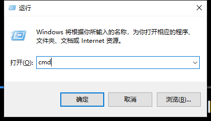
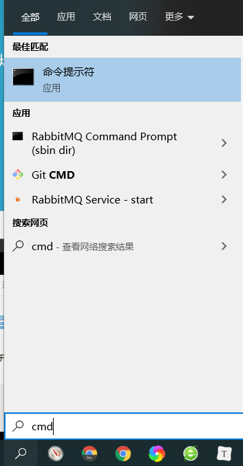
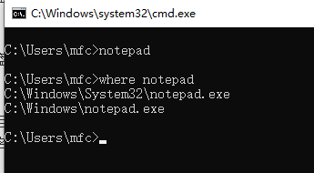
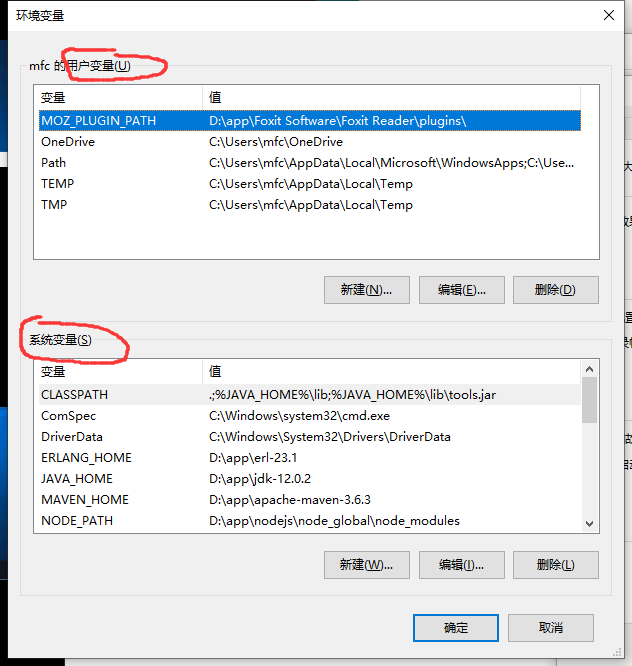
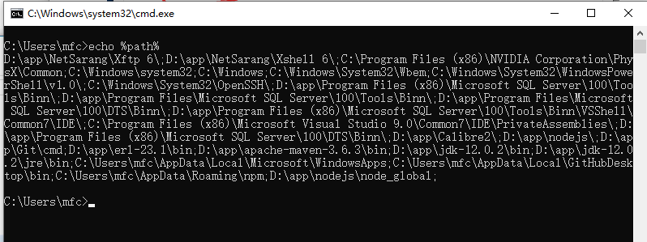

01.windows命令行基础


windows命令行与环境变量


内容

* 启动命令行
* 常用命令
  * 盘符切换
  * dir
  * cd
  * exit
* 想对路径与绝对路径
* 查看命令的位置
  * where
* 环境变量查看与设置
  * 用户变量与系统变量
  * echo
* 遇到疑难问题
  * 首先重启


打开命令行

* 1.win+R 输入`cmd`



* 2.搜索cmd




常用DOS命令

```
-- 切换盘符
C:
D:
E:

-- 返回上一级
cd ..

-- 返回盘符根目录
cd /

-- 改变目录cd 是 change directory（改变目录）的缩写
cd 目录名

-- 退出，或者直接关闭窗口
exit

-- 清屏
cls

-- dir目录列表
dir

-- 查看命令的位置
where

-- echo查看环境变量
echo %环境变量%
```


windows命令的本质

* 是一个可执行文件，例如`notepad`



环境变量

* 打开环境变量
  * 我的电脑--属性--高级系统设置--高级--环境变量
* 用户变量和系统变量
  * Path-最重要的环境变量





```
-- echo 查看环境变量
echo %path%
```




编辑修改环境变量后，保存，需要重启命令行。


遇到疑难问题的两大法宝

* 重启
* 重装


