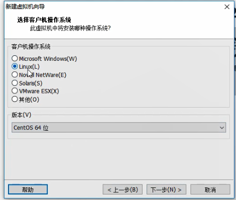
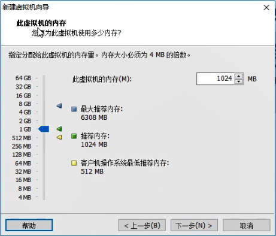
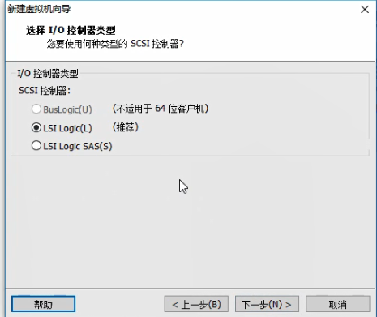
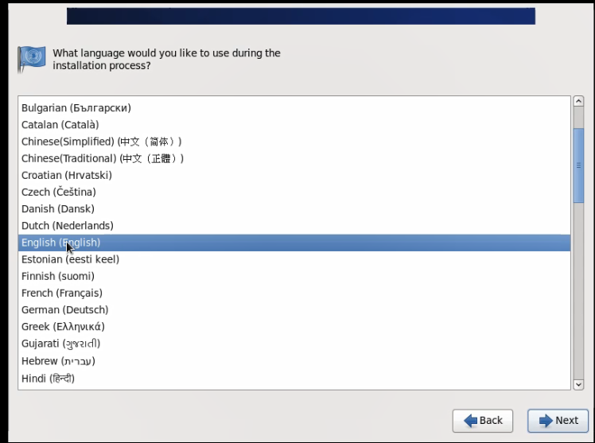
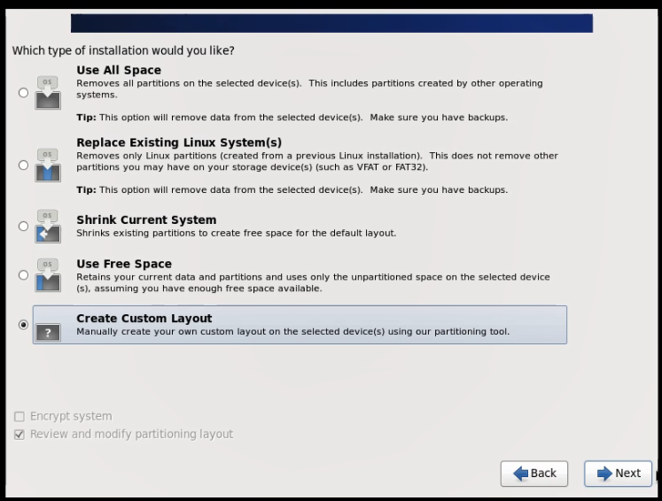
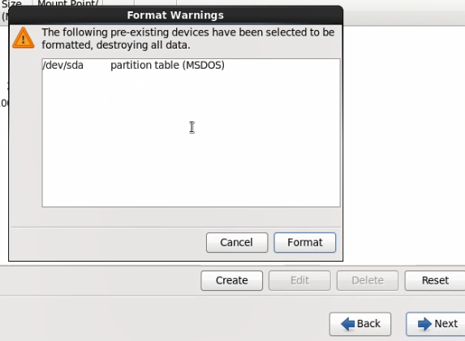
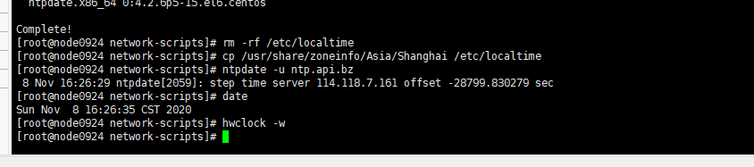
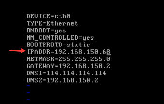
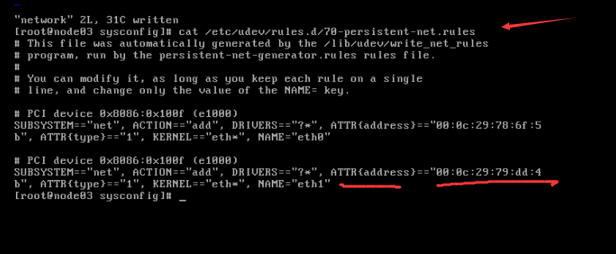

安装虚拟机与linux安装


学习大数据之前的预备知识

* 虚拟机安装
* linux安装


安装虚拟环境

* what 什么是虚拟环境
* why 为什么
  * VM
* how 怎么做
  * 装虚拟机
  * 装linux


准备安装软件：`VMware-workstation-full-15.5.1-15018445.exe`

* 下一步，下一步安装。


安装好VM后，准备安装虚拟机


`创建新的虚拟机`


`自定义`安装


下一步


`稍后安装操作系统`，下一步



选择`Linux`操作系统，CentOS 64位


设置`虚拟机名称`和`位置`


设置虚拟机的`核数`



设置虚拟机的`内存`，默认1G，不要小于768M。


设置网络类型，选择`使用网络地址转换(NAT)(E)`




选择I/O控制器类型，默认，下一步


选择磁盘类型，默认，下一步


选择磁盘，`创建新虚拟磁盘`


指定磁盘大小，设置为`100G`，方便后面安装软件。


指定磁盘文件，默认，下一步


查看配置值，完成。


成功创建虚拟机。这是一个空的虚拟机，安装虚拟环境完成，没有操作系统。


后面开始安装Linux操作系统。


准备安装光盘，`CentOS-6.5-x86_64-minimal.iso`


虚拟机指定光驱，CD/DVD(IDE)


选择`CD/DVD(IDE)`，连接使用`ISO映像文件`。


设置好ISO文件后，直接`开启虚拟机`，安装Linux系统。


开机画面...


选择`Install or upgrade an existing system`，回车，安装或升级现有系统


注意，按`Ctrl + Alt`可以释放鼠标光标。


安装中...，等一下，稍微有点慢。


跳过光盘检查介质，`Skip`，跳过。


`Found local installation media`找到本地安装媒体文件


选择`OK`


等待一小会


进入图形化安装界面。



选择喜欢的语言，使用默认`English(English)`，Nexit，下一步。


键盘使用的语言，U.S English，Next


使用基本的存储设备，Next


清除存储设备里面可能有的碎片化数据，选Yes。


给你的Linux系统取名字，这里设置了一个node03


选择时区，上海。


设置root账号密码，随便设，不要太复杂。Next，提示密码太简单，选择Use Anyway。



Create Custom Layout，创建自定义分区，Next。


开始自定义分区了。


分区概念

* sda
  * boot 引导程序区
  * swap 交换区
  * 用户区


创建分区boot，选中sda，Create，Create。


选择`/boot`，`ext4`，`200`MB，`OK`


创建分区swap，选择`swap`，`2048`MB(一般为内存大小的2倍)，`OK`


创建用户分区，选择`/`，`ext4`，`Fill to maximun allowable size`，`OK`

将剩下的磁盘空间全部都给用户分区。


分区创建完成，Next



Format，格式化


Write changes to disk，写到磁盘。


等待一会


安装boot引导程序


等待安装


等待安装，时间比较长。安装完成后配置虚拟机的网络。


配置虚拟机的网络

* 1.找到网卡的位置
* 2.配置协议
  * 2.1删除网卡物理地址和UUID
  * 2.2配置IPADDR、NETMASK、GATEWAY、DNS1、DNS2
  * 2.3重启网络服务，测试网络


启动虚拟机，登录root账号。


登录成功后，切换文件夹

```
-- 切换到network-scripts文件夹
cd /etc/sysconfig/network-scripts/
```


切换文件夹后，查看文件

```
-- 查看文件夹下的文件
ls
```


编辑`ifcfg-eth0`文件，vi，文本编辑器。

```
-- 编辑ifcfg-eth0文件
vi ifcfg-eth0
```

使用vi编辑器编辑ifcfg-eth0内容，参考示例IPADDR，是你自己的IP地址。

```
DEVICE=eth0
TYPE=Ethernet
ONBOOT=yes
NM_CONTROLLED=yes
BOOTPROTO=static
IPADDR=192.168.11.66
NETMASK=255.255.255.0
GATEWAY=192.168.11.2
DNS1=114.114.114.114
DNS2=192.168.11.2
```


确定你自己机器的IP，进入虚拟网络编辑器。


更改设置


NAT模式，查看子网IP，子网掩码。

可用IP为

```
192.168.150.0 ~ 192.168.150.254
```


查看NAT设置，发现有一个IP被网关用了

网关IP:`192.168.150.2`


将主机虚拟适配器连接到此网络(V)


查看VM的虚拟网卡


查看网卡状态，IP:`192.168.150.1`，被使用了。

所以可用IP为

```
192.168.150.3 ~ 192.168.150.254
```


补充一下vi文件编辑器

* vi 编辑文件
* i 下发提示INSERT，插入编辑文本模式
* ESC 退出文本编辑
* Shift + ：进入命令模式
* wq! 回车，关闭并保存修改的文本


修改完`ifcfg-eth0`文件后，重启网卡服务。

```
-- 重启网卡服务
service network restart
```


ifconfig，查看网卡配置。

```
-- 查看网卡配置
ifconfig

-- ping一下外网(百度)，CTRL+c或CTRL+z方式退出
ping www.baidu.com

-- 此时ping命令将执行4次
ping www.baidu.com -c 4
```


网卡配置命令总结

```
-- 登录系统
root
******

-- 切换到network-scripts文件夹
cd /etc/sysconfig/network-scripts/

-- 查看文件夹下的文件
ls

-- 编辑ifcfg-eth0文件
vi ifcfg-eth0

-- ifcfg-eth0文件的内容(参考)
DEVICE=eth0
TYPE=Ethernet
ONBOOT=yes
NM_CONTROLLED=yes
BOOTPROTO=static
IPADDR=192.168.11.66
NETMASK=255.255.255.0
GATEWAY=192.168.11.2
DNS1=114.114.114.114
DNS2=192.168.11.2

-- 重启网卡服务
service network restart

-- 查看网卡配置
ifconfig

-- CTRL+c或CTRL+z方式退出
ping www.baidu.com

-- 此时ping命令将执行4次
ping www.baidu.com -c 4

```


vi文件编辑器

* vi 编辑文件
* i 下发提示INSERT，插入编辑文本模式
* ESC 退出文本编辑
* Shift + ：进入命令模式
* wq! 回车，关闭并保存修改的文本


补充：Liunx时间问题


安装ntpdate



最后查看时间`date`


解决linux系统时间不对的问题:https://blog.csdn.net/qq_39314099/article/details/100575935

```
-- 调整时间

-- 安装ntpdate
yum install -y ntpdate

-- 删除etc/localtime文件
rm -rf /etc/localtime

-- 复制shanghai时区文件替换到这里
cp /usr/share/zoneinfo/Asia/Shanghai /etc/localtime

-- 更新下时间
ntpdate -u ntp.api.bz

-- 查看时间
date

-- 进行保存
hwclock -w
```

推荐使用`Xshell`进行操作。


克隆多台虚拟机

* 1.修改IP地址
* 2.hostname
* 3.删除一个文件


先将虚拟机关机，再打开`快照管理器`


当前位置，拍摄快照，给快照取一个名字。


快照保存后，打开管理，克隆。


克隆向导


`克隆源`选择，现有快照。


克隆方法：`创建链接克隆`


新虚拟机的`名称`和`位置`，位置放置在自己想要放置的地方。


正在克隆


克隆完成，关闭。


开启克隆的虚拟机，配置信息和`node03`一样。


登录Linux，node05账号和密码和node03的一样，因为是克隆过来的。准备`修改网卡信息`。



仅修改IPADDR，其他的不变。

```
-- 切换到network-scripts文件夹
cd /etc/sysconfig/network-scripts/

-- 编辑ifcfg-eth0文件
vi ifcfg-eth0

-- ifcfg-eth0文件的内容(参考)
DEVICE=eth0
TYPE=Ethernet
ONBOOT=yes
NM_CONTROLLED=yes
BOOTPROTO=static
IPADDR=192.168.11.**
NETMASK=255.255.255.0
GATEWAY=192.168.11.2
DNS1=114.114.114.114
DNS2=192.168.11.2
```


修改hostname

```
-- 切换目录
cd /etc/sysconfig/

-- 编辑
vi network

```


修改文件的全路径


node03修改为node05，保存。



查看一个文件,node05的物理网卡地址和node03的相同

```
-- 查看一个文件
cat /etc/udev/rules.d/70-persistent-net.rules
```


删除这个文件，删除之后会重新生成这个文件。

```
-- 删除这个文件
rm -f /etc/udev/rules.d/70-persistent-net.rules
```


全部改完之后，`reboot`，重启，耐心等待一会。

```
-- 重启
reboot
```


登录，查看ip信息。

```
-- 查看网卡配置
ifconfig
```


总结

* 1.改IP
* 2.改hostname
* 3.删除文件


命令总结

```
-- 登录克隆虚拟机	######

-- 切换到network-scripts文件夹
cd /etc/sysconfig/network-scripts/

-- 编辑ifcfg-eth0文件
vi ifcfg-eth0

-- ifcfg-eth0文件的内容(参考)
DEVICE=eth0
TYPE=Ethernet
ONBOOT=yes
NM_CONTROLLED=yes
BOOTPROTO=static
IPADDR=192.168.11.**
NETMASK=255.255.255.0
GATEWAY=192.168.11.2
DNS1=114.114.114.114
DNS2=192.168.11.2

-- 切换目录
cd /etc/sysconfig/

-- 编辑
vi network

-- 查看一个文件
cat /etc/udev/rules.d/70-persistent-net.rules


-- 删除这个文件
rm -f /etc/udev/rules.d/70-persistent-net.rules

-- 重启
reboot

-- 查看网卡配置
ifconfig
```

