二进制


内容

* 二进制整数
  * 原码、反码、补码
  * 二进制与十进制转换
  * 八进制与十六进制
  * 位运算
  * big/little endian
* 二进制小数
  * IEEE754


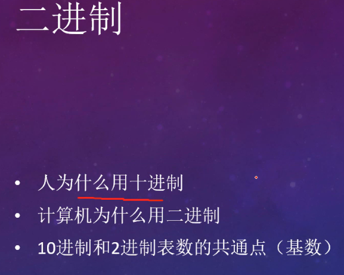

二进制

* 十进制
* 二进制
* 十进制和二进制的共通点（基数）


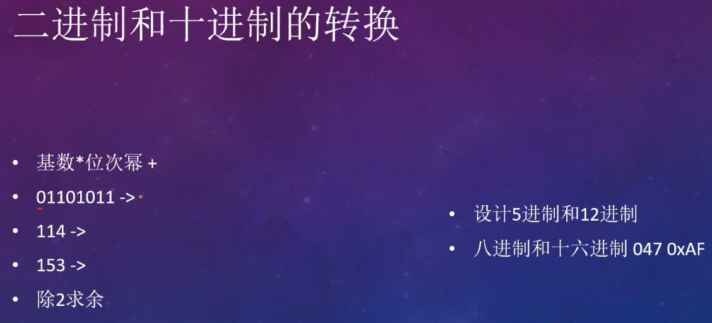

二进制和十进制的转换

* 基数*位次幂
* 除2求余
* 2的十次方之内的数值

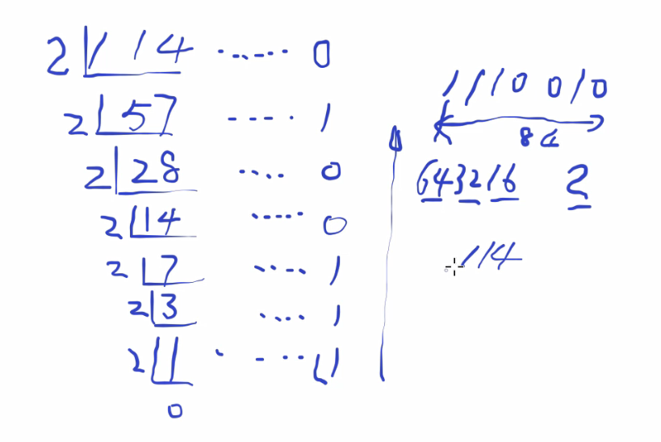


| 十进制 | 等于 | 二进制                                                       |
| ------ | ---- | ------------------------------------------------------------ |
| 114    | =    | 01110010                                                     |
|        | =    |  |
|        | =    | 0 + 2 + 0 + 0 + 0 + 16 + 32 + 64 + 0                         |
|        | =    | 114                                                          |

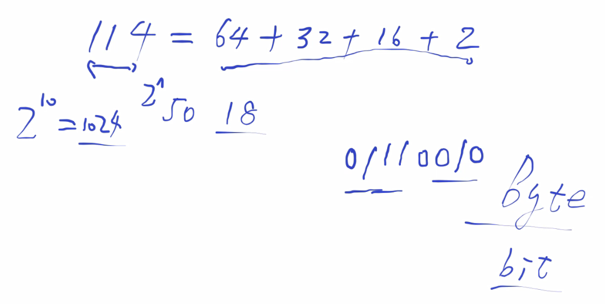

快速计算。


153	->	10011001

```
2	153		1
2	76		0
2	38		0
2	19		1
2	9		1
2	4		0
2	2		0
2	1		1	
--------------
153	->	10011001
```


2的十次方之内的数值

| 2的幂次                                                      | 10进制表数 |
| ------------------------------------------------------------ | ---------- |
|  | 2          |
|  | 4          |
|  | 8          |
|  | 16         |
|  | 32         |
|  | 64         |
|  | 128        |
|  | 256        |
|  | 512        |
|  | 1024       |

在线LaTex公式编辑器：https://www.codecogs.com/latex/eqneditor.php


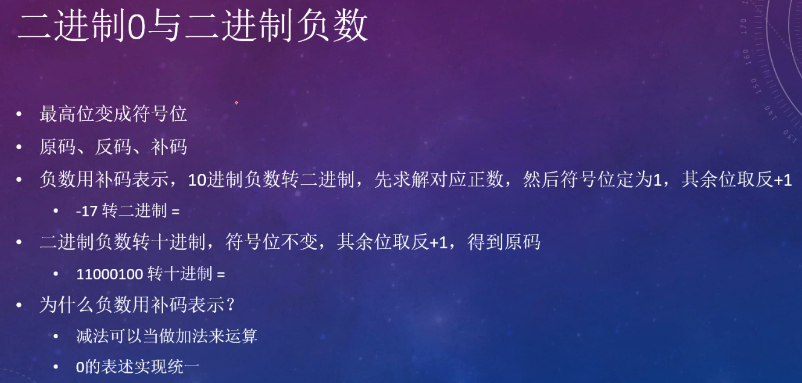

> 注意：二进制负数（补码）转十进制，`先减一`得到反码，在取反得到`原码`。图片的表述有误。


二进制0与二进制负数

* 原码、反码、补码
  * 原码：**原码就是符号位加上真值的绝对值**, 即`用第一位表示符号`, 其余位表示值.
  * 反码
    * **正数的反码是其本身**
    * `负数的反码是在其原码的基础上, 符号位不变，其余各个位取反.`
  * 补码
    * **正数的补码就是其本身**
    * 负数的补码是在其原码的基础上, `符号位不变`, `其余各位取反, 最后+1.` (即在反码的基础上+1)
* 负数用补码表示


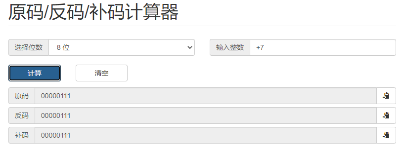

正数7的原码、反码、补码

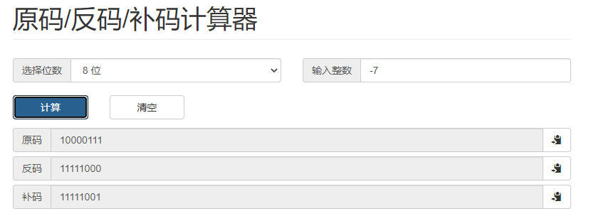

负数7的原码、反码、补码


原码/反码/补码计算器：http://www.atoolbox.net/Tool.php?Id=952


注意：一个数有无符号，必须先告知。

`二进制数是否为带符号位的数，需要明确告知`(不告知则无法判断)。

* 符号位为1(最高位)，代表为负数；符号位为0(最高位)，代表为正数。

* 不带符号位的数，默认为正数。


**计算机中的有符号数都是以二进制的补码形式存储的。**

* 正数的补码，反码，原码，都是正数本身
* 负数
  * 补码
  * 反码 = 补码 - 1
  * 原码 = 反码取反，符号位不变


十进制负数转二进制

* 十进制负数转二进制，先求解对应正数原码，符号位定为1，取反得到反码，反码加1得到补码。最后的补码就是计算机里面的二进制表数。

* -17转为二进制 -> 11101111

```
计算机中的有符号数都是以二进制的补码形式存储的

 17 -> 00010001	正17的原码,反码，补码就是他本身，在计算机用补码表示，和原码一样。

-17 -> 10010001	负17的原码，(就是`正17的原码`，符号位为1)
       11101110 负17的反码 = 负17的原码取反，符号位不变
       11101111 负17的补码 = 负17的反码 + 1
```

二进制负数转十进制

* 二进制负数（补码）转十进制，`先减一`得到反码，在取反得到`原码`。最后求解原码。

* 11000100 这个数为负数，转为十进制，为`-60`

```
11000100 补码
11000011 反码 = 补码 - 1
10111100 原码 = 反码取反，符号位不变
--------------------------------
10111100 符号位不进行计算,仅作为符号判断
= -( 0*2^0 + 0*2^1 + 1*2^2 + 1*2^3 + 1*2^4 + 1*2^5 )
= -( 4 + 8 + 16 + 32 )
= -(60)
= -60
```


参考资料：

二进制编码-详细讲解：https://www.cnblogs.com/xy404/p/3708666.html


为什么在计算机中**有符号的数用补码**表示（负数用补码，正数也是用补码）

* 减法可以当做加法运算
* 0的表述实现统一

```
二进制表示5-3，怎么计算？

5 - 3 = ?
5 + (-3) = ?

(-3)
3   ->   00000011 原码
-3  ->   10000011 原码
         11111100 反码，原码取反
         11111101 补码，反码加1
-----------------------------
         11111101

计算5 + (-3)：

  00000101    5  补码
  11111101    -3 补码
--------------
0|00000010    2  补码，截断溢出，计数为2

减法可以当做加法运算，CPU内部没有减法器，只有加法器。提高效率。
```


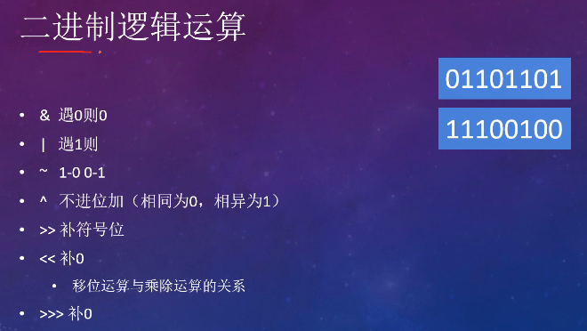


二进制逻辑运算，俗称`位运算`(bit operation)

* `&` 遇0则0，与运算

  * `1&0=0`,`1&1=1`,`0&1=0`,`0&0=0`

* `|` 遇1则1，或运算

  * `1|0=1`,`1|1=1`,`0|1=1`,`0|0=0`

* `~` 遇1为0，遇0为1，取反

* `^` 相同为0，相异为1(不进位的加法)，异或

  * `1^0=1`,`1^1=0`,`0^1=1`,`0^0=0`
  * 看做加法

* `>>` 移位，右移，补符号位

  * ```
        0..0 0000 1111 |   符号位0
    >>  0..0 0000 0111 | 1 右移一位
    
        1..1 1000 1111 |   符号位1
    >>  1..1 1100 0111 | 1 右移一位
    ```

  * 左边补符号位

* `<<` 左移

  * ```
        0..0 0000 1111 |   
    <<  0..0 0001 1110 | 0..0 左移一位
    
        1..1 1000 1111 |   
    <<  1..1 1101 1110 | 0..0 左移一位
    ```

  * 永远在右边补0

* `>>>` 无符号右移

  * ```
        0..0 0000 1111 |   符号位0
    >>  0..0 0000 0111 | 1 右移一位
    
        1..1 1000 1111 |   符号位1
    >>  1..1 0100 0111 | 1 右移一位
    ```

  * 不管符号位，左边永远补0

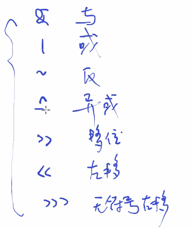

这七个运算把他吃透。


移位运算和乘除运算的关系

* ```
  对于正整数，(负整数不管)。
  
  正整数8 
      0000 1000
  >>  0000 0100  右移1位，相当于除以2
  
      0000 1000
  <<  0001 0000  左移1位，相当于乘以2
  ```

* ```
  面试题1：
  2^3     2的三次方，怎么计算最快？
  
  2*2*2	效率比较慢
  2<<2    2左移2位，效率最快
  
      0000 0010
  <<2 0000 1000  左移2位，相当于乘以2，在乘以2
  ```

* ```
  面试题2：
  正整数a=3 b=4,将a,b的数值交换位置。
  
  A方式，可以用临时变量，比较常见，效率不高。
  (1)c = a;
  (2)a = b;
  (3)b = c;
  
  B方式，对于正整数，使用异或快速运算,效率最高。
  (1)a = a ^ b;
  (2)b = a ^ b;
  (3)a = a ^ b;
  
  验算一下
  a = 3;   0011
  b = 4;   0100
  
  (1)a = a ^ b;
      0011
  ^   0100
  --------
      0111    a=7
  
  (2)b = a ^ b;
      0111
  ^   0100
  --------
      0011    b=3;
  
  (3)a = a ^ b;
      0111
  ^   0011
  --------
      0100    a=4;
  
  最终，a=4,b=3;数值交换成功
  ```

* 对于正整数，(负整数不管)


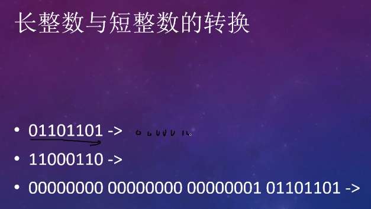


长整数与短整数转换

* 短整数变长整数，直接补0
* 长整数变短整数，直接砍掉左边的位数，可能精度丢失。


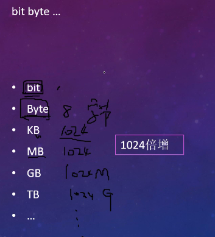

计数单位

* bit byte ...


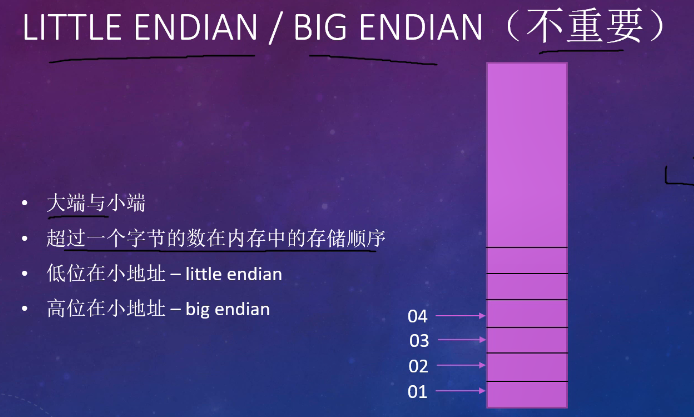

大端和小端


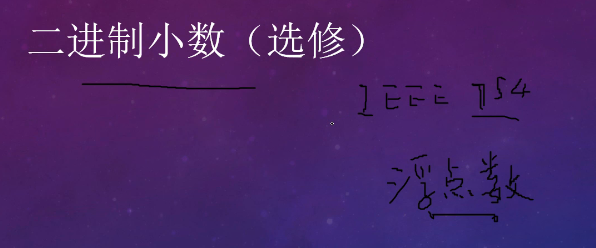

二进制小数

* IEEE754
* 有时间，有精力，有兴趣自己去了解。


参考资料：

IEEE754：https://blog.csdn.net/charles_neil/article/details/59125861

