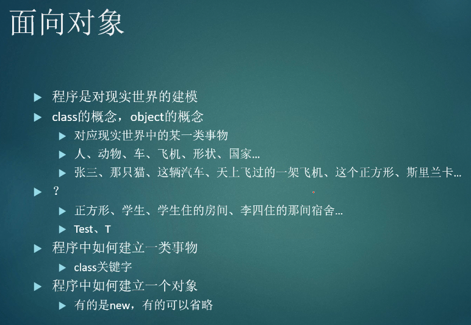
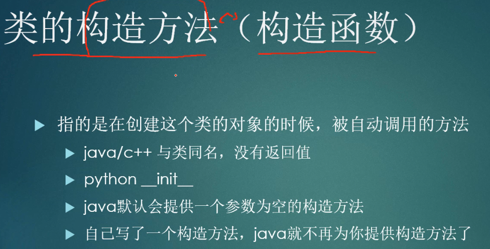
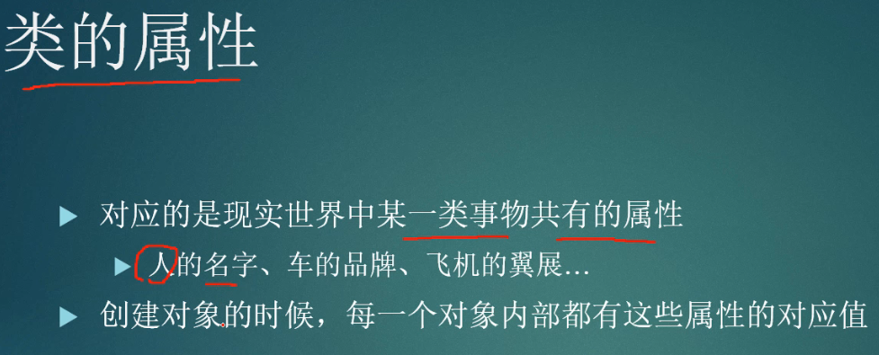
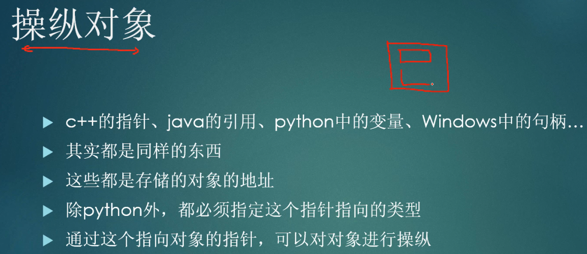
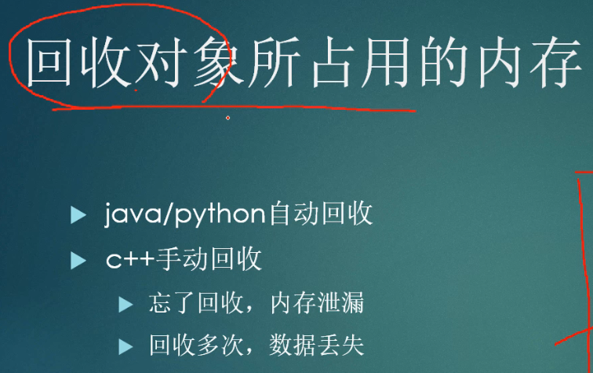
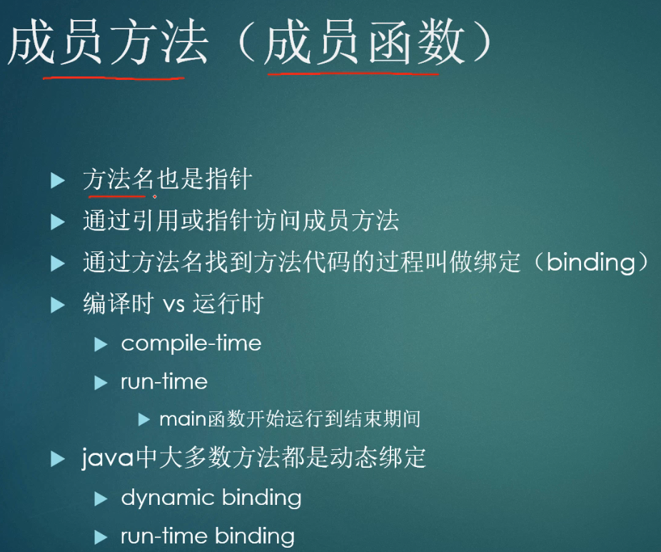
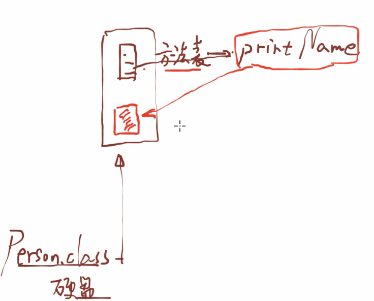
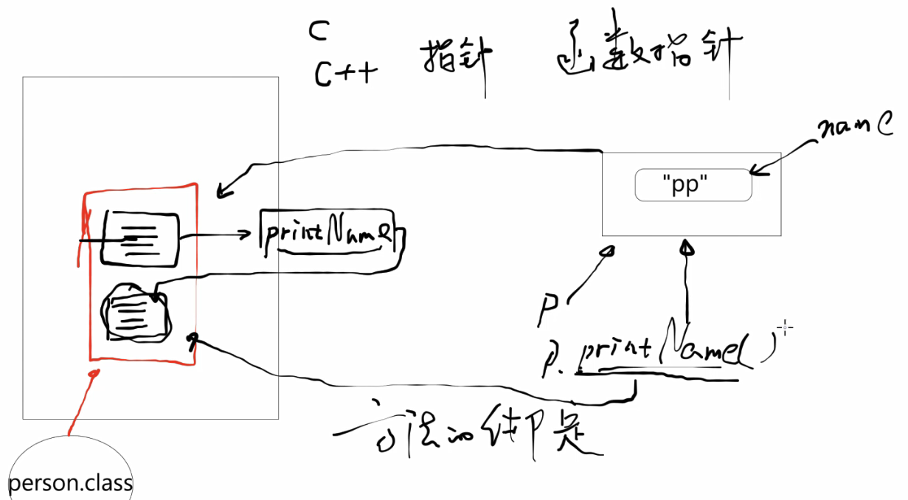
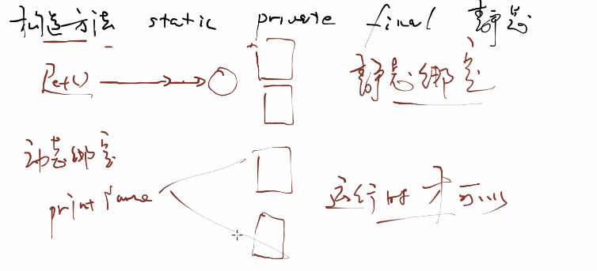
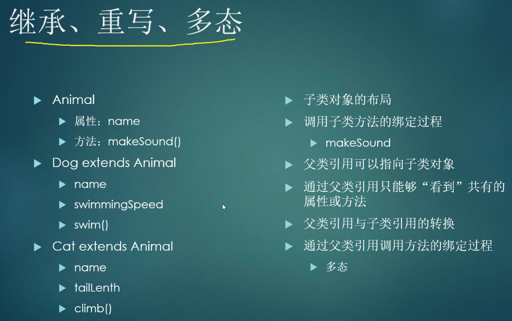

04.面向对象2019

讲的不是具体的哪一种语言，而是讲`面向对象`的概念。

Java面向对象

面向对象

* 程序是对现实世界的建模
* class的概念，object的概念
* 程序中如何建立一类事物
  * class
* 程序中如何建立一个对象
  * new

对象是脱离语言的一种概念，具体的语法多敲就行了。

类的构造方法

* 在创建这个类的对象的时候，被自动调用的方法

类的属性

* 一类事物共有的属性
* 创建对象的时候，每一个对象内部都有这些属性的对应值

操纵对象

* 对象的地址

回收对象所占的内存

面向对象

成员方法

* 方法名也是指针
* 通过引用或指针访问成员方法

硬盘和方法表

内存分析

构造方法、static、private、final，都是静态绑定（编译期间绑定）。

* 静态绑定，一个方法通过名称找到代码，没有歧义，叫做静态绑定。

动态绑定，运行时才可以确定。

* 父类指向子类的对象。

复习

* 类、对象
* 构造方法
* 创建对象
* 回收对象
* 操作对象

继承、重写、多态

* 父类调用子类方法

