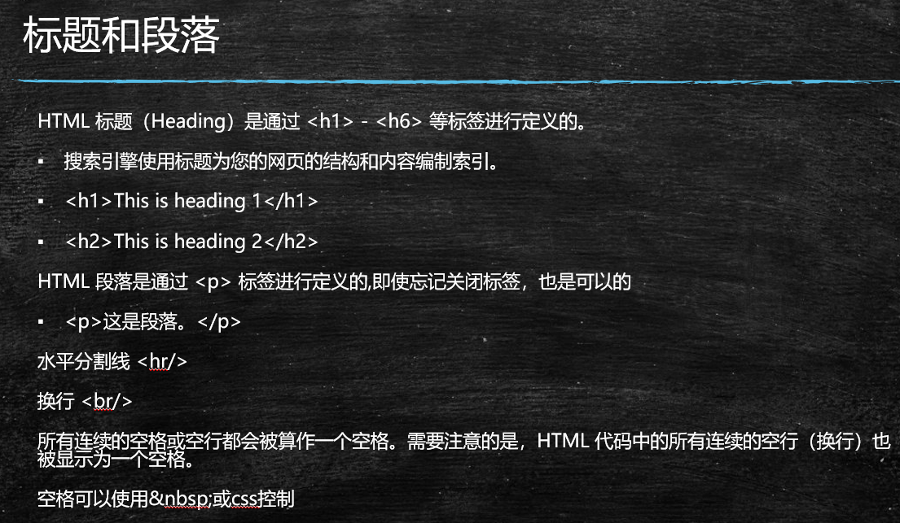
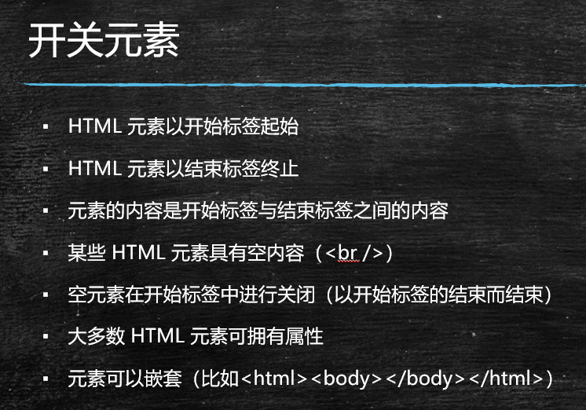
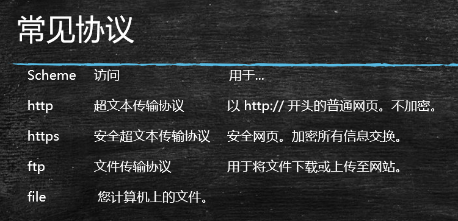

05.web前端html基础部分


HTML

* html常用标签


一个网站的组成

* html
* 服务器
* 网站域名、url
* http协议


示意图


URL

* 协议
* 域名
* uri


HTML概述

* 超文本标记语言，静态网页


html结构

* html
* head
* body


稍微复杂的html文件


HTML5与浏览器适配

* HTML5
* W3C


html中的标签


Head中的子标签

* meta
* title
* style
* script

```html
<!DOCTYPE html>
<html>
	<head>
		<meta charset="utf-8">
		<title></title>
		<!-- author 创建者 -->
		<meta name="author"  content="张洋,马老师" />
		<!-- 描述 -->
		<meta name="description" content="java,前端,html,head等学习~" />
		<!-- 关键字 -->
		<meta name="keywords" content="html,javascirpt,css" />
		<!-- seo -->
		<!-- 自动刷新/跳转页面 -->
		<!-- <meta http-equiv="refresh" content="5;http://www.mashibing.com" /> -->
		<!-- 缓存相关 -->
		<meta http-equiv="Pragma" content="no-cache" />
		<meta http-equiv="Cache-Control" content="no-cache" />
		<meta http-equiv="expires" content="0" />
		
		<style>
			button {
				color: red;
				font-size: 20px;
			}
		</style>
		
		<script>
			function clk(){
				alert("别点我！");
			}
		</script>
	</head>
	<body>
		<button onclick="javascript:clk();">点我呀</button>
	</body>
</html>

```




标题和段落


排版

* p
* pre


属性

* html属性

```html
<!DOCTYPE html>
<html>
	<head>
		<meta charset="utf-8">
		<title></title>
	</head>
	<body>
		<h1 align="middle">老英雄张富清：60多年深藏功名 坚守初心</h1>
		<h2 align="right">老英雄张富清：60多年深藏功名 坚守初心</h2>
		<h3>老英雄张富清：60多年深藏功名 坚守初心</h3>
		<h4>老英雄张富清：60多年深藏功名 坚守初心</h4>
		<h5>老英雄张富清：60多年深藏功名 坚守初心</h5>
		<h6>老英雄张富清：60多年深藏功名 坚守初心</h6>
		<hr width="200px" color="#FF0000" align="center" size="50px">
		1955年，张富清退伍转业，他戴上勋章拍下这张照片后，将所有勋章封存，也将自己的赫赫战功封存，这一封存就是60多年。
		
		
		<p>
		
		

转业后的张富清，本打算回陕西老家，但当他得知湖北恩施最穷的贫困山区需要支援建设时，他听从党的号召，带着妻子去了恩施来凤县，从此，他乡变故乡。
<br>
在来凤县，张富清奔波于最穷的乡镇，在遭遇干旱时，他带领老百姓进山找水；为了给没水没电没路的高洞山区修出一条路，张富清又当了一回突击队员，他带着炸药上了悬崖。4个月后，高洞山区结束了不通路的历史。
	
	
	<p>
    春眠不觉晓 &nbsp;   &nbsp; &nbsp;  处处闻啼鸟。
                        夜来风雨声，
                                花落知多少。
								
								
		<pre>
			五十年尽全力，  毕其功                          与一役。
			成了是得意，败了是乐趣。
			余生做个好色老头，调戏良家妇女。
		</pre>

</p>


	</body>
</html>

```



开关元素


文本格式化标签

* b
* u
* font


超链接

* a
* 锚点


图像


列表

* ul
* ol
* li


颜色


样式

* style


CSS

* 外部样式
* 内部样式
* 内联样式


CSS选择器

* 元素选择器
* class选择器


chrome调试样式


表格布局


表单与表单元素


表单提交

* get
* post


form

* input
* select
  * option
* textarea
* button


网页框架

* frame
* Iframe


布局

* div
* span


bootstrap


html参考手册：http://www.w3school.com.cn/tags/index.asp


完整地址 http://www.w3school.com.cn/tags/html_ref_entities.html



协议

* http
* https


介绍结束

