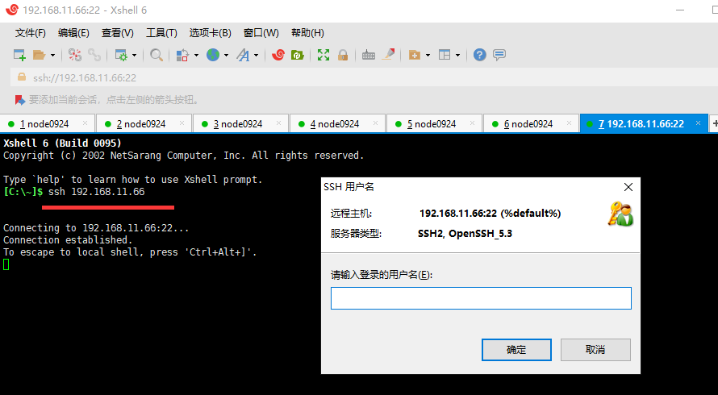
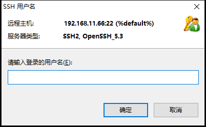
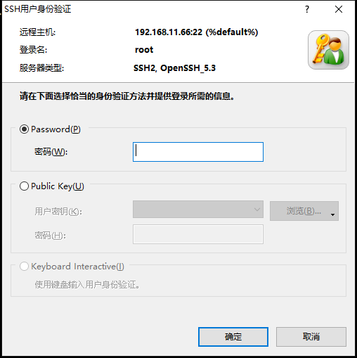
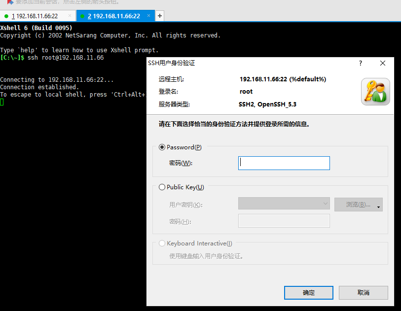
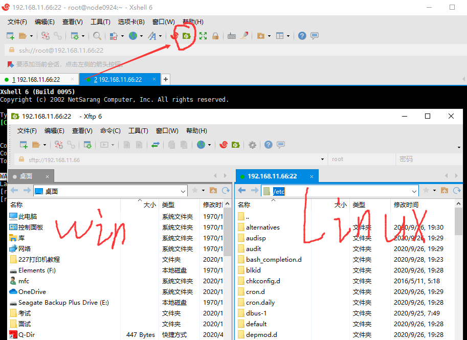

05-xhell、xftp工具


xhell、xftp工具：网盘分享

```
链接：https://pan.baidu.com/s/104DXGTpaNikH69WJcq3jqA 
提取码：gvmq 
```


菜鸟预习：网盘分享

```
链接：https://pan.baidu.com/s/1Uet0HpbSZirK91x7qIP_Bg 
提取码：ee3n 
```


前4节

* 01-安装VMWare workstation
* 02-Linux系统安装步骤
* 03-配置虚拟机的网络服务
* 04-基于虚拟机的快照克隆多台虚拟机的方法

虚拟机和Linux安装，前面已经学过了。可以跳过，也可以复习一遍。

[安装虚拟机与linux安装](../../02.安装虚拟机与linux安装/note/02.安装虚拟机与linux安装.md)


VM操作Linux系统，不是很方便。


XShell工具，方便的操作Linux系统





使用ssh命令连接Linux

```
ssh 192.168.11.66
```




输入用户名



输入密码，连接linux。





```
ssh root@192.168.11.66
```

连接Linux，指定了用户名，后面直接输入密码。


Xftp工具

* windows系统与linux系统，文件交互。





左边是你的windows系统文件，右边是Linux系统文件。

可以拖拽、复制，传输文件。

非常的方便。

