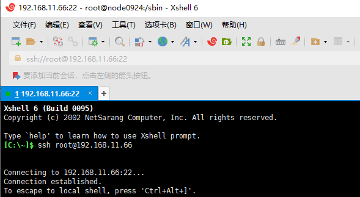
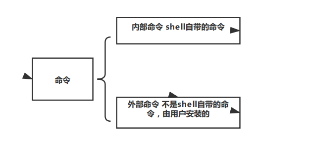
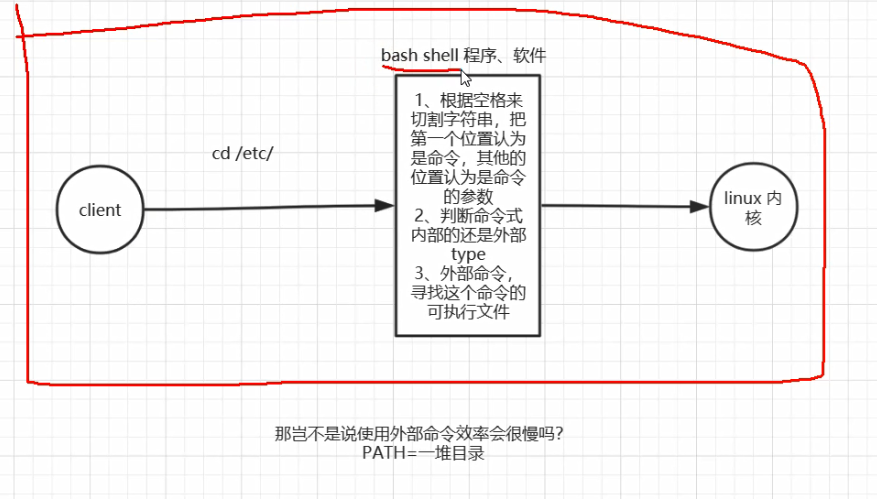

06-linux内外部命令的判断方式以及命令的执行流程




开启linux，使用Xshell连接

```
ssh root@192.168.11.66
```

连接后，输入密码。成功登陆linux系统，进行linux命令练习。


```shell
-- 切换目录
[root@node0924 ~]# cd /etc/

-- 查看目录文件
[root@node0924 etc]# ls

-- 查看cd命令的类型,cd is a shell builtin,说明是linux内部命令
[root@node0924 etc]# type cd
cd is a shell builtin

-- 查看网卡信息
[root@node0924 etc]# ifconfig

-- 查看ifconfig命令的类型，ifconfig is hashed (/sbin/ifconfig)，说明是外部命令
[root@node0924 etc]# type ifconfig
ifconfig is hashed (/sbin/ifconfig)

-- 切换到sbin目录
[root@node0924 etc]# cd /sbin/

-- 查看文件
[root@node0924 sbin]# ls

-- 查看文件文本，乱码，说明不是文本文件
[root@node0924 sbin]# cat ifconfig

-- 查看文件类型，ELF，代表二进制文件
[root@node0924 sbin]# file ifconfig
ifconfig: ELF 64-bit LSB executable, x86-64, version 1 (SYSV), dynamically linked (uses shared libs), for GNU/Linux 2.6.18, stripped

-- 使用type，找到ifconfig可执行文件的路径
[root@node0924 sbin]# type ifconfig
ifconfig is /sbin/ifconfig

-- 使用whereis，找到ifconfig可执行文件的路径
[root@node0924 sbin]# whereis ifconfig
ifconfig: /sbin/ifconfig /usr/share/man/man8/ifconfig.8.gz


```

连上linux，敲命令，干就完了。


小结一下

* cd
* ls
* type
* ifconfig
* cat
* file
* whereis




命令，查看命令的类型使用`type`命令

* 内部命令
* 外部命令


```shell
-- 查看yum命令
[root@node0924 sbin]# type yum
yum is /usr/bin/yum

-- echo命令，打印123
[root@node0924 sbin]# echo "123"
123

-- echo命令打印$PATH，使用分号分割目录，寻找外部命令
[root@node0924 sbin]# echo $PATH
/usr/local/sbin:/usr/local/bin:/sbin:/bin:/usr/sbin:/usr/bin:/opt/maofachang/redis5/bin:/root/bin
[root@node0924 sbin]# 
```




bash shell

linux内核

PATH