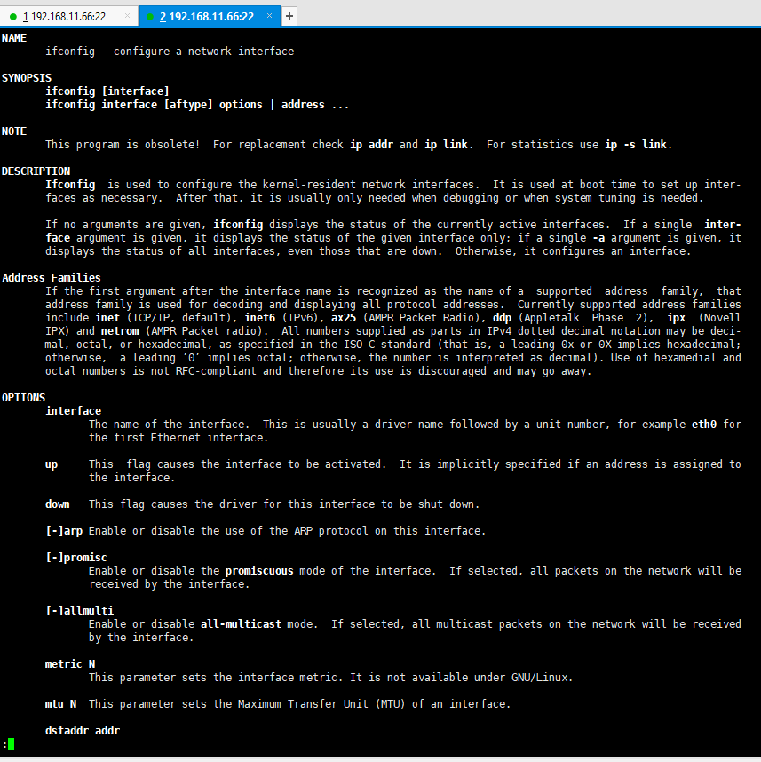
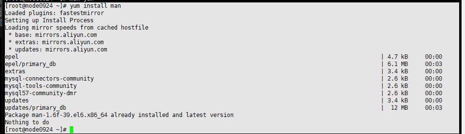
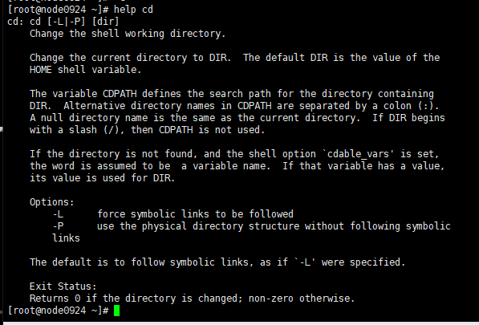

07-linux查看命令帮助文档


```
-- man查看帮助文档
[root@node0924 ~]# man ifconfig
```




进入文档后

`回车`，一行一行的读文档

`空格`，一页一页的读文档

`Q`，退出文档。


```shell
-- 查看yum的帮助文档
[root@node0924 ~]# man yum
```


```
-- 如果没有man命令，使用yum安装
[root@node0924 ~]# yum install man

```

安装时是这样的



```shell
[root@node0924 ~]# yum install man
Loaded plugins: fastestmirror
Setting up Install Process
Loading mirror speeds from cached hostfile
 * base: mirrors.aliyun.com
 * extras: mirrors.aliyun.com
 * updates: mirrors.aliyun.com
epel                                                                                                          | 4.7 kB     00:00     
epel/primary_db                                                                                               | 6.1 MB     00:03     
extras                                                                                                        | 3.4 kB     00:00     
mysql-connectors-community                                                                                    | 2.6 kB     00:00     
mysql-tools-community                                                                                         | 2.6 kB     00:00     
mysql57-community-dmr                                                                                         | 2.6 kB     00:00     
updates                                                                                                       | 3.4 kB     00:00     
updates/primary_db                                                                                            |  12 MB     00:03     
Package man-1.6f-39.el6.x86_64 already installed and latest version
Nothing to do
[root@node0924 ~]# 

```


```
-- 查看cd的帮助
[root@node0924 ~]# help cd
```




小结一下

* man
* help


