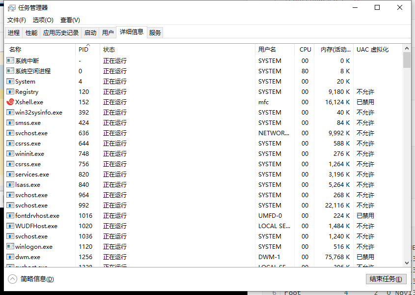
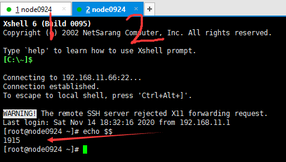
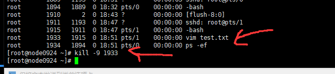

08-bash shell定义变量以及进程简单管理


```shell
-- echo 打印
[root@node0924 ~]# echo "msb"
msb

-- a赋值，然后使用echo打印变量
[root@node0924 ~]# a=1
[root@node0924 ~]# echo $a
1
[root@node0924 ~]#


```

创建变量赋值，并打印。

```shell
-- 尝试定义数组arr
[root@node0924 ~]# arr=(1,2,3)
[root@node0924 ~]# echo $arr
1,2,3
[root@node0924 ~]# echo $arr[1]
1,2,3[1]
[root@node0924 ~]# echo ${arr[1]}

[root@node0924 ~]
```

不要用`,`分隔数组

```shell
-- 尝试定义数组arr1
[root@node0924 ~]# arr1=(1 2 3)
[root@node0924 ~]# echo $arr1
1
[root@node0924 ~]# echo ${arr1[1]}
2
[root@node0924 ~]# echo ${arr1[2]}
3
[root@node0924 ~]# 

```

要用`空格` 分隔数组

```shell
[root@node0924 ~]# echo ~$a~
~1~
[root@node0924 ~]# 

```

echo打印值时，前后加`~`.


```shell
[root@node0924 ~]# echo $$
1894
[root@node0924 ~]# 

```

查看当前的进程号，`1894`.

```shell
[root@node0924 ~]# ps -ef
UID         PID   PPID  C STIME TTY          TIME CMD
root          1      0  0 Nov13 ?        00:00:01 /sbin/init
root          2      0  0 Nov13 ?        00:00:00 [kthreadd]
root          3      2  0 Nov13 ?        00:00:00 [migration/0]
root          4      2  0 Nov13 ?        00:00:00 [ksoftirqd/0]
root          5      2  0 Nov13 ?        00:00:00 [stopper/0]
root          6      2  0 Nov13 ?        00:00:00 [watchdog/0]
root          7      2  0 Nov13 ?        00:01:04 [events/0]
root          8      2  0 Nov13 ?        00:00:00 [events/0]
root          9      2  0 Nov13 ?        00:00:00 [events_long/0]
root         10      2  0 Nov13 ?        00:00:00 [events_power_ef]
root         11      2  0 Nov13 ?        00:00:00 [cgroup]
root         12      2  0 Nov13 ?        00:00:00 [khelper]
root         13      2  0 Nov13 ?        00:00:00 [netns]
root         14      2  0 Nov13 ?        00:00:00 [async/mgr]
root         15      2  0 Nov13 ?        00:00:00 [pm]
root         16      2  0 Nov13 ?        00:00:00 [sync_supers]
root         17      2  0 Nov13 ?        00:00:00 [bdi-default]
root         18      2  0 Nov13 ?        00:00:00 [kintegrityd/0]
root         19      2  0 Nov13 ?        00:00:00 [kblockd/0]
root         20      2  0 Nov13 ?        00:00:00 [kacpid]
root         21      2  0 Nov13 ?        00:00:00 [kacpi_notify]
root         22      2  0 Nov13 ?        00:00:00 [kacpi_hotplug]
root         23      2  0 Nov13 ?        00:00:00 [ata_aux]
root         24      2  0 Nov13 ?        00:00:00 [ata_sff/0]
root         25      2  0 Nov13 ?        00:00:00 [ksuspend_usbd]
root         26      2  0 Nov13 ?        00:00:00 [khubd]
root         27      2  0 Nov13 ?        00:00:00 [kseriod]
root         28      2  0 Nov13 ?        00:00:00 [md/0]
root         29      2  0 Nov13 ?        00:00:00 [md_misc/0]
root         30      2  0 Nov13 ?        00:00:00 [linkwatch]
root         33      2  0 Nov13 ?        00:00:00 [khungtaskd]
root         34      2  0 Nov13 ?        00:00:00 [lru-add-drain/0]
root         35      2  0 Nov13 ?        00:00:00 [kswapd0]
root         36      2  0 Nov13 ?        00:00:00 [ksmd]
root         37      2  0 Nov13 ?        00:00:04 [khugepaged]
root         38      2  0 Nov13 ?        00:00:00 [aio/0]
root         39      2  0 Nov13 ?        00:00:00 [crypto/0]
root         46      2  0 Nov13 ?        00:00:00 [kthrotld/0]
root         47      2  0 Nov13 ?        00:00:00 [pciehpd]
root         49      2  0 Nov13 ?        00:00:00 [kpsmoused]
root         50      2  0 Nov13 ?        00:00:00 [usbhid_resumer]
root         51      2  0 Nov13 ?        00:00:00 [deferwq]
root         83      2  0 Nov13 ?        00:00:00 [kdmremove]
root         84      2  0 Nov13 ?        00:00:00 [kstriped]
root        115      2  0 Nov13 ?        00:00:00 [ttm_swap]
root        255      2  0 Nov13 ?        00:00:00 [scsi_eh_0]
root        257      2  0 Nov13 ?        00:00:00 [scsi_eh_1]
root        263      2  0 Nov13 ?        00:00:02 [mpt_poll_0]
root        264      2  0 Nov13 ?        00:00:00 [mpt/0]
root        265      2  0 Nov13 ?        00:00:00 [scsi_eh_2]
root        364      2  0 Nov13 ?        00:00:00 [jbd2/sda3-8]
root        365      2  0 Nov13 ?        00:00:00 [ext4-dio-unwrit]
root        451      1  0 Nov13 ?        00:00:00 /sbin/udevd -d
root        618      2  0 Nov13 ?        00:00:01 [vmmemctl]
root        751      2  0 Nov13 ?        00:00:00 [bluetooth]
root        796      2  0 Nov13 ?        00:00:00 [jbd2/sda1-8]
root        797      2  0 Nov13 ?        00:00:00 [ext4-dio-unwrit]
root        848      2  0 Nov13 ?        00:00:00 [kauditd]
root       1105      1  0 Nov13 ?        00:00:00 auditd
root       1127      1  0 Nov13 ?        00:00:00 /sbin/rsyslogd -i /var/run/syslogd.pid -c 5
root       1193      1  0 Nov13 ?        00:00:00 /usr/sbin/sshd
root       1200      1  0 Nov13 ?        00:01:36 /opt/maofachang/redis5/bin/redis-server 127.0.0.1:6379   
root       1210      1  0 Nov13 ?        00:01:36 /opt/maofachang/redis5/bin/redis-server 127.0.0.1:6380   
root       1219      1  0 Nov13 ?        00:01:36 /opt/maofachang/redis5/bin/redis-server 127.0.0.1:6381   
root       1254      1  0 Nov13 ?        00:00:00 /bin/sh /usr/bin/mysqld_safe --datadir=/var/lib/mysql --so
mysql      1508   1254  0 Nov13 ?        00:00:28 /usr/sbin/mysqld --basedir=/usr --datadir=/var/lib/mysql -
root       1565      1  0 Nov13 tty1     00:00:00 /sbin/mingetty /dev/tty1
root       1567      1  0 Nov13 tty2     00:00:00 /sbin/mingetty /dev/tty2
root       1569      1  0 Nov13 tty3     00:00:00 /sbin/mingetty /dev/tty3
root       1572    451  0 Nov13 ?        00:00:00 /sbin/udevd -d
root       1573    451  0 Nov13 ?        00:00:00 /sbin/udevd -d
root       1574      1  0 Nov13 tty4     00:00:00 /sbin/mingetty /dev/tty4
root       1576      1  0 Nov13 tty5     00:00:00 /sbin/mingetty /dev/tty5
root       1578      1  0 Nov13 tty6     00:00:00 /sbin/mingetty /dev/tty6
root       1889   1193  0 18:31 ?        00:00:05 sshd: root@pts/0 
root       1894   1889  0 18:32 pts/0    00:00:00 -bash
root       1909   1894 42 18:43 pts/0    00:00:00 ps -ef
[root@node0924 ~]# 

```

查看系统的进程，类似于windows的任务管理器。



查看windows下的任务管理器。




复制会话管理器，查看新的进程号，和上一个会话管理器的进程号不同。




```shell
root       1911   1193  0 18:47 ?        00:00:00 sshd: root@pts/1 
root       1915   1911  0 18:47 pts/1    00:00:00 -bash
root       1933   1915  0 18:51 pts/1    00:00:00 vim test.txt
root       1934   1894  0 18:51 pts/0    00:00:00 ps -ef
[root@node0924 ~]# kill -9 1933
[root@node0924 ~]# 

```

退出进程，`kill -9 进程号`。


小结

* 定义变量
* echo
  * echo $$
* ps -ef
* vim test.txt
* kill -9 进程号


