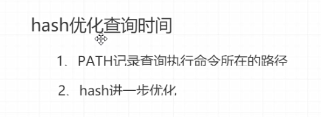

09-hash优化命令查询时间的原理




hash优化查询时间

* PATH记录路径
* hash进一步优化


查看PATH变量的值，用冒号`:`分割

```shell
[root@node0924 ~]# ASD ASD
-bash: ASD: command not found
[root@node0924 ~]# 

```

命令找不到时，提示`-bash: ASD: command not found`


使用过的命令`yum install man`，会存到hash中。


再次执行`yum install man`，会直接去hash中找，不用全局找PATH中的路径。


```shell
-- 清空hash中的值
[root@node0924 ~]# hash -r
[root@node0924 ~]# hash
hash: hash table empty
[root@node0924 ~]# 

```

清空hash中的值。


命令查询优化原理

* 先查找命令，再存到hash中


命令小结

* yum install man
* echo $PATH
* hash
* hash -r

