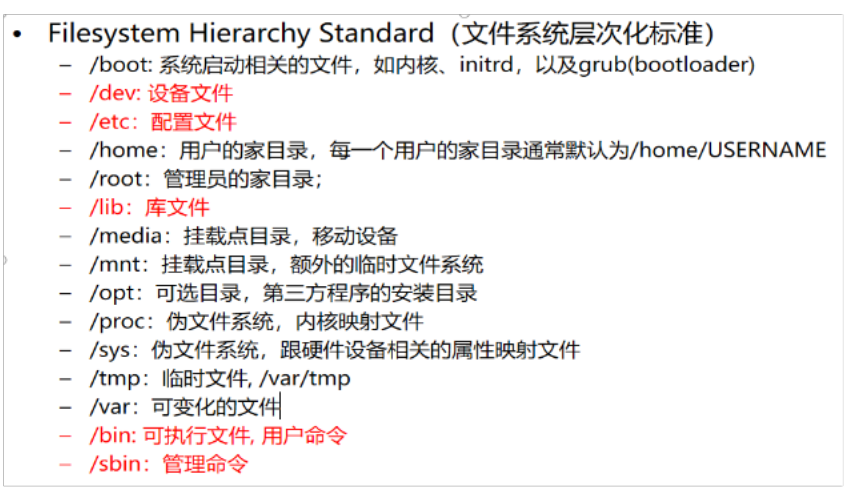

10-介绍Linux文件系统


```shell
-- 进入根目录
[root@node0924 ~]# cd /
-- 根目录下的文件
[root@node0924 /]# ll
total 94
dr-xr-xr-x.  2 root root   4096 Sep 26 19:30 bin
dr-xr-xr-x.  5 root root   1024 Sep 26 19:30 boot
drwxr-xr-x. 19 root root   3740 Nov 13 20:58 dev
drwxr-xr-x. 65 root root   4096 Nov 13 20:57 etc
drwxr-xr-x.  6 root root   4096 Sep 26 06:54 home
dr-xr-xr-x.  8 root root   4096 Sep 26 23:49 lib
dr-xr-xr-x.  9 root root  12288 Sep 26 19:30 lib64
drwx------.  2 root root  16384 Sep 25 07:48 lost+found
drwxr-xr-x.  2 root root   4096 Sep 23  2011 media
drwxr-xr-x.  2 root root   4096 Sep 23  2011 mnt
drwxr-xr-x.  3 root root   4096 Sep 27 00:44 opt
dr-xr-xr-x. 92 root root      0 Nov 13 20:57 proc
dr-xr-x---.  8 root root   4096 Nov 14 18:51 root
dr-xr-xr-x.  2 root root  12288 Sep 26 19:30 sbin
drwxr-xr-x.  7 root root      0 Nov 13 20:57 selinux
drwxrwx---.  2 root share  4096 Sep 26 07:20 share
drwxr-xr-x.  2 root root   4096 Sep 23  2011 srv
drwxr-xr-x  13 root root      0 Nov 13 20:57 sys
drwxrwxrwt.  3 root root   4096 Nov 13 23:19 tmp
drwxr-xr-x. 13 root root   4096 Sep 25 07:48 usr
drwxr-xr-x. 17 root root   4096 Sep 25 07:48 var
[root@node0924 /]# 

```

查看根目录下的文件

```shell
[root@node0924 /]# cd bin
[root@node0924 bin]# ls
arch      df             gawk                logger         ping      sh               uname
awk       dmesg          grep                login          ping6     sleep            unicode_start
basename  dnsdomainname  gtar                ls             plymouth  sort             unicode_stop
bash      domainname     gunzip              lsblk          ps        stty             unlink
cat       dumpkeys       gzip                mkdir          pwd       su               usleep
chgrp     echo           hostname            mknod          raw       sync             vi
chmod     egrep          ipcalc              mktemp         readlink  tar              view
chown     env            iptables-xml        more           rm        taskset          ypdomainname
cp        ex             iptables-xml-1.4.7  mount          rmdir     touch            zcat
cpio      false          kbd_mode            mountpoint     rpm       tracepath
cut       fgrep          kill                mv             rvi       tracepath6
dash      find           link                netstat        rview     true
date      findmnt        ln                  nice           sed       ulockmgr_server
dd        fusermount     loadkeys            nisdomainname  setfont   umount
[root@node0924 bin]# ll
total 5956
-rwxr-xr-x. 1 root root  24232 Jun 19  2018 arch
lrwxrwxrwx. 1 root root      4 Sep 26 19:27 awk -> gawk
-rwxr-xr-x. 1 root root  23720 Jun 19  2018 basename
-rwxr-xr-x. 1 root root 906568 Mar 23  2017 bash
-rwxr-xr-x. 1 root root  45224 Jun 19  2018 cat
-rwxr-xr-x. 1 root root  52936 Jun 19  2018 chgrp
-rwxr-xr-x. 1 root root  48712 Jun 19  2018 chmod
-rwxr-xr-x. 1 root root  53640 Jun 19  2018 chown
-rwxr-xr-x. 1 root root 116824 Jun 19  2018 cp
-rwxr-xr-x. 1 root root 129992 Mar 22  2017 cpio
-rwxr-xr-x. 1 root root  41704 Jun 19  2018 cut
-rwxr-xr-x. 1 root root 106216 Oct 17  2012 dash
-rwxr-xr-x. 1 root root  55576 Jun 19  2018 date
-rwxr-xr-x. 1 root root  52720 Jun 19  2018 dd
-rwxr-xr-x. 1 root root  90544 Jun 19  2018 df
-rwxr-xr-x. 1 root root   6736 Jan 26  2018 dmesg
lrwxrwxrwx. 1 root root      8 Sep 26 19:27 dnsdomainname -> hostname
lrwxrwxrwx. 1 root root      8 Sep 26 19:27 domainname -> hostname
-rwxr-xr-x. 1 root root  78504 Nov 12  2010 dumpkeys
-rwxr-xr-x. 1 root root  24136 Jun 19  2018 echo
lrwxrwxrwx. 1 root root      4 Sep 26 19:27 egrep -> grep
-rwxr-xr-x. 1 root root  23832 Jun 19  2018 env
lrwxrwxrwx. 1 root root      2 Sep 26 00:15 ex -> vi
-rwxr-xr-x. 1 root root  21112 Jun 19  2018 false
lrwxrwxrwx. 1 root root      4 Sep 26 19:27 fgrep -> grep
-rwxr-xr-x. 1 root root 234512 Mar  1  2016 find
-rwxr-xr-x. 1 root root  36392 Jan 26  2018 findmnt
-rwsr-x---. 1 root fuse  28000 May 11  2016 fusermount
-rwxr-xr-x. 1 root root 375616 Nov 10  2015 gawk
-rwxr-xr-x. 1 root root 163696 Mar 22  2017 grep
lrwxrwxrwx. 1 root root      3 Sep 26 19:27 gtar -> tar
-rwxr-xr-x. 1 root root     61 Mar 22  2017 gunzip
-rwxr-xr-x. 1 root root  64688 Mar 22  2017 gzip
-rwxr-xr-x. 1 root root  13880 Mar 22  2017 hostname
-rwxr-xr-x. 1 root root  11264 Jun 20  2018 ipcalc
lrwxrwxrwx. 1 root root     41 Sep 26 19:30 iptables-xml -> /etc/alternatives/bin-iptables-xml.x86_64
lrwxrwxrwx. 1 root root     20 Sep 26 19:28 iptables-xml-1.4.7 -> /sbin/iptables-multi
-rwxr-xr-x. 1 root root   7920 Nov 12  2010 kbd_mode
-rwxr-xr-x. 1 root root  11576 Jan 26  2018 kill
-rwxr-xr-x. 1 root root  23720 Jun 19  2018 link
-rwxr-xr-x. 1 root root  45664 Jun 19  2018 ln
-rwxr-xr-x. 1 root root 108248 Nov 12  2010 loadkeys
-rwxr-xr-x. 1 root root  11608 Jan 26  2018 logger
-rwxr-xr-x. 1 root root  29720 Jan 26  2018 login
-rwxr-xr-x. 1 root root 109208 Jun 19  2018 ls
-rwxr-xr-x. 1 root root  55336 Jan 26  2018 lsblk
-rwxr-xr-x. 1 root root  45416 Jun 19  2018 mkdir
-rwxr-xr-x. 1 root root  28568 Jun 19  2018 mknod
-rwxr-xr-x. 1 root root  33544 Jun 19  2018 mktemp
-rwxr-xr-x. 1 root root  35928 Jan 26  2018 more
-rwsr-xr-x. 1 root root  77560 Jan 26  2018 mount
-rwxr-xr-x. 1 root root   6728 Jul 24  2015 mountpoint
-rwxr-xr-x. 1 root root 106912 Jun 19  2018 mv
-rwxr-xr-x. 1 root root 123360 Mar 22  2017 netstat
-rwxr-xr-x. 1 root root  25208 Jun 19  2018 nice
lrwxrwxrwx. 1 root root      8 Sep 26 19:27 nisdomainname -> hostname
-rwsr-xr-x. 1 root root  38520 Mar 22  2017 ping
-rwsr-xr-x. 1 root root  36488 Mar 22  2017 ping6
-rwxr-xr-x. 1 root root  31776 Mar 22  2017 plymouth
-rwxr-xr-x. 1 root root  85304 Jun  1  2018 ps
-rwxr-xr-x. 1 root root  28008 Jun 19  2018 pwd
-rwxr-xr-x. 1 root root   8184 Jan 26  2018 raw
-rwxr-xr-x. 1 root root  36360 Jun 19  2018 readlink
-rwxr-xr-x. 1 root root  53592 Jun 19  2018 rm
-rwxr-xr-x. 1 root root  36888 Jun 19  2018 rmdir
-rwxr-xr-x. 1 root root  20392 Jun 19  2018 rpm
lrwxrwxrwx. 1 root root      2 Sep 26 00:15 rvi -> vi
lrwxrwxrwx. 1 root root      2 Sep 26 00:15 rview -> vi
-rwxr-xr-x. 1 root root  69624 Jun 22  2012 sed
-rwxr-xr-x. 1 root root  37448 Nov 12  2010 setfont
lrwxrwxrwx. 1 root root      4 Sep 26 19:27 sh -> bash
-rwxr-xr-x. 1 root root  24264 Jun 19  2018 sleep
-rwxr-xr-x. 1 root root  93496 Jun 19  2018 sort
-rwxr-xr-x. 1 root root  61320 Jun 19  2018 stty
-rwsr-xr-x. 1 root root  34904 Jun 19  2018 su
-rwxr-xr-x. 1 root root  21896 Jun 19  2018 sync
-rwxr-xr-x. 1 root root 390616 Jul 12  2016 tar
-rwxr-xr-x. 1 root root  11352 Jan 26  2018 taskset
-rwxr-xr-x. 1 root root  47928 Jun 19  2018 touch
-rwxr-xr-x. 1 root root  11440 Mar 22  2017 tracepath
-rwxr-xr-x. 1 root root  12304 Mar 22  2017 tracepath6
-rwxr-xr-x. 1 root root  21112 Jun 19  2018 true
-rwxr-xr-x. 1 root root  11256 May 11  2016 ulockmgr_server
-rwsr-xr-x. 1 root root  53480 Jan 26  2018 umount
-rwxr-xr-x. 1 root root  24232 Jun 19  2018 uname
-rwxr-xr-x. 1 root root   2555 Nov 12  2010 unicode_start
-rwxr-xr-x. 1 root root    363 Nov 12  2010 unicode_stop
-rwxr-xr-x. 1 root root  22216 Jun 19  2018 unlink
-rwxr-xr-x. 1 root root   6736 Jun 20  2018 usleep
-rwxr-xr-x. 1 root root 907312 Jul 17  2019 vi
lrwxrwxrwx. 1 root root      2 Sep 26 00:15 view -> vi
lrwxrwxrwx. 1 root root      8 Sep 26 19:27 ypdomainname -> hostname
-rwxr-xr-x. 1 root root     62 Mar 22  2017 zcat
[root@node0924 bin]# 

```


查看bin目录下的文件



文件系统


```shell
-- 查看分区
[root@node0924 /]# df -h
Filesystem      Size  Used Avail Use% Mounted on
/dev/sda3        97G  2.3G   89G   3% /
tmpfs           490M     0  490M   0% /dev/shm
/dev/sda1       190M   48M  132M  27% /boot

-- 查看PATH
[root@node0924 /]# echo $PATH
/usr/local/sbin:/usr/local/bin:/sbin:/bin:/usr/sbin:/usr/bin:/opt/maofachang/redis5/bin:/root/bin
[root@node0924 /]# 

```


```shell
[root@node0924 /]# cd /boot/
[root@node0924 boot]# ls
config-2.6.32-431.el6.x86_64              symvers-2.6.32-431.el6.x86_64.gz
config-2.6.32-754.33.1.el6.x86_64         symvers-2.6.32-754.33.1.el6.x86_64.gz
efi                                       System.map-2.6.32-431.el6.x86_64
grub                                      System.map-2.6.32-754.33.1.el6.x86_64
initramfs-2.6.32-431.el6.x86_64.img       vmlinuz-2.6.32-431.el6.x86_64
initramfs-2.6.32-754.33.1.el6.x86_64.img  vmlinuz-2.6.32-754.33.1.el6.x86_64
lost+found
[root@node0924 boot]# 

```

查看内核程序


```shell
[root@node0924 boot]# cd /dev/
[root@node0924 dev]# ll
total 0
crw-rw----. 1 root video    10, 175 Nov 13 20:57 agpgart
drwxr-xr-x. 2 root root         620 Nov 13 20:57 block
drwxr-xr-x. 2 root root          80 Nov 13 20:57 bsg
crw-------. 1 root root     10, 234 Nov 13 20:57 btrfs-control
drwxr-xr-x. 3 root root          60 Nov 13 20:57 bus
lrwxrwxrwx. 1 root root           3 Nov 13 20:57 cdrom -> sr0
lrwxrwxrwx. 1 root root           3 Nov 13 20:57 cdrw -> sr0
drwxr-xr-x. 2 root root        2940 Nov 13 20:58 char
crw-------. 1 root root      5,   1 Nov 13 20:57 console
lrwxrwxrwx. 1 root root          11 Nov 13 20:57 core -> /proc/kcore
drwxr-xr-x. 3 root root          60 Nov 13 20:57 cpu
crw-rw----. 1 root root     10,  61 Nov 13 20:57 cpu_dma_latency
crw-rw----. 1 root root     10,  62 Nov 13 20:57 crash
drwxr-xr-x. 6 root root         120 Nov 13 20:57 disk
crw-rw----. 1 root audio    14,   9 Nov 13 20:57 dmmidi
drwxr-xr-x. 2 root root         100 Nov 13 20:57 dri
lrwxrwxrwx. 1 root root           3 Nov 13 20:57 dvd -> sr0
lrwxrwxrwx. 1 root root           3 Nov 13 20:57 dvdrw -> sr0
lrwxrwxrwx. 1 root root           3 Nov 13 20:57 fb -> fb0
crw-rw----. 1 root video    29,   0 Nov 13 20:57 fb0
lrwxrwxrwx. 1 root root          13 Nov 13 20:57 fd -> /proc/self/fd
crw-rw-rw-. 1 root root      1,   7 Nov 13 20:57 full
crw-rw-rw-. 1 root root     10, 229 Nov 13 20:57 fuse
crw-rw----. 1 root root    248,   0 Nov 13 20:57 hidraw0
crw-rw----. 1 root root     10, 228 Nov 13 20:57 hpet
drwxr-xr-x. 2 root root          40 Nov 13 20:57 hugepages
crw-------. 1 root root    229,   0 Nov 13 20:57 hvc0
drwxr-xr-x. 4 root root         260 Nov 13 20:57 input
crw-rw----. 1 root root      1,  11 Nov 13 20:57 kmsg
srw-rw-rw-. 1 root root           0 Nov 13 20:58 log
brw-rw----. 1 root disk      7,   0 Nov 13 20:57 loop0
brw-rw----. 1 root disk      7,   1 Nov 13 20:57 loop1
brw-rw----. 1 root disk      7,   2 Nov 13 20:57 loop2
brw-rw----. 1 root disk      7,   3 Nov 13 20:57 loop3
brw-rw----. 1 root disk      7,   4 Nov 13 20:57 loop4
brw-rw----. 1 root disk      7,   5 Nov 13 20:57 loop5
brw-rw----. 1 root disk      7,   6 Nov 13 20:57 loop6
brw-rw----. 1 root disk      7,   7 Nov 13 20:57 loop7
crw-rw----. 1 root lp        6,   0 Nov 13 20:57 lp0
crw-rw----. 1 root lp        6,   1 Nov 13 20:57 lp1
crw-rw----. 1 root lp        6,   2 Nov 13 20:57 lp2
crw-rw----. 1 root lp        6,   3 Nov 13 20:57 lp3
lrwxrwxrwx. 1 root root          13 Nov 13 20:57 MAKEDEV -> /sbin/MAKEDEV
drwxr-xr-x. 2 root root          60 Nov 13 20:57 mapper
crw-rw----. 1 root root     10, 227 Nov 13 20:57 mcelog
crw-r-----. 1 root kmem      1,   1 Nov 13 20:57 mem
crw-rw----. 1 root audio    14,   2 Nov 13 20:57 midi
drwxr-xr-x. 2 root root          60 Nov 13 20:57 net
crw-rw----. 1 root root     10,  60 Nov 13 20:57 network_latency
crw-rw----. 1 root root     10,  59 Nov 13 20:57 network_throughput
crw-rw-rw-. 1 root root      1,   3 Nov 13 20:57 null
crw-r-----. 1 root kmem     10, 144 Nov 13 20:57 nvram
crw-rw----. 1 root root      1,  12 Nov 13 20:57 oldmem
crw-r-----. 1 root kmem      1,   4 Nov 13 20:57 port
crw-------. 1 root root    108,   0 Nov 13 20:57 ppp
crw-rw-rw-. 1 root tty       5,   2 Nov 14 19:55 ptmx
drwxr-xr-x. 2 root root           0 Nov 13 20:57 pts
brw-rw----. 1 root disk      1,   0 Nov 13 20:57 ram0
brw-rw----. 1 root disk      1,   1 Nov 13 20:57 ram1
brw-rw----. 1 root disk      1,  10 Nov 13 20:57 ram10
brw-rw----. 1 root disk      1,  11 Nov 13 20:57 ram11
brw-rw----. 1 root disk      1,  12 Nov 13 20:57 ram12
brw-rw----. 1 root disk      1,  13 Nov 13 20:57 ram13
brw-rw----. 1 root disk      1,  14 Nov 13 20:57 ram14
brw-rw----. 1 root disk      1,  15 Nov 13 20:57 ram15
brw-rw----. 1 root disk      1,   2 Nov 13 20:57 ram2
brw-rw----. 1 root disk      1,   3 Nov 13 20:57 ram3
brw-rw----. 1 root disk      1,   4 Nov 13 20:57 ram4
brw-rw----. 1 root disk      1,   5 Nov 13 20:57 ram5
brw-rw----. 1 root disk      1,   6 Nov 13 20:57 ram6
brw-rw----. 1 root disk      1,   7 Nov 13 20:57 ram7
brw-rw----. 1 root disk      1,   8 Nov 13 20:57 ram8
brw-rw----. 1 root disk      1,   9 Nov 13 20:57 ram9
crw-rw-rw-. 1 root root      1,   8 Nov 13 20:57 random
drwxr-xr-x. 2 root root          60 Nov 13 20:57 raw
crw-r--r--. 1 root root     10,  57 Nov 13 20:57 rfkill
lrwxrwxrwx. 1 root root           4 Nov 13 20:57 root -> sda3
lrwxrwxrwx. 1 root root           4 Nov 13 20:57 rtc -> rtc0
crw-rw----. 1 root root    253,   0 Nov 13 20:57 rtc0
lrwxrwxrwx. 1 root root           3 Nov 13 20:57 scd0 -> sr0
brw-rw----. 1 root disk      8,   0 Nov 13 20:57 sda
brw-rw----. 1 root disk      8,   1 Nov 13 20:57 sda1
brw-rw----. 1 root disk      8,   2 Nov 13 20:57 sda2
brw-rw----. 1 root disk      8,   3 Nov 13 20:57 sda3
crw-rw----. 1 root cdrom    21,   0 Nov 13 20:57 sg0
crw-rw----. 1 root disk     21,   1 Nov 13 20:57 sg1
drwxrwxrwt. 2 root root          40 Nov 13 20:57 shm
crw-rw----. 1 root root     10, 231 Nov 13 20:57 snapshot
drwxr-xr-x. 3 root root         200 Nov 13 20:57 snd
brw-rw----. 1 root cdrom    11,   0 Nov 13 20:57 sr0
lrwxrwxrwx. 1 root root          15 Nov 13 20:57 stderr -> /proc/self/fd/2
lrwxrwxrwx. 1 root root          15 Nov 13 20:57 stdin -> /proc/self/fd/0
lrwxrwxrwx. 1 root root          15 Nov 13 20:57 stdout -> /proc/self/fd/1
lrwxrwxrwx. 1 root root           4 Nov 13 20:57 systty -> tty0
crw-rw-rw-. 1 root tty       5,   0 Nov 13 20:57 tty
crw--w----. 1 root tty       4,   0 Nov 13 20:57 tty0
crw-------. 1 root root      4,   1 Nov 13 20:58 tty1
crw--w----. 1 root tty       4,  10 Nov 13 20:57 tty10
crw--w----. 1 root tty       4,  11 Nov 13 20:57 tty11
crw--w----. 1 root tty       4,  12 Nov 13 20:57 tty12
crw--w----. 1 root tty       4,  13 Nov 13 20:57 tty13
crw--w----. 1 root tty       4,  14 Nov 13 20:57 tty14
crw--w----. 1 root tty       4,  15 Nov 13 20:57 tty15
crw--w----. 1 root tty       4,  16 Nov 13 20:57 tty16
crw--w----. 1 root tty       4,  17 Nov 13 20:57 tty17
crw--w----. 1 root tty       4,  18 Nov 13 20:57 tty18
crw--w----. 1 root tty       4,  19 Nov 13 20:57 tty19
crw-------. 1 root root      4,   2 Nov 13 20:58 tty2
crw--w----. 1 root tty       4,  20 Nov 13 20:57 tty20
crw--w----. 1 root tty       4,  21 Nov 13 20:57 tty21
crw--w----. 1 root tty       4,  22 Nov 13 20:57 tty22
crw--w----. 1 root tty       4,  23 Nov 13 20:57 tty23
crw--w----. 1 root tty       4,  24 Nov 13 20:57 tty24
crw--w----. 1 root tty       4,  25 Nov 13 20:57 tty25
crw--w----. 1 root tty       4,  26 Nov 13 20:57 tty26
crw--w----. 1 root tty       4,  27 Nov 13 20:57 tty27
crw--w----. 1 root tty       4,  28 Nov 13 20:57 tty28
crw--w----. 1 root tty       4,  29 Nov 13 20:57 tty29
crw-------. 1 root root      4,   3 Nov 13 20:58 tty3
crw--w----. 1 root tty       4,  30 Nov 13 20:57 tty30
crw--w----. 1 root tty       4,  31 Nov 13 20:57 tty31
crw--w----. 1 root tty       4,  32 Nov 13 20:57 tty32
crw--w----. 1 root tty       4,  33 Nov 13 20:57 tty33
crw--w----. 1 root tty       4,  34 Nov 13 20:57 tty34
crw--w----. 1 root tty       4,  35 Nov 13 20:57 tty35
crw--w----. 1 root tty       4,  36 Nov 13 20:57 tty36
crw--w----. 1 root tty       4,  37 Nov 13 20:57 tty37
crw--w----. 1 root tty       4,  38 Nov 13 20:57 tty38
crw--w----. 1 root tty       4,  39 Nov 13 20:57 tty39
crw-------. 1 root root      4,   4 Nov 13 20:58 tty4
crw--w----. 1 root tty       4,  40 Nov 13 20:57 tty40
crw--w----. 1 root tty       4,  41 Nov 13 20:57 tty41
crw--w----. 1 root tty       4,  42 Nov 13 20:57 tty42
crw--w----. 1 root tty       4,  43 Nov 13 20:57 tty43
crw--w----. 1 root tty       4,  44 Nov 13 20:57 tty44
crw--w----. 1 root tty       4,  45 Nov 13 20:57 tty45
crw--w----. 1 root tty       4,  46 Nov 13 20:57 tty46
crw--w----. 1 root tty       4,  47 Nov 13 20:57 tty47
crw--w----. 1 root tty       4,  48 Nov 13 20:57 tty48
crw--w----. 1 root tty       4,  49 Nov 13 20:57 tty49
crw-------. 1 root root      4,   5 Nov 13 20:58 tty5
crw--w----. 1 root tty       4,  50 Nov 13 20:57 tty50
crw--w----. 1 root tty       4,  51 Nov 13 20:57 tty51
crw--w----. 1 root tty       4,  52 Nov 13 20:57 tty52
crw--w----. 1 root tty       4,  53 Nov 13 20:57 tty53
crw--w----. 1 root tty       4,  54 Nov 13 20:57 tty54
crw--w----. 1 root tty       4,  55 Nov 13 20:57 tty55
crw--w----. 1 root tty       4,  56 Nov 13 20:57 tty56
crw--w----. 1 root tty       4,  57 Nov 13 20:57 tty57
crw--w----. 1 root tty       4,  58 Nov 13 20:57 tty58
crw--w----. 1 root tty       4,  59 Nov 13 20:57 tty59
crw-------. 1 root root      4,   6 Nov 13 20:58 tty6
crw--w----. 1 root tty       4,  60 Nov 13 20:57 tty60
crw--w----. 1 root tty       4,  61 Nov 13 20:57 tty61
crw--w----. 1 root tty       4,  62 Nov 13 20:57 tty62
crw--w----. 1 root tty       4,  63 Nov 13 20:57 tty63
crw--w----. 1 root tty       4,   7 Nov 13 20:57 tty7
crw--w----. 1 root tty       4,   8 Nov 13 20:57 tty8
crw--w----. 1 root tty       4,   9 Nov 13 20:57 tty9
crw-rw----. 1 root dialout   4,  64 Nov 13 20:57 ttyS0
crw-rw----. 1 root dialout   4,  65 Nov 13 20:57 ttyS1
crw-rw----. 1 root dialout   4,  66 Nov 13 20:57 ttyS2
crw-rw----. 1 root dialout   4,  67 Nov 13 20:57 ttyS3
crw-rw-rw-. 1 root root      1,   9 Nov 13 20:57 urandom
crw-rw----. 1 root root    249,   0 Nov 13 20:57 usbmon0
crw-rw----. 1 root root    249,   1 Nov 13 20:57 usbmon1
crw-rw----. 1 root root    249,   2 Nov 13 20:57 usbmon2
crw-rw----. 1 vcsa tty       7,   0 Nov 13 20:57 vcs
crw-rw----. 1 vcsa tty       7,   1 Nov 13 20:57 vcs1
crw-rw----. 1 vcsa tty       7,   2 Nov 13 20:58 vcs2
crw-rw----. 1 vcsa tty       7,   3 Nov 13 20:58 vcs3
crw-rw----. 1 vcsa tty       7,   4 Nov 13 20:58 vcs4
crw-rw----. 1 vcsa tty       7,   5 Nov 13 20:58 vcs5
crw-rw----. 1 vcsa tty       7,   6 Nov 13 20:58 vcs6
crw-rw----. 1 vcsa tty       7, 128 Nov 13 20:57 vcsa
crw-rw----. 1 vcsa tty       7, 129 Nov 13 20:57 vcsa1
crw-rw----. 1 vcsa tty       7, 130 Nov 13 20:58 vcsa2
crw-rw----. 1 vcsa tty       7, 131 Nov 13 20:58 vcsa3
crw-rw----. 1 vcsa tty       7, 132 Nov 13 20:58 vcsa4
crw-rw----. 1 vcsa tty       7, 133 Nov 13 20:58 vcsa5
crw-rw----. 1 vcsa tty       7, 134 Nov 13 20:58 vcsa6
crw-rw----. 1 root root     10,  63 Nov 13 20:57 vga_arbiter
crw-rw-rw-. 1 root root      1,   5 Nov 13 20:57 zero
[root@node0924 dev]# 

```


查看dev文件，设备文件，鼠标键盘。。。


```shell
-- cd，返回当前用户的家目录
[root@node0924 dev]# cd
-- root用户的家目录是/root
[root@node0924 ~]# pwd
/root

-- 普通用户的家目录是home
[root@node0924 ~]# cd /home/

-- home下有4个用户
[root@node0924 home]# ls
mfc01  mfc02  mfc03  mfc9
[root@node0924 home]# 

```


```shell
[root@node0924 home]# useradd mfc19
[root@node0924 home]# ls
mfc01  mfc02  mfc03  mfc19  mfc9
[root@node0924 home]# 


```

添加一个新用户，查看用户


查看伪文件系统，1894为当前进程的系统文件。回随着进程的存在而存在，进程的消失而消失。

```shell
[root@node0924 home]# cd /proc/
[root@node0924 proc]# ls
1     14    18    24   33   49   848        driver       kmsg        net            sysvipc
10    15    1889  25   34   5    9          execdomains  kpagecount  pagetypeinfo   timer_list
11    1508  1894  255  35   50   acpi       fb           kpageflags  partitions     timer_stats
1105  1565  19    257  36   51   asound     filesystems  loadavg     sched_debug    tty
1127  1567  1911  26   364  6    buddyinfo  fs           locks       schedstat      uptime
115   1569  1915  263  365  618  bus        interrupts   mdstat      scsi           version
1193  1572  1941  264  37   7    cgroups    iomem        meminfo     self           vmallocinfo
12    1573  1956  265  38   751  cmdline    ioports      misc        slabinfo       vmstat
1200  1574  2     27   39   796  cpuinfo    irq          modules     softirqs       zoneinfo
1210  1576  20    28   4    797  crypto     kallsyms     mounts      stat
1219  1578  21    29   451  8    devices    kcore        mpt         swaps
1254  16    22    3    46   83   diskstats  keys         mtd         sys
13    17    23    30   47   84   dma        key-users    mtrr        sysrq-trigger
[root@node0924 proc]# echo $$
1894
[root@node0924 proc]# cd 1894
[root@node0924 1894]# ls
attr        cmdline          environ  limits     mounts      oom_adj        root       stack    task
autogroup   comm             exe      loginuid   mountstats  oom_score      sched      stat     wchan
auxv        coredump_filter  fd       maps       net         oom_score_adj  schedstat  statm
cgroup      cpuset           fdinfo   mem        ns          pagemap        sessionid  status
clear_refs  cwd              io       mountinfo  numa_maps   personality    smaps      syscall
[root@node0924 1894]# 

```


最后，还是看着张图，总结。


命令小结

* cd /
* ll
* ls
* df -h
* echo $PATH
* useradd xxx

