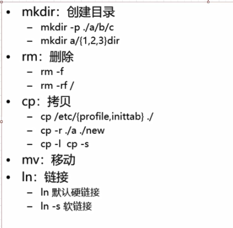

12-文件系统相关的命令-cd cp mv mkdir等命令


```shell
# 切换目录
[root@node0924 ~]# cd /etc/
# 查看当前目录
[root@node0924 etc]# pwd
/etc
# 返回家目录
[root@node0924 etc]# cd
# 查看当前目录
[root@node0924 ~]# pwd
/root
# 切换目录
[root@node0924 ~]# cd /dev/
# 返回家目录
[root@node0924 dev]# cd ~
# 返回上一级目录
[root@node0924 ~]# cd ..
# 查看当前目录
[root@node0924 /]# pwd
/
[root@node0924 /]# 

```


```shell
# mkdir 创建aa目录
[root@node0924 ~]# mkdir aa
# 查看文件
[root@node0924 ~]# ls -l
total 64
drwxr-xr-x. 9 root root 4096 Nov 14 18:50 a
drwxr-xr-x. 2 root root 4096 Nov 15 08:25 aa
-rw-------. 1 root root  903 Nov 14 20:37 anaconda-ks.cfg
drwxr-xr-x. 4 root root 4096 Sep 28 20:23 data
-rw-r--r--. 1 root root 8815 Sep 25 07:50 install.log
-rw-r--r--. 1 root root 3384 Sep 25 07:50 install.log.syslog
-rw-r--r--. 1 root root 5824 Nov 12  2015 mysql-community-release-el6-5.noarch.rpm
-rw-r--r--. 1 root root 5824 Nov 12  2015 mysql-community-release-el6-5.noarch.rpm.1
drwxr-xr-x. 5 root root 4096 Sep 28 20:46 soft
drwxr-xr-x. 2 root root 4096 Sep 29 01:56 springboot
drwxr-xr-x. 6 root root 4096 Nov 14 18:50 test
-rw-r--r--. 1 root root   45 Sep 26 03:45 zfg

```


```shell
# 创建目录下面的子目录，没有创建成功
[root@node0924 ~]# mkdir aa/adir/bdir
mkdir: cannot create directory `aa/adir/bdir': No such file or directory
# 创建目录下面的子目录，创建成功
[root@node0924 ~]# mkdir -p aa/adir/bdir
[root@node0924 ~]# cd /aa/
-bash: cd: /aa/: No such file or directory
# 切换到子目录
[root@node0924 ~]# cd aa
# 查看目录
[root@node0924 aa]# ls
adir
# 切换到子目录
[root@node0924 aa]# cd adir/
# 查看目录
[root@node0924 adir]# ls
bdir
[root@node0924 adir]# 

```


```shell
# 返回家目录
[root@node0924 adir]# cd
# 查看目录文件
[root@node0924 ~]# ls
a   anaconda-ks.cfg  install.log         mysql-community-release-el6-5.noarch.rpm    soft        test
aa  data             install.log.syslog  mysql-community-release-el6-5.noarch.rpm.1  springboot  zfg
# 创建多个目录
[root@node0924 ~]# mkdir aa/xdir aa/ydir aa/zdir
# 切换aa目录
[root@node0924 ~]# cd aa
# 查看目录文件
[root@node0924 aa]# ls
adir  xdir  ydir  zdir
[root@node0924 aa]# 

```


```shell
# 查看aa目录下的文件
[root@node0924 aa]# ls
adir  xdir  ydir  zdir
# 创建多个目录，目录不存在
[root@node0924 aa]# mkdir aa/{1,2,3}dir
mkdir: cannot create directory `aa/1dir': No such file or directory
mkdir: cannot create directory `aa/2dir': No such file or directory
mkdir: cannot create directory `aa/3dir': No such file or directory
# 返货上一级
[root@node0924 aa]# cd ..
# 创建多个目录
[root@node0924 ~]# mkdir aa/{1,2,3}dir
# 切换目录
[root@node0924 ~]# cd aa
# 查看目录文件
[root@node0924 aa]# ls
1dir  2dir  3dir  adir  xdir  ydir  zdir
[root@node0924 aa]# 

```


```shell
# 拷贝文件到当前目录
[root@node0924 aa]# cp /etc/profile .
# 查看目录文件
[root@node0924 aa]# ls
1dir  2dir  3dir  adir  profile  xdir  ydir  zdir
[root@node0924 aa]# 

```


```shell
# 查看目录下的文件
[root@node0924 aa]# ls
1dir  2dir  3dir  adir  profile  xdir  ydir  zdir
# 查看etc目录下profile文件的内容
[root@node0924 aa]# cat /etc/profile
# /etc/profile

# System wide environment and startup programs, for login setup
# Functions and aliases go in /etc/bashrc

# It's NOT a good idea to change this file unless you know what you
# are doing. It's much better to create a custom.sh shell script in
# /etc/profile.d/ to make custom changes to your environment, as this
# will prevent the need for merging in future updates.

pathmunge () {
    case ":${PATH}:" in
        *:"$1":*)
            ;;
        *)
            if [ "$2" = "after" ] ; then
                PATH=$PATH:$1
            else
                PATH=$1:$PATH
            fi
    esac
}


if [ -x /usr/bin/id ]; then
    if [ -z "$EUID" ]; then
        # ksh workaround
        EUID=`/usr/bin/id -u`
        UID=`/usr/bin/id -ru`
    fi
    USER="`/usr/bin/id -un`"
    LOGNAME=$USER
    MAIL="/var/spool/mail/$USER"
fi

# Path manipulation
if [ "$EUID" = "0" ]; then
    pathmunge /sbin
    pathmunge /usr/sbin
    pathmunge /usr/local/sbin
else
    pathmunge /usr/local/sbin after
    pathmunge /usr/sbin after
    pathmunge /sbin after
fi

HOSTNAME=`/bin/hostname 2>/dev/null`
HISTSIZE=1000
if [ "$HISTCONTROL" = "ignorespace" ] ; then
    export HISTCONTROL=ignoreboth
else
    export HISTCONTROL=ignoredups
fi

export PATH USER LOGNAME MAIL HOSTNAME HISTSIZE HISTCONTROL

# By default, we want umask to get set. This sets it for login shell
# Current threshold for system reserved uid/gids is 200
# You could check uidgid reservation validity in
# /usr/share/doc/setup-*/uidgid file
if [ $UID -gt 199 ] && [ "`/usr/bin/id -gn`" = "`/usr/bin/id -un`" ]; then
    umask 002
else
    umask 022
fi

for i in /etc/profile.d/*.sh ; do
    if [ -r "$i" ]; then
        if [ "${-#*i}" != "$-" ]; then
            . "$i"
        else
            . "$i" >/dev/null 2>&1
        fi
    fi
done

unset i
unset -f pathmunge

export REDIS_HOME=/opt/maofachang/redis5
export PATH=$PATH:$REDIS_HOME/bin
[root@node0924 aa]# ls
1dir  2dir  3dir  adir  profile  xdir  ydir  zdir
# 查看aa目录下profile文件的内容
[root@node0924 aa]# cat profile
# /etc/profile

# System wide environment and startup programs, for login setup
# Functions and aliases go in /etc/bashrc

# It's NOT a good idea to change this file unless you know what you
# are doing. It's much better to create a custom.sh shell script in
# /etc/profile.d/ to make custom changes to your environment, as this
# will prevent the need for merging in future updates.

pathmunge () {
    case ":${PATH}:" in
        *:"$1":*)
            ;;
        *)
            if [ "$2" = "after" ] ; then
                PATH=$PATH:$1
            else
                PATH=$1:$PATH
            fi
    esac
}


if [ -x /usr/bin/id ]; then
    if [ -z "$EUID" ]; then
        # ksh workaround
        EUID=`/usr/bin/id -u`
        UID=`/usr/bin/id -ru`
    fi
    USER="`/usr/bin/id -un`"
    LOGNAME=$USER
    MAIL="/var/spool/mail/$USER"
fi

# Path manipulation
if [ "$EUID" = "0" ]; then
    pathmunge /sbin
    pathmunge /usr/sbin
    pathmunge /usr/local/sbin
else
    pathmunge /usr/local/sbin after
    pathmunge /usr/sbin after
    pathmunge /sbin after
fi

HOSTNAME=`/bin/hostname 2>/dev/null`
HISTSIZE=1000
if [ "$HISTCONTROL" = "ignorespace" ] ; then
    export HISTCONTROL=ignoreboth
else
    export HISTCONTROL=ignoredups
fi

export PATH USER LOGNAME MAIL HOSTNAME HISTSIZE HISTCONTROL

# By default, we want umask to get set. This sets it for login shell
# Current threshold for system reserved uid/gids is 200
# You could check uidgid reservation validity in
# /usr/share/doc/setup-*/uidgid file
if [ $UID -gt 199 ] && [ "`/usr/bin/id -gn`" = "`/usr/bin/id -un`" ]; then
    umask 002
else
    umask 022
fi

for i in /etc/profile.d/*.sh ; do
    if [ -r "$i" ]; then
        if [ "${-#*i}" != "$-" ]; then
            . "$i"
        else
            . "$i" >/dev/null 2>&1
        fi
    fi
done

unset i
unset -f pathmunge

export REDIS_HOME=/opt/maofachang/redis5
export PATH=$PATH:$REDIS_HOME/bin
[root@node0924 aa]# 

```


```shell
# 查看目录下的文件
[root@node0924 aa]# ls
1dir  2dir  3dir  adir  profile  xdir  ydir  zdir
# mv移动文件
[root@node0924 aa]# mv profile 1dir/
# 查看目录下的文件
[root@node0924 aa]# ls
1dir  2dir  3dir  adir  xdir  ydir  zdir
# 切换目录
[root@node0924 aa]# cd 1dir/
# 查看目录下的文件
[root@node0924 1dir]# ls
profile
[root@node0924 1dir]# 

```


```shell
# 查看当前目录的文件
[root@node0924 1dir]# ls
profile
# 使用mv，给文件改名
[root@node0924 1dir]# mv profile profile.bak
# 查看目录下的文件详情
[root@node0924 1dir]# ll
total 4
-rw-r--r--. 1 root root 1917 Nov 15 08:37 profile.bak
[root@node0924 1dir]# 

```





命令小结

* mkdir
* cp
* mv

