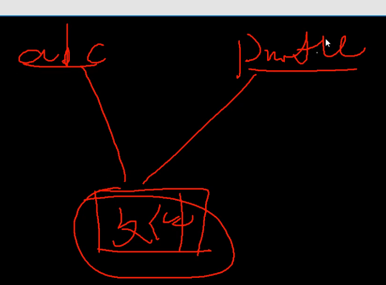
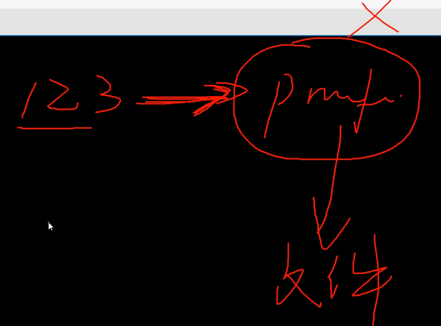

13-文件系统相关的命令-rm ln软连接等命令


cp 复制

mv 移动


```shell
# 查看目录下文件
[root@node0924 ~]# ls
a   anaconda-ks.cfg  install.log         mysql-community-release-el6-5.noarch.rpm    soft        test
aa  data             install.log.syslog  mysql-community-release-el6-5.noarch.rpm.1  springboot  zfg
# 创建目录ccpp
[root@node0924 ~]# mkdir ccpp
[root@node0924 ~]# ls
a                ccpp         install.log.syslog                          soft        zfg
aa               data         mysql-community-release-el6-5.noarch.rpm    springboot
anaconda-ks.cfg  install.log  mysql-community-release-el6-5.noarch.rpm.1  test
# 将文件夹aa拷贝到ccpp，失败
[root@node0924 ~]# cp aa ccpp/
cp: omitting directory `aa'
# 将文件夹aa拷贝到ccpp，成功
[root@node0924 ~]# cp -r aa ccpp/
# 切换目录
[root@node0924 ~]# cd ccpp
# 查看目录
[root@node0924 ccpp]# ls
aa
# 返回家目录
[root@node0924 ccpp]# cd
# 切换目录
[root@node0924 ~]# cd aa
# 查看目录
[root@node0924 aa]# ls
1dir  2dir  3dir  adir  xdir  ydir  zdir
[root@node0924 aa]# 

```

`cp -r aa ccpp/`拷贝文件目录


```shell
# 查看当前目录的文件
[root@node0924 1dir]# ls
profile.bak
# 删除文件，需要手动确认yes
[root@node0924 1dir]# rm profile.bak
rm: remove regular file `profile.bak'? yes
# 查看当前目录的文件
[root@node0924 1dir]# ls
[root@node0924 1dir]# 

```

`rm profile.bak`删除文件，有提示。

```shell
# 创建hello文件
[root@node0924 1dir]# vim hello
# 查看目录下的文件
[root@node0924 1dir]# ls
hello
# 查看文件的内容
[root@node0924 1dir]# cat hello
hello
# 删除文件
[root@node0924 1dir]# rm -f hell
# 查看目录下的文件
[root@node0924 1dir]# ls
hello
[root@node0924 1dir]# 

```

`rm -f hell`删除文件，没有提示。


```shell
# 返回家目录
[root@node0924 1dir]# cd
# 删除文件夹，失败
[root@node0924 ~]# rm -f ccpp/
rm: cannot remove `ccpp/': Is a directory
# 删除文件夹，成功
[root@node0924 ~]# rm -r -f ccpp/
# 查看目录文件
[root@node0924 ~]# ls
a   anaconda-ks.cfg  install.log         mysql-community-release-el6-5.noarch.rpm    soft        test
aa  data             install.log.syslog  mysql-community-release-el6-5.noarch.rpm.1  springboot  zfg
[root@node0924 ~]# 

```

`rm -r -f ccpp/`,删除文件夹。


```shell
# 清理屏幕
[root@node0924 ~]# clear
# 切换目录
[root@node0924 ~]# cd aa
# 切换目录
[root@node0924 aa]# cd 1dir
# 查看目录文件
[root@node0924 1dir]# ls
hello
# 删除hello文件
[root@node0924 1dir]# rm -f hello
# 查看目录文件
[root@node0924 1dir]# ls
# 创建hello.txt文件
[root@node0924 1dir]# vim hello.txt
# 查看目录文件
[root@node0924 1dir]# ls
hello.txt
# 创建链接文件
[root@node0924 1dir]# ln hello.txt abc
# 查看目录文件
[root@node0924 1dir]# ls
abc  hello.txt
# 查看文件详情
[root@node0924 1dir]# ll -i
total 8
3802869 -rw-r--r--. 2 root root 12 Nov 15 09:07 abc
3802869 -rw-r--r--. 2 root root 12 Nov 15 09:07 hello.txt
# 删除目录下所有文件
[root@node0924 1dir]# rm -rf *
# 查看目录文件
[root@node0924 1dir]# ls
# 拷贝文件profile到当前目录
[root@node0924 1dir]# cp /etc/profile ./
# 查看目录文件
[root@node0924 1dir]# ls
profile
[root@node0924 1dir]# 

```

`rm -rf *`删除目录下所有文件

`cp /etc/profile ./`拷贝文件profile到当前目


```shell
# 查看文件详细
[root@node0924 1dir]# ll -i
total 4
3801097 -rw-r--r--. 1 root root 1917 Nov 15 09:08 profile
# 创建ln链接
[root@node0924 1dir]# ln profile abc
[root@node0924 1dir]# ll -i
total 8
3801097 -rw-r--r--. 2 root root 1917 Nov 15 09:08 abc
3801097 -rw-r--r--. 2 root root 1917 Nov 15 09:08 profile
[root@node0924 1dir]# vim profile
[root@node0924 1dir]# cat abc
11111111111111111111
# /etc/profile

# System wide environment and startup programs, for login setup
# Functions and aliases go in /etc/bashrc

# It's NOT a good idea to change this file unless you know what you
# are doing. It's much better to create a custom.sh shell script in
# /etc/profile.d/ to make custom changes to your environment, as this
# will prevent the need for merging in future updates.

pathmunge () {
    case ":${PATH}:" in
        *:"$1":*)
            ;;
        *)
            if [ "$2" = "after" ] ; then
                PATH=$PATH:$1
            else
                PATH=$1:$PATH
            fi
    esac
}


if [ -x /usr/bin/id ]; then
    if [ -z "$EUID" ]; then
        # ksh workaround
        EUID=`/usr/bin/id -u`
        UID=`/usr/bin/id -ru`
    fi
    USER="`/usr/bin/id -un`"
    LOGNAME=$USER
    MAIL="/var/spool/mail/$USER"
fi

# Path manipulation
if [ "$EUID" = "0" ]; then
    pathmunge /sbin
    pathmunge /usr/sbin
    pathmunge /usr/local/sbin
else
    pathmunge /usr/local/sbin after
    pathmunge /usr/sbin after
    pathmunge /sbin after
fi

HOSTNAME=`/bin/hostname 2>/dev/null`
HISTSIZE=1000
if [ "$HISTCONTROL" = "ignorespace" ] ; then
    export HISTCONTROL=ignoreboth
else
    export HISTCONTROL=ignoredups
fi

export PATH USER LOGNAME MAIL HOSTNAME HISTSIZE HISTCONTROL

# By default, we want umask to get set. This sets it for login shell
# Current threshold for system reserved uid/gids is 200
# You could check uidgid reservation validity in
# /usr/share/doc/setup-*/uidgid file
if [ $UID -gt 199 ] && [ "`/usr/bin/id -gn`" = "`/usr/bin/id -un`" ]; then
    umask 002
else
    umask 022
fi

for i in /etc/profile.d/*.sh ; do
    if [ -r "$i" ]; then
        if [ "${-#*i}" != "$-" ]; then
            . "$i"
        else
            . "$i" >/dev/null 2>&1
        fi
    fi
done

unset i
unset -f pathmunge

export REDIS_HOME=/opt/maofachang/redis5
export PATH=$PATH:$REDIS_HOME/bin
[root@node0924 1dir]# 

```

`ln profile abc`创建链接。abc链接到profile文件。



`abc`和`profile`操作的是同一个文件。

```shell
[root@node0924 1dir]# ls
abc  profile
[root@node0924 1dir]# rm -f profile
[root@node0924 1dir]# cat abc
11111111111111111111
# /etc/profile

# System wide environment and startup programs, for login setup
# Functions and aliases go in /etc/bashrc

# It's NOT a good idea to change this file unless you know what you
# are doing. It's much better to create a custom.sh shell script in
# /etc/profile.d/ to make custom changes to your environment, as this
# will prevent the need for merging in future updates.

pathmunge () {
    case ":${PATH}:" in
        *:"$1":*)
            ;;
        *)
            if [ "$2" = "after" ] ; then
                PATH=$PATH:$1
            else
                PATH=$1:$PATH
            fi
    esac
}


if [ -x /usr/bin/id ]; then
    if [ -z "$EUID" ]; then
        # ksh workaround
        EUID=`/usr/bin/id -u`
        UID=`/usr/bin/id -ru`
    fi
    USER="`/usr/bin/id -un`"
    LOGNAME=$USER
    MAIL="/var/spool/mail/$USER"
fi

# Path manipulation
if [ "$EUID" = "0" ]; then
    pathmunge /sbin
    pathmunge /usr/sbin
    pathmunge /usr/local/sbin
else
    pathmunge /usr/local/sbin after
    pathmunge /usr/sbin after
    pathmunge /sbin after
fi

HOSTNAME=`/bin/hostname 2>/dev/null`
HISTSIZE=1000
if [ "$HISTCONTROL" = "ignorespace" ] ; then
    export HISTCONTROL=ignoreboth
else
    export HISTCONTROL=ignoredups
fi

export PATH USER LOGNAME MAIL HOSTNAME HISTSIZE HISTCONTROL

# By default, we want umask to get set. This sets it for login shell
# Current threshold for system reserved uid/gids is 200
# You could check uidgid reservation validity in
# /usr/share/doc/setup-*/uidgid file
if [ $UID -gt 199 ] && [ "`/usr/bin/id -gn`" = "`/usr/bin/id -un`" ]; then
    umask 002
else
    umask 022
fi

for i in /etc/profile.d/*.sh ; do
    if [ -r "$i" ]; then
        if [ "${-#*i}" != "$-" ]; then
            . "$i"
        else
            . "$i" >/dev/null 2>&1
        fi
    fi
done

unset i
unset -f pathmunge

export REDIS_HOME=/opt/maofachang/redis5
export PATH=$PATH:$REDIS_HOME/bin
[root@node0924 1dir]# 

```

`rm -f profile`先删除profile文件，
`cat abc`再查看abc文件的内容，发现删除profile文件对abc没有影响。

这是一个硬连接。


```shell
[root@node0924 1dir]# ls
abc
[root@node0924 1dir]# ll -i
total 4
3801097 -rw-r--r--. 1 root root 1938 Nov 15 09:13 abc
[root@node0924 1dir]# cp /etc/profile ./
[root@node0924 1dir]# ls
abc  profile
[root@node0924 1dir]# ll -i
total 8
3801097 -rw-r--r--. 1 root root 1938 Nov 15 09:13 abc
3802869 -rw-r--r--. 1 root root 1917 Nov 15 09:20 profile
[root@node0924 1dir]# 

```

`cp /etc/profile ./`重新拷贝文件。


```shell
[root@node0924 1dir]# ln -s profile 123
[root@node0924 1dir]# ll -i
total 8
3802870 lrwxrwxrwx. 1 root root    7 Nov 15 09:21 123 -> profile
3801097 -rw-r--r--. 1 root root 1938 Nov 15 09:13 abc
3802869 -rw-r--r--. 1 root root 1917 Nov 15 09:20 profile
[root@node0924 1dir]# 

```

`ln -s profile 123`创建软链接

```shell
[root@node0924 1dir]# cat 123
# /etc/profile

# System wide environment and startup programs, for login setup
# Functions and aliases go in /etc/bashrc

# It's NOT a good idea to change this file unless you know what you
# are doing. It's much better to create a custom.sh shell script in
# /etc/profile.d/ to make custom changes to your environment, as this
# will prevent the need for merging in future updates.

pathmunge () {
    case ":${PATH}:" in
        *:"$1":*)
            ;;
        *)
            if [ "$2" = "after" ] ; then
                PATH=$PATH:$1
            else
                PATH=$1:$PATH
            fi
    esac
}


if [ -x /usr/bin/id ]; then
    if [ -z "$EUID" ]; then
        # ksh workaround
        EUID=`/usr/bin/id -u`
        UID=`/usr/bin/id -ru`
    fi
    USER="`/usr/bin/id -un`"
    LOGNAME=$USER
    MAIL="/var/spool/mail/$USER"
fi

# Path manipulation
if [ "$EUID" = "0" ]; then
    pathmunge /sbin
    pathmunge /usr/sbin
    pathmunge /usr/local/sbin
else
    pathmunge /usr/local/sbin after
    pathmunge /usr/sbin after
    pathmunge /sbin after
fi

HOSTNAME=`/bin/hostname 2>/dev/null`
HISTSIZE=1000
if [ "$HISTCONTROL" = "ignorespace" ] ; then
    export HISTCONTROL=ignoreboth
else
    export HISTCONTROL=ignoredups
fi

export PATH USER LOGNAME MAIL HOSTNAME HISTSIZE HISTCONTROL

# By default, we want umask to get set. This sets it for login shell
# Current threshold for system reserved uid/gids is 200
# You could check uidgid reservation validity in
# /usr/share/doc/setup-*/uidgid file
if [ $UID -gt 199 ] && [ "`/usr/bin/id -gn`" = "`/usr/bin/id -un`" ]; then
    umask 002
else
    umask 022
fi

for i in /etc/profile.d/*.sh ; do
    if [ -r "$i" ]; then
        if [ "${-#*i}" != "$-" ]; then
            . "$i"
        else
            . "$i" >/dev/null 2>&1
        fi
    fi
done

unset i
unset -f pathmunge

export REDIS_HOME=/opt/maofachang/redis5
export PATH=$PATH:$REDIS_HOME/bin
[root@node0924 1dir]# 

```

 `cat 123`查看123的内容。

```shell
[root@node0924 1dir]# ll -i
total 8
3802870 lrwxrwxrwx. 1 root root    7 Nov 15 09:21 123 -> profile
3801097 -rw-r--r--. 1 root root 1938 Nov 15 09:13 abc
3802869 -rw-r--r--. 1 root root 1917 Nov 15 09:20 profile
[root@node0924 1dir]# rm -f profile
[root@node0924 1dir]# ll -i
total 4
3802870 lrwxrwxrwx. 1 root root    7 Nov 15 09:21 123 -> profile
3801097 -rw-r--r--. 1 root root 1938 Nov 15 09:13 abc
[root@node0924 1dir]# cat 123
cat: 123: No such file or directory
[root@node0924 1dir]# 

```

`rm -f profile`删除profile后

`cat 123`也不能访问到。



删除profile文件之后，123找不到文件。

软连接，设置依赖管理。


小结

* cp
* mv
* rm
* ln
  * 硬连接 ln profile abc
  * 软连接 ln -s profile 123


