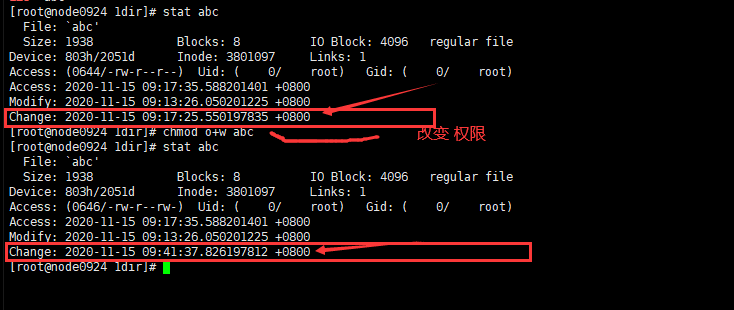
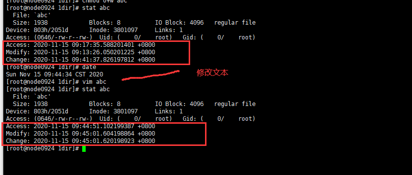
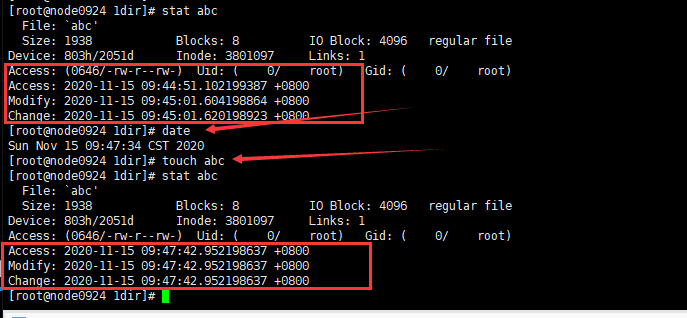
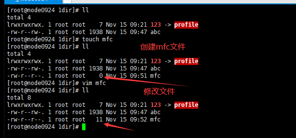

14-文件系统相关的命令-stat touch命令


stat查看文件详细信息

touch一致时间，创建新文本


```shell
[root@node0924 1dir]# pwd
/root/aa/1dir
[root@node0924 1dir]# ls
123  abc
[root@node0924 1dir]# stat abc
  File: `abc'
  Size: 1938      	Blocks: 8          IO Block: 4096   regular file
Device: 803h/2051d	Inode: 3801097     Links: 1
Access: (0644/-rw-r--r--)  Uid: (    0/    root)   Gid: (    0/    root)
Access: 2020-11-15 09:17:35.588201401 +0800
Modify: 2020-11-15 09:13:26.050201225 +0800
Change: 2020-11-15 09:17:25.550197835 +0800
[root@node0924 1dir]# 

```

`stat abc`查看文件状态

* File 文件
* Size 大小
* Blocks 块
* IO Block IO块
* 时间
  * Access 访问时间
  * Modify 修改时间
  * Change 改变时间




改变权限后，Change的时间改变了。

```shell
[root@node0924 1dir]# stat abc
  File: `abc'
  Size: 1938      	Blocks: 8          IO Block: 4096   regular file
Device: 803h/2051d	Inode: 3801097     Links: 1
Access: (0644/-rw-r--r--)  Uid: (    0/    root)   Gid: (    0/    root)
Access: 2020-11-15 09:17:35.588201401 +0800
Modify: 2020-11-15 09:13:26.050201225 +0800
Change: 2020-11-15 09:17:25.550197835 +0800
[root@node0924 1dir]# chmod o+w abc
[root@node0924 1dir]# stat abc
  File: `abc'
  Size: 1938      	Blocks: 8          IO Block: 4096   regular file
Device: 803h/2051d	Inode: 3801097     Links: 1
Access: (0646/-rw-r--rw-)  Uid: (    0/    root)   Gid: (    0/    root)
Access: 2020-11-15 09:17:35.588201401 +0800
Modify: 2020-11-15 09:13:26.050201225 +0800
Change: 2020-11-15 09:41:37.826197812 +0800
[root@node0924 1dir]# 

```



修改文本`vim abc`后，访问时间，修改时间，改变时间，全部更新了。


```shell
[root@node0924 1dir]# stat abc
  File: `abc'
  Size: 1938      	Blocks: 8          IO Block: 4096   regular file
Device: 803h/2051d	Inode: 3801097     Links: 1
Access: (0646/-rw-r--rw-)  Uid: (    0/    root)   Gid: (    0/    root)
Access: 2020-11-15 09:17:35.588201401 +0800
Modify: 2020-11-15 09:13:26.050201225 +0800
Change: 2020-11-15 09:41:37.826197812 +0800
[root@node0924 1dir]# date
Sun Nov 15 09:44:34 CST 2020
[root@node0924 1dir]# vim abc
[root@node0924 1dir]# stat abc
  File: `abc'
  Size: 1938      	Blocks: 8          IO Block: 4096   regular file
Device: 803h/2051d	Inode: 3801097     Links: 1
Access: (0646/-rw-r--rw-)  Uid: (    0/    root)   Gid: (    0/    root)
Access: 2020-11-15 09:44:51.102199387 +0800
Modify: 2020-11-15 09:45:01.604198864 +0800
Change: 2020-11-15 09:45:01.620198923 +0800
[root@node0924 1dir]# 

```





`touch abc`接触abc文件后，访问时间，修改时间，改变时间全部同步为当前时间。

```shell
[root@node0924 1dir]# stat abc
  File: `abc'
  Size: 1938      	Blocks: 8          IO Block: 4096   regular file
Device: 803h/2051d	Inode: 3801097     Links: 1
Access: (0646/-rw-r--rw-)  Uid: (    0/    root)   Gid: (    0/    root)
Access: 2020-11-15 09:44:51.102199387 +0800
Modify: 2020-11-15 09:45:01.604198864 +0800
Change: 2020-11-15 09:45:01.620198923 +0800
[root@node0924 1dir]# date
Sun Nov 15 09:47:34 CST 2020
[root@node0924 1dir]# touch abc
[root@node0924 1dir]# stat abc
  File: `abc'
  Size: 1938      	Blocks: 8          IO Block: 4096   regular file
Device: 803h/2051d	Inode: 3801097     Links: 1
Access: (0646/-rw-r--rw-)  Uid: (    0/    root)   Gid: (    0/    root)
Access: 2020-11-15 09:47:42.952198637 +0800
Modify: 2020-11-15 09:47:42.952198637 +0800
Change: 2020-11-15 09:47:42.952198637 +0800
[root@node0924 1dir]# 

```





`touch mfc`创建文件


```shell
[root@node0924 1dir]# ll
total 4
lrwxrwxrwx. 1 root root    7 Nov 15 09:21 123 -> profile
-rw-r--rw-. 1 root root 1938 Nov 15 09:47 abc
[root@node0924 1dir]# touch mfc
[root@node0924 1dir]# ll
total 4
lrwxrwxrwx. 1 root root    7 Nov 15 09:21 123 -> profile
-rw-r--rw-. 1 root root 1938 Nov 15 09:47 abc
-rw-r--r--. 1 root root    0 Nov 15 09:51 mfc
[root@node0924 1dir]# vim mfc
[root@node0924 1dir]# ll
total 8
lrwxrwxrwx. 1 root root    7 Nov 15 09:21 123 -> profile
-rw-r--rw-. 1 root root 1938 Nov 15 09:47 abc
-rw-r--r--. 1 root root   11 Nov 15 09:52 mfc
[root@node0924 1dir]# 

```


小结

* stat查看文件详细信息
* touch
  * 一致时间
  * 创建新文本

