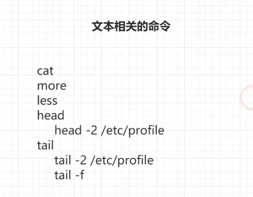
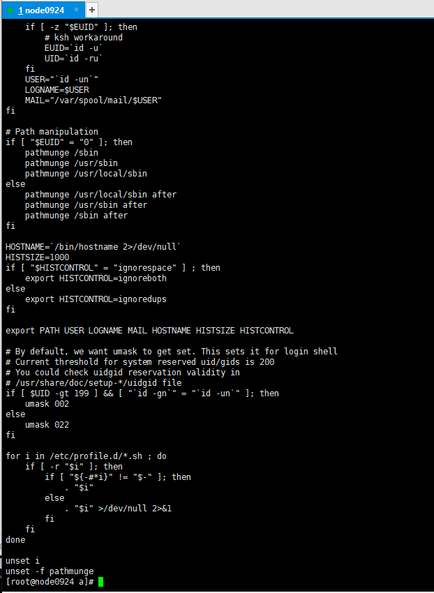
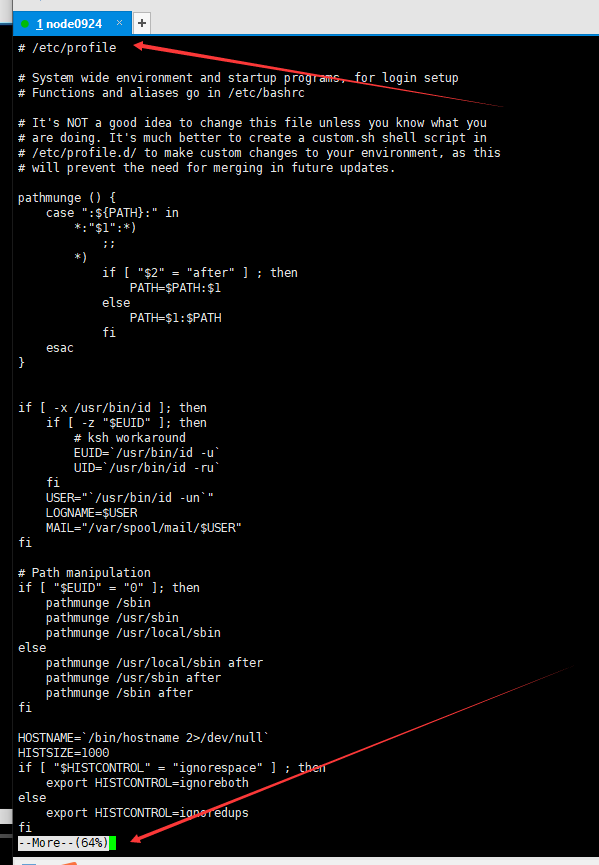
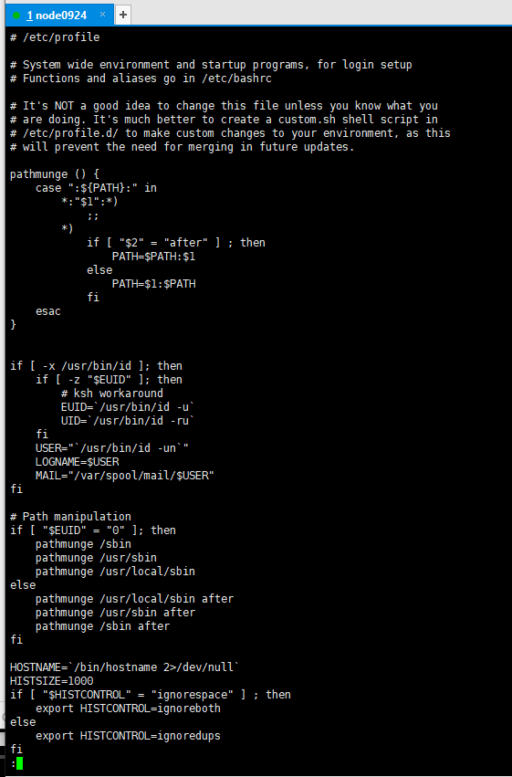
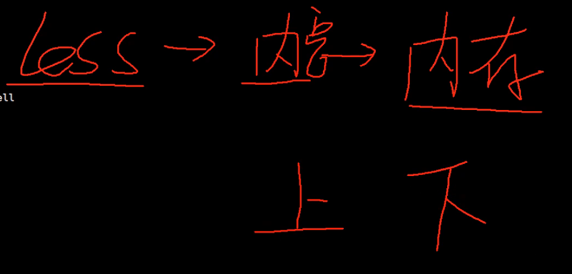
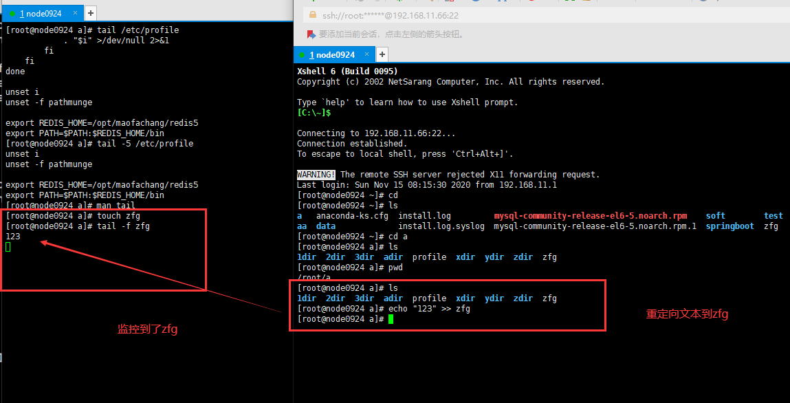
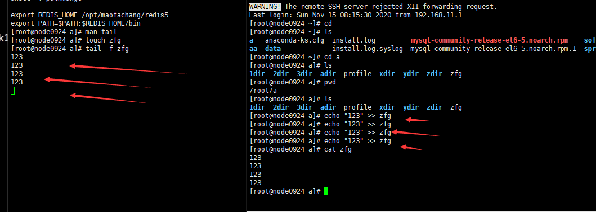

15-文本操作相关的命令-more less tail命令





```shell
[root@node0924 ~]# cd a
[root@node0924 a]# ls
1dir  2dir  3dir  adir  profile  xdir  ydir  zdir
[root@node0924 a]# cat profile
# /etc/profile

# System wide environment and startup programs, for login setup
# Functions and aliases go in /etc/bashrc

# It's NOT a good idea to change this file unless you know what you
# are doing. It's much better to create a custom.sh shell script in
# /etc/profile.d/ to make custom changes to your environment, as this
# will prevent the need for merging in future updates.

pathmunge () {
    case ":${PATH}:" in
        *:"$1":*)
            ;;
        *)
            if [ "$2" = "after" ] ; then
                PATH=$PATH:$1
            else
                PATH=$1:$PATH
            fi
    esac
}


if [ -x /usr/bin/id ]; then
    if [ -z "$EUID" ]; then
        # ksh workaround
        EUID=`id -u`
        UID=`id -ru`
    fi
    USER="`id -un`"
    LOGNAME=$USER
    MAIL="/var/spool/mail/$USER"
fi

# Path manipulation
if [ "$EUID" = "0" ]; then
    pathmunge /sbin
    pathmunge /usr/sbin
    pathmunge /usr/local/sbin
else
    pathmunge /usr/local/sbin after
    pathmunge /usr/sbin after
    pathmunge /sbin after
fi

HOSTNAME=`/bin/hostname 2>/dev/null`
HISTSIZE=1000
if [ "$HISTCONTROL" = "ignorespace" ] ; then
    export HISTCONTROL=ignoreboth
else
    export HISTCONTROL=ignoredups
fi

export PATH USER LOGNAME MAIL HOSTNAME HISTSIZE HISTCONTROL

# By default, we want umask to get set. This sets it for login shell
# Current threshold for system reserved uid/gids is 200
# You could check uidgid reservation validity in
# /usr/share/doc/setup-*/uidgid file
if [ $UID -gt 199 ] && [ "`id -gn`" = "`id -un`" ]; then
    umask 002
else
    umask 022
fi

for i in /etc/profile.d/*.sh ; do
    if [ -r "$i" ]; then
        if [ "${-#*i}" != "$-" ]; then
            . "$i"
        else
            . "$i" >/dev/null 2>&1
        fi
    fi
done

unset i
unset -f pathmunge
[root@node0924 a]# 

```



`cat profile`查看profile文件，一屏显示不全。直接显示到最后一行，前面内容的需要回过头去翻看。


```shell
[root@node0924 a]# more /etc/profile
# /etc/profile

# System wide environment and startup programs, for login setup
# Functions and aliases go in /etc/bashrc

# It's NOT a good idea to change this file unless you know what you
# are doing. It's much better to create a custom.sh shell script in
# /etc/profile.d/ to make custom changes to your environment, as this
# will prevent the need for merging in future updates.

pathmunge () {
    case ":${PATH}:" in
        *:"$1":*)
            ;;
        *)
            if [ "$2" = "after" ] ; then
                PATH=$PATH:$1
            else
                PATH=$1:$PATH
            fi
    esac
}


if [ -x /usr/bin/id ]; then
    if [ -z "$EUID" ]; then
        # ksh workaround
        EUID=`/usr/bin/id -u`
        UID=`/usr/bin/id -ru`
    fi
    USER="`/usr/bin/id -un`"
    LOGNAME=$USER
    MAIL="/var/spool/mail/$USER"
fi

# Path manipulation
if [ "$EUID" = "0" ]; then
    pathmunge /sbin
    pathmunge /usr/sbin
    pathmunge /usr/local/sbin
else
    pathmunge /usr/local/sbin after
    pathmunge /usr/sbin after
    pathmunge /sbin after
fi

HOSTNAME=`/bin/hostname 2>/dev/null`
HISTSIZE=1000
if [ "$HISTCONTROL" = "ignorespace" ] ; then
    export HISTCONTROL=ignoreboth
else
    export HISTCONTROL=ignoredups
fi
[root@node0924 a]# 

```





`more /etc/profile`从第一行开始读取。以分页的形式显示。

`回车`，一行一行的看；

`空格`，一页一页的看。

看完之后，退回到命令提示符，想要回看只能通过滑轮往前翻。


```shell
[root@node0924 a]# less /etc/profile

```




`less /etc/profile`,在屏幕中查看文件，不返回命令行。

* `回车`，一行一行的读取；

* `空格`，往后翻页；

* `B键`，往前翻页。

* `Q键`，退出less。



less读出文件的`内容`，放到`内存`中，所以我们可以上下翻页。

less不适合读取大数据文件；

读取大数据文件，使用more。


```shell
[root@node0924 a]# head /etc/profile
# /etc/profile

# System wide environment and startup programs, for login setup
# Functions and aliases go in /etc/bashrc

# It's NOT a good idea to change this file unless you know what you
# are doing. It's much better to create a custom.sh shell script in
# /etc/profile.d/ to make custom changes to your environment, as this
# will prevent the need for merging in future updates.

[root@node0924 a]# 

```

`head /etc/profile`,默认打印前10行的数据

```shell
[root@node0924 a]# head -5 /etc/profile
# /etc/profile

# System wide environment and startup programs, for login setup
# Functions and aliases go in /etc/bashrc

[root@node0924 a]# 
```

`head -5 /etc/profile`,打印前5行数据


```shell
[root@node0924 a]# tail /etc/profile
            . "$i" >/dev/null 2>&1
        fi
    fi
done

unset i
unset -f pathmunge

export REDIS_HOME=/opt/maofachang/redis5
export PATH=$PATH:$REDIS_HOME/bin
[root@node0924 a]# tail -5 /etc/profile
unset i
unset -f pathmunge

export REDIS_HOME=/opt/maofachang/redis5
export PATH=$PATH:$REDIS_HOME/bin
[root@node0924 a]# 

```

`tail /etc/profile`，默认打印文件的最后10行。

`tail -5 /etc/profile`，打印文件的最后5行。


```shell
[root@node0924 a]# man tail
[root@node0924 a]# touch zfg
[root@node0924 a]# tail -f zfg

```

`tail -f zfg`，监控输出文件。




```shell
[root@node0924 a]# ls
1dir  2dir  3dir  adir  profile  xdir  ydir  zdir  zfg
[root@node0924 a]# echo "123" >> zfg
[root@node0924 a]# echo "123" >> zfg
[root@node0924 a]# echo "123" >> zfg
[root@node0924 a]# echo "123" >> zfg
[root@node0924 a]# cat zfg
123
123
123
123
[root@node0924 a]# 


```

`echo "123" >> zfg`，重定向文本。




增长一行加一行。


命令小结

* cat
  * cat profile
* more
  * more /etc/profile
* less
  * less /etc/profile
* head
  * head /etc/profile
  * head -5 /etc/profile
* tail
  * tail /etc/profile
  * tail -5 /etc/profile
  * tail -f


