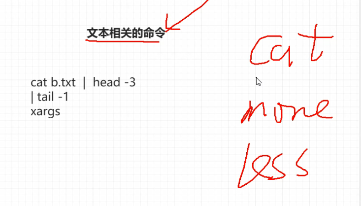
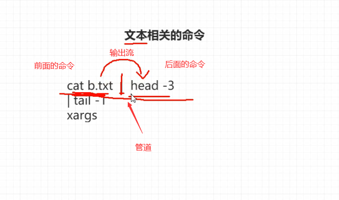

16-文本操作相关的命令-管道的使用




查看文本相关的命令

* cat
* more
* less
* head
* tail




管道

```shell
cat b.txt | head -3
```

前面的命令`cat b.txt`，作为输出流

`|`管道

后面的命令`head -3`，作为输入流

展示数据的前3行。


```shell
[root@node0924 a]# tail -f zfg
123
123
123
123
^C
[root@node0924 a]# cat zfg | head -3
123
123
123
[root@node0924 a]# 

```

`cat zfg | head -3`，使用管道打印输出。


```shell
[root@node0924 a]# ls -l /
total 94
dr-xr-xr-x.  2 root root   4096 Sep 26 19:30 bin
dr-xr-xr-x.  5 root root   1024 Sep 26 19:30 boot
drwxr-xr-x. 19 root root   3740 Nov 15 08:15 dev
drwxr-xr-x. 65 root root   4096 Nov 15 08:14 etc
drwxr-xr-x.  7 root root   4096 Nov 14 19:59 home
dr-xr-xr-x.  8 root root   4096 Sep 26 23:49 lib
dr-xr-xr-x.  9 root root  12288 Sep 26 19:30 lib64
drwx------.  2 root root  16384 Sep 25 07:48 lost+found
drwxr-xr-x.  2 root root   4096 Sep 23  2011 media
drwxr-xr-x.  2 root root   4096 Sep 23  2011 mnt
drwxr-xr-x.  3 root root   4096 Sep 27 00:44 opt
dr-xr-xr-x. 92 root root      0 Nov 15 08:14 proc
dr-xr-x---.  9 root root   4096 Nov 15 09:52 root
dr-xr-xr-x.  2 root root  12288 Sep 26 19:30 sbin
drwxr-xr-x.  7 root root      0 Nov 15 08:14 selinux
drwxrwx---.  2 root share  4096 Sep 26 07:20 share
drwxr-xr-x.  2 root root   4096 Sep 23  2011 srv
drwxr-xr-x  13 root root      0 Nov 15 08:14 sys
drwxrwxrwt.  3 root root   4096 Nov 15 10:38 tmp
drwxr-xr-x. 13 root root   4096 Sep 25 07:48 usr
drwxr-xr-x. 17 root root   4096 Sep 25 07:48 var
[root@node0924 a]# 

```


`ls -l /`，查看根目录的文件。


```shell
[root@node0924 a]# ls -l /
total 94
dr-xr-xr-x.  2 root root   4096 Sep 26 19:30 bin
dr-xr-xr-x.  5 root root   1024 Sep 26 19:30 boot
drwxr-xr-x. 19 root root   3740 Nov 15 08:15 dev
drwxr-xr-x. 65 root root   4096 Nov 15 08:14 etc
drwxr-xr-x.  7 root root   4096 Nov 14 19:59 home
dr-xr-xr-x.  8 root root   4096 Sep 26 23:49 lib
dr-xr-xr-x.  9 root root  12288 Sep 26 19:30 lib64
drwx------.  2 root root  16384 Sep 25 07:48 lost+found
drwxr-xr-x.  2 root root   4096 Sep 23  2011 media
drwxr-xr-x.  2 root root   4096 Sep 23  2011 mnt
drwxr-xr-x.  3 root root   4096 Sep 27 00:44 opt
dr-xr-xr-x. 92 root root      0 Nov 15 08:14 proc
dr-xr-x---.  9 root root   4096 Nov 15 09:52 root
dr-xr-xr-x.  2 root root  12288 Sep 26 19:30 sbin
drwxr-xr-x.  7 root root      0 Nov 15 08:14 selinux
drwxrwx---.  2 root share  4096 Sep 26 07:20 share
drwxr-xr-x.  2 root root   4096 Sep 23  2011 srv
drwxr-xr-x  13 root root      0 Nov 15 08:14 sys
drwxrwxrwt.  3 root root   4096 Nov 15 10:38 tmp
drwxr-xr-x. 13 root root   4096 Sep 25 07:48 usr
drwxr-xr-x. 17 root root   4096 Sep 25 07:48 var
[root@node0924 a]# echo "/" | ls -l
total 36
drwxr-xr-x. 2 root root 4096 Sep 26 01:50 1dir
drwxr-xr-x. 2 root root 4096 Sep 26 01:21 2dir
drwxr-xr-x. 2 root root 4096 Sep 26 01:21 3dir
drwxr-xr-x. 3 root root 4096 Sep 26 01:17 adir
-rw-r--r--. 1 root root 1796 Sep 26 03:58 profile
drwxr-xr-x. 2 root root 4096 Sep 26 01:18 xdir
drwxr-xr-x. 2 root root 4096 Sep 26 01:18 ydir
drwxr-xr-x. 2 root root 4096 Sep 26 01:18 zdir
-rw-r--r--. 1 root root   16 Nov 15 10:44 zfg
[root@node0924 a]# 

```

`echo "/" | ls -l`尝试用管道打印根目录的内容。

`ls -l`没有接收前半部分的输出流。ls -l 不能接收前半部分的输出流


```shell
[root@node0924 a]# man xargs
[root@node0924 a]# echo "/" | xargs ls -l
total 94
dr-xr-xr-x.  2 root root   4096 Sep 26 19:30 bin
dr-xr-xr-x.  5 root root   1024 Sep 26 19:30 boot
drwxr-xr-x. 19 root root   3740 Nov 15 08:15 dev
drwxr-xr-x. 65 root root   4096 Nov 15 08:14 etc
drwxr-xr-x.  7 root root   4096 Nov 14 19:59 home
dr-xr-xr-x.  8 root root   4096 Sep 26 23:49 lib
dr-xr-xr-x.  9 root root  12288 Sep 26 19:30 lib64
drwx------.  2 root root  16384 Sep 25 07:48 lost+found
drwxr-xr-x.  2 root root   4096 Sep 23  2011 media
drwxr-xr-x.  2 root root   4096 Sep 23  2011 mnt
drwxr-xr-x.  3 root root   4096 Sep 27 00:44 opt
dr-xr-xr-x. 94 root root      0 Nov 15 08:14 proc
dr-xr-x---.  9 root root   4096 Nov 15 09:52 root
dr-xr-xr-x.  2 root root  12288 Sep 26 19:30 sbin
drwxr-xr-x.  7 root root      0 Nov 15 08:14 selinux
drwxrwx---.  2 root share  4096 Sep 26 07:20 share
drwxr-xr-x.  2 root root   4096 Sep 23  2011 srv
drwxr-xr-x  13 root root      0 Nov 15 08:14 sys
drwxrwxrwt.  3 root root   4096 Nov 15 11:44 tmp
drwxr-xr-x. 13 root root   4096 Sep 25 07:48 usr
drwxr-xr-x. 17 root root   4096 Sep 25 07:48 var
[root@node0924 a]# 

```


`echo "/" | xargs ls -l`，使用xargs，打印根目录的内容。

当后面的命令（例如`ls -l`），无法用`输出流`的形式接收左边的命令(例如`echo "/"`)时，使用xargs。


```shell
[root@node0924 a]# vim zfg
[root@node0924 a]# cat zfg
zfg1
zfg2
zfg3
zfg4
zfg5
zfg6
zfg7
zfg8
zfg9
[root@node0924 a]# head -5 zfg
zfg1
zfg2
zfg3
zfg4
zfg5
[root@node0924 a]# head -5 zfg | tail -1
zfg5
[root@node0924 a]# 

```

`head -5 zfg`，打印前5条

`head -5 zfg | tail -1`，通过管道，打印前5条后，再打印最后1条。


