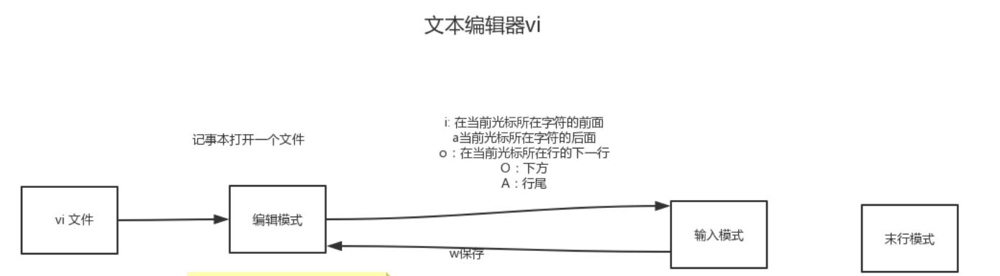
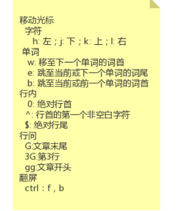
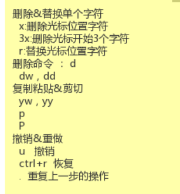

17-vi文本编辑器的编辑模式




文本编辑器vi

* 编辑模式
* 输入模式
* 末行模式


```shell
[root@node0924 a]# ls
1dir  2dir  3dir  adir  profile  xdir  ydir  zdir  zfg
[root@node0924 a]# vi profile
[root@node0924 a]# vi +10 profile
[root@node0924 a]# vi + profile


```

`vi profile`,使用vi编辑器，打开profile文件。

`vi +10 profile`，使用vi编辑器，打开profile文件，并定位到第10行行首。

`vi + profile`，使用vi编辑器，打开profile文件，并定位到最后一行的行首。

`ECS键`，输入`：`，进入末行模式，再输入`q!`不保存退出。


[VIM 进入和退出命令](https://www.cnblogs.com/chen-nn/p/11531932.html)

按`ESC键` 跳到命令模式：

1. :w 保存文件但不退出vi
2. :w file 将修改另外保存到file中，不退出vi
3. :w! 强制保存，不推出vi
4. :wq 保存文件并退出vi
5. `:wq! 强制保存文件，并退出vi`
6. q: 不保存文件，退出vi
7. `:q! 不保存文件，强制退出vi`
8. :e! 放弃所有修改，从上次保存文件开始再编辑


使用默认`vi profile`，进入profile文件后，进入`编辑模式`，不能输入字符，可以移动光标

* 单个字符
  * `↑键`--上、`↓键`--下、`←键`--左、`→键`--右
  * `k键`--上、`j键`--下、`h键`--左、`l键`--右
* 单词
  * `w键`--跳到`下一个`单词的`词首`
  * `b键`--跳到`上一个`单词的`词首`
  * `e键`--跳到`下一个`单词的`词尾`
* 行内
  * `0键` （或者称为 `)键`），跳到绝对行首
  * `Shift键` + `6键` （或者称为 `^键`），跳到行首的第一个非空白字符
  * `Shift键` + `4键` （或者称为 `$键`），跳到绝对行尾 
* 行间
  * G（`Shift键` + `g键`），文章的末尾
    * 先按8，在使用G，定位到第8行
  * gg（两次`g键`），文章的开头
* 翻屏
  * `Ctrl + f`,往下翻屏
  * `Ctrl + b`,往上翻屏
* 删除替换字符
  * x 删除关标位置字符
  * 3x 删除关标开始三个字符
  * r 替换关标位置字符
    * 先输入 r ，在输入要替换的字符
  * dd 每次删除一行
  * dw 每次删除一个单词
* 复制、粘贴
  * yw 复制一个单词，使用 p 粘贴
  * yy 复制一行
    * 使用 `p` （p键）粘贴，在行的下方
    * 使用 `P`（shift + p） 粘贴，在行的上方
* 撤销和恢复
  * u 撤销
  * ctrl + r 恢复
  *  . 重复上一步的操作







自己打开vi编辑器，进入编辑模式可以操作一下这些命令。

比较繁琐。操作尝试一下，有一个了解。


