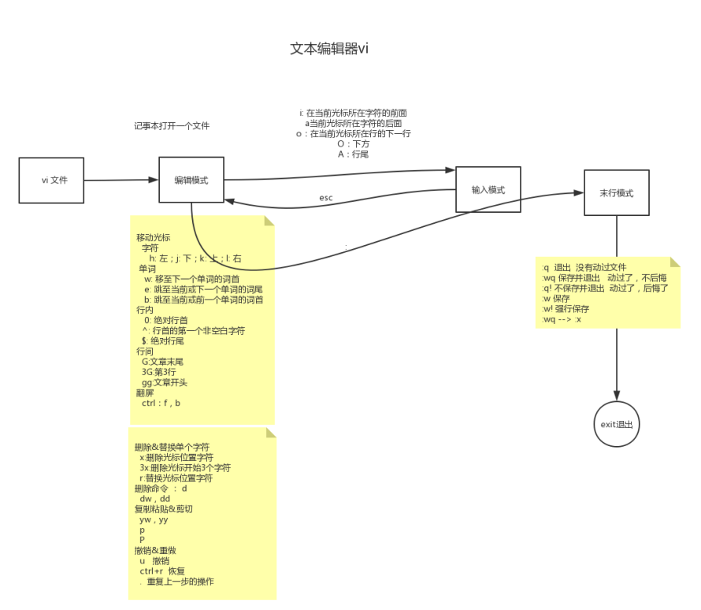
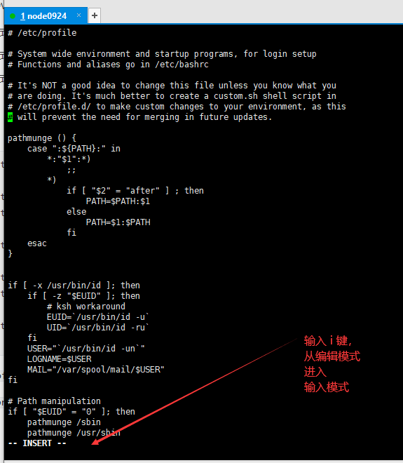

18-vi文本编辑器的输入模式+末行模式切换




文本编辑器vi

* 编辑模式
* 输入模式
* 末行模式


```shell
[root@node0924 a]# ls
1dir  2dir  3dir  adir  profile  xdir  ydir  zdir  zfg
[root@node0924 a]# rm -f profile
[root@node0924 a]# ls
1dir  2dir  3dir  adir  xdir  ydir  zdir  zfg
[root@node0924 a]# ls
1dir  2dir  3dir  adir  xdir  ydir  zdir  zfg
[root@node0924 a]# cp /etc/profile .
[root@node0924 a]# ls
1dir  2dir  3dir  adir  profile  xdir  ydir  zdir  zfg
[root@node0924 a]# 

```

`rm -f profile`删除profile文件，

`cp /etc/profile .`，复制etc下的profile文件到当前目录


```shell
[root@node0924 a]# vi profile

```

`vi profile`进入vi文本编辑器，编辑profile文件




输入`i键`，从`编辑模式`，进入`输入模式`

输入模式下可以输入字符。

从`输入模式`进入`编辑模式`，按`ECS键`


有好几种从`编辑模式`到`输入模式`的方式

* i 在当前光标所在字符的前面
* a 在当前光标所在字符的后面
* o 在当前光标所在行的下一行
* O 在当前光标所在行的上一行
* A 在当前光标所在行的行尾


从 `编辑模式` 进入 `末行模式` 保存文件，按 `:` 冒号进入。


`末行模式`的操作

* :q 退出，没有动过文件
* `:wq`  保存并退出，动过了，不后悔
* `:q!`  不保存并退出，动过了，后悔了
* :w  保存
* :w!  强行保存
* :wq  -->  :x


快捷的方式

在`编辑模式`下输入`shift + zz`， 保存并退出。

类似在`末行模式`下输入`:wq`  保存并退出，动过了，不后悔。


