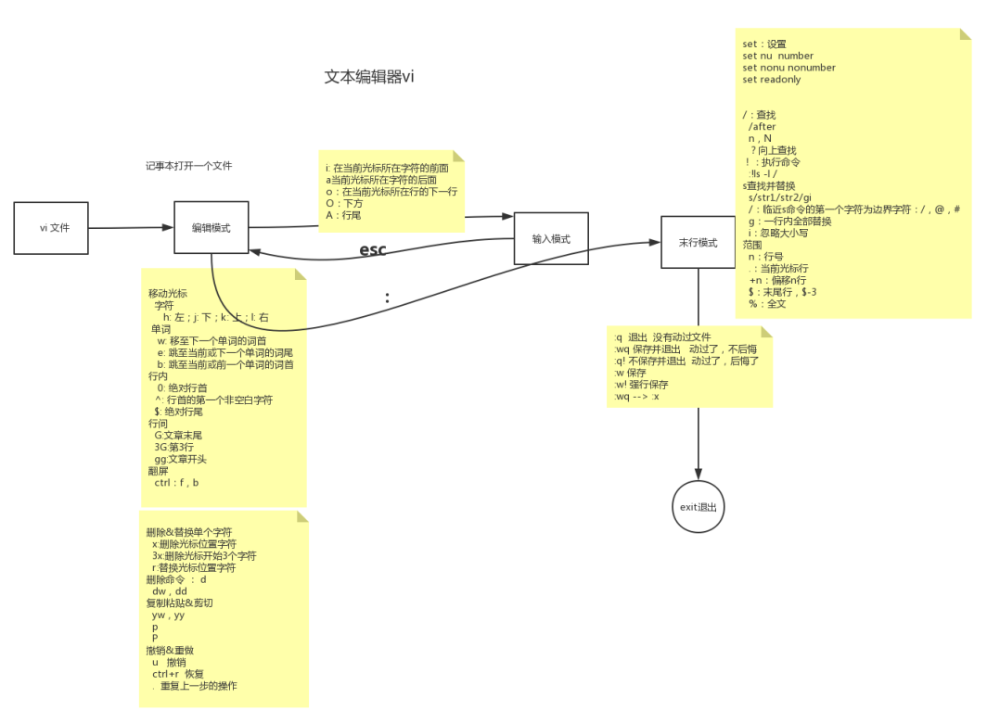

19-vi文本编辑器末行模式的操作





```shell
[root@node0924 a]# ls
1dir  2dir  3dir  adir  profile  xdir  ydir  zdir  zfg
[root@node0924 a]# rm -f profile
[root@node0924 a]# ls
1dir  2dir  3dir  adir  xdir  ydir  zdir  zfg
[root@node0924 a]# cp /etc/profile ./
[root@node0924 a]# ls
1dir  2dir  3dir  adir  profile  xdir  ydir  zdir  zfg
[root@node0924 a]# vi +10 profile


```

准备文件

`rm -f profile`，先删除；

`cp /etc/profile ./` 在拷贝。

`vi +10 profile`打开编辑文件，定位到第10行。


`末行模式`下的操作

* :set  设置
  * :set nu	设置行号  set number
  * :set nonu  取消行号 set nonumber
  * :set readonly  设置只读模式
* :/ 查找
  * :/after  回车，`向下查找`
    * 使用 n ，会帮你找 after字符，从上往下找
    * 使用 N，会帮你找 after字符，从下往上找
  * :?after  回车，`向上查找`
    * 使用 n ，会帮你找 after字符，从下往上找
    * 使用 N，会帮你找 after字符，从上往下找
* :! 执行命令
  * `:!ls -l /`  回车，查找`/`目录下的文件，再回车返回vi
* :s查找并替换
  * `:s/after/before`
    * 将after，替换为before，光标需要定位到要替换的那一行，只能替换一个
  * `:s/after/before/g`
    * 将after，替换为before，光标需要定位到要替换的那一行，能替换所有
  * `:s/before/after/gi`
    * 将before，替换为after，忽略大小写。
  * `:.,+2s/after/before/gi`
    * `.,+2`  替换光标定位的行，在加2行。after替换为before。全部替换，忽略大小写。
  * `:%s/before/after/gi`
    * `:%` 全文替换，before换为after
  * `:0,$s/after/before/gi`
    * `0,$` 从第0行，到最后1行，after换为before
* 临近s的**边界字符** `/`  `@`  `#`
  * `:%s#before#after#gi`
    * `:%` 全文替换，before换为after


末行模式


