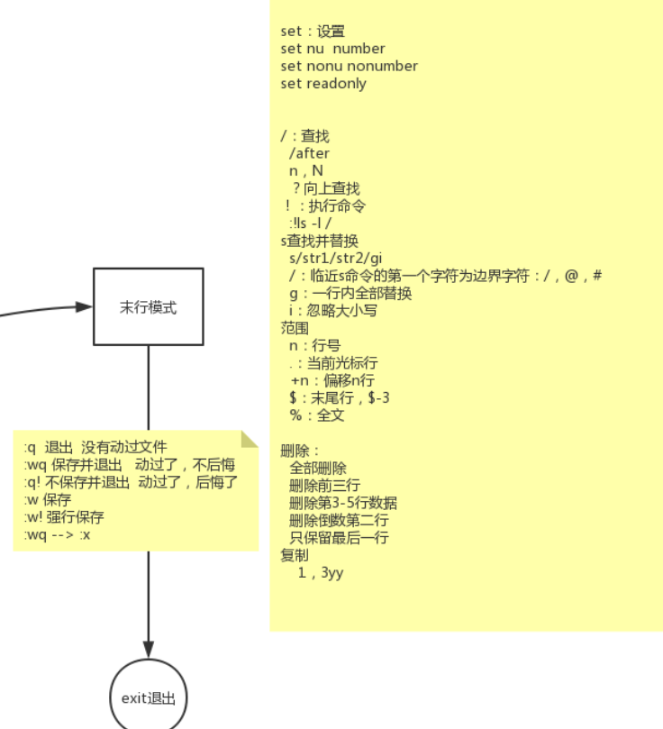
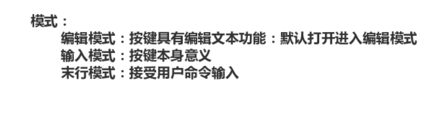

20-补充vi文本编辑器末行模式的操作

补充末行模式下的删除和复制


```shell
[root@node0924 a]# ls
1dir  2dir  3dir  adir  profile  xdir  ydir  zdir  zfg
[root@node0924 a]# rm -f profile
[root@node0924 a]# cp /etc/profile ./
[root@node0924 a]# ls
1dir  2dir  3dir  adir  profile  xdir  ydir  zdir  zfg
[root@node0924 a]# vi +10 profile

```

`rm -f profile`删除

`cp /etc/profile ./` 复制文件

`vi +10 profile` vi编辑profile


`末行模式`下删除和复制

* `:0,$d` 删除全部
* `:.,+2d`  删除前3行
* `:1,3d`  删除前3行
* `:3,5d`   删除3-5行
* `G` 跳转到最后一行
* `:$-1d`  删除倒数第二行
* `:1,$-1d`  仅保留最后一行，其他的删除
* `:1,3y`  复制1-3行， 使用 `p` 进行粘贴
* `:0,$y`  复制全部文本，使用 `p` 进行粘贴





末行模式下的命令




vi的三个模式

* 编辑模式
* 输入模式
* 末行模式


