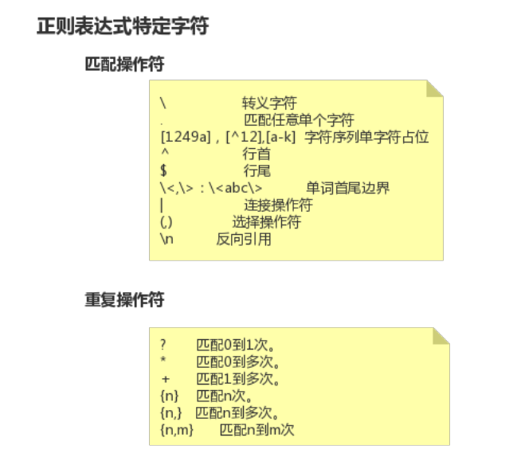
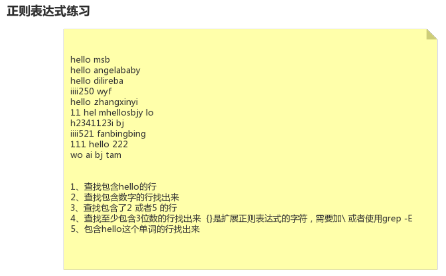

21-Linux中正则表达式的简单使用


正则表达式

* 规则表达式
* 对字符串操作的一种逻辑公式




正则表达式特定字符

* 匹配操作符
  * `\`     转义字符
  * `.`     匹配任意单个字符
  * `[1249a]`    匹配任意单个字符
  * `[^12]`         匹配任意一个非1或者非2的字符
  * `[a-k`           匹配任意一个a到k的字符
  * `^`                 行首
  * `$`                 行尾
  * `\<`              单词首边界
  * `\>`              单词尾边界
  * `\<abc\>`             匹配`abc`这个单词
  * `|`                         连接操作符
  * `(,)`                        选择操作符
  * `\n`                      反向引用
* 重复操作符
  * `?`              匹配0到1次
  * `*`              匹配0到多次
  * `+`              匹配1到多次
  * `{n}`           匹配n次
  * `{n,}`            匹配n到多次
  * `{n,m}`          匹配n到m次


linux中的grep命令

```shell
[root@node0924 ~]# man grep

```

`man grep`，查看grep命令。




网络图片文字识别：

```
https://ai.baidu.com/tech/ocr_others/webimage?track=cp:ainsem|pf:pc|pp:chanpin-wenzishibie|pu:wenzishibie-tupian|ci:|kw:10003290
```

这个网址可以识别图片里面的文字，由百度提供。


正则表达式练习

```
hello msb
hello angelababy
hello dilireba
iiii250wyf
hello zhangxinyi
11 hel mhellosbjy lo
h2341123i bj
iiii521 fanbingbing
111 hello 222
wo ai bj tam


1、查找包含hello 的行
2、查找包含数字的行找出来
3、查找包含了2或者5的行
4、查找至少包含3位数的行找出来是扩展正则表达式的字符,需要加或者使用grep-E
5、包含这个单词的行找出来
```


```shell
[root@node0924 a]# ls
1dir  2dir  3dir  adir  profile  test.txt  xdir  ydir  zdir  zfg
[root@node0924 a]# cat test.txt
hello msb
hello angelababy
hello dilireba
iiii250wyf
hello zhangxinyi
11 hel mhellosbjy lo
h2341123i bj
iiii521 fanbingbing
111 hello 222
wo ai bj tam


1、查找包含hello 的行
2、查找包含数字的行找出来
3、查找包含了2或者5的行
4、查找至少包含3位数的行找出来是扩展正则表达式的字符,需要加或者使用grep-E
5、包含这个单词的行找出来[root@node0924 a]# 

```

`cat test.txt` 准备好练习文本，查看练习文本。（PS：先准备好test.txt，再利用Xftp传输文件）


```shell
[root@node0924 a]# grep "hello" test.txt
hello msb
hello angelababy
hello dilireba
hello zhangxinyi
11 hel mhellosbjy lo
111 hello 222
1、查找包含hello 的行
[root@node0924 a]# 

```

`grep "hello" test.txt`  查找包含hello 的行


```shell
[root@node0924 a]# grep "[0-9]" test.txt
iiii250wyf
11 hel mhellosbjy lo
h2341123i bj
iiii521 fanbingbing
111 hello 222
1、查找包含hello 的行
2、查找包含数字的行找出来
3、查找包含了2或者5的行
4、查找至少包含3位数的行找出来是扩展正则表达式的字符,需要加或者使用grep-E
5、包含这个单词的行找出来
[root@node0924 a]# 

```

 `grep "[0-9]" test.txt`  查找包含数字的行找出来


```shell
[root@node0924 a]# grep "[25]" test.txt
iiii250wyf
h2341123i bj
iiii521 fanbingbing
111 hello 222
2、查找包含数字的行找出来
3、查找包含了2或者5的行
5、包含这个单词的行找出来
[root@node0924 a]# 

```

`grep "[25]" test.txt`  查找包含了2或者5的行


```shell
[root@node0924 a]# grep "[0-9]{3}" test.txt
[root@node0924 a]# grep "[0-9]\{3\}" test.txt
iiii250wyf
h2341123i bj
iiii521 fanbingbing
111 hello 222
[root@node0924 a]# grep -E "[0-9]{3}" test.txt
iiii250wyf
h2341123i bj
iiii521 fanbingbing
111 hello 222
[root@node0924 a]# 

```

`grep "[0-9]{3}" test.txt` 查找包含3个数字的行，这个找不出来，需要转义`{}`

`grep "[0-9]\{3\}" test.txt` 查找包含3个数字的行

`grep -E "[0-9]{3}" test.txt`  查找包含3个数字的行, `-E` 之后的`{}`不需要转义


```
   Matcher Selection
       -E, --extended-regexp
              Interpret PATTERN as an extended regular expression (ERE, see below).  (-E is specified by POSIX.)
```

使用 `man grep` 查看，`-E` 代表扩展正则表达式字符。


```shell 
[root@node0924 a]# grep "\<hello\>" test.txt
hello msb
hello angelababy
hello dilireba
hello zhangxinyi
111 hello 222
[root@node0924 a]# 

```

`grep "\<hello\>" test.txt` 包含hello这个单词的行找出来


上面是在linux中正则的简单使用。