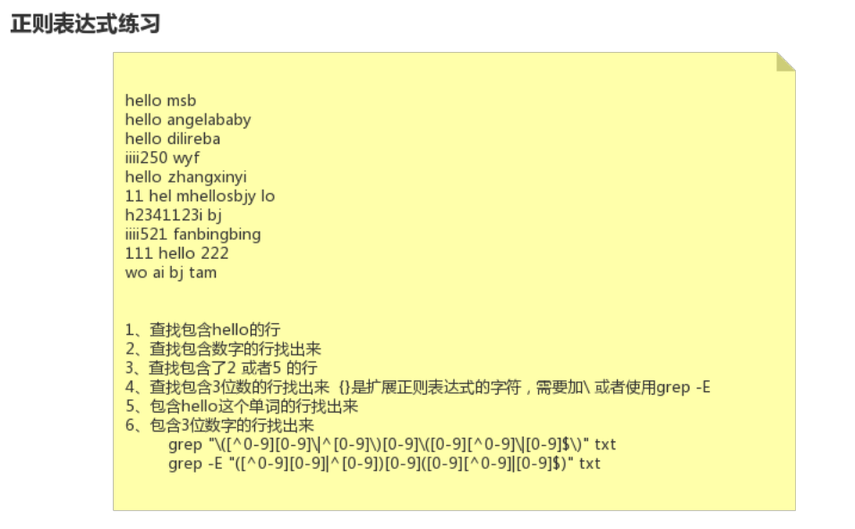

22-Linux正则表达式练习题





```shell
[root@node0924 a]# grep "[^0-9][0-9]\{3\}[^0-9]" test.txt
iiii250wyf
iiii521 fanbingbing
111 hello 222

```

`grep "[^0-9][0-9]\{3\}[^0-9]" test.txt` 找出包含3位数字的行。

```
[root@node0924 a]# grep "\([^0-9][0-9]\|^[0-9]\)[0-9]\([0-9][^0-9]\|[0-9$]\)" test.txt
iiii250wyf
h2341123i bj
iiii521 fanbingbing
111 hello 222

```

`grep "\([^0-9][0-9]\|^[0-9]\)[0-9]\([0-9][^0-9]\|[0-9$]\)" test.txt` 找出包含3位数字的行。`$`符号位置错了。

```
[root@node0924 a]# grep "\([^0-9][0-9]\|^[0-9]\)[0-9]\([0-9][^0-9]\|[0-9]$\)" test.txt
iiii250wyf
iiii521 fanbingbing
111 hello 222

```

`grep "\([^0-9][0-9]\|^[0-9]\)[0-9]\([0-9][^0-9]\|[0-9]$\)" test.txt` 找出包含3位数字的行。

```
[root@node0924 a]# grep -E "([^0-9][0-9]|^[0-9])[0-9]([0-9][^0-9]|[0-9]$)" test.txt
iiii250wyf
iiii521 fanbingbing
111 hello 222

```

`grep -E "([^0-9][0-9]|^[0-9])[0-9]([0-9][^0-9]|[0-9]$)" test.txt` 找出包含3位数字的行。

