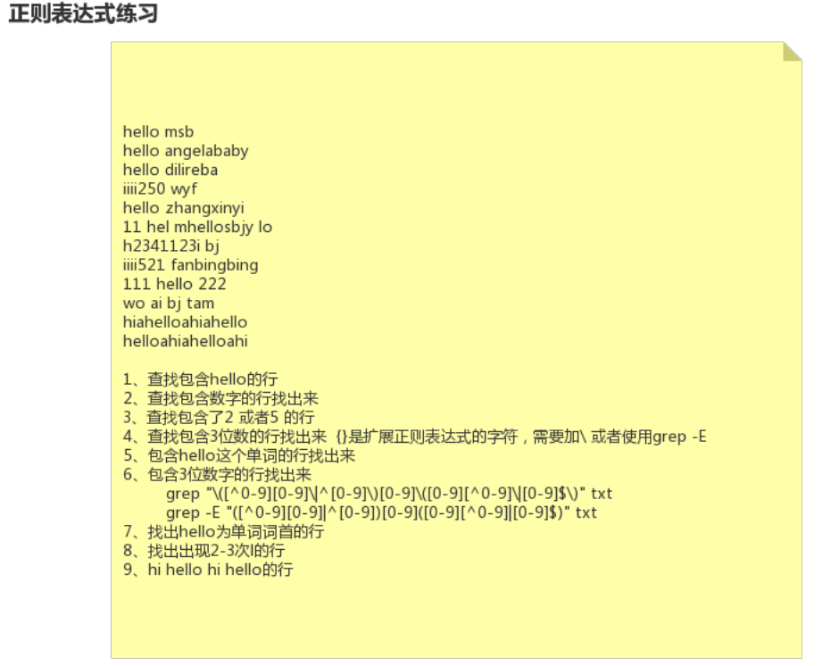
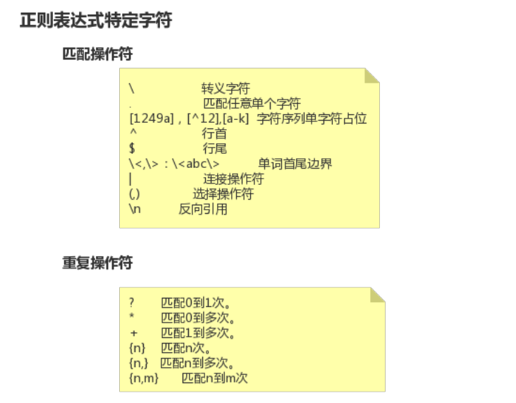

23-Linux正则表达式-反向引用简化正则表达式




正则表达式练习

```shell
[root@node0924 a]# ls
1dir  2dir  3dir  adir  profile  test2.txt  test.txt  xdir  ydir  zdir  zfg
[root@node0924 a]# cat test2.txt
hello msb
hello angelababy
hello dilireba
iiii250 wyf
hello zhangxinyi
11 hel mhellosbjy lo
h2341123ibj
iiii521 fanbingbing
111 hello 222
wo ai bj tam
hiahelloahiahello
helloahiahelloahi
[root@node0924 a]# 

```

`cat test2.txt ` 准备文本。


```shell
[root@node0924 a]# grep "\<hello" test2.txt
hello msb
hello angelababy
hello dilireba
hello zhangxinyi
111 hello 222
helloahiahelloahi
[root@node0924 a]# grep "\<hello\>" test2.txt
hello msb
hello angelababy
hello dilireba
hello zhangxinyi
111 hello 222
[root@node0924 a]# 

```

`grep "\<hello" test2.txt` 以hello开头行

`grep "\<hello\>" test2.txt` 以hello为单词词首的行


```shell
[root@node0924 a]# grep "l\{2,3\}" test2.txt
hello msb
hello angelababy
hello dilireba
hello zhangxinyi
11 hel mhellosbjy lo
111 hello 222
hiahelloahiahello
helloahiahelloahi
[root@node0924 a]# 

```

`grep "l\{2,3\}" test2.txt`  找出出现2-3次l的行


```shell
[root@node0924 a]# grep "hi.*hello.*hi.*hello.*" test2.txt
hiahelloahiahello
[root@node0924 a]# grep "\(hi.*\)\(hello.*\).*\1.*\2" test2.txt
hiahelloahiahello
[root@node0924 a]# 

```

`grep "hi.*hello.*hi.*hello.*" test2.txt` 找出 hi hello hi hello 的行

`grep "\(hi.*\)\(hello.*\).*\1.*\2" test2.txt` 通过反向引用。找出 hi hello hi hello 的行。

反向引用

* `\n`





