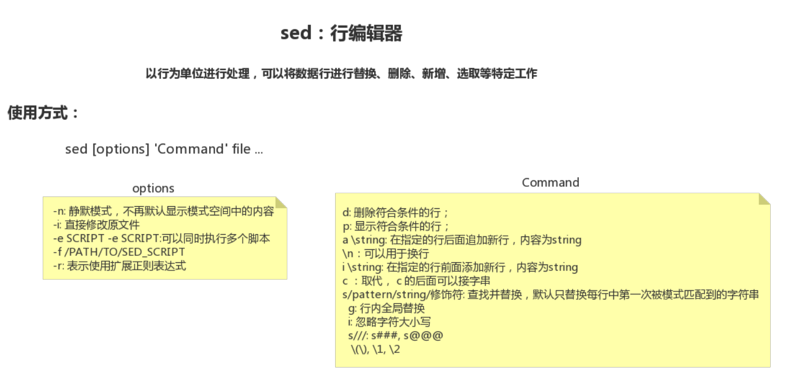
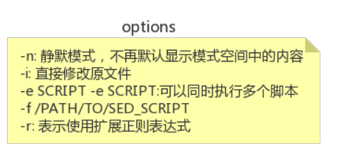
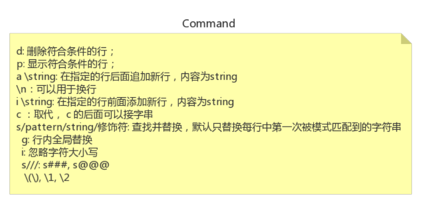

25-Linux行编辑器-sed的使用方式





```shell
[root@node0924 a]# ls
1dir  2dir  3dir  adir  ctxt  ctxt.txt  passwd  profile  test2.txt  test.txt  xdir  ydir  zdir  zfg
[root@node0924 a]# cat ctxt
hello1
hello2
hello3
[root@node0924 a]# 

```

`cat ctxt` 查看准备好的文本


```shell
[root@node0924 a]# cat ctxt
hello1
hello2
hello3
[root@node0924 a]# sed "2p" ctxt
hello1
hello2
hello2
hello3
[root@node0924 a]# 

```

`sed "2p" ctxt` 显示符合条件的行


```shell
[root@node0924 a]# sed -n "2p" ctxt
hello2
[root@node0924 a]# 

```

`sed -n "2p" ctxt` 禁默模式 `n`


```shell
[root@node0924 a]# sed -n "3p" ctxt
hello3
[root@node0924 a]# sed  "3d" ctxt
hello1
hello2
[root@node0924 a]# sed -n "3d" ctxt
[root@node0924 a]# 
```

`sed -n "3p" ctxt`  显示符合条件的行 `p`

`sed  "3d" ctxt` 删除符合条件的行 `d`

`sed -n "3d" ctxt ` 禁默`n` 和 删除 `d`


```shell
[root@node0924 a]# sed -n "3d" ctxt
[root@node0924 a]# cat ctxt
hello1
hello2
hello3
[root@node0924 a]# 

```

对源文件`ctxt`，没有影响

```shell
[root@node0924 a]# sed -i "3d" ctxt
[root@node0924 a]# cat ctxt
hello1
hello2
[root@node0924 a]# 

```

`sed -i "3d" ctxt`  对源文件有影响 `-i`


```shell
[root@node0924 a]# cat ctxt
hello1
hello2
[root@node0924 a]# sed "amsb" ctxt
hello1
msb
hello2
msb
[root@node0924 a]# sed "imsb" ctxt
msb
hello1
msb
hello2
[root@node0924 a]# cat ctxt
hello1
hello2


```

`sed "amsb" ctxt`  在后面追加文本 `a`

`sed "imsb" ctxt` 在前面追加文本 `i`

并不会修改源文件`ctxt`


```shell
[root@node0924 a]# cat ctxt
hello1
hello2
[root@node0924 a]# sed -i "imsb" ctxt
[root@node0924 a]# cat ctxt
msb
hello1
msb
hello2
[root@node0924 a]# 

```

`sed -i "imsb" ctxt` 影响源文件 `-i` ，在前面追加文本。


```shell
[root@node0924 a]# cat ctxt
msb
hello1
msb
hello2
[root@node0924 a]# sed "chi" ctxt
hi
hi
hi
hi
[root@node0924 a]# sed -i "chi" ctxt
[root@node0924 a]# cat ctxt
hi
hi
hi
hi
[root@node0924 a]# 


```

`sed "chi" ctxt`  替换行文本 `c`

`sed -i "chi" ctxt`  修改源文件，替换文本。







```shell
sed [potions] "command" file ...
```


