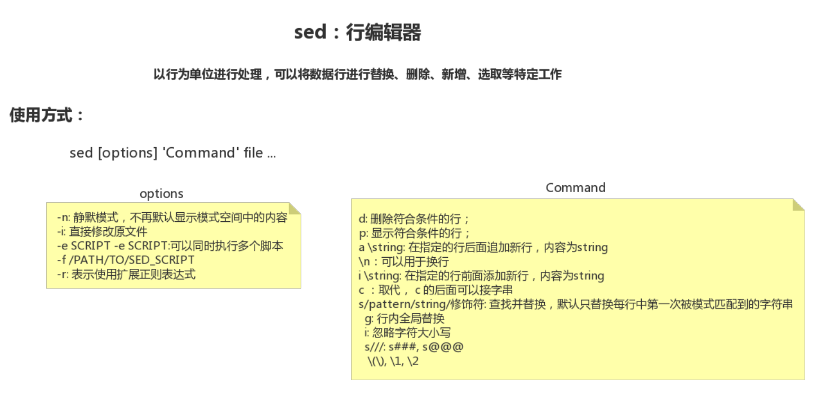
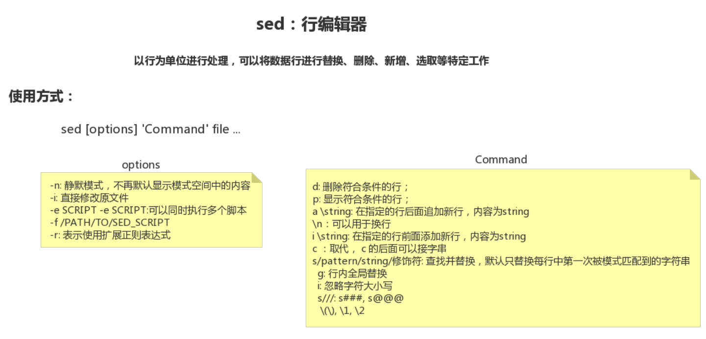

26-Linux sed命令修改各种配置文件案例




sed 行编辑器


```shell
[root@node0924 a]# ls
1dir  2dir  3dir  adir  ctxt  ctxt.txt  passwd  profile  test2.txt  test.txt  xdir  ydir  zdir  zfg
[root@node0924 a]# cp /etc/inittab ./
[root@node0924 a]# ls
1dir  2dir  3dir  adir  ctxt  ctxt.txt  inittab  passwd  profile  test2.txt  test.txt  xdir  ydir  zdir  zfg
[root@node0924 a]# 

```

`cp /etc/inittab ./`  准备文件`inittab`


```shell
[root@node0924 a]# cat inittab
# inittab is only used by upstart for the default runlevel.
#
# ADDING OTHER CONFIGURATION HERE WILL HAVE NO EFFECT ON YOUR SYSTEM.
#
# System initialization is started by /etc/init/rcS.conf
#
# Individual runlevels are started by /etc/init/rc.conf
#
# Ctrl-Alt-Delete is handled by /etc/init/control-alt-delete.conf
#
# Terminal gettys are handled by /etc/init/tty.conf and /etc/init/serial.conf,
# with configuration in /etc/sysconfig/init.
#
# For information on how to write upstart event handlers, or how
# upstart works, see init(5), init(8), and initctl(8).
#
# Default runlevel. The runlevels used are:
#   0 - halt (Do NOT set initdefault to this)
#   1 - Single user mode
#   2 - Multiuser, without NFS (The same as 3, if you do not have networking)
#   3 - Full multiuser mode
#   4 - unused
#   5 - X11
#   6 - reboot (Do NOT set initdefault to this)
# 
id:3:initdefault:
[root@node0924 a]# 

```

查看文件文本，将最后一行的3，变为8

```
id:3:initdefault:   ->   id:8:initdefault:
```


```shell
[root@node0924 a]# sed "s/[0-9]/8/" inittab
# inittab is only used by upstart for the default runlevel.
#
# ADDING OTHER CONFIGURATION HERE WILL HAVE NO EFFECT ON YOUR SYSTEM.
#
# System initialization is started by /etc/init/rcS.conf
#
# Individual runlevels are started by /etc/init/rc.conf
#
# Ctrl-Alt-Delete is handled by /etc/init/control-alt-delete.conf
#
# Terminal gettys are handled by /etc/init/tty.conf and /etc/init/serial.conf,
# with configuration in /etc/sysconfig/init.
#
# For information on how to write upstart event handlers, or how
# upstart works, see init(8), init(8), and initctl(8).
#
# Default runlevel. The runlevels used are:
#   8 - halt (Do NOT set initdefault to this)
#   8 - Single user mode
#   8 - Multiuser, without NFS (The same as 3, if you do not have networking)
#   8 - Full multiuser mode
#   8 - unused
#   8 - X11
#   8 - reboot (Do NOT set initdefault to this)
# 
id:8:initdefault:
[root@node0924 a]# sed "s/id:[0-9]:initdefault/8/" inittab
# inittab is only used by upstart for the default runlevel.
#
# ADDING OTHER CONFIGURATION HERE WILL HAVE NO EFFECT ON YOUR SYSTEM.
#
# System initialization is started by /etc/init/rcS.conf
#
# Individual runlevels are started by /etc/init/rc.conf
#
# Ctrl-Alt-Delete is handled by /etc/init/control-alt-delete.conf
#
# Terminal gettys are handled by /etc/init/tty.conf and /etc/init/serial.conf,
# with configuration in /etc/sysconfig/init.
#
# For information on how to write upstart event handlers, or how
# upstart works, see init(5), init(8), and initctl(8).
#
# Default runlevel. The runlevels used are:
#   0 - halt (Do NOT set initdefault to this)
#   1 - Single user mode
#   2 - Multiuser, without NFS (The same as 3, if you do not have networking)
#   3 - Full multiuser mode
#   4 - unused
#   5 - X11
#   6 - reboot (Do NOT set initdefault to this)
# 
8:
[root@node0924 a]# sed "s/id:[0-9]:initdefault:/id:8:initdefault:/" inittab
# inittab is only used by upstart for the default runlevel.
#
# ADDING OTHER CONFIGURATION HERE WILL HAVE NO EFFECT ON YOUR SYSTEM.
#
# System initialization is started by /etc/init/rcS.conf
#
# Individual runlevels are started by /etc/init/rc.conf
#
# Ctrl-Alt-Delete is handled by /etc/init/control-alt-delete.conf
#
# Terminal gettys are handled by /etc/init/tty.conf and /etc/init/serial.conf,
# with configuration in /etc/sysconfig/init.
#
# For information on how to write upstart event handlers, or how
# upstart works, see init(5), init(8), and initctl(8).
#
# Default runlevel. The runlevels used are:
#   0 - halt (Do NOT set initdefault to this)
#   1 - Single user mode
#   2 - Multiuser, without NFS (The same as 3, if you do not have networking)
#   3 - Full multiuser mode
#   4 - unused
#   5 - X11
#   6 - reboot (Do NOT set initdefault to this)
# 
id:8:initdefault:
[root@node0924 a]# sed "s/(id:)[0-9](:initdefault:)/\18\2/" inittab
sed: -e expression #1, char 34: invalid reference \2 on `s' command's RHS
[root@node0924 a]# sed "s/\(id:\)[0-9]\(:initdefault:\)/\18\2/" inittab
# inittab is only used by upstart for the default runlevel.
#
# ADDING OTHER CONFIGURATION HERE WILL HAVE NO EFFECT ON YOUR SYSTEM.
#
# System initialization is started by /etc/init/rcS.conf
#
# Individual runlevels are started by /etc/init/rc.conf
#
# Ctrl-Alt-Delete is handled by /etc/init/control-alt-delete.conf
#
# Terminal gettys are handled by /etc/init/tty.conf and /etc/init/serial.conf,
# with configuration in /etc/sysconfig/init.
#
# For information on how to write upstart event handlers, or how
# upstart works, see init(5), init(8), and initctl(8).
#
# Default runlevel. The runlevels used are:
#   0 - halt (Do NOT set initdefault to this)
#   1 - Single user mode
#   2 - Multiuser, without NFS (The same as 3, if you do not have networking)
#   3 - Full multiuser mode
#   4 - unused
#   5 - X11
#   6 - reboot (Do NOT set initdefault to this)
# 
id:8:initdefault:
[root@node0924 a]# 

```

各种各样的实验

* `sed "s/[0-9]/8/" inittab`  替换

* `sed "s/id:[0-9]:initdefault/8/" inittab`  替换

* `sed "s/id:[0-9]:initdefault:/id:8:initdefault:/" inittab` 替换

* `sed "s/(id:)[0-9](:initdefault:)/\18\2/" inittab` 替换文本，反向引用，需要转义

* `sed "s/\(id:\)[0-9]\(:initdefault:\)/\18\2/" inittab` 替换文本，反向引用，需要转义


```shell
[root@node0924 a]# sed -i "s/\(id:\)[0-9]\(:initdefault:\)/\18\2/" inittab
[root@node0924 a]# cat inittab
# inittab is only used by upstart for the default runlevel.
#
# ADDING OTHER CONFIGURATION HERE WILL HAVE NO EFFECT ON YOUR SYSTEM.
#
# System initialization is started by /etc/init/rcS.conf
#
# Individual runlevels are started by /etc/init/rc.conf
#
# Ctrl-Alt-Delete is handled by /etc/init/control-alt-delete.conf
#
# Terminal gettys are handled by /etc/init/tty.conf and /etc/init/serial.conf,
# with configuration in /etc/sysconfig/init.
#
# For information on how to write upstart event handlers, or how
# upstart works, see init(5), init(8), and initctl(8).
#
# Default runlevel. The runlevels used are:
#   0 - halt (Do NOT set initdefault to this)
#   1 - Single user mode
#   2 - Multiuser, without NFS (The same as 3, if you do not have networking)
#   3 - Full multiuser mode
#   4 - unused
#   5 - X11
#   6 - reboot (Do NOT set initdefault to this)
# 
id:8:initdefault:
[root@node0924 a]# 

```

确认好之后，直接修改

`sed -i "s/\(id:\)[0-9]\(:initdefault:\)/\18\2/" inittab`  修改原文件

`cat inittab`  查看文本


```shell
[root@node0924 a]# sed -i "s/\(id:\)[0-9]\(:initdefault:\)/\19\2/" inittab
[root@node0924 a]# cat inittab
# inittab is only used by upstart for the default runlevel.
#
# ADDING OTHER CONFIGURATION HERE WILL HAVE NO EFFECT ON YOUR SYSTEM.
#
# System initialization is started by /etc/init/rcS.conf
#
# Individual runlevels are started by /etc/init/rc.conf
#
# Ctrl-Alt-Delete is handled by /etc/init/control-alt-delete.conf
#
# Terminal gettys are handled by /etc/init/tty.conf and /etc/init/serial.conf,
# with configuration in /etc/sysconfig/init.
#
# For information on how to write upstart event handlers, or how
# upstart works, see init(5), init(8), and initctl(8).
#
# Default runlevel. The runlevels used are:
#   0 - halt (Do NOT set initdefault to this)
#   1 - Single user mode
#   2 - Multiuser, without NFS (The same as 3, if you do not have networking)
#   3 - Full multiuser mode
#   4 - unused
#   5 - X11
#   6 - reboot (Do NOT set initdefault to this)
# 
id:9:initdefault:
[root@node0924 a]# 

```


`sed -i "s/\(id:\)[0-9]\(:initdefault:\)/\19\2/" inittab`  每次修改，都是写死的值，例如改为`9`


```shell
[root@node0924 a]# version=2
[root@node0924 a]# echo $version
2
[root@node0924 a]# sed -i "s/\(id:\)[0-9]\(:initdefault:\)/\1$version\2/" inittab
[root@node0924 a]# cat inittab
# inittab is only used by upstart for the default runlevel.
#
# ADDING OTHER CONFIGURATION HERE WILL HAVE NO EFFECT ON YOUR SYSTEM.
#
# System initialization is started by /etc/init/rcS.conf
#
# Individual runlevels are started by /etc/init/rc.conf
#
# Ctrl-Alt-Delete is handled by /etc/init/control-alt-delete.conf
#
# Terminal gettys are handled by /etc/init/tty.conf and /etc/init/serial.conf,
# with configuration in /etc/sysconfig/init.
#
# For information on how to write upstart event handlers, or how
# upstart works, see init(5), init(8), and initctl(8).
#
# Default runlevel. The runlevels used are:
#   0 - halt (Do NOT set initdefault to this)
#   1 - Single user mode
#   2 - Multiuser, without NFS (The same as 3, if you do not have networking)
#   3 - Full multiuser mode
#   4 - unused
#   5 - X11
#   6 - reboot (Do NOT set initdefault to this)
# 
id:2:initdefault:
[root@node0924 a]# 

```


`version=2`  定义变量

`echo $version` 打印变量

`sed -i "s/\(id:\)[0-9]\(:initdefault:\)/\1$version\2/" inittab`  使用变量替换文本


```shell
[root@node0924 a]# version=5
[root@node0924 a]# sed -i "s/\(id:\)[0-9]\(:initdefault:\)/\1$version\2/" inittab
[root@node0924 a]# cat inittab
# inittab is only used by upstart for the default runlevel.
#
# ADDING OTHER CONFIGURATION HERE WILL HAVE NO EFFECT ON YOUR SYSTEM.
#
# System initialization is started by /etc/init/rcS.conf
#
# Individual runlevels are started by /etc/init/rc.conf
#
# Ctrl-Alt-Delete is handled by /etc/init/control-alt-delete.conf
#
# Terminal gettys are handled by /etc/init/tty.conf and /etc/init/serial.conf,
# with configuration in /etc/sysconfig/init.
#
# For information on how to write upstart event handlers, or how
# upstart works, see init(5), init(8), and initctl(8).
#
# Default runlevel. The runlevels used are:
#   0 - halt (Do NOT set initdefault to this)
#   1 - Single user mode
#   2 - Multiuser, without NFS (The same as 3, if you do not have networking)
#   3 - Full multiuser mode
#   4 - unused
#   5 - X11
#   6 - reboot (Do NOT set initdefault to this)
# 
id:5:initdefault:
[root@node0924 a]# 
```

可以修改变量version，替换文本


```shell
[root@node0924 a]# clear
[root@node0924 a]# ls
1dir  2dir  3dir  adir  ctxt  ctxt.txt  inittab  passwd  profile  test2.txt  test.txt  xdir  ydir  zdir  zfg
[root@node0924 a]# cp /etc/sysconfig/network-scripts/ifcfg-eth0 ./
[root@node0924 a]# ls
1dir  2dir  3dir  adir  ctxt  ctxt.txt  ifcfg-eth0  inittab  passwd  profile  test2.txt  test.txt  xdir  ydir  zdir  zfg
[root@node0924 a]# 

```

`cp /etc/sysconfig/network-scripts/ifcfg-eth0 ./`  准备文件`ifcfg-eth0`


```shell
[root@node0924 a]# cat ifcfg-eth0
DEVICE=eth0
TYPE=Ethernet
ONBOOT=yes
NM_CONTROLLED=yes
BOOTPROTO=static
IPADDR=192.168.11.66
NETMASK=255.255.255.0
GATEWAY=192.168.11.2
DNS1=114.114.114.114
DNS2=192.168.11.2
[root@node0924 a]# 

```


`cat ifcfg-eth0`  查看文件


```shell
[root@node0924 a]# sed "s/\(IPADDR=\([0-9]\?[0-9][0-9]\?.\)\{3\}\).*/\188/" ifcfg-eth0
DEVICE=eth0
TYPE=Ethernet
ONBOOT=yes
NM_CONTROLLED=yes
BOOTPROTO=static
IPADDR=192.168.11.88
NETMASK=255.255.255.0
GATEWAY=192.168.11.2
DNS1=114.114.114.114
DNS2=192.168.11.2
[root@node0924 a]# sed -i "s/\(IPADDR=\([0-9]\?[0-9][0-9]\?.\)\{3\}\).*/\188/" ifcfg-eth0
[root@node0924 a]# cat ifcfg-eth0
DEVICE=eth0
TYPE=Ethernet
ONBOOT=yes
NM_CONTROLLED=yes
BOOTPROTO=static
IPADDR=192.168.11.88
NETMASK=255.255.255.0
GATEWAY=192.168.11.2
DNS1=114.114.114.114
DNS2=192.168.11.2
[root@node0924 a]# 

```

`sed "s/\(IPADDR=\([0-9]\?[0-9][0-9]\?.\)\{3\}\).*/\188/" ifcfg-eth0`  使用反向引用，替换字符

`sed -i "s/\(IPADDR=\([0-9]\?[0-9][0-9]\?.\)\{3\}\).*/\188/" ifcfg-eth0`  保存替换的字符

`cat ifcfg-eth0`  查看文本

```
sed -i "s/\(IPADDR=\([0-9]\?[0-9][0-9]\?.\)\{3\}\).*/\188/" ifcfg-eth0
```




sed 行编辑器


  


