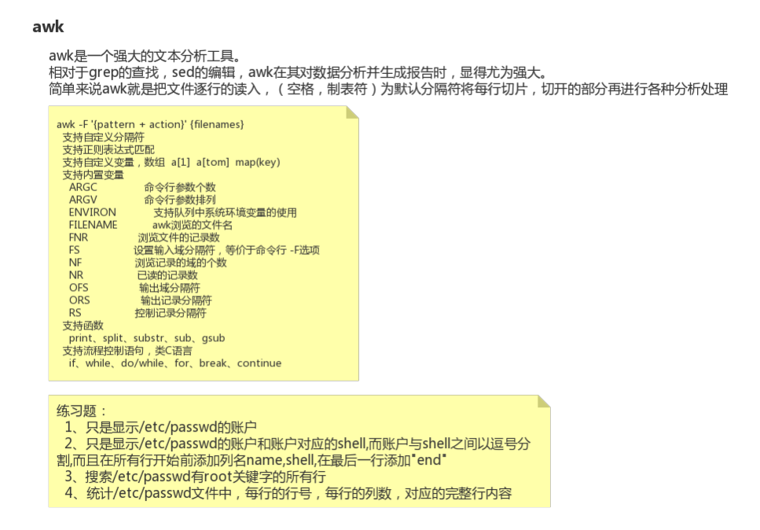

27-Linux强大的文本分析工具awk入门





```shell
[root@node0924 a]# ls
1dir  2dir  3dir  adir  ctxt  ctxt.txt  ifcfg-eth0  inittab  passwd  profile  test2.txt  test.txt  xdir  ydir  zdir  zfg
[root@node0924 a]# cat passwd
root:x:0:0:root:/root:/bin/bash
bin:x:1:1:bin:/bin:/sbin/nologin
daemon:x:2:2:daemon:/sbin:/sbin/nologin
adm:x:3:4:adm:/var/adm:/sbin/nologin
lp:x:4:7:lp:/var/spool/lpd:/sbin/nologin
sync:x:5:0:sync:/sbin:/bin/sync
shutdown:x:6:0:shutdown:/sbin:/sbin/shutdown
halt:x:7:0:halt:/sbin:/sbin/halt
mail:x:8:12:mail:/var/spool/mail:/sbin/nologin
uucp:x:10:14:uucp:/var/spool/uucp:/sbin/nologin
operator:x:11:0:operator:/root:/sbin/nologin
games:x:12:100:games:/usr/games:/sbin/nologin
gopher:x:13:30:gopher:/var/gopher:/sbin/nologin
ftp:x:14:50:FTP User:/var/ftp:/sbin/nologin
nobody:x:99:99:Nobody:/:/sbin/nologin
vcsa:x:69:69:virtual console memory owner:/dev:/sbin/nologin
saslauth:x:499:76:"Saslauthd user":/var/empty/saslauth:/sbin/nologin
postfix:x:89:89::/var/spool/postfix:/sbin/nologin
sshd:x:74:74:Privilege-separated SSH:/var/empty/sshd:/sbin/nologin
mfc9:x:500:500::/home/mfc9:/bin/bash
mfc01:x:501:501::/home/mfc01:/bin/bash
mfc02:x:502:502::/home/mfc02:/bin/bash
mfc03:x:503:503::/home/mfc03:/bin/bash
mysql:x:27:27:MySQL Server:/var/lib/mysql:/bin/false
ntp:x:38:38::/etc/ntp:/sbin/nologin
mfc19:x:504:505::/home/mfc19:/bin/bash
[root@node0924 a]# 

```

准备文件`passwd`。

```
root:x:0:0:root:/root:/bin/bash

以`:`分割字符串,由7个字段组成
root			用户名
x				密码，被加密了
0				userid
0				groupid
root			描述
/root			家目录
/bin/bash		默认使用的shell，bashshell。
```

`root:x:0:0:root:/root:/bin/bash` passwd文本内容的介绍和解释。


```shell
[root@node0924 a]# awk -F ':' '{print $1}' passwd
root
bin
daemon
adm
lp
sync
shutdown
halt
mail
uucp
operator
games
gopher
ftp
nobody
vcsa
saslauth
postfix
sshd
mfc9
mfc01
mfc02
mfc03
mysql
ntp
mfc19
[root@node0924 a]# 

```

`awk -F ':' '{print $1}' passwd`  只显示/etc/passwd的账户


```shell
[root@node0924 a]# awk -F ':' 'BEGIN {print "name,shell"}{print $1 "," $7}END{print "end"}' passwd
name,shell
root,/bin/bash
bin,/sbin/nologin
daemon,/sbin/nologin
adm,/sbin/nologin
lp,/sbin/nologin
sync,/bin/sync
shutdown,/sbin/shutdown
halt,/sbin/halt
mail,/sbin/nologin
uucp,/sbin/nologin
operator,/sbin/nologin
games,/sbin/nologin
gopher,/sbin/nologin
ftp,/sbin/nologin
nobody,/sbin/nologin
vcsa,/sbin/nologin
saslauth,/sbin/nologin
postfix,/sbin/nologin
sshd,/sbin/nologin
mfc9,/bin/bash
mfc01,/bin/bash
mfc02,/bin/bash
mfc03,/bin/bash
mysql,/bin/false
ntp,/sbin/nologin
mfc19,/bin/bash
end
[root@node0924 a]# 

```

`awk -F ':' 'BEGIN {print "name,shell"}{print $1 "," $7}END{print "end"}' passwd`

只显示账户和账户对应的shell

账户和shell之间用逗号分隔

在所有行开始前添加列名name，shell

在最后一行添加end


```shell
[root@node0924 a]# awk '/root/ {print $0}' passwd
root:x:0:0:root:/root:/bin/bash
operator:x:11:0:operator:/root:/sbin/nologin
[root@node0924 a]# 

```

`awk '/root/ {print $0}' passwd`  搜索有root关键字的所有行


```shell
[root@node0924 a]# awk -F ':' '{print NR "\t" NF "\t" $0}' passwd
1	7	root:x:0:0:root:/root:/bin/bash
2	7	bin:x:1:1:bin:/bin:/sbin/nologin
3	7	daemon:x:2:2:daemon:/sbin:/sbin/nologin
4	7	adm:x:3:4:adm:/var/adm:/sbin/nologin
5	7	lp:x:4:7:lp:/var/spool/lpd:/sbin/nologin
6	7	sync:x:5:0:sync:/sbin:/bin/sync
7	7	shutdown:x:6:0:shutdown:/sbin:/sbin/shutdown
8	7	halt:x:7:0:halt:/sbin:/sbin/halt
9	7	mail:x:8:12:mail:/var/spool/mail:/sbin/nologin
10	7	uucp:x:10:14:uucp:/var/spool/uucp:/sbin/nologin
11	7	operator:x:11:0:operator:/root:/sbin/nologin
12	7	games:x:12:100:games:/usr/games:/sbin/nologin
13	7	gopher:x:13:30:gopher:/var/gopher:/sbin/nologin
14	7	ftp:x:14:50:FTP User:/var/ftp:/sbin/nologin
15	7	nobody:x:99:99:Nobody:/:/sbin/nologin
16	7	vcsa:x:69:69:virtual console memory owner:/dev:/sbin/nologin
17	7	saslauth:x:499:76:"Saslauthd user":/var/empty/saslauth:/sbin/nologin
18	7	postfix:x:89:89::/var/spool/postfix:/sbin/nologin
19	7	sshd:x:74:74:Privilege-separated SSH:/var/empty/sshd:/sbin/nologin
20	7	mfc9:x:500:500::/home/mfc9:/bin/bash
21	7	mfc01:x:501:501::/home/mfc01:/bin/bash
22	7	mfc02:x:502:502::/home/mfc02:/bin/bash
23	7	mfc03:x:503:503::/home/mfc03:/bin/bash
24	7	mysql:x:27:27:MySQL Server:/var/lib/mysql:/bin/false
25	7	ntp:x:38:38::/etc/ntp:/sbin/nologin
26	7	mfc19:x:504:505::/home/mfc19:/bin/bash
[root@node0924 a]# 

```

`awk -F ':' '{print NR "\t" NF "\t" $0}' passwd`  统计passwd每行的行号，每行的列数，对应的完整行内容。


