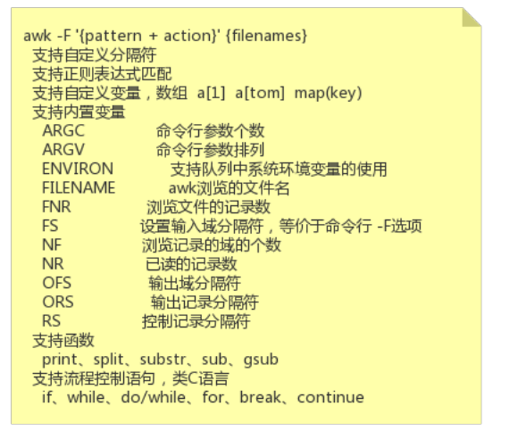
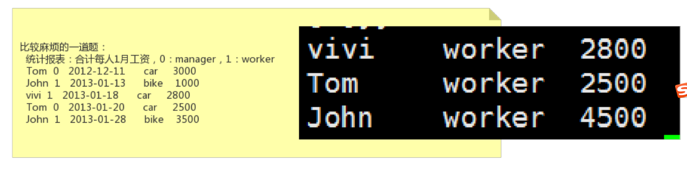

28-Linux强大的文本分析工具awk脚本


awk




语法解释


练习题，前面已经写过了。




练习题：统计报表，合计每人1月工资。


```shell
[root@node0924 a]# ls
1dir  2dir  3dir  adir  ctxt  ctxt.txt  ifcfg-eth0  inittab  passwd  profile  salary  test2.txt  test.txt  xdir  ydir  zdir  zfg
[root@node0924 a]# cat salary
Tom    0    2012-12-11    car    3000
John    1    2013-01-13    bike    1000
vivi    1    2013-01-18    car    2800
Tom    0    2013-01-20    car    2500
John    1    2013-01-28    bike    3500
[root@node0924 a]# 
```

准备文件

```shell
[root@node0924 a]# cat salary
Tom    0    2012-12-11    car    3000
John    1    2013-01-13    bike    1000
vivi    1    2013-01-18    car    2800
Tom    0    2013-01-20    car    2500
John    1    2013-01-28    bike    3500
[root@node0924 a]# awk '{split($3,date,"-");if(date[2]=="01"){names[$1]+=$5}} END{for(i in names) print i "\t" names[i]}' salary
vivi	2800
Tom	2500
John	4500
[root@node0924 a]# 

```

`awk '{split($3,date,"-");if(date[2]=="01"){names[$1]+=$5}} END{for(i in names) print i "\t" names[i]}' salary`

感觉有点像程序语法，有数组，有循环，有逻辑判断


```shell
[root@node0924 a]# awk '{split($3,date,"-");if(date[2]=="01"){names[$1]+=$5};if($2=="0"){roles[$1]="Manager"}else{roles[$1]="Worker"}} END{for(i in names) print i "\t" names[i] "\t" roles[i]}' salary
vivi	2800	Worker
Tom	2500	Manager
John	4500	Worker
[root@node0924 a]# 

```

`awk '{split($3,date,"-");if(date[2]=="01"){names[$1]+=$5};if($2=="0"){roles[$1]="Manager"}else{roles[$1]="Worker"}} END{for(i in names) print i "\t" names[i] "\t" roles[i]}' salary`

打印工资和角色，个人感觉这个代码太不友好了，不好阅读。逻辑还是比较简单的。if判断和循环打印。


```shell
[root@node0924 a]# cat qqqq
{
	split($3,date,"-");
	if(date[2]=="01"){
		names[$1]+=$5
	};
	if($2=="0"){
		roles[$1]="Manager"
	}
	else{
		roles[$1]="Worker"
	}
} 
END{
	for(i in names) print i "\t" names[i] "\t" roles[i]
}
[root@node0924 a]# 

```

稍微排一下版，放到`qqqq`文件中


```shell
[root@node0924 a]# man awk
[root@node0924 a]# awk -f qqqq salary
vivi	2800	Worker
Tom	2500	Manager
John	4500	Worker
[root@node0924 a]# 

```

`awk -f qqqq salary`  使用awk 的 `-f` 命令


```shell
[root@node0924 a]# cat qqqq
{
	split($3,date,"-");
	if(date[2]=="01"){
		names[$1]+=$5
	};
	if($2=="0"){
		roles[$1]="Manager"
	}
	else{
		roles[$1]="Worker"
	}
} 
END
{
	for(i in names) print i "\t" names[i] "\t" roles[i]
}
[root@node0924 a]# awk -f qqqq salary
awk: qqqq:14: END blocks must have an action part
[root@node0924 a]# 

```

修改一下格式，讲END后面的`{`放到下一行，执行命令时无法识别。

```shell
[root@node0924 a]# cat qqqq
{
	split($3,date,"-");
	if(date[2]=="01"){
		names[$1]+=$5
	};
	if($2=="0"){
		roles[$1]="Manager"
	}
	else{
		roles[$1]="Worker"
	}
} 
END{
	for(i in names) print i "\t" names[i] "\t" roles[i]
}
[root@node0924 a]# awk -f qqqq salary
vivi	2800	Worker
Tom	2500	Manager
John	4500	Worker
[root@node0924 a]# 

```

放在同一行，又可以识别了。注意一下格式问题。对格式要求比较严格。

