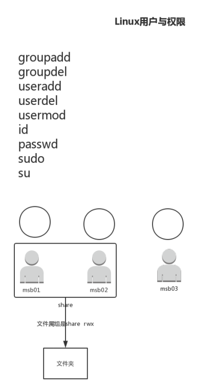
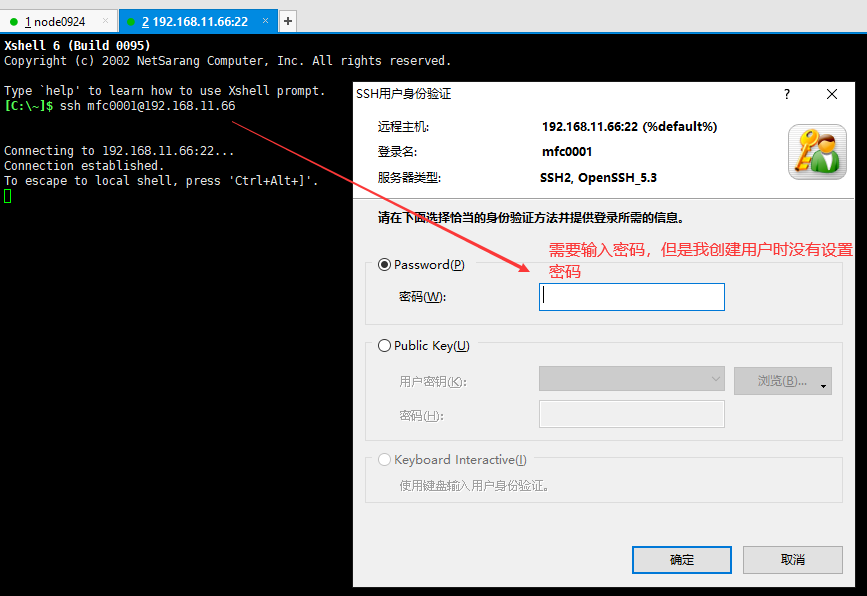
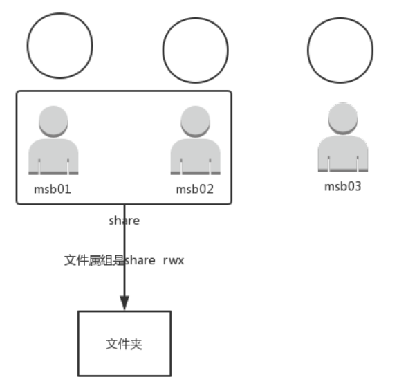

29-Linux用户与权限




Linux用户与权限


```shell
# 创建mfc0001用户
[root@node0924 ~]# useradd mfc0001
# 删除mfc0001用户
[root@node0924 ~]# userdel mfc0001
[root@node0924 ~]# 

```


```shell
[root@node0924 ~]# cd /home/
[root@node0924 home]# ls
mfc0001  mfc01  mfc02  mfc03  mfc19  mfc9
[root@node0924 home]# rm -rf mfc0001/
[root@node0924 home]# cd /var/spool/mail/
[root@node0924 mail]# ls
mfc0001  mfc01  mfc02  mfc03  mfc19  mfc9
[root@node0924 mail]# rm -rf mfc0001
```

将用户删除干净

`cd /home/`

`cd /var/spool/mail/`

删除指定的文件或者文件夹


```shell
[root@node0924 ~]# useradd mfc0001
[root@node0924 ~]# useradd mfc0002
[root@node0924 ~]# cd /home/
[root@node0924 home]# ls
mfc0001  mfc0002  mfc01  mfc02  mfc03  mfc19  mfc9
[root@node0924 home]# 

```

添加两个用户，查看home文件夹





```
ssh mfc0001@192.168.11.66
```

用新创建的用户，连接linux。


```shell
[root@node0924 home]# passwd
Changing password for user root.
New password: 
[root@node0924 home]# passwd mfc0001
Changing password for user mfc0001.
New password: 
BAD PASSWORD: it does not contain enough DIFFERENT characters
BAD PASSWORD: is a palindrome
Retype new password: 
passwd: all authentication tokens updated successfully.
[root@node0924 home]# 

```

`passwd`  修改的是当前root账户的密码

`passwd mfc0001` 修改的是mfc0001账户的密码。密码输入两次。`111111` `111111`


```shell
[C:\~]$ ssh mfc0001@192.168.11.66


Connecting to 192.168.11.66:22...
Connection established.
To escape to local shell, press 'Ctrl+Alt+]'.

WARNING! The remote SSH server rejected X11 forwarding request.
[mfc0001@node0924 ~]$ 

```

再次连接，登录上去新用户了。`mfc0001`


```
[root@node0924 ~]# 

[mfc0001@node0924 ~]$ 
```

普通用户登录和root用户登录，对比一下命令行。


```shell
[root@node0924 ~]# passwd mfc0002
Changing password for user mfc0002.
New password: 
BAD PASSWORD: it does not contain enough DIFFERENT characters
BAD PASSWORD: is a palindrome
Retype new password: 
passwd: all authentication tokens updated successfully.
[root@node0924 ~]# useradd mfc0003
[root@node0924 ~]# passwd mfc0003
Changing password for user mfc0003.
New password: 
BAD PASSWORD: it does not contain enough DIFFERENT characters
BAD PASSWORD: is a palindrome
Retype new password: 
passwd: all authentication tokens updated successfully.
[root@node0924 ~]# 

```

重复新建用户，设置密码。现在有三个用户`mfc0001`、`mfc0002`、`mfc0003`.

密码均为`111111`。




文件属组


```shell
[root@node0924 ~]# cd /
[root@node0924 /]# mkdir mfc-share
[root@node0924 /]# ll
total 98
dr-xr-xr-x.  2 root root   4096 Sep 26 19:30 bin
dr-xr-xr-x.  5 root root   1024 Sep 26 19:30 boot
drwxr-xr-x. 19 root root   3740 Nov 16 21:18 dev
drwxr-xr-x. 65 root root   4096 Nov 17 23:56 etc
drwxr-xr-x. 10 root root   4096 Nov 17 23:56 home
dr-xr-xr-x.  8 root root   4096 Sep 26 23:49 lib
dr-xr-xr-x.  9 root root  12288 Sep 26 19:30 lib64
drwx------.  2 root root  16384 Sep 25 07:48 lost+found
drwxr-xr-x.  2 root root   4096 Sep 23  2011 media
drwxr-xr-x.  2 root root   4096 Nov 18 00:02 mfc-share
drwxr-xr-x.  2 root root   4096 Sep 23  2011 mnt
drwxr-xr-x.  3 root root   4096 Sep 27 00:44 opt
dr-xr-xr-x. 97 root root      0 Nov 16 21:18 proc
dr-xr-x---.  9 root root   4096 Nov 17 23:27 root
dr-xr-xr-x.  2 root root  12288 Sep 26 19:30 sbin
drwxr-xr-x.  7 root root      0 Nov 16 21:18 selinux
drwxrwx---.  2 root share  4096 Sep 26 07:20 share
drwxr-xr-x.  2 root root   4096 Sep 23  2011 srv
drwxr-xr-x  13 root root      0 Nov 16 21:18 sys
drwxrwxrwt.  3 root root   4096 Nov 17 23:22 tmp
drwxr-xr-x. 13 root root   4096 Sep 25 07:48 usr
drwxr-xr-x. 17 root root   4096 Sep 25 07:48 var
[root@node0924 /]# 

```

切换到根目录，创建`mfc-share`文件夹


```shell
[root@node0924 /]# groupadd mfc-share
[root@node0924 /]# 

```

`groupadd mfc-share`  创建一个组`mfc-share`


```shell
[root@node0924 /]# usermod -G mfc-share mfc0001
[root@node0924 /]# id mfc0001
uid=505(mfc0001) gid=506(mfc0001) groups=506(mfc0001),509(mfc-share)
[root@node0924 /]# 

```

`usermod -G mfc-share mfc0001` 将用户加入组

`id mfc0001` 查看用户`mfc0001`

```
# uid 用户id
uid=505(mfc0001) 
# gid 组id
gid=506(mfc0001) 
# groups 加入的组
groups=506(mfc0001),509(mfc-share)
```


```shell
[root@node0924 /]# usermod -G mfc-share mfc0002
[root@node0924 /]# id mfc0002
uid=506(mfc0002) gid=507(mfc0002) groups=507(mfc0002),509(mfc-share)
[root@node0924 /]# id mfc0003
uid=507(mfc0003) gid=508(mfc0003) groups=508(mfc0003)
[root@node0924 /]# 

```

mfc0002也加入到mfc-share，mfc0003不加入

查看用户。


```shell
[root@node0924 /]# ll
total 98
dr-xr-xr-x.  2 root root   4096 Sep 26 19:30 bin
dr-xr-xr-x.  5 root root   1024 Sep 26 19:30 boot
drwxr-xr-x. 19 root root   3740 Nov 16 21:18 dev
drwxr-xr-x. 65 root root   4096 Nov 18 00:08 etc
drwxr-xr-x. 10 root root   4096 Nov 17 23:56 home
dr-xr-xr-x.  8 root root   4096 Sep 26 23:49 lib
dr-xr-xr-x.  9 root root  12288 Sep 26 19:30 lib64
drwx------.  2 root root  16384 Sep 25 07:48 lost+found
drwxr-xr-x.  2 root root   4096 Sep 23  2011 media
drwxr-xr-x.  2 root root   4096 Nov 18 00:02 mfc-share
drwxr-xr-x.  2 root root   4096 Sep 23  2011 mnt
drwxr-xr-x.  3 root root   4096 Sep 27 00:44 opt
dr-xr-xr-x. 97 root root      0 Nov 16 21:18 proc
dr-xr-x---.  9 root root   4096 Nov 17 23:27 root
dr-xr-xr-x.  2 root root  12288 Sep 26 19:30 sbin
drwxr-xr-x.  7 root root      0 Nov 16 21:18 selinux
drwxrwx---.  2 root share  4096 Sep 26 07:20 share
drwxr-xr-x.  2 root root   4096 Sep 23  2011 srv
drwxr-xr-x  13 root root      0 Nov 16 21:18 sys
drwxrwxrwt.  3 root root   4096 Nov 17 23:22 tmp
drwxr-xr-x. 13 root root   4096 Sep 25 07:48 usr
drwxr-xr-x. 17 root root   4096 Sep 25 07:48 var
[root@node0924 /]# 

```


```
drwxr-xr-x.  2 root root   4096 Nov 18 00:02 mfc-share
##########
三位一组，代表UGO的权限
U：属主
G：属组
O：其他人
             #
             2代表硬连接的个数
                ####
                代表属主
                     ####
                     代表属组
```


```shell
[root@node0924 /]# man chown
[root@node0924 /]# chown root:mfc-share mfc-share/
[root@node0924 /]# ll
total 98
dr-xr-xr-x.  2 root root       4096 Sep 26 19:30 bin
dr-xr-xr-x.  5 root root       1024 Sep 26 19:30 boot
drwxr-xr-x. 19 root root       3740 Nov 16 21:18 dev
drwxr-xr-x. 65 root root       4096 Nov 18 00:08 etc
drwxr-xr-x. 10 root root       4096 Nov 17 23:56 home
dr-xr-xr-x.  8 root root       4096 Sep 26 23:49 lib
dr-xr-xr-x.  9 root root      12288 Sep 26 19:30 lib64
drwx------.  2 root root      16384 Sep 25 07:48 lost+found
drwxr-xr-x.  2 root root       4096 Sep 23  2011 media
drwxr-xr-x.  2 root mfc-share  4096 Nov 18 00:02 mfc-share
drwxr-xr-x.  2 root root       4096 Sep 23  2011 mnt
drwxr-xr-x.  3 root root       4096 Sep 27 00:44 opt
dr-xr-xr-x. 97 root root          0 Nov 16 21:18 proc
dr-xr-x---.  9 root root       4096 Nov 17 23:27 root
dr-xr-xr-x.  2 root root      12288 Sep 26 19:30 sbin
drwxr-xr-x.  7 root root          0 Nov 16 21:18 selinux
drwxrwx---.  2 root share      4096 Sep 26 07:20 share
drwxr-xr-x.  2 root root       4096 Sep 23  2011 srv
drwxr-xr-x  13 root root          0 Nov 16 21:18 sys
drwxrwxrwt.  3 root root       4096 Nov 18 00:14 tmp
drwxr-xr-x. 13 root root       4096 Sep 25 07:48 usr
drwxr-xr-x. 17 root root       4096 Sep 25 07:48 var
[root@node0924 /]# 

```

`chown root:mfc-share mfc-share/` 属主不变，属组为`mfc-share`

```
改变前：
drwxr-xr-x.  2 root root   4096 Nov 18 00:02 mfc-share

改变后：
drwxr-xr-x.  2 root mfc-share  4096 Nov 18 00:02 mfc-share
```

对比观察

```shell
[root@node0924 /]# chmod g+w mfc-share/
[root@node0924 /]# ll
total 98
dr-xr-xr-x.  2 root root       4096 Sep 26 19:30 bin
dr-xr-xr-x.  5 root root       1024 Sep 26 19:30 boot
drwxr-xr-x. 19 root root       3740 Nov 16 21:18 dev
drwxr-xr-x. 65 root root       4096 Nov 18 00:08 etc
drwxr-xr-x. 10 root root       4096 Nov 17 23:56 home
dr-xr-xr-x.  8 root root       4096 Sep 26 23:49 lib
dr-xr-xr-x.  9 root root      12288 Sep 26 19:30 lib64
drwx------.  2 root root      16384 Sep 25 07:48 lost+found
drwxr-xr-x.  2 root root       4096 Sep 23  2011 media
drwxrwxr-x.  2 root mfc-share  4096 Nov 18 00:02 mfc-share
drwxr-xr-x.  2 root root       4096 Sep 23  2011 mnt
drwxr-xr-x.  3 root root       4096 Sep 27 00:44 opt
dr-xr-xr-x. 97 root root          0 Nov 16 21:18 proc
dr-xr-x---.  9 root root       4096 Nov 17 23:27 root
dr-xr-xr-x.  2 root root      12288 Sep 26 19:30 sbin
drwxr-xr-x.  7 root root          0 Nov 16 21:18 selinux
drwxrwx---.  2 root share      4096 Sep 26 07:20 share
drwxr-xr-x.  2 root root       4096 Sep 23  2011 srv
drwxr-xr-x  13 root root          0 Nov 16 21:18 sys
drwxrwxrwt.  3 root root       4096 Nov 18 00:14 tmp
drwxr-xr-x. 13 root root       4096 Sep 25 07:48 usr
drwxr-xr-x. 17 root root       4096 Sep 25 07:48 var
[root@node0924 /]# 

```

`chmod g+w mfc-share/` 

`g`代表`属组`加上`w`权限

```
前：
drwxr-xr-x.  2 root mfc-share  4096 Nov 18 00:02 mfc-share
后：
drwxrwxr-x.  2 root mfc-share  4096 Nov 18 00:02 mfc-share

xr-    ->    xrw
```


```shell
[root@node0924 /]# chmod o-r mfc-share
[root@node0924 /]# chmod o-x mfc-share
[root@node0924 /]# ll
total 98
dr-xr-xr-x.  2 root root       4096 Sep 26 19:30 bin
dr-xr-xr-x.  5 root root       1024 Sep 26 19:30 boot
drwxr-xr-x. 19 root root       3740 Nov 16 21:18 dev
drwxr-xr-x. 65 root root       4096 Nov 18 00:08 etc
drwxr-xr-x. 10 root root       4096 Nov 17 23:56 home
dr-xr-xr-x.  8 root root       4096 Sep 26 23:49 lib
dr-xr-xr-x.  9 root root      12288 Sep 26 19:30 lib64
drwx------.  2 root root      16384 Sep 25 07:48 lost+found
drwxr-xr-x.  2 root root       4096 Sep 23  2011 media
drwxrwx---.  2 root mfc-share  4096 Nov 18 00:02 mfc-share
drwxr-xr-x.  2 root root       4096 Sep 23  2011 mnt
drwxr-xr-x.  3 root root       4096 Sep 27 00:44 opt
dr-xr-xr-x. 97 root root          0 Nov 16 21:18 proc
dr-xr-x---.  9 root root       4096 Nov 17 23:27 root
dr-xr-xr-x.  2 root root      12288 Sep 26 19:30 sbin
drwxr-xr-x.  7 root root          0 Nov 16 21:18 selinux
drwxrwx---.  2 root share      4096 Sep 26 07:20 share
drwxr-xr-x.  2 root root       4096 Sep 23  2011 srv
drwxr-xr-x  13 root root          0 Nov 16 21:18 sys
drwxrwxrwt.  3 root root       4096 Nov 18 00:14 tmp
drwxr-xr-x. 13 root root       4096 Sep 25 07:48 usr
drwxr-xr-x. 17 root root       4096 Sep 25 07:48 var
[root@node0924 /]# 

```

`chmod o-r mfc-share`

`chmod o-x mfc-share`

`o`代表`其他`，去掉`r` 和 `x`权限

```
前
drwxrwxr-x.  2 root mfc-share  4096 Nov 18 00:02 mfc-share
后：
drwxrwx---.  2 root mfc-share  4096 Nov 18 00:02 mfc-share

r-x    ->    ---
```


更改权限

* 字母
* 数字


```shell
[mfc0001@node0924 ~]$ cd /mfc-share/
-bash: cd: /mfc-share/: Permission denied
[mfc0001@node0924 ~]$ 
```

说我没有权限操作，这个不对。

解释一下：

我们先以mfc0001用户登录

再在用root账户改的权限

又用mfc0001直接访问，没有重新登录，内存不知道权限修改了。

所有说没有权限。


```shell
[mfc0001@node0924 ~]$ exit
logout
Connection closing...Socket close.

Connection closed by foreign host.

Disconnected from remote host(192.168.11.66:22) at 22:02:43.

Type `help' to learn how to use Xshell prompt.
[C:\~]$ ssh mfc0001@192.168.11.66


Connecting to 192.168.11.66:22...
Connection established.
To escape to local shell, press 'Ctrl+Alt+]'.

WARNING! The remote SSH server rejected X11 forwarding request.
Last login: Tue Nov 17 23:52:18 2020 from 192.168.11.1
[mfc0001@node0924 ~]$ cd /mfc-share/
[mfc0001@node0924 mfc-share]$ pwd
/mfc-share
[mfc0001@node0924 mfc-share]$ 

```

`exit` 退出

`ssh mfc0001@192.168.11.66` 重新登录

`cd /mfc-share/`  切换目录。有权限操作了

`pwd` 查看当前路径地址


```shell
[mfc0001@node0924 mfc-share]$ vim mfc0001.log
[mfc0001@node0924 mfc-share]$ cat mfc0001.log
I love mfc0001.
[mfc0001@node0924 mfc-share]$ 

```

`vim mfc0001.log`  新建一个文件，写一点东西。

`cat mfc0001.log` 查看文件内容。


```shell
[mfc0002@node0924 ~]$ exit
logout
Connection closing...Socket close.

Connection closed by foreign host.

Disconnected from remote host(192.168.11.66:22) at 22:07:11.

Type `help' to learn how to use Xshell prompt.
[C:\~]$ ssh mfc0002@192.168.11.66


Connecting to 192.168.11.66:22...
Connection established.
To escape to local shell, press 'Ctrl+Alt+]'.

WARNING! The remote SSH server rejected X11 forwarding request.
Last login: Tue Nov 17 23:56:00 2020 from 192.168.11.1
[mfc0002@node0924 ~]$ cd /mfc-share/
[mfc0002@node0924 mfc-share]$ ls
mfc0001.log
[mfc0002@node0924 mfc-share]$ vim mfc0002.log
[mfc0002@node0924 mfc-share]$ cat mfc0002.log
I love mfc0002
[mfc0002@node0924 mfc-share]$ ls
mfc0001.log  mfc0002.log


```

mfc0002，退出登录，切换到mfc-share。写点内容。


```shelll
[mfc0001@node0924 mfc-share]$ ls
mfc0001.log  mfc0002.log
[mfc0001@node0924 mfc-share]$ cat mfc0002.log
I love mfc0002
[mfc0001@node0924 mfc-share]$ 

```

mfc0001,可以看到mfc0002写的文件。


小结

* 创建用户
* 用户删除
* 修改用户密码
* 文件属组
  * 创建文件夹mfc-share
  * 创建一个组mfc-share
  * 将用户加入组
  * 修改文件夹权限
* 用户测试，操作组里面的文件夹


