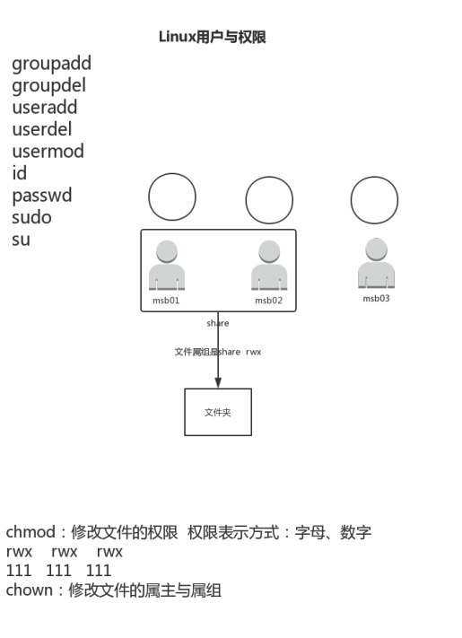

30-Linux用户与权限实操





```shell
[root@node0924 ~]# su mfc0001
[mfc0001@node0924 root]$ exit
exit
[root@node0924 ~]# su mfc0002
[mfc0002@node0924 root]$ su mfc0001
Password: 
[mfc0001@node0924 root]$ 

```

`su`  切换用户。

root切换到其他用户，直接就切换了

普通用户切换到其他用户，需要输入密码。

`exit` 退出登录


```shell
[mfc0001@node0924 ~]$ cd /tem/
-bash: cd: /tem/: No such file or directory
[mfc0001@node0924 ~]$ cd /tmp/
[mfc0001@node0924 tmp]$ ls
6379.conf  6381.conf  yum.log                                   yum_save_tx-2020-09-25-22-42piQCXZ.yumtx
6380.conf  cc         yum_save_tx-2020-09-25-15-40n1dcP7.yumtx  yum_save_tx-2020-09-27-02-05GqK7vR.yumtx
[mfc0001@node0924 tmp]$ touch ccc
[mfc0001@node0924 tmp]$ ls
6379.conf  cc       yum_save_tx-2020-09-25-15-40n1dcP7.yumtx
6380.conf  ccc      yum_save_tx-2020-09-25-22-42piQCXZ.yumtx
6381.conf  yum.log  yum_save_tx-2020-09-27-02-05GqK7vR.yumtx
[mfc0001@node0924 tmp]$ ll
total 28
-rw-r--r--. 1 root    root    1726 Sep 27 01:28 6379.conf
-rw-r--r--. 1 root    root    1726 Sep 27 01:39 6380.conf
-rw-r--r--. 1 root    root    1726 Sep 28 02:11 6381.conf
-rwxrw----. 1 mfc01   share     12 Sep 26 17:15 cc
-rw-rw-r--. 1 mfc0001 mfc0001    0 Nov 18 21:55 ccc
-rw-------. 1 root    root       0 Sep 25 07:48 yum.log
-rw-------. 1 root    root    1501 Sep 25 23:40 yum_save_tx-2020-09-25-15-40n1dcP7.yumtx
-rw-------. 1 root    root     262 Sep 25 22:42 yum_save_tx-2020-09-25-22-42piQCXZ.yumtx
-rw-------. 1 root    root     366 Sep 27 02:05 yum_save_tx-2020-09-27-02-05GqK7vR.yumtx
[mfc0001@node0924 tmp]$ 
```


`cd /tmp/`  切换到临时文件

`touch ccc`  创建一个ccc的空白文件


```shell
-rw-rw-r--. 1 mfc0001 mfc0001    0 Nov 18 21:55 ccc
```

查看文件


```shell
[mfc0002@node0924 ~]$ cd /tmp/
[mfc0002@node0924 tmp]$ ll
total 28
-rw-r--r--. 1 root    root    1726 Sep 27 01:28 6379.conf
-rw-r--r--. 1 root    root    1726 Sep 27 01:39 6380.conf
-rw-r--r--. 1 root    root    1726 Sep 28 02:11 6381.conf
-rwxrw----. 1 mfc01   share     12 Sep 26 17:15 cc
-rw-rw-r--. 1 mfc0001 mfc0001    0 Nov 18 21:55 ccc
-rw-------. 1 root    root       0 Sep 25 07:48 yum.log
-rw-------. 1 root    root    1501 Sep 25 23:40 yum_save_tx-2020-09-25-15-40n1dcP7.yumtx
-rw-------. 1 root    root     262 Sep 25 22:42 yum_save_tx-2020-09-25-22-42piQCXZ.yumtx
-rw-------. 1 root    root     366 Sep 27 02:05 yum_save_tx-2020-09-27-02-05GqK7vR.yumtx
[mfc0002@node0924 tmp]$ cat ccc
[mfc0002@node0924 tmp]$ vim ccc
[mfc0002@node0924 tmp]$ 

```

用mfc0002登录，

`cat ccc`查看文件，可以查看

`vim ccc` 修改文件，不能修改。说是只读文件，没有权限。


```shell
[mfc0001@node0924 tmp]$ chmod o+w ccc
[mfc0001@node0924 tmp]$ ll
total 28
-rw-r--r--. 1 root    root    1726 Sep 27 01:28 6379.conf
-rw-r--r--. 1 root    root    1726 Sep 27 01:39 6380.conf
-rw-r--r--. 1 root    root    1726 Sep 28 02:11 6381.conf
-rwxrw----. 1 mfc01   share     12 Sep 26 17:15 cc
-rw-rw-rw-. 1 mfc0001 mfc0001    0 Nov 18 21:55 ccc
-rw-------. 1 root    root       0 Sep 25 07:48 yum.log
-rw-------. 1 root    root    1501 Sep 25 23:40 yum_save_tx-2020-09-25-15-40n1dcP7.yumtx
-rw-------. 1 root    root     262 Sep 25 22:42 yum_save_tx-2020-09-25-22-42piQCXZ.yumtx
-rw-------. 1 root    root     366 Sep 27 02:05 yum_save_tx-2020-09-27-02-05GqK7vR.yumtx
[mfc0001@node0924 tmp]$ 

```

`chmod o+w ccc` 给其他人加上写的权限

```
-rw-rw-rw-. 1 mfc0001 mfc0001    0 Nov 18 21:55 ccc
```


```shell
[mfc0002@node0924 tmp]$ vim ccc
[mfc0002@node0924 tmp]$ cat ccc
i love mfc0002.
[mfc0002@node0924 tmp]$ 

```

mfc0002，可以修改`ccc`文件了

`cat ccc`  查看文件


```shell
[mfc0001@node0924 tmp]$ cat ccc
i love mfc0002.
[mfc0001@node0924 tmp]$ 

```

mfc0001

同样可以看到内容。


```shell
[mfc0001@node0924 tmp]$ chmod u+x ccc
[mfc0001@node0924 tmp]$ ll
total 32
-rw-r--r--. 1 root    root    1726 Sep 27 01:28 6379.conf
-rw-r--r--. 1 root    root    1726 Sep 27 01:39 6380.conf
-rw-r--r--. 1 root    root    1726 Sep 28 02:11 6381.conf
-rwxrw----. 1 mfc01   share     12 Sep 26 17:15 cc
-rwxrw-rw-. 1 mfc0001 mfc0001   16 Nov 18 22:01 ccc
-rw-------. 1 root    root       0 Sep 25 07:48 yum.log
-rw-------. 1 root    root    1501 Sep 25 23:40 yum_save_tx-2020-09-25-15-40n1dcP7.yumtx
-rw-------. 1 root    root     262 Sep 25 22:42 yum_save_tx-2020-09-25-22-42piQCXZ.yumtx
-rw-------. 1 root    root     366 Sep 27 02:05 yum_save_tx-2020-09-27-02-05GqK7vR.yumtx
[mfc0001@node0924 tmp]$ 

```

`chmod u+x ccc`  属主，加上执行权限

```
-rwxrw-rw-. 1 mfc0001 mfc0001   16 Nov 18 22:01 ccc
```


```shell
[mfc0001@node0924 tmp]$ chmod o-rw ccc
[mfc0001@node0924 tmp]$ ll
total 32
-rw-r--r--. 1 root    root    1726 Sep 27 01:28 6379.conf
-rw-r--r--. 1 root    root    1726 Sep 27 01:39 6380.conf
-rw-r--r--. 1 root    root    1726 Sep 28 02:11 6381.conf
-rwxrw----. 1 mfc01   share     12 Sep 26 17:15 cc
-rwxrw----. 1 mfc0001 mfc0001   16 Nov 18 22:01 ccc
-rw-------. 1 root    root       0 Sep 25 07:48 yum.log
-rw-------. 1 root    root    1501 Sep 25 23:40 yum_save_tx-2020-09-25-15-40n1dcP7.yumtx
-rw-------. 1 root    root     262 Sep 25 22:42 yum_save_tx-2020-09-25-22-42piQCXZ.yumtx
-rw-------. 1 root    root     366 Sep 27 02:05 yum_save_tx-2020-09-27-02-05GqK7vR.yumtx
[mfc0001@node0924 tmp]$ 

```

`chmod o-rw ccc`  去掉其他人的读写权限

```
-rwxrw----. 1 mfc0001 mfc0001   16 Nov 18 22:01 ccc
```


三个一组


```
rwx

4 + 2 + 1 = 7
2^2 2^1 2^0 
```


```shell
[mfc0001@node0924 tmp]$ chmod 764 ccc
[mfc0001@node0924 tmp]$ ll
total 32
-rw-r--r--. 1 root    root    1726 Sep 27 01:28 6379.conf
-rw-r--r--. 1 root    root    1726 Sep 27 01:39 6380.conf
-rw-r--r--. 1 root    root    1726 Sep 28 02:11 6381.conf
-rwxrw----. 1 mfc01   share     12 Sep 26 17:15 cc
-rwxrw-r--. 1 mfc0001 mfc0001   16 Nov 18 22:01 ccc
-rw-------. 1 root    root       0 Sep 25 07:48 yum.log
-rw-------. 1 root    root    1501 Sep 25 23:40 yum_save_tx-2020-09-25-15-40n1dcP7.yumtx
-rw-------. 1 root    root     262 Sep 25 22:42 yum_save_tx-2020-09-25-22-42piQCXZ.yumtx
-rw-------. 1 root    root     366 Sep 27 02:05 yum_save_tx-2020-09-27-02-05GqK7vR.yumtx
[mfc0001@node0924 tmp]$ 

```

`chmod 764 ccc` 用数字的方式授权

```
-rwxrw-r--. 1 mfc0001 mfc0001   16 Nov 18 22:01 ccc

rwx    ->   7
rw-    ->   6
r--    ->   4
```


```shell
[mfc0001@node0924 tmp]$ chmod 765 ccc
[mfc0001@node0924 tmp]$ ll
total 32
-rw-r--r--. 1 root    root    1726 Sep 27 01:28 6379.conf
-rw-r--r--. 1 root    root    1726 Sep 27 01:39 6380.conf
-rw-r--r--. 1 root    root    1726 Sep 28 02:11 6381.conf
-rwxrw----. 1 mfc01   share     12 Sep 26 17:15 cc
-rwxrw-r-x. 1 mfc0001 mfc0001   16 Nov 18 22:01 ccc
-rw-------. 1 root    root       0 Sep 25 07:48 yum.log
-rw-------. 1 root    root    1501 Sep 25 23:40 yum_save_tx-2020-09-25-15-40n1dcP7.yumtx
-rw-------. 1 root    root     262 Sep 25 22:42 yum_save_tx-2020-09-25-22-42piQCXZ.yumtx
-rw-------. 1 root    root     366 Sep 27 02:05 yum_save_tx-2020-09-27-02-05GqK7vR.yumtx
[mfc0001@node0924 tmp]$ 

```

`chmod 765 ccc` 

通过数字授权，仅给其他人加上执行的权限，需要算出其他未修改的权限

```
-rwxrw-r-x. 1 mfc0001 mfc0001   16 Nov 18 22:01 ccc

rwx    ->    7
rw-    ->    6
r-x    ->    4+1=5

```


```shell
[mfc0001@node0924 tmp]$ chmod o+x ccc
[mfc0001@node0924 tmp]$ ll
total 32
-rw-r--r--. 1 root    root    1726 Sep 27 01:28 6379.conf
-rw-r--r--. 1 root    root    1726 Sep 27 01:39 6380.conf
-rw-r--r--. 1 root    root    1726 Sep 28 02:11 6381.conf
-rwxrw----. 1 mfc01   share     12 Sep 26 17:15 cc
-rwxrw-r-x. 1 mfc0001 mfc0001   16 Nov 18 22:01 ccc
-rw-------. 1 root    root       0 Sep 25 07:48 yum.log
-rw-------. 1 root    root    1501 Sep 25 23:40 yum_save_tx-2020-09-25-15-40n1dcP7.yumtx
-rw-------. 1 root    root     262 Sep 25 22:42 yum_save_tx-2020-09-25-22-42piQCXZ.yumtx
-rw-------. 1 root    root     366 Sep 27 02:05 yum_save_tx-2020-09-27-02-05GqK7vR.yumtx
[mfc0001@node0924 tmp]$ 

```

`chmod o+x ccc`  用字母可以精确指定，不用计算多余的权限

```
-rwxrw-r-x. 1 mfc0001 mfc0001   16 Nov 18 22:01 ccc
```


```shell
[mfc0001@node0924 tmp]$ ll ccc
-rwxrw-r-x. 1 mfc0001 mfc0001 16 Nov 18 22:01 ccc
[mfc0001@node0924 tmp]$ chown :mfc-share ccc
[mfc0001@node0924 tmp]$ ll ccc
-rwxrw-r-x. 1 mfc0001 mfc-share 16 Nov 18 22:01 ccc
[mfc0001@node0924 tmp]$ 

```

`ll ccc` 查看ccc的文件信息

`chown :mfc-share ccc`  修改属组的权限，属主不变。


```
前：
-rwxrw-r-x. 1 mfc0001 mfc0001 16 Nov 18 22:01 ccc
后：
-rwxrw-r-x. 1 mfc0001 mfc-share 16 Nov 18 22:01 ccc

```

