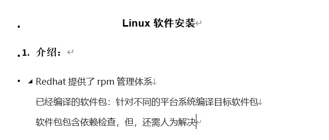
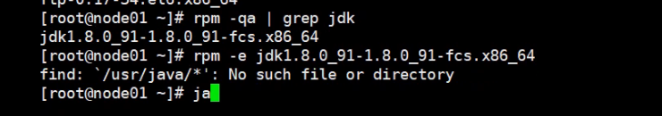

31-Linux软件安装与卸载





2、命令

(1)   rpm安装： 

①    -ivh filename

②    --prefix 

(2) rpm卸载： 

①    -e PACKAGE_NAME

(3)    其他选项：

①   rpm -qa : 查询已经安装的所有包

②   rpm -q PACKAGE_NAME: 查询指定的包是否已经安装

③   rpm -qi PACKAGE_NAME: 查询指定包的说明信息

④   rpm -ql PACKAGE_NAME: 查询指定包安装后生成的文件列表

⑤   rpm -qc PACEAGE_NEME：查询指定包安装的配置文件

⑥   rpm -qd PACKAGE_NAME: 查询指定包安装的帮助文件

⑦   rpm -q --scripts PACKAGE_NAME: 查询指定包中包含的脚本 

⑧   rpm -qf /path/to/somefile: 查询文件是由哪个rpm包安装生成的

 


Linux软件安装的方式

* 源码，编译安装
* 安装包，下一步，下一步安装


Redhat rpm  小红帽的包管理者 


```shell
[root@node0924 ~]# pwd
/root
[root@node0924 ~]# java -version
-bash: java: command not found
[root@node0924 ~]# rpm -qa
mysql-community-release-el6-5.noarch
basesystem-10.0-4.el6.noarch
mysql-community-client-5.7.31-1.el6.x86_64
setup-2.8.14-23.el6.noarch
tzdata-2020a-1.el6.noarch
info-4.13a-8.el6.x86_64
nspr-4.21.0-1.el6_10.x86_64
libselinux-2.0.94-7.el6.x86_64
db4-4.7.25-22.el6.x86_64
sed-4.2.1-10.el6.x86_64
libuuid-2.17.2-12.28.el6_9.2.x86_64
dbus-libs-1.2.24-11.el6_10.x86_64
libgpg-error-1.7-4.el6.x86_64
libselinux-utils-2.0.94-7.el6.x86_64
tcp_wrappers-libs-7.6-58.el6.x86_64
libidn-1.18-2.el6.x86_64
libstdc++-4.4.7-23.el6.x86_64
expat-2.0.1-13.el6_8.x86_64
checkpolicy-2.0.22-1.el6.x86_64
gmp-4.3.1-13.el6.x86_64
pth-2.0.7-9.3.el6.x86_64
grubby-7.0.15-7.el6.x86_64
e2fsprogs-libs-1.41.12-24.el6.x86_64
procps-3.2.8-45.el6_9.3.x86_64
coreutils-libs-8.4-47.el6.x86_64
shadow-utils-4.1.5.1-5.el6.x86_64
logrotate-3.7.8-28.el6.x86_64
nss-sysinit-3.44.0-7.el6_10.x86_64
krb5-libs-1.10.3-65.el6.x86_64
rpm-libs-4.8.0-59.el6.x86_64
cracklib-dicts-2.8.16-4.el6.x86_64
libuser-0.56.13-8.el6_7.x86_64
gdbm-1.8.0-39.el6.x86_64
python-pycurl-7.19.0-9.el6.x86_64
newt-python-0.52.11-4.el6.x86_64
iptables-1.4.7-19.el6.x86_64
util-linux-ng-2.17.2-12.28.el6_9.2.x86_64
device-mapper-libs-1.02.117-12.el6_9.1.x86_64
device-mapper-event-1.02.117-12.el6_9.1.x86_64
libcap-ng-0.6.4-3.el6_0.1.x86_64
device-mapper-multipath-libs-0.4.9-106.el6_10.1.x86_64
kernel-2.6.32-754.33.1.el6.x86_64
python-iniparse-0.3.1-2.1.el6.noarch
selinux-policy-targeted-3.7.19-312.el6.noarch
ustr-1.0.4-9.1.el6.x86_64
openssh-clients-5.3p1-124.el6_10.x86_64
gamin-0.1.10-9.el6.x86_64
dhclient-4.1.1-63.P1.el6.centos.x86_64
efibootmgr-0.5.4-15.el6.x86_64
dbus-glib-0.86-6.el6.x86_64
passwd-0.77-7.el6.x86_64
e2fsprogs-1.41.12-24.el6.x86_64
cloog-ppl-0.15.7-1.2.el6.x86_64
mpfr-2.4.1-6.el6.x86_64
perl-Error-0.17015-4.el6.noarch
autoconf-2.63-5.1.el6.noarch
ntpdate-4.2.6p5-15.el6.centos.x86_64
bridge-utils-1.2-10.el6.x86_64
xz-4.999.9-0.5.beta.20091007git.el6.x86_64
glib2-2.28.8-10.el6.x86_64
libpng-1.2.49-2.el6_7.x86_64
hicolor-icon-theme-0.11-1.1.el6.noarch
perl-Module-Pluggable-3.90-144.el6.x86_64
perl-5.10.1-144.el6.x86_64
vim-common-7.4.629-5.el6_10.2.x86_64
libXext-1.3.3-1.el6.x86_64
libXcursor-1.1.14-2.1.el6.x86_64
libXft-2.3.2-1.el6.x86_64
gnutls-2.12.23-22.el6.x86_64
cairo-1.8.8-6.el6_6.x86_64
vim-enhanced-7.4.629-5.el6_10.2.x86_64
wget-1.12-10.el6.x86_64
filesystem-2.4.30-3.el6.x86_64
gpg-pubkey-5072e1f5-4e773e2a
mysql-community-libs-5.7.31-1.el6.x86_64
numactl-2.0.9-2.el6.x86_64
libgcc-4.4.7-23.el6.x86_64
dhcp-common-4.1.1-63.P1.el6.centos.x86_64
libattr-2.4.44-7.el6.x86_64
ncurses-base-5.7-4.20090207.el6.x86_64
zlib-1.2.3-29.el6.x86_64
glibc-common-2.12-1.212.el6_10.3.x86_64
popt-1.13-7.el6.x86_64
glibc-2.12-1.212.el6_10.3.x86_64
ncurses-libs-5.7-4.20090207.el6.x86_64
nss-util-3.44.0-1.el6_10.x86_64
chkconfig-1.3.49.5-1.el6.x86_64
readline-6.0-4.el6.x86_64
audit-libs-2.4.5-6.el6.x86_64
libacl-2.2.49-7.el6_9.1.x86_64
libudev-147-2.74.el6_10.x86_64
libblkid-2.17.2-12.28.el6_9.2.x86_64
libsemanage-2.0.43-5.1.el6.x86_64
elfutils-libelf-0.164-2.el6.x86_64
findutils-4.4.2-9.el6.x86_64
cpio-2.10-13.el6.x86_64
lua-5.1.4-4.1.el6.x86_64
p11-kit-0.18.5-2.el6_5.2.x86_64
sysvinit-tools-2.87-6.dsf.el6.x86_64
nss-softokn-3.44.0-6.el6_10.x86_64
pcre-7.8-7.el6.x86_64
bzip2-1.0.5-7.el6_0.x86_64
libgcrypt-1.4.5-12.el6_8.x86_64
device-mapper-persistent-data-0.6.2-0.2.rc7.el6.x86_64
less-436-13.el6.x86_64
libnih-1.0.1-8.el6.x86_64
file-5.04-30.el6.x86_64
tar-1.23-15.el6_8.x86_64
libss-1.41.12-24.el6.x86_64
pinentry-0.7.6-8.el6.x86_64
net-tools-1.60-114.el6.x86_64
binutils-2.20.51.0.2-5.48.el6_10.1.x86_64
libusb-0.1.12-23.el6.x86_64
ncurses-5.7-4.20090207.el6.x86_64
libutempter-1.1.5-4.1.el6.x86_64
coreutils-8.4-47.el6.x86_64
module-init-tools-3.9-26.el6.x86_64
hwdata-0.233-20.1.el6.noarch
libpciaccess-0.13.4-1.el6.x86_64
gzip-1.3.12-24.el6.x86_64
nss-3.44.0-7.el6_10.x86_64
diffutils-2.8.1-28.el6.x86_64
nss-tools-3.44.0-7.el6_10.x86_64
dash-0.5.5.1-4.el6.x86_64
keyutils-libs-1.4-5.el6.x86_64
groff-1.18.1.4-21.el6.x86_64
openssl-1.0.1e-58.el6_10.x86_64
libcurl-7.19.7-54.el6_10.x86_64
cracklib-2.8.16-4.el6.x86_64
curl-7.19.7-54.el6_10.x86_64
openldap-2.4.40-16.el6.x86_64
ethtool-3.5-6.el6.x86_64
redhat-logos-60.0.14-12.el6.centos.noarch
plymouth-core-libs-0.8.3-29.el6.centos.x86_64
python-2.6.6-68.el6_10.x86_64
rpm-python-4.8.0-59.el6.x86_64
python-urlgrabber-3.9.1-11.el6.noarch
libedit-2.11-4.20080712cvs.1.el6.x86_64
yum-3.2.29-81.el6.centos.0.1.noarch
mingetty-1.08-5.el6.x86_64
pciutils-libs-3.1.10-4.el6.x86_64
libdrm-2.4.65-2.el6.x86_64
iproute-2.6.32-57.el6.x86_64
plymouth-0.8.3-29.el6.centos.x86_64
initscripts-9.03.61-1.el6.centos.x86_64
policycoreutils-2.0.83-30.1.el6_8.x86_64
fipscheck-1.2.0-7.el6.x86_64
device-mapper-1.02.117-12.el6_9.1.x86_64
openssh-5.3p1-124.el6_10.x86_64
lvm2-libs-2.02.143-12.el6_9.1.x86_64
libffi-3.0.5-3.2.el6.x86_64
kpartx-0.4.9-106.el6_10.1.x86_64
selinux-policy-3.7.19-312.el6.noarch
dracut-kernel-004-411.el6.noarch
iptables-ipv6-1.4.7-19.el6.x86_64
slang-2.2.1-1.el6.x86_64
fuse-2.8.3-5.el6.x86_64
pkgconfig-0.23-9.1.el6.x86_64
yum-metadata-parser-1.1.2-16.el6.x86_64
ppl-0.10.2-11.el6.x86_64

^C^C^C
[root@node0924 ~]# 

```

`pwd`  查看当前目录

`java -version` 查看java版本号

`rpm -qa` 查询已经安装的所有包


```shell
[root@node0924 ~]# rpm -qa | grep jdk
[root@node0924 ~]# 
[root@node0924 ~]# rpm -qa | grep mysql
mysql-community-release-el6-5.noarch
mysql-community-client-5.7.31-1.el6.x86_64
mysql-community-libs-5.7.31-1.el6.x86_64
mysql-community-common-5.7.31-1.el6.x86_64
mysql-community-server-5.7.31-1.el6.x86_64
[root@node0924 ~]# 

```

`rpm -qa | grep jdk`  使用管道，查看jdk，我没有安装jdk

`rpm -qa | grep mysql` 使用管道，查看mysql。




```shell
# 查看jdk
rpm -qa | grep jdk
# 删除安装的包
rpm -e jdk1.8.0_91-1.8.0_91-fcs.x86_64
```


```shell
[root@node0924 ~]# cd /opt/
[root@node0924 opt]# ll
total 4
drwxr-xr-x. 3 root root 4096 Sep 27 00:44 maofachang
[root@node0924 opt]# mkdir software
[root@node0924 opt]# ll
total 8
drwxr-xr-x. 3 root root 4096 Sep 27 00:44 maofachang
drwxr-xr-x. 2 root root 4096 Nov 18 22:57 software
[root@node0924 opt]# cd software
[root@node0924 software]# mkdir jdk
[root@node0924 software]# ll
total 4
drwxr-xr-x. 2 root root 4096 Nov 18 22:57 jdk
[root@node0924 software]# cd jdk
[root@node0924 jdk]# pwd
/opt/software/jdk
[root@node0924 jdk]# 

```

`cd /opt/`  且换opt目录，创建software文件夹，在创建jdk文件夹

用Xftp，下载好文件传输到linux。


```shell
[root@node0924 jdk]# ll
total 250140
-rw-r--r--. 1 root root 112994496 Nov 18 23:05 jdk-8u271-linux-x64.rpm
-rw-r--r--. 1 root root 143142634 Nov 18 23:05 jdk-8u271-linux-x64.tar.gz
[root@node0924 jdk]# 

```


```shell
[root@node0924 jdk]# ls
jdk-8u271-linux-x64.rpm  jdk-8u271-linux-x64.tar.gz
[root@node0924 jdk]# rpm -ivh --prefix /usr/mfc jdk-8u271-linux-x64.rpm
warning: jdk-8u271-linux-x64.rpm: Header V3 RSA/SHA256 Signature, key ID ec551f03: NOKEY
Preparing...                ########################################### [100%]
   1:jdk1.8                 ########################################### [100%]
Unpacking JAR files...
	tools.jar...
	plugin.jar...
	javaws.jar...
	deploy.jar...
	rt.jar...
	jsse.jar...
	charsets.jar...
	localedata.jar...
ln: creating symbolic link `/usr/java/jdk1.8.0_271-amd64': No such file or directory
[root@node0924 jdk]# 

```


`rpm -ivh --prefix /usr/mfc jdk-8u271-linux-x64.rpm` 安装jdk，指定安装目录

`--prefix /usr/mfc` 指定安装目录


```shell
[root@node0924 jdk]# ls
jdk-8u271-linux-x64.rpm  jdk-8u271-linux-x64.tar.gz
[root@node0924 jdk]# java -version
java version "1.8.0_271"
Java(TM) SE Runtime Environment (build 1.8.0_271-b09)
Java HotSpot(TM) 64-Bit Server VM (build 25.271-b09, mixed mode)
[root@node0924 jdk]# 

```

`java -version` 查看java版本


```shell
[root@node0924 jdk]# echo $PATH
/usr/local/sbin:/usr/local/bin:/sbin:/bin:/usr/sbin:/usr/bin:/opt/maofachang/redis5/bin:/root/bin
[root@node0924 jdk]# cd /usr/bin
[root@node0924 bin]# ls
[                            glib-compile-schemas        modutil                    setarch
a2p                          glookbib                    myisamchk                  setfacl
aclocal                      gmake                       myisam_ftdump              setfattr
aclocal-1.11                 gneqn                       myisamlog                  setkeycodes
addftinfo                    gnroff                      myisampack                 setleds
addr2line                    gpasswd                     my_print_defaults          setmetamode
appletviewer                 gpg                         mysql                      setsid
apropos                      gpg2                        mysqladmin                 setterm
ar                           gpg-agent                   mysqlbinlog                setup-nsssysinit.sh
as                           gpgconf                     mysqlcheck                 sftp
attr                         gpg-connect-agent           mysql_config_editor        sg
aulast                       gpg-error                   mysqld_multi               sha1sum
aulastlog                    gpgkey2ssh                  mysqld_safe                sha224sum
ausyscall                    gpgparsemail                mysqldump                  sha256sum
autoconf                     gpgsplit                    mysqldumpslow              sha384sum
autoconf268                  gpgv                        mysqlimport                sha512sum
autoheader                   gpgv2                       mysql_install_db           showconsolefont
autoheader268                gpg-zip                     mysql_plugin               showkey
autom4te                     gpic                        mysqlpump                  shred
autom4te268                  gprof                       mysql_secure_installation  shuf
automake                     grefer                      mysqlshow                  signtool
automake-1.11                grn                         mysqlslap                  signver
autoreconf                   grodvi                      mysql_ssl_rsa_setup        size
autoreconf268                groff                       mysql_tzinfo_to_sql        skill
autoscan                     groffer                     mysql_upgrade              slabtop
autoscan268                  grog                        namei                      slogin
autoupdate                   grolbp                      native2ascii               snice
autoupdate268                grolj4                      neqn                       soelim
auvirt                       grops                       newgrp                     splain
awk                          grotty                      nl                         split
base64                       groups                      nm                         sprof
bashbug-64                   gsoelim                     nohup                      sqlite3
berkeley_db_svc              gtbl                        nproc                      ssh
bmp2tiff                     gtk-query-immodules-2.0-64  nroff                      ssh-add
bunzip2                      gtk-update-icon-cache       nsenter                    ssh-agent
bzcat                        gtroff                      nss-policy-check           ssh-copy-id
bzcmp                        gunzip                      numactl                    ssh-keygen
bzdiff                       gview                       numademo                   ssh-keyscan
bzgrep                       gvim                        numastat                   ssltap
bzip2                        gvimdiff                    nutcracker                 stat
bzip2recover                 gvimtutor                   objcopy                    stdbuf
bzless                       gzexe                       objdump                    strings
bzmore                       gzip                        od                         strip
c2ph                         h2ph                        oldfind                    sudo
c89                          head                        open                       sudoedit
c99                          hexdump                     openssl                    sudoreplay
cal                          hostid                      openvt                     sum
ca-legacy                    hpftodit                    orbd                       tabs
captoinfo                    i386                        p11-kit                    tac
catchsegv                    iconv                       pack200                    tail
cc                           id                          pal2rgb                    tailf
certutil                     idlj                        pango-querymodules-64      tbl
c++filt                      idn                         pango-view                 tee
chacl                        ifnames                     passwd                     test
chage                        ifnames268                  paste                      tfmtodit
chattr                       igawk                       pathchk                    thumbnail
chcon                        indxbib                     pcregrep                   tic
checkmodule                  info                        pcretest                   tiff2bw
checkpolicy                  infocmp                     peekfd                     tiff2pdf
chfn                         infokey                     perl                       tiff2ps
chrt                         infotocap                   perl5.10.1                 tiff2rgba
chsh                         innochecksum                perlbug                    tiffcmp
chvt                         install                     perldoc                    tiffcp
cjpeg                        ionice                      perlthanks                 tiffcrop
cksum                        ipcmk                       perror                     tiffdither
clear                        ipcrm                       pfbtops                    tiffdump
cloog                        ipcs                        pgawk                      tiffinfo
cmp                          isosize                     pgrep                      tiffmedian
cmsutil                      jar                         pic                        tiffset
col                          jarsigner                   pic2graph                  tiffsplit
colcrt                       java                        piconv                     timeout
colrm                        javac                       pinentry                   tload
column                       javadoc                     pinentry-curses            tnameserv
comm                         javafxpackager              pinky                      toe
ControlPanel                 javah                       pk12util                   top
cpp                          javap                       pkg-config                 tput
crlutil                      javapackager                pkill                      tr
csplit                       java-rmi.cgi                pl2pm                      troff
curl                         javaws                      plymouth                   truncate
cut                          jcmd                        pmap                       tset
db_archive                   jconsole                    pod2html                   tsort
db_checkpoint                jcontrol                    pod2latex                  tty
db_codegen                   jdb                         pod2man                    tzselect
db_deadlock                  jdeps                       pod2text                   ul
db_dump                      jhat                        pod2usage                  ulockmgr_server
db_dump185                   jinfo                       podchecker                 unexpand
db_hotbackup                 jjs                         podselect                  uniq
db_load                      jmap                        policytool                 unlzma
db_printlog                  join                        post-grohtml               unpack200
db_recover                   jpegtran                    ppl-config                 unprotoize
db_stat                      jps                         ppm2tiff                   unshare
db_upgrade                   jrunscript                  pr                         unxz
dbus-binding-tool            jsadebugd                   pre-grohtml                update-ca-trust
db_verify                    jstack                      printenv                   update-gdk-pixbuf-loaders
ddate                        jstat                       printf                     update-gio-modules
deallocvt                    jstatd                      protoize                   update-gtk-immodules
diff                         jvisualvm                   psed                       update-mime-database
diff3                        kbdrate                     psfaddtable                uptime
dir                          keytool                     psfgettable                urlgrabber
dircolors                    kill                        psfstriptable              users
dirname                      killall                     psfxtable                  utmpdump
djpeg                        last                        pstree                     uuidgen
dprofpp                      lastb                       pstree.x11                 vdir
du                           lastlog                     pstruct                    vim
env                          lchfn                       ptx                        vimdiff
eqn                          lchsh                       pwdx                       vimtutor
eqn2graph                    ld                          pydoc                      vimx
evim                         ldd                         python                     vmstat
expand                       less                        python2                    w
expr                         lessecho                    python2.6                  wall
extcheck                     lesskey                     ranlib                     watch
factor                       lesspipe.sh                 ras2tiff                   watchgnupg
fallocate                    libtool                     raw2tiff                   wc
fax2ps                       libtoolize                  rdjpgcom                   wget
fax2tiff                     linux32                     readelf                    whatis
fc-cache                     linux64                     readlink                   whereis
fc-cat                       lkbib                       refer                      which
fc-list                      loadunimap                  rename                     whiptail
fc-match                     locale                      renice                     who
fc-query                     localedef                   replace                    whoami
fc-scan                      logger                      reset                      write
fgconsole                    logname                     resizecons                 wrjpgcom
file                         look                        resolveip                  wsgen
find                         lookbib                     resolve_stack_dump         wsimport
find2perl                    lsattr                      rev                        x86_64
fipscheck                    lscpu                       rgb2ycbcr                  x86_64-redhat-linux-gcc
fipshmac                     lslogins                    rhgb-client                xargs
flock                        lua                         rmic                       xjc
floppy                       luac                        rmid                       xmlcatalog
fmt                          lz4_decompress              rmiregistry                xmllint
fold                         lzcat                       rpcgen                     xmlwf
free                         lzcmp                       rpm2cpio                   xxd
fusermount                   lzdiff                      rpmdb                      xz
gawk                         lzegrep                     rpmquery                   xzcat
gcc                          lzfgrep                     rpmsign                    xzcmp
gcov                         lzgrep                      rpmverify                  xzdec
gdbus                        lzless                      rsync                      xzdiff
gdk-pixbuf-query-loaders-64  lzma                        runcon                     xzegrep
gencat                       lzmadec                     rvim                       xzfgrep
geqn                         lzmainfo                    s2p                        xzgrep
getconf                      lzmore                      schemagen                  xzless
getent                       m4                          scp                        xzmore
getfacl                      make                        script                     yes
getfattr                     man                         scriptreplay               yum
getkeycodes                  man2html                    sdiff                      zcmp
getopt                       manpath                     secon                      zdiff
gex                          mapscrn                     sedismod                   zegrep
gif2tiff                     mbchk                       sedispol                   zfgrep
gindxbib                     mcookie                     semodule_deps              zforce
gio-querymodules-64          md5sum                      semodule_expand            zgrep
git                          memhog                      semodule_link              zless
git-receive-pack             mesg                        semodule_package           zlib_decompress
git-shell                    migratepages                seq                        zmore
git-upload-archive           migspeed                    serialver                  znew
git-upload-pack              mkfifo                      servertool                 zsoelim
[root@node0924 bin]# ll
total 264340
-rwxr-xr-x.   1 root root      33408 Jun 19  2018 [
-rwxr-xr-x.   1 root root     106792 Mar 22  2017 a2p
-rwxr-xr-x.   2 root root      31181 Feb 22  2013 aclocal
-rwxr-xr-x.   2 root root      31181 Feb 22  2013 aclocal-1.11
-rwxr-xr-x.   1 root root      23488 Nov 12  2010 addftinfo
-rwxr-xr-x.   1 root root      24936 Feb 26  2019 addr2line
lrwxrwxrwx.   1 root root         30 Nov 18 23:23 appletviewer -> /etc/alternatives/appletviewer
-rwxr-xr-x.   1 root root       1786 Mar 22  2017 apropos
-rwxr-xr-x.   1 root root      56624 Feb 26  2019 ar
-rwxr-xr-x.   1 root root     328392 Feb 26  2019 as
-rwxr-xr-x.   1 root root      10400 Sep 24  2011 attr
-rwxr-xr-x.   1 root root      15112 Mar 22  2017 aulast
-rwxr-xr-x.   1 root root       9104 Mar 22  2017 aulastlog
-rwxr-xr-x.   1 root root       7632 Mar 22  2017 ausyscall
-rwxr-xr-x.   1 root root      14631 Nov 11  2010 autoconf
-rwxr-xr-x.   1 root root      14657 Mar 12  2015 autoconf268
-rwxr-xr-x.   1 root root       8484 Nov 11  2010 autoheader
-rwxr-xr-x.   1 root root       8625 Mar 12  2015 autoheader268
-rwxr-xr-x.   1 root root      31789 Nov 11  2010 autom4te
-rwxr-xr-x.   1 root root      32240 Mar 12  2015 autom4te268
-rwxr-xr-x.   2 root root     257062 Feb 22  2013 automake
-rwxr-xr-x.   2 root root     257062 Feb 22  2013 automake-1.11
-rwxr-xr-x.   1 root root      20233 Nov 11  2010 autoreconf
-rwxr-xr-x.   1 root root      21150 Mar 12  2015 autoreconf268
-rwxr-xr-x.   1 root root      17065 Nov 11  2010 autoscan
-rwxr-xr-x.   1 root root      17214 Mar 12  2015 autoscan268
-rwxr-xr-x.   1 root root      33766 Nov 11  2010 autoupdate
-rwxr-xr-x.   1 root root      33962 Mar 12  2015 autoupdate268
-rwxr-xr-x.   1 root root      29792 Mar 22  2017 auvirt
lrwxrwxrwx.   1 root root         14 Sep 26 19:27 awk -> ../../bin/gawk
-rwxr-xr-x.   1 root root      29240 Jun 19  2018 base64
-rwxr-xr-x.   1 root root       6932 Mar 23  2017 bashbug-64
-rwxr-xr-x.   1 root root      66176 Mar 22  2017 berkeley_db_svc
-rwxr-xr-x.   1 root root      13944 Feb  1  2017 bmp2tiff
lrwxrwxrwx.   1 root root          5 Sep 25 07:49 bunzip2 -> bzip2
lrwxrwxrwx.   1 root root          5 Sep 25 07:49 bzcat -> bzip2
lrwxrwxrwx.   1 root root          6 Sep 25 07:49 bzcmp -> bzdiff
-rwxr-xr-x.   1 root root       2128 Jun 25  2011 bzdiff
-rwxr-xr-x.   1 root root       1677 Jun 25  2011 bzgrep
-rwxr-xr-x.   1 root root      32936 Jun 25  2011 bzip2
-rwxr-xr-x.   1 root root      10872 Jun 25  2011 bzip2recover
lrwxrwxrwx.   1 root root          6 Sep 25 07:49 bzless -> bzmore
-rwxr-xr-x.   1 root root       1259 Jun 25  2011 bzmore
-rwxr-xr-x.   2 root root      36601 Mar 22  2017 c2ph
-rwxr-xr-x.   1 root root        224 Jun 19  2018 c89
-rwxr-xr-x.   1 root root        215 Jun 19  2018 c99
-rwxr-xr-x.   1 root root      16784 Jan 26  2018 cal
-rwxr-xr-x.   1 root root       1644 Jul 23 06:38 ca-legacy
lrwxrwxrwx.   1 root root          3 Sep 26 19:28 captoinfo -> tic
-rwxr-xr-x.   1 root root       3384 Apr 10  2019 catchsegv
lrwxrwxrwx.   1 root root          3 Sep 26 23:49 cc -> gcc
-rwxr-xr-x.   1 root root     176808 Nov  1  2019 certutil
-rwxr-xr-x.   1 root root      23560 Feb 26  2019 c++filt
-rwxr-xr-x.   1 root root      14592 Aug 23  2017 chacl
-rwsr-xr-x.   1 root root      70480 May 11  2016 chage
-rwxr-xr-x.   1 root root      10456 Jun 19  2018 chattr
-rwxr-xr-x.   1 root root      57144 Jun 19  2018 chcon
-rwxr-xr-x.   1 root root     276992 Nov 11  2010 checkmodule
-rwxr-xr-x.   1 root root     285152 Nov 11  2010 checkpolicy
-rws--x--x.   1 root root      20184 Jan 26  2018 chfn
-rwxr-xr-x.   1 root root       9624 Jan 26  2018 chrt
-rws--x--x.   1 root root      20056 Jan 26  2018 chsh
-rwxr-xr-x.   1 root root       6744 Nov 12  2010 chvt
-rwxr-xr-x.   1 root root      28776 Dec 10  2013 cjpeg
-rwxr-xr-x.   1 root root      25272 Jun 19  2018 cksum
-rwxr-xr-x.   1 root root       4976 Mar 16  2015 clear
-rwxr-xr-x.   1 root root       7808 Nov 11  2010 cloog
-rwxr-xr-x.   1 root root      19248 Nov 11  2010 cmp
-rwxr-xr-x.   1 root root     106264 Nov  1  2019 cmsutil
-rwxr-xr-x.   1 root root      10904 Jan 26  2018 col
-rwxr-xr-x.   1 root root       7920 Jan 26  2018 colcrt
-rwxr-xr-x.   1 root root       5576 Jan 26  2018 colrm
-rwxr-xr-x.   1 root root       9744 Jan 26  2018 column
-rwxr-xr-x.   1 root root      28456 Jun 19  2018 comm
lrwxrwxrwx.   1 root root         30 Nov 18 23:23 ControlPanel -> /etc/alternatives/ControlPanel
-rwxr-xr-x.   1 root root     267912 Jun 19  2018 cpp
-rwxr-xr-x.   1 root root     118392 Nov  1  2019 crlutil
-rwxr-xr-x.   1 root root     106168 Jun 19  2018 csplit
-rwxr-xr-x.   1 root root     120224 Dec 23  2019 curl
lrwxrwxrwx.   1 root root         13 Sep 26 19:28 cut -> ../../bin/cut
-rwxr-xr-x.   1 root root       8240 Mar 22  2017 db_archive
-rwxr-xr-x.   1 root root      10192 Mar 22  2017 db_checkpoint
-rwxr-xr-x.   1 root root      22224 Mar 22  2017 db_codegen
-rwxr-xr-x.   1 root root      11024 Mar 22  2017 db_deadlock
-rwxr-xr-x.   1 root root      12272 Mar 22  2017 db_dump
-rwxr-xr-x.   1 root root      61744 Mar 22  2017 db_dump185
-rwxr-xr-x.   1 root root      17304 Mar 22  2017 db_hotbackup
-rwxr-xr-x.   1 root root      23368 Mar 22  2017 db_load
-rwxr-xr-x.   1 root root      65776 Mar 22  2017 db_printlog
-rwxr-xr-x.   1 root root       9864 Mar 22  2017 db_recover
-rwxr-xr-x.   1 root root      11008 Mar 22  2017 db_stat
-rwxr-xr-x.   1 root root       8760 Mar 22  2017 db_upgrade
-rwxr-xr-x.   1 root root      83304 Feb 27  2013 dbus-binding-tool
-rwxr-xr-x.   1 root root       9360 Mar 22  2017 db_verify
-rwxr-xr-x.   1 root root      11448 Jan 26  2018 ddate
-rwxr-xr-x.   1 root root       7192 Nov 12  2010 deallocvt
-rwxr-xr-x.   1 root root      81080 Nov 11  2010 diff
-rwxr-xr-x.   1 root root      23480 Nov 11  2010 diff3
-rwxr-xr-x.   1 root root     109208 Jun 19  2018 dir
-rwxr-xr-x.   1 root root      32872 Jun 19  2018 dircolors
-rwxr-xr-x.   1 root root      23720 Jun 19  2018 dirname
-rwxr-xr-x.   1 root root      29112 Dec 10  2013 djpeg
-rwxr-xr-x.   1 root root      24089 Mar 22  2017 dprofpp
-rwxr-xr-x.   1 root root      95448 Jun 19  2018 du
lrwxrwxrwx.   1 root root         13 Sep 26 19:28 env -> ../../bin/env
-rwxr-xr-x.   1 root root     137328 Nov 12  2010 eqn
-rwxr-xr-x.   1 root root       2242 Nov 12  2010 eqn2graph
lrwxrwxrwx.   1 root root          4 Sep 26 00:15 evim -> gvim
-rwxr-xr-x.   1 root root      27960 Jun 19  2018 expand
-rwxr-xr-x.   1 root root      97688 Jun 19  2018 expr
lrwxrwxrwx.   1 root root         26 Nov 18 23:23 extcheck -> /etc/alternatives/extcheck
-rwxr-xr-x.   1 root root      44696 Jun 19  2018 factor
-rwxr-xr-x.   1 root root       8040 Jan 26  2018 fallocate
-rwxr-xr-x.   1 root root      15328 Feb  1  2017 fax2ps
-rwxr-xr-x.   1 root root      14128 Feb  1  2017 fax2tiff
-rwxr-xr-x.   1 root root      13000 May 27  2014 fc-cache
-rwxr-xr-x.   1 root root      11136 May 27  2014 fc-cat
-rwxr-xr-x.   1 root root       8840 May 27  2014 fc-list
-rwxr-xr-x.   1 root root       9992 May 27  2014 fc-match
-rwxr-xr-x.   1 root root       7568 May 27  2014 fc-query
-rwxr-xr-x.   1 root root       7872 May 27  2014 fc-scan
-rwxr-xr-x.   1 root root       7312 Nov 12  2010 fgconsole
-rwxr-xr-x.   1 root root      15680 May 11  2016 file
lrwxrwxrwx.   1 root root         14 Sep 26 19:27 find -> ../../bin/find
-rwxr-xr-x.   1 root root      23614 Mar 22  2017 find2perl
-rwxr-xr-x.   1 root root      10512 Dec  8  2011 fipscheck
-rwxr-xr-x.   1 root root      10480 Dec  8  2011 fipshmac
-rwxr-xr-x.   1 root root      10928 Jan 26  2018 flock
-rwxr-xr-x.   1 root root      23616 Jan 26  2018 floppy
-rwxr-xr-x.   1 root root      30264 Jun 19  2018 fmt
-rwxr-xr-x.   1 root root      28024 Jun 19  2018 fold
-rwxr-xr-x.   1 root root       9696 Jun  1  2018 free
lrwxrwxrwx.   1 root root         15 Sep 26 19:28 fusermount -> /bin/fusermount
lrwxrwxrwx.   1 root root         14 Sep 26 19:27 gawk -> ../../bin/gawk
-rwxr-xr-x.   2 root root     264504 Jun 19  2018 gcc
-rwxr-xr-x.   1 root root      39848 Jun 19  2018 gcov
-rwxr-xr-x.   1 root root      30032 Jun 19  2018 gdbus
-rwxr-xr-x.   1 root root       9472 Aug 31  2015 gdk-pixbuf-query-loaders-64
-rwxr-xr-x.   1 root root      23048 Apr 10  2019 gencat
lrwxrwxrwx.   1 root root          3 Sep 25 07:49 geqn -> eqn
-rwxr-xr-x.   1 root root      22808 Apr 10  2019 getconf
-rwxr-xr-x.   1 root root      27776 Apr 10  2019 getent
-rwxr-xr-x.   1 root root      23584 Aug 23  2017 getfacl
-rwxr-xr-x.   1 root root      19296 Sep 24  2011 getfattr
-rwxr-xr-x.   1 root root       7464 Nov 12  2010 getkeycodes
-rwxr-xr-x.   1 root root      12040 Jan 26  2018 getopt
lrwxrwxrwx.   1 root root          4 Sep 26 00:15 gex -> gvim
-rwxr-xr-x.   1 root root      15256 Feb  1  2017 gif2tiff
lrwxrwxrwx.   1 root root          7 Sep 25 07:49 gindxbib -> indxbib
-rwxr-xr-x.   1 root root       7536 Jun 19  2018 gio-querymodules-64
-rwxr-xr-x. 105 root root    1138048 Feb  4  2020 git
-rwxr-xr-x.   1 root root    1138056 Feb  4  2020 git-receive-pack
-rwxr-xr-x.   1 root root     457496 Feb  4  2020 git-shell
-rwxr-xr-x.   1 root root    1138056 Feb  4  2020 git-upload-archive
-rwxr-xr-x.   1 root root     467792 Feb  4  2020 git-upload-pack
-rwxr-xr-x.   1 root root      38496 Jun 19  2018 glib-compile-schemas
lrwxrwxrwx.   1 root root          7 Sep 25 07:49 glookbib -> lookbib
lrwxrwxrwx.   1 root root          4 Sep 26 19:28 gmake -> make
lrwxrwxrwx.   1 root root          4 Sep 25 07:49 gneqn -> neqn
lrwxrwxrwx.   1 root root          5 Sep 25 07:49 gnroff -> nroff
-rwsr-xr-x.   1 root root      75640 May 11  2016 gpasswd
lrwxrwxrwx.   1 root root          4 Sep 26 19:29 gpg -> gpg2
-rwxr-xr-x.   1 root root     761688 Jul 13  2018 gpg2
-rwxr-xr-x.   1 root root     297976 Jul 13  2018 gpg-agent
-rwxr-xr-x.   1 root root     131352 Jul 13  2018 gpgconf
-rwxr-xr-x.   1 root root     171224 Jul 13  2018 gpg-connect-agent
-rwxr-xr-x.   1 root root      18576 Dec  8  2011 gpg-error
-rwxr-xr-x.   1 root root      35888 Jul 13  2018 gpgkey2ssh
-rwxr-xr-x.   1 root root      23352 Jul 13  2018 gpgparsemail
-rwxr-xr-x.   1 root root      48536 Jul 13  2018 gpgsplit
lrwxrwxrwx.   1 root root          5 Sep 26 19:29 gpgv -> gpgv2
-rwxr-xr-x.   1 root root     336480 Jul 13  2018 gpgv2
-rwxr-xr-x.   1 root root       3303 Jul 13  2018 gpg-zip
lrwxrwxrwx.   1 root root          3 Sep 25 07:49 gpic -> pic
-rwxr-xr-x.   1 root root      94960 Feb 26  2019 gprof
lrwxrwxrwx.   1 root root          5 Sep 25 07:49 grefer -> refer
-rwxr-xr-x.   1 root root      65408 Nov 12  2010 grn
-rwxr-xr-x.   1 root root      81400 Nov 12  2010 grodvi
-rwxr-xr-x.   1 root root      65424 Nov 12  2010 groff
-rwxr-xr-x.   1 root root       7777 Nov 12  2010 groffer
-rwxr-xr-x.   1 root root       2472 Nov 12  2010 grog
-rwxr-xr-x.   1 root root      87960 Nov 12  2010 grolbp
-rwxr-xr-x.   1 root root      77464 Nov 12  2010 grolj4
-rwxr-xr-x.   1 root root     117008 Nov 12  2010 grops
-rwxr-xr-x.   1 root root      77304 Nov 12  2010 grotty
-rwxr-xr-x.   1 root root      24408 Jun 19  2018 groups
lrwxrwxrwx.   1 root root          6 Sep 25 07:49 gsoelim -> soelim
lrwxrwxrwx.   1 root root          3 Sep 25 07:49 gtbl -> tbl
-rwxr-xr-x.   1 root root      11432 Mar 22  2017 gtk-query-immodules-2.0-64
-rwxr-xr-x.   1 root root      28368 Mar 22  2017 gtk-update-icon-cache
lrwxrwxrwx.   1 root root          5 Sep 25 07:49 gtroff -> troff
lrwxrwxrwx.   1 root root         16 Sep 26 19:28 gunzip -> ../../bin/gunzip
lrwxrwxrwx.   1 root root          4 Sep 26 00:15 gview -> gvim
-rwxr-xr-x.   1 root root    2585624 Jul 17  2019 gvim
lrwxrwxrwx.   1 root root          4 Sep 26 00:15 gvimdiff -> gvim
-rwxr-xr-x.   1 root root        143 Jul 17  2019 gvimtutor
-rwxr-xr-x.   1 root root       5864 Mar 22  2017 gzexe
lrwxrwxrwx.   1 root root         14 Sep 26 19:28 gzip -> ../../bin/gzip
-rwxr-xr-x.   1 root root      28036 Mar 22  2017 h2ph
-rwxr-xr-x.   1 root root      32520 Jun 19  2018 head
-rwxr-xr-x.   1 root root      21576 Jan 26  2018 hexdump
-rwxr-xr-x.   1 root root      22056 Jun 19  2018 hostid
-rwxr-xr-x.   1 root root      20384 Nov 12  2010 hpftodit
lrwxrwxrwx.   1 root root          7 Sep 26 19:28 i386 -> setarch
-rwxr-xr-x.   1 root root      60272 Apr 10  2019 iconv
-rwxr-xr-x.   1 root root      28104 Jun 19  2018 id
lrwxrwxrwx.   1 root root         22 Nov 18 23:23 idlj -> /etc/alternatives/idlj
-rwxr-xr-x.   1 root root      32488 Aug 24  2010 idn
-rwxr-xr-x.   1 root root       4049 Nov 11  2010 ifnames
-rwxr-xr-x.   1 root root       4185 Mar 12  2015 ifnames268
-rwxr-xr-x.   1 root root       3091 Nov 10  2015 igawk
-rwxr-xr-x.   1 root root      27824 Nov 12  2010 indxbib
-rwxr-xr-x.   1 root root     180968 Aug 20  2010 info
-rwxr-xr-x.   1 root root      50960 Mar 16  2015 infocmp
-rwxr-xr-x.   1 root root      20352 Aug 20  2010 infokey
lrwxrwxrwx.   1 root root          3 Sep 26 19:28 infotocap -> tic
-rwxr-xr-x.   1 root root    8152721 Jun  2 20:30 innochecksum
-rwxr-xr-x.   1 root root     107200 Jun 19  2018 install
-rwxr-xr-x.   1 root root      15112 Jan 26  2018 ionice
-rwxr-xr-x.   1 root root      15056 Jan 26  2018 ipcmk
-rwxr-xr-x.   1 root root       9064 Jan 26  2018 ipcrm
-rwxr-xr-x.   1 root root      19720 Jan 26  2018 ipcs
-rwxr-xr-x.   1 root root       7320 Jan 26  2018 isosize
lrwxrwxrwx.   1 root root         21 Nov 18 23:23 jar -> /etc/alternatives/jar
lrwxrwxrwx.   1 root root         27 Nov 18 23:23 jarsigner -> /etc/alternatives/jarsigner
lrwxrwxrwx.   1 root root         22 Nov 18 23:23 java -> /etc/alternatives/java
lrwxrwxrwx.   1 root root         23 Nov 18 23:23 javac -> /etc/alternatives/javac
lrwxrwxrwx.   1 root root         25 Nov 18 23:23 javadoc -> /etc/alternatives/javadoc
lrwxrwxrwx.   1 root root         32 Nov 18 23:23 javafxpackager -> /etc/alternatives/javafxpackager
lrwxrwxrwx.   1 root root         23 Nov 18 23:23 javah -> /etc/alternatives/javah
lrwxrwxrwx.   1 root root         23 Nov 18 23:23 javap -> /etc/alternatives/javap
lrwxrwxrwx.   1 root root         30 Nov 18 23:23 javapackager -> /etc/alternatives/javapackager
lrwxrwxrwx.   1 root root         30 Nov 18 23:23 java-rmi.cgi -> /etc/alternatives/java-rmi.cgi
lrwxrwxrwx.   1 root root         24 Nov 18 23:23 javaws -> /etc/alternatives/javaws
lrwxrwxrwx.   1 root root         22 Nov 18 23:23 jcmd -> /etc/alternatives/jcmd
lrwxrwxrwx.   1 root root         26 Nov 18 23:23 jconsole -> /etc/alternatives/jconsole
lrwxrwxrwx.   1 root root         26 Nov 18 23:23 jcontrol -> /etc/alternatives/jcontrol
lrwxrwxrwx.   1 root root         21 Nov 18 23:23 jdb -> /etc/alternatives/jdb
lrwxrwxrwx.   1 root root         23 Nov 18 23:23 jdeps -> /etc/alternatives/jdeps
lrwxrwxrwx.   1 root root         22 Nov 18 23:23 jhat -> /etc/alternatives/jhat
lrwxrwxrwx.   1 root root         23 Nov 18 23:23 jinfo -> /etc/alternatives/jinfo
lrwxrwxrwx.   1 root root         21 Nov 18 23:23 jjs -> /etc/alternatives/jjs
lrwxrwxrwx.   1 root root         22 Nov 18 23:23 jmap -> /etc/alternatives/jmap
-rwxr-xr-x.   1 root root      40360 Jun 19  2018 join
-rwxr-xr-x.   1 root root      28232 Dec 10  2013 jpegtran
lrwxrwxrwx.   1 root root         21 Nov 18 23:23 jps -> /etc/alternatives/jps
lrwxrwxrwx.   1 root root         28 Nov 18 23:23 jrunscript -> /etc/alternatives/jrunscript
lrwxrwxrwx.   1 root root         27 Nov 18 23:23 jsadebugd -> /etc/alternatives/jsadebugd
lrwxrwxrwx.   1 root root         24 Nov 18 23:23 jstack -> /etc/alternatives/jstack
lrwxrwxrwx.   1 root root         23 Nov 18 23:23 jstat -> /etc/alternatives/jstat
lrwxrwxrwx.   1 root root         24 Nov 18 23:23 jstatd -> /etc/alternatives/jstatd
lrwxrwxrwx.   1 root root         27 Nov 18 23:23 jvisualvm -> /etc/alternatives/jvisualvm
-rwxr-xr-x.   1 root root       8224 Nov 12  2010 kbdrate
lrwxrwxrwx.   1 root root         25 Nov 18 23:23 keytool -> /etc/alternatives/keytool
lrwxrwxrwx.   1 root root         14 Sep 26 19:28 kill -> ../../bin/kill
-rwxr-xr-x.   1 root root      19944 Mar 22  2017 killall
-rwxr-xr-x.   1 root root      16488 Jul 24  2015 last
lrwxrwxrwx.   1 root root          4 Sep 26 19:27 lastb -> last
-rwxr-xr-x.   1 root root      14352 May 11  2016 lastlog
-rwxr-xr-x.   1 root root      24016 Jul 25  2015 lchfn
-rwxr-xr-x.   1 root root      21504 Jul 25  2015 lchsh
-rwxr-xr-x.   1 root root     588208 Feb 26  2019 ld
-rwxr-xr-x.   1 root root       5325 Apr 10  2019 ldd
-rwxr-xr-x.   1 root root     149944 Jun 16  2014 less
-rwxr-xr-x.   1 root root       7376 Jun 16  2014 lessecho
-rwxr-xr-x.   1 root root      16264 Jun 16  2014 lesskey
-rwxr-xr-x.   1 root root       2804 Jun  4  2014 lesspipe.sh
-rwxr-xr-x.   1 root root     283333 Aug 25  2010 libtool
-rwxr-xr-x.   1 root root      68161 Aug 25  2010 libtoolize
lrwxrwxrwx.   1 root root          7 Sep 26 19:28 linux32 -> setarch
lrwxrwxrwx.   1 root root          7 Sep 26 19:28 linux64 -> setarch
-rwxr-xr-x.   1 root root      33544 Nov 12  2010 lkbib
-rwxr-xr-x.   1 root root      23520 Nov 12  2010 loadunimap
-rwxr-xr-x.   1 root root      38640 Apr 10  2019 locale
-rwxr-xr-x.   1 root root     326880 Apr 10  2019 localedef
lrwxrwxrwx.   1 root root         16 Sep 26 19:28 logger -> ../../bin/logger
-rwxr-xr-x.   1 root root      22152 Jun 19  2018 logname
-rwxr-xr-x.   1 root root       8080 Jan 26  2018 look
-rwxr-xr-x.   1 root root      33320 Nov 12  2010 lookbib
-rwxr-xr-x.   1 root root      10440 Jun 19  2018 lsattr
-rwxr-xr-x.   1 root root      50872 Jan 26  2018 lscpu
-rwxr-xr-x.   1 root root      49360 Jan 26  2018 lslogins
-rwxr-xr-x.   1 root root      12896 Aug 19  2010 lua
-rwxr-xr-x.   1 root root     112256 Aug 19  2010 luac
-rwxr-xr-x.   1 root root     236399 Jun  2 20:28 lz4_decompress
lrwxrwxrwx.   1 root root          2 Sep 25 23:52 lzcat -> xz
lrwxrwxrwx.   1 root root          6 Sep 25 23:52 lzcmp -> xzdiff
lrwxrwxrwx.   1 root root          6 Sep 25 23:52 lzdiff -> xzdiff
lrwxrwxrwx.   1 root root          6 Sep 25 23:52 lzegrep -> xzgrep
lrwxrwxrwx.   1 root root          6 Sep 25 23:52 lzfgrep -> xzgrep
lrwxrwxrwx.   1 root root          6 Sep 25 23:52 lzgrep -> xzgrep
lrwxrwxrwx.   1 root root          6 Sep 25 23:52 lzless -> xzless
lrwxrwxrwx.   1 root root          2 Sep 25 23:52 lzma -> xz
-rwxr-xr-x.   1 root root      11464 Jun 19  2014 lzmadec
-rwxr-xr-x.   1 root root       8984 Jun 19  2014 lzmainfo
lrwxrwxrwx.   1 root root          6 Sep 25 23:52 lzmore -> xzmore
-rwxr-xr-x.   1 root root     208520 Nov 12  2010 m4
-rwxr-xr-x.   1 root root     170576 May 11  2016 make
-rwxr-xr-x.   1 root root      53496 Mar 22  2017 man
-rwxr-xr-x.   1 root root      56792 Mar 22  2017 man2html
lrwxrwxrwx.   1 root root          3 Sep 25 23:52 manpath -> man
-rwxr-xr-x.   1 root root      16280 Nov 12  2010 mapscrn
-rwxr-xr-x.   1 root root     621880 Mar 23  2017 mbchk
-rwxr-xr-x.   1 root root      11032 Jan 26  2018 mcookie
-rwxr-xr-x.   1 root root      32472 Jun 19  2018 md5sum
-rwxr-xr-x.   1 root root       9624 Oct 15  2014 memhog
-rwxr-xr-x.   1 root root       6744 Jul 24  2015 mesg
-rwxr-xr-x.   1 root root       8832 Oct 15  2014 migratepages
-rwxr-xr-x.   1 root root      11128 Oct 15  2014 migspeed
-rwxr-xr-x.   1 root root      25272 Jun 19  2018 mkfifo
-rwxr-xr-x.   1 root root     161192 Nov  1  2019 modutil
-rwxr-xr-x.   1 root root   10107194 Jun  2 20:30 myisamchk
-rwxr-xr-x.   1 root root    9626155 Jun  2 20:30 myisam_ftdump
-rwxr-xr-x.   1 root root    7524622 Jun  2 20:30 myisamlog
-rwxr-xr-x.   1 root root    9758622 Jun  2 20:30 myisampack
-rwxr-xr-x.   1 root root    7425696 Jun  2 20:29 my_print_defaults
-rwxr-xr-x.   1 root root   10430869 Jun  2 20:30 mysql
-rwxr-xr-x.   1 root root    9255436 Jun  2 20:31 mysqladmin
-rwxr-xr-x.   1 root root   11242201 Jun  2 20:31 mysqlbinlog
-rwxr-xr-x.   1 root root    9630310 Jun  2 20:31 mysqlcheck
-rwxr-xr-x.   1 root root    7607649 Jun  2 20:30 mysql_config_editor
-rwxr-xr-x.   1 root root      26952 Jun  2 20:28 mysqld_multi
-rwxr-xr-x.   1 root root      27790 Jun  2 20:28 mysqld_safe
-rwxr-xr-x.   1 root root    9548518 Jun  2 20:31 mysqldump
-rwxr-xr-x.   1 root root       7865 Jun  2 20:28 mysqldumpslow
-rwxr-xr-x.   1 root root    9276185 Jun  2 20:31 mysqlimport
-rwxr-xr-x.   1 root root    9743677 Jun  2 20:30 mysql_install_db
-rwxr-xr-x.   1 root root    7499152 Jun  2 20:30 mysql_plugin
-rwxr-xr-x.   1 root root   17549243 Jun  2 20:32 mysqlpump
-rwxr-xr-x.   1 root root    9203985 Jun  2 20:30 mysql_secure_installation
-rwxr-xr-x.   1 root root    9215934 Jun  2 20:32 mysqlshow
-rwxr-xr-x.   1 root root    9328278 Jun  2 20:32 mysqlslap
-rwxr-xr-x.   1 root root    7812980 Jun  2 20:29 mysql_ssl_rsa_setup
-rwxr-xr-x.   1 root root    5131264 Jun  2 20:29 mysql_tzinfo_to_sql
-rwxr-xr-x.   1 root root   12477447 Jun  2 20:32 mysql_upgrade
-rwxr-xr-x.   1 root root      12712 Jan 26  2018 namei
lrwxrwxrwx.   1 root root         30 Nov 18 23:23 native2ascii -> /etc/alternatives/native2ascii
-rwxr-xr-x.   1 root root        255 Nov 12  2010 neqn
-rwsr-xr-x.   1 root root      40240 May 11  2016 newgrp
-rwxr-xr-x.   1 root root      98120 Jun 19  2018 nl
-rwxr-xr-x.   1 root root      41120 Feb 26  2019 nm
-rwxr-xr-x.   1 root root      26184 Jun 19  2018 nohup
-rwxr-xr-x.   1 root root      24264 Jun 19  2018 nproc
-rwxr-xr-x.   1 root root       2401 May 20  2009 nroff
-rwxr-xr-x.   1 root root      19480 Jan 26  2018 nsenter
-rwxr-xr-x.   1 root root      10448 Nov  1  2019 nss-policy-check
-rwxr-xr-x.   1 root root      28576 Oct 15  2014 numactl
-rwxr-xr-x.   1 root root      40008 Oct 15  2014 numademo
-rwxr-xr-x.   1 root root      24840 Oct 15  2014 numastat
-rwxr-xr-x.   1 root root     833566 Sep 28 20:11 nutcracker
-rwxr-xr-x.   1 root root     212104 Feb 26  2019 objcopy
-rwxr-xr-x.   1 root root     280680 Feb 26  2019 objdump
-rwxr-xr-x.   1 root root      58152 Jun 19  2018 od
-rwxr-xr-x.   1 root root     230416 Mar  1  2016 oldfind
lrwxrwxrwx.   1 root root          6 Sep 25 07:49 open -> openvt
-rwxr-xr-x.   1 root root     525600 Aug 15  2019 openssl
-rwxr-xr-x.   1 root root      12976 Nov 12  2010 openvt
lrwxrwxrwx.   1 root root         22 Nov 18 23:23 orbd -> /etc/alternatives/orbd
-rwxr-xr-x.   1 root root     117824 Jan 28  2014 p11-kit
lrwxrwxrwx.   1 root root         25 Nov 18 23:23 pack200 -> /etc/alternatives/pack200
-rwxr-xr-x.   1 root root      11480 Feb  1  2017 pal2rgb
-rwxr-xr-x.   1 root root      10176 Feb  3  2016 pango-querymodules-64
-rwxr-xr-x.   1 root root      49688 Feb  3  2016 pango-view
-rwsr-xr-x.   1 root root      30768 Nov 24  2015 passwd
-rwxr-xr-x.   1 root root      25544 Jun 19  2018 paste
-rwxr-xr-x.   1 root root      23752 Jun 19  2018 pathchk
-rwxr-xr-x.   1 root root      28768 Jul 24  2015 pcregrep
-rwxr-xr-x.   1 root root      44872 Jul 24  2015 pcretest
-rwxr-xr-x.   1 root root       9584 Mar 22  2017 peekfd
-rwxr-xr-x.   2 root root       7184 Mar 22  2017 perl
-rwxr-xr-x.   2 root root       7184 Mar 22  2017 perl5.10.1
-rwxr-xr-x.   2 root root      44726 Mar 22  2017 perlbug
-rwxr-xr-x.   1 root root        224 Mar 22  2017 perldoc
-rwxr-xr-x.   2 root root      44726 Mar 22  2017 perlthanks
-rwxr-xr-x.   1 root root    7564707 Jun  2 20:30 perror
-rwxr-xr-x.   1 root root       6776 Nov 12  2010 pfbtops
-rwxr-xr-x.   1 root root     376576 Nov 10  2015 pgawk
-rwxr-xr-x.   2 root root      16144 Jun  1  2018 pgrep
-rwxr-xr-x.   1 root root     213616 Nov 12  2010 pic
-rwxr-xr-x.   1 root root       2563 Nov 12  2010 pic2graph
-rwxr-xr-x.   1 root root       7337 Mar 22  2017 piconv
-rwxr-xr-x.   1 root root       2602 Feb 27  2015 pinentry
-rwxr-xr-x.   1 root root      48600 Mar 30  2015 pinentry-curses
-rwxr-xr-x.   1 root root      29608 Jun 19  2018 pinky
-rwxr-xr-x.   1 root root      94416 Nov  1  2019 pk12util
-rwxr-xr-x.   1 root root     105888 Aug 19  2010 pkg-config
-rwxr-xr-x.   2 root root      16144 Jun  1  2018 pkill
-rwxr-xr-x.   1 root root       4531 Mar 22  2017 pl2pm
lrwxrwxrwx.   1 root root         18 Sep 26 19:28 plymouth -> ../../bin/plymouth
-rwxr-xr-x.   1 root root      12136 Jun  1  2018 pmap
-rwxr-xr-x.   1 root root       2338 Mar 22  2017 pod2html
-rwxr-xr-x.   1 root root      10255 Mar 22  2017 pod2latex
-rwxr-xr-x.   1 root root      21175 Mar 22  2017 pod2man
-rwxr-xr-x.   1 root root       9080 Mar 22  2017 pod2text
-rwxr-xr-x.   1 root root       3342 Mar 22  2017 pod2usage
-rwxr-xr-x.   1 root root       3699 Mar 22  2017 podchecker
-rwxr-xr-x.   1 root root       2527 Mar 22  2017 podselect
lrwxrwxrwx.   1 root root         28 Nov 18 23:23 policytool -> /etc/alternatives/policytool
-rwxr-xr-x.   1 root root     131608 Nov 12  2010 post-grohtml
-rwxr-xr-x.   1 root root      95232 Nov 12  2010 ppl-config
-rwxr-xr-x.   1 root root      11192 Feb  1  2017 ppm2tiff
-rwxr-xr-x.   1 root root      61768 Jun 19  2018 pr
-rwxr-xr-x.   1 root root      70640 Nov 12  2010 pre-grohtml
-rwxr-xr-x.   1 root root      23736 Jun 19  2018 printenv
-rwxr-xr-x.   1 root root      46344 Jun 19  2018 printf
-rwxr-xr-x.   1 root root      68664 Jun 19  2018 protoize
-rwxr-xr-x.   2 root root      53325 Mar 22  2017 psed
lrwxrwxrwx.   1 root root          9 Sep 25 07:49 psfaddtable -> psfxtable
lrwxrwxrwx.   1 root root          9 Sep 25 07:49 psfgettable -> psfxtable
lrwxrwxrwx.   1 root root          9 Sep 25 07:49 psfstriptable -> psfxtable
-rwxr-xr-x.   1 root root      17432 Nov 12  2010 psfxtable
-rwxr-xr-x.   1 root root      19616 Mar 22  2017 pstree
lrwxrwxrwx.   1 root root          6 Sep 26 19:27 pstree.x11 -> pstree
-rwxr-xr-x.   2 root root      36601 Mar 22  2017 pstruct
-rwxr-xr-x.   1 root root     127064 Jun 19  2018 ptx
-rwxr-xr-x.   1 root root       6744 Jun  1  2018 pwdx
-rwxr-xr-x.   1 root root         78 Jun 20  2019 pydoc
-rwxr-xr-x.   2 root root       4864 Jun 20  2019 python
lrwxrwxrwx.   1 root root          6 Sep 26 19:28 python2 -> python
-rwxr-xr-x.   2 root root       4864 Jun 20  2019 python2.6
-rwxr-xr-x.   1 root root      56624 Feb 26  2019 ranlib
-rwxr-xr-x.   1 root root      11160 Feb  1  2017 ras2tiff
-rwxr-xr-x.   1 root root      15992 Feb  1  2017 raw2tiff
-rwxr-xr-x.   1 root root       9000 Dec 10  2013 rdjpgcom
-rwxr-xr-x.   1 root root     299152 Feb 26  2019 readelf
lrwxrwxrwx.   1 root root         18 Sep 26 19:28 readlink -> ../../bin/readlink
-rwxr-xr-x.   1 root root     122224 Nov 12  2010 refer
-rwxr-xr-x.   1 root root       6752 Jan 26  2018 rename
-rwxr-xr-x.   1 root root       7320 Jan 26  2018 renice
-rwxr-xr-x.   1 root root    5347715 Jun  2 20:29 replace
lrwxrwxrwx.   1 root root          4 Sep 26 19:28 reset -> tset
-rwxr-xr-x.   1 root root      15264 Nov 12  2010 resizecons
-rwxr-xr-x.   1 root root    7422606 Jun  2 20:29 resolveip
-rwxr-xr-x.   1 root root    7512342 Jun  2 20:29 resolve_stack_dump
-rwxr-xr-x.   1 root root       6784 Jan 26  2018 rev
-rwxr-xr-x.   1 root root      12008 Feb  1  2017 rgb2ycbcr
lrwxrwxrwx.   1 root root         18 Sep 26 19:28 rhgb-client -> ../../bin/plymouth
lrwxrwxrwx.   1 root root         22 Nov 18 23:23 rmic -> /etc/alternatives/rmic
lrwxrwxrwx.   1 root root         22 Nov 18 23:23 rmid -> /etc/alternatives/rmid
lrwxrwxrwx.   1 root root         29 Nov 18 23:23 rmiregistry -> /etc/alternatives/rmiregistry
-rwxr-xr-x.   1 root root      93000 Apr 10  2019 rpcgen
-rwxr-xr-x.   1 root root       7320 Jun 19  2018 rpm2cpio
lrwxrwxrwx.   1 root root         13 Sep 26 19:28 rpmdb -> ../../bin/rpm
lrwxrwxrwx.   1 root root         13 Sep 26 19:28 rpmquery -> ../../bin/rpm
lrwxrwxrwx.   1 root root         13 Sep 26 19:28 rpmsign -> ../../bin/rpm
lrwxrwxrwx.   1 root root         13 Sep 26 19:28 rpmverify -> ../../bin/rpm
-rwxr-xr-x.   1 root root     410536 Apr 30  2014 rsync
-rwxr-xr-x.   1 root root      28104 Jun 19  2018 runcon
lrwxrwxrwx.   1 root root          3 Sep 26 00:15 rvim -> vim
-rwxr-xr-x.   2 root root      53325 Mar 22  2017 s2p
lrwxrwxrwx.   1 root root         27 Nov 18 23:23 schemagen -> /etc/alternatives/schemagen
-rwxr-xr-x.   1 root root      67648 Apr  9  2019 scp
-rwxr-xr-x.   1 root root      12624 Jan 26  2018 script
-rwxr-xr-x.   1 root root       7760 Jan 26  2018 scriptreplay
-rwxr-xr-x.   1 root root      23568 Nov 11  2010 sdiff
-rwxr-xr-x.   1 root root      18832 Nov 18  2016 secon
-rwxr-xr-x.   1 root root     168360 Nov 11  2010 sedismod
-rwxr-xr-x.   1 root root     137912 Nov 11  2010 sedispol
-rwxr-xr-x.   1 root root     199632 Nov 18  2016 semodule_deps
-rwxr-xr-x.   1 root root      10584 Nov 18  2016 semodule_expand
-rwxr-xr-x.   1 root root      10512 Nov 18  2016 semodule_link
-rwxr-xr-x.   1 root root      14944 Nov 18  2016 semodule_package
-rwxr-xr-x.   1 root root      40280 Jun 19  2018 seq
lrwxrwxrwx.   1 root root         27 Nov 18 23:23 serialver -> /etc/alternatives/serialver
lrwxrwxrwx.   1 root root         28 Nov 18 23:23 servertool -> /etc/alternatives/servertool
-rwxr-xr-x.   1 root root      11336 Jan 26  2018 setarch
-rwxr-xr-x.   1 root root      32032 Aug 23  2017 setfacl
-rwxr-xr-x.   1 root root      14864 Sep 24  2011 setfattr
-rwxr-xr-x.   1 root root       7160 Nov 12  2010 setkeycodes
-rwxr-xr-x.   1 root root       8952 Nov 12  2010 setleds
-rwxr-xr-x.   1 root root       6864 Nov 12  2010 setmetamode
-rwxr-xr-x.   1 root root       5536 Jan 26  2018 setsid
-rwxr-xr-x.   1 root root      20784 Jan 26  2018 setterm
-rwxr-xr-x.   1 root root       1539 Nov  1  2019 setup-nsssysinit.sh
-rwxr-xr-x.   1 root root     104520 Apr  9  2019 sftp
lrwxrwxrwx.   1 root root          6 Sep 26 19:28 sg -> newgrp
-rwxr-xr-x.   1 root root      36280 Jun 19  2018 sha1sum
-rwxr-xr-x.   1 root root      42136 Jun 19  2018 sha224sum
-rwxr-xr-x.   1 root root      42136 Jun 19  2018 sha256sum
-rwxr-xr-x.   1 root root      48568 Jun 19  2018 sha384sum
-rwxr-xr-x.   1 root root      48568 Jun 19  2018 sha512sum
-rwxr-xr-x.   1 root root      15040 Nov 12  2010 showconsolefont
-rwxr-xr-x.   1 root root      10888 Nov 12  2010 showkey
-rwxr-xr-x.   1 root root      48896 Jun 19  2018 shred
-rwxr-xr-x.   1 root root      36408 Jun 19  2018 shuf
-rwxr-xr-x.   1 root root     172128 Nov  1  2019 signtool
-rwxr-xr-x.   1 root root      93840 Nov  1  2019 signver
-rwxr-xr-x.   1 root root      28040 Feb 26  2019 size
-rwxr-xr-x.   2 root root      15104 Jun  1  2018 skill
-rwxr-xr-x.   1 root root      12888 Jun  1  2018 slabtop
lrwxrwxrwx.   1 root root          5 Sep 26 19:29 slogin -> ./ssh
-rwxr-xr-x.   2 root root      15104 Jun  1  2018 snice
-rwxr-xr-x.   1 root root      23512 Nov 12  2010 soelim
-rwxr-xr-x.   1 root root      17452 Mar 22  2017 splain
-rwxr-xr-x.   1 root root      52824 Jun 19  2018 split
-rwxr-xr-x.   1 root root      23104 Apr 10  2019 sprof
-rwxr-xr-x.   1 root root      52680 Aug 17  2015 sqlite3
-rwxr-xr-x.   1 root root     450728 Apr  9  2019 ssh
-rwxr-xr-x.   1 root root     158920 Apr  9  2019 ssh-add
-rwxr-sr-x.   1 root nobody   141384 Apr  9  2019 ssh-agent
-rwxr-xr-x.   1 root root       1425 Apr  9  2019 ssh-copy-id
-rwxr-xr-x.   1 root root     199880 Apr  9  2019 ssh-keygen
-rwxr-xr-x.   1 root root     253752 Apr  9  2019 ssh-keyscan
-rwxr-xr-x.   1 root root     118208 Nov  1  2019 ssltap
-rwxr-xr-x.   1 root root      46152 Jun 19  2018 stat
-rwxr-xr-x.   1 root root      60920 Jun 19  2018 stdbuf
-rwxr-xr-x.   1 root root      28040 Feb 26  2019 strings
-rwxr-xr-x.   1 root root     212104 Feb 26  2019 strip
---s--x--x.   1 root root     123832 Mar 10  2020 sudo
lrwxrwxrwx.   1 root root          4 Sep 26 19:29 sudoedit -> sudo
---x--x--x.   1 root root      63840 Mar 10  2020 sudoreplay
-rwxr-xr-x.   1 root root      32096 Jun 19  2018 sum
-rwxr-xr-x.   1 root root      11192 Mar 16  2015 tabs
-rwxr-xr-x.   1 root root      93720 Jun 19  2018 tac
-rwxr-xr-x.   1 root root      57688 Jun 19  2018 tail
-rwxr-xr-x.   1 root root       8520 Jan 26  2018 tailf
-rwxr-xr-x.   1 root root      98176 Nov 12  2010 tbl
-rwxr-xr-x.   1 root root      24184 Jun 19  2018 tee
-rwxr-xr-x.   1 root root      30248 Jun 19  2018 test
-rwxr-xr-x.   1 root root      23560 Nov 12  2010 tfmtodit
-rwxr-xr-x.   1 root root      15696 Feb  1  2017 thumbnail
-rwxr-xr-x.   1 root root      49832 Mar 16  2015 tic
-rwxr-xr-x.   1 root root      12400 Feb  1  2017 tiff2bw
-rwxr-xr-x.   1 root root      64768 Feb  1  2017 tiff2pdf
-rwxr-xr-x.   1 root root      41624 Feb  1  2017 tiff2ps
-rwxr-xr-x.   1 root root      11912 Feb  1  2017 tiff2rgba
-rwxr-xr-x.   1 root root      15144 Feb  1  2017 tiffcmp
-rwxr-xr-x.   1 root root      32368 Feb  1  2017 tiffcp
-rwxr-xr-x.   1 root root      99584 Feb  1  2017 tiffcrop
-rwxr-xr-x.   1 root root      11200 Feb  1  2017 tiffdither
-rwxr-xr-x.   1 root root      16664 Feb  1  2017 tiffdump
-rwxr-xr-x.   1 root root      14152 Feb  1  2017 tiffinfo
-rwxr-xr-x.   1 root root      15296 Feb  1  2017 tiffmedian
-rwxr-xr-x.   1 root root       9320 Feb  1  2017 tiffset
-rwxr-xr-x.   1 root root      11256 Feb  1  2017 tiffsplit
-rwxr-xr-x.   1 root root      46720 Jun 19  2018 timeout
-rwxr-xr-x.   1 root root       7824 Jun  1  2018 tload
lrwxrwxrwx.   1 root root         27 Nov 18 23:23 tnameserv -> /etc/alternatives/tnameserv
-rwxr-xr-x.   1 root root      11392 Mar 16  2015 toe
-rwxr-xr-x.   1 root root      62448 Jun  1  2018 top
-rwxr-xr-x.   1 root root      11504 Mar 16  2015 tput
-rwxr-xr-x.   1 root root      37608 Jun 19  2018 tr
-rwxr-xr-x.   1 root root     354864 Nov 12  2010 troff
-rwxr-xr-x.   1 root root      48616 Jun 19  2018 truncate
-rwxr-xr-x.   1 root root      17896 Mar 16  2015 tset
-rwxr-xr-x.   1 root root      31976 Jun 19  2018 tsort
-rwxr-xr-x.   1 root root      21928 Jun 19  2018 tty
-rwxr-xr-x.   1 root root       7131 Apr 10  2019 tzselect
-rwxr-xr-x.   1 root root      13416 Jan 26  2018 ul
lrwxrwxrwx.   1 root root         20 Sep 26 19:28 ulockmgr_server -> /bin/ulockmgr_server
-rwxr-xr-x.   1 root root      28056 Jun 19  2018 unexpand
-rwxr-xr-x.   1 root root      36472 Jun 19  2018 uniq
lrwxrwxrwx.   1 root root          2 Sep 25 23:52 unlzma -> xz
lrwxrwxrwx.   1 root root         27 Nov 18 23:23 unpack200 -> /etc/alternatives/unpack200
-rwxr-xr-x.   1 root root      57504 Jun 19  2018 unprotoize
-rwxr-xr-x.   1 root root       9560 Jan 26  2018 unshare
lrwxrwxrwx.   1 root root          2 Sep 25 23:52 unxz -> xz
-rwxr-xr-x.   1 root root       8743 Jul 23 06:38 update-ca-trust
-rwxr-xr-x.   1 root root        484 Aug 31  2015 update-gdk-pixbuf-loaders
-rw-r--r--.   1 root root        319 Feb  6  2018 update-gio-modules
-rwxr-xr-x.   1 root root        313 Mar 22  2017 update-gtk-immodules
-rwxr-xr-x.   1 root root      44656 May 27  2014 update-mime-database
-rwxr-xr-x.   1 root root       4840 Jun  1  2018 uptime
-rwxr-xr-x.   1 root root      12437 May 11  2016 urlgrabber
-rwxr-xr-x.   1 root root      24104 Jun 19  2018 users
-rwxr-xr-x.   1 root root      10936 Jul 24  2015 utmpdump
-rwxr-xr-x.   1 root root       5880 Jan 26  2018 uuidgen
-rwxr-xr-x.   1 root root     109208 Jun 19  2018 vdir
-rwxr-xr-x.   1 root root    2283960 Jul 17  2019 vim
lrwxrwxrwx.   1 root root          3 Sep 26 00:15 vimdiff -> vim
-rwxr-xr-x.   1 root root       2084 Jul 17  2019 vimtutor
lrwxrwxrwx.   1 root root          4 Sep 26 00:15 vimx -> gvim
-rwxr-xr-x.   1 root root      20320 Jun  1  2018 vmstat
-rwxr-xr-x.   1 root root      12552 Jun  1  2018 w
-r-xr-sr-x.   1 root tty       11104 Jul 24  2015 wall
-rwxr-xr-x.   1 root root      12576 Jun  1  2018 watch
-rwxr-xr-x.   1 root root      10968 Jul 13  2018 watchgnupg
-rwxr-xr-x.   1 root root      32616 Jun 19  2018 wc
-rwxr-xr-x.   1 root root     357400 Mar 22  2017 wget
-rwxr-xr-x.   1 root root       1784 Mar 22  2017 whatis
-rwxr-xr-x.   1 root root      11456 Jan 26  2018 whereis
-rwxr-xr-x.   1 root root      20768 Sep 23  2011 which
-rwxr-xr-x.   1 root root      25000 Mar 22  2017 whiptail
-rwxr-xr-x.   1 root root      45016 Jun 19  2018 who
-rwxr-xr-x.   1 root root      23736 Jun 19  2018 whoami
-rwxr-sr-x.   1 root tty       12016 Jan 26  2018 write
-rwxr-xr-x.   1 root root       9656 Dec 10  2013 wrjpgcom
lrwxrwxrwx.   1 root root         23 Nov 18 23:23 wsgen -> /etc/alternatives/wsgen
lrwxrwxrwx.   1 root root         26 Nov 18 23:23 wsimport -> /etc/alternatives/wsimport
lrwxrwxrwx.   1 root root          7 Sep 26 19:28 x86_64 -> setarch
-rwxr-xr-x.   2 root root     264504 Jun 19  2018 x86_64-redhat-linux-gcc
-rwxr-xr-x.   1 root root      44024 Mar  1  2016 xargs
lrwxrwxrwx.   1 root root         21 Nov 18 23:23 xjc -> /etc/alternatives/xjc
-rwxr-xr-x.   1 root root      15152 Jun 23  2016 xmlcatalog
-rwxr-xr-x.   1 root root      58760 Jun 23  2016 xmllint
-rwxr-xr-x.   1 root root      22416 Nov 29  2016 xmlwf
-rwxr-xr-x.   1 root root      15160 Jul 17  2019 xxd
-rwxr-xr-x.   1 root root      48248 Jun 19  2014 xz
lrwxrwxrwx.   1 root root          2 Sep 25 23:52 xzcat -> xz
lrwxrwxrwx.   1 root root          6 Sep 25 23:52 xzcmp -> xzdiff
-rwxr-xr-x.   1 root root      11432 Jun 19  2014 xzdec
-rwxr-xr-x.   1 root root       5220 Jun 19  2014 xzdiff
lrwxrwxrwx.   1 root root          6 Sep 25 23:52 xzegrep -> xzgrep
lrwxrwxrwx.   1 root root          6 Sep 25 23:52 xzfgrep -> xzgrep
-rwxr-xr-x.   1 root root       5488 Jun 19  2014 xzgrep
-rwxr-xr-x.   1 root root       1806 Jun 19  2014 xzless
-rwxr-xr-x.   1 root root       2167 Jun 19  2014 xzmore
-rwxr-xr-x.   1 root root      22120 Jun 19  2018 yes
-rwxr-xr-x.   1 root root        801 Oct 10  2018 yum
-rwxr-xr-x.   1 root root         67 Mar 22  2017 zcmp
-rwxr-xr-x.   1 root root       4441 Mar 22  2017 zdiff
-rwxr-xr-x.   1 root root         62 Mar 22  2017 zegrep
-rwxr-xr-x.   1 root root         62 Mar 22  2017 zfgrep
-rwxr-xr-x.   1 root root       2026 Mar 22  2017 zforce
-rwxr-xr-x.   1 root root       4981 Mar 22  2017 zgrep
-rwxr-xr-x.   1 root root       1731 Mar 22  2017 zless
-rwxr-xr-x.   1 root root     115368 Jun  2 20:28 zlib_decompress
-rwxr-xr-x.   1 root root       2605 Mar 22  2017 zmore
-rwxr-xr-x.   1 root root       5246 Mar 22  2017 znew
lrwxrwxrwx.   1 root root          6 Sep 25 07:49 zsoelim -> soelim
[root@node0924 bin]# 

```


`echo $PATH`

```
/usr/local/sbin:/usr/local/bin:/sbin:/bin:/usr/sbin:/usr/bin:/opt/maofachang/redis5/bin:/root/bin
```

`cd /usr/bin` 切换到usr/bin

`ll`

```
lrwxrwxrwx.   1 root root         22 Nov 18 23:23 java -> /etc/alternatives/java

```


```
[root@node0924 bin]# cd /etc/alternatives
[root@node0924 alternatives]# 

```

`cd /etc/alternatives` 切换目录


```shell
[root@node0924 bin]# cd /etc/alternatives
[root@node0924 alternatives]# ll
total 0
lrwxrwxrwx. 1 root root 44 Nov 18 23:23 appletviewer -> /usr/mfc/jdk1.8.0_271-amd64/bin/appletviewer
lrwxrwxrwx. 1 root root 51 Nov 18 23:23 appletviewer.1 -> /usr/mfc/jdk1.8.0_271-amd64/man/man1/appletviewer.1
lrwxrwxrwx. 1 root root 23 Sep 26 19:30 bin-iptables-xml.x86_64 -> /bin/iptables-xml-1.4.7
lrwxrwxrwx. 1 root root 44 Nov 18 23:23 ControlPanel -> /usr/mfc/jdk1.8.0_271-amd64/bin/ControlPanel
lrwxrwxrwx. 1 root root 40 Nov 18 23:23 extcheck -> /usr/mfc/jdk1.8.0_271-amd64/bin/extcheck
lrwxrwxrwx. 1 root root 47 Nov 18 23:23 extcheck.1 -> /usr/mfc/jdk1.8.0_271-amd64/man/man1/extcheck.1
lrwxrwxrwx. 1 root root 36 Nov 18 23:23 idlj -> /usr/mfc/jdk1.8.0_271-amd64/bin/idlj
lrwxrwxrwx. 1 root root 43 Nov 18 23:23 idlj.1 -> /usr/mfc/jdk1.8.0_271-amd64/man/man1/idlj.1
lrwxrwxrwx. 1 root root 21 Sep 26 19:30 ip6tables.x86_64 -> /sbin/ip6tables-1.4.7
lrwxrwxrwx. 1 root root 20 Sep 26 19:30 iptables.x86_64 -> /sbin/iptables-1.4.7
lrwxrwxrwx. 1 root root 35 Nov 18 23:23 jar -> /usr/mfc/jdk1.8.0_271-amd64/bin/jar
lrwxrwxrwx. 1 root root 42 Nov 18 23:23 jar.1 -> /usr/mfc/jdk1.8.0_271-amd64/man/man1/jar.1
lrwxrwxrwx. 1 root root 41 Nov 18 23:23 jarsigner -> /usr/mfc/jdk1.8.0_271-amd64/bin/jarsigner
lrwxrwxrwx. 1 root root 48 Nov 18 23:23 jarsigner.1 -> /usr/mfc/jdk1.8.0_271-amd64/man/man1/jarsigner.1
lrwxrwxrwx. 1 root root 36 Nov 18 23:23 java -> /usr/mfc/jdk1.8.0_271-amd64/bin/java
lrwxrwxrwx. 1 root root 43 Nov 18 23:23 java.1 -> /usr/mfc/jdk1.8.0_271-amd64/man/man1/java.1
lrwxrwxrwx. 1 root root 37 Nov 18 23:23 javac -> /usr/mfc/jdk1.8.0_271-amd64/bin/javac
lrwxrwxrwx. 1 root root 44 Nov 18 23:23 javac.1 -> /usr/mfc/jdk1.8.0_271-amd64/man/man1/javac.1
lrwxrwxrwx. 1 root root 39 Nov 18 23:23 javadoc -> /usr/mfc/jdk1.8.0_271-amd64/bin/javadoc
lrwxrwxrwx. 1 root root 46 Nov 18 23:23 javadoc.1 -> /usr/mfc/jdk1.8.0_271-amd64/man/man1/javadoc.1
lrwxrwxrwx. 1 root root 46 Nov 18 23:23 javafxpackager -> /usr/mfc/jdk1.8.0_271-amd64/bin/javafxpackager
lrwxrwxrwx. 1 root root 53 Nov 18 23:23 javafxpackager.1 -> /usr/mfc/jdk1.8.0_271-amd64/man/man1/javafxpackager.1
lrwxrwxrwx. 1 root root 37 Nov 18 23:23 javah -> /usr/mfc/jdk1.8.0_271-amd64/bin/javah
lrwxrwxrwx. 1 root root 44 Nov 18 23:23 javah.1 -> /usr/mfc/jdk1.8.0_271-amd64/man/man1/javah.1
lrwxrwxrwx. 1 root root 37 Nov 18 23:23 javap -> /usr/mfc/jdk1.8.0_271-amd64/bin/javap
lrwxrwxrwx. 1 root root 44 Nov 18 23:23 javap.1 -> /usr/mfc/jdk1.8.0_271-amd64/man/man1/javap.1
lrwxrwxrwx. 1 root root 44 Nov 18 23:23 javapackager -> /usr/mfc/jdk1.8.0_271-amd64/bin/javapackager
lrwxrwxrwx. 1 root root 51 Nov 18 23:23 javapackager.1 -> /usr/mfc/jdk1.8.0_271-amd64/man/man1/javapackager.1
lrwxrwxrwx. 1 root root 44 Nov 18 23:23 java-rmi.cgi -> /usr/mfc/jdk1.8.0_271-amd64/bin/java-rmi.cgi
lrwxrwxrwx. 1 root root 38 Nov 18 23:23 javaws -> /usr/mfc/jdk1.8.0_271-amd64/bin/javaws
lrwxrwxrwx. 1 root root 45 Nov 18 23:23 javaws.1 -> /usr/mfc/jdk1.8.0_271-amd64/man/man1/javaws.1
lrwxrwxrwx. 1 root root 36 Nov 18 23:23 jcmd -> /usr/mfc/jdk1.8.0_271-amd64/bin/jcmd
lrwxrwxrwx. 1 root root 43 Nov 18 23:23 jcmd.1 -> /usr/mfc/jdk1.8.0_271-amd64/man/man1/jcmd.1
lrwxrwxrwx. 1 root root 40 Nov 18 23:23 jconsole -> /usr/mfc/jdk1.8.0_271-amd64/bin/jconsole
lrwxrwxrwx. 1 root root 47 Nov 18 23:23 jconsole.1 -> /usr/mfc/jdk1.8.0_271-amd64/man/man1/jconsole.1
lrwxrwxrwx. 1 root root 40 Nov 18 23:23 jcontrol -> /usr/mfc/jdk1.8.0_271-amd64/bin/jcontrol
lrwxrwxrwx. 1 root root 35 Nov 18 23:23 jdb -> /usr/mfc/jdk1.8.0_271-amd64/bin/jdb
lrwxrwxrwx. 1 root root 42 Nov 18 23:23 jdb.1 -> /usr/mfc/jdk1.8.0_271-amd64/man/man1/jdb.1
lrwxrwxrwx. 1 root root 37 Nov 18 23:23 jdeps -> /usr/mfc/jdk1.8.0_271-amd64/bin/jdeps
lrwxrwxrwx. 1 root root 44 Nov 18 23:23 jdeps.1 -> /usr/mfc/jdk1.8.0_271-amd64/man/man1/jdeps.1
lrwxrwxrwx. 1 root root 36 Nov 18 23:23 jhat -> /usr/mfc/jdk1.8.0_271-amd64/bin/jhat
lrwxrwxrwx. 1 root root 43 Nov 18 23:23 jhat.1 -> /usr/mfc/jdk1.8.0_271-amd64/man/man1/jhat.1
lrwxrwxrwx. 1 root root 37 Nov 18 23:23 jinfo -> /usr/mfc/jdk1.8.0_271-amd64/bin/jinfo
lrwxrwxrwx. 1 root root 44 Nov 18 23:23 jinfo.1 -> /usr/mfc/jdk1.8.0_271-amd64/man/man1/jinfo.1
lrwxrwxrwx. 1 root root 35 Nov 18 23:23 jjs -> /usr/mfc/jdk1.8.0_271-amd64/bin/jjs
lrwxrwxrwx. 1 root root 42 Nov 18 23:23 jjs.1 -> /usr/mfc/jdk1.8.0_271-amd64/man/man1/jjs.1
lrwxrwxrwx. 1 root root 36 Nov 18 23:23 jmap -> /usr/mfc/jdk1.8.0_271-amd64/bin/jmap
lrwxrwxrwx. 1 root root 43 Nov 18 23:23 jmap.1 -> /usr/mfc/jdk1.8.0_271-amd64/man/man1/jmap.1
lrwxrwxrwx. 1 root root 35 Nov 18 23:23 jps -> /usr/mfc/jdk1.8.0_271-amd64/bin/jps
lrwxrwxrwx. 1 root root 42 Nov 18 23:23 jps.1 -> /usr/mfc/jdk1.8.0_271-amd64/man/man1/jps.1
lrwxrwxrwx. 1 root root 42 Nov 18 23:23 jrunscript -> /usr/mfc/jdk1.8.0_271-amd64/bin/jrunscript
lrwxrwxrwx. 1 root root 49 Nov 18 23:23 jrunscript.1 -> /usr/mfc/jdk1.8.0_271-amd64/man/man1/jrunscript.1
lrwxrwxrwx. 1 root root 41 Nov 18 23:23 jsadebugd -> /usr/mfc/jdk1.8.0_271-amd64/bin/jsadebugd
lrwxrwxrwx. 1 root root 48 Nov 18 23:23 jsadebugd.1 -> /usr/mfc/jdk1.8.0_271-amd64/man/man1/jsadebugd.1
lrwxrwxrwx. 1 root root 38 Nov 18 23:23 jstack -> /usr/mfc/jdk1.8.0_271-amd64/bin/jstack
lrwxrwxrwx. 1 root root 45 Nov 18 23:23 jstack.1 -> /usr/mfc/jdk1.8.0_271-amd64/man/man1/jstack.1
lrwxrwxrwx. 1 root root 37 Nov 18 23:23 jstat -> /usr/mfc/jdk1.8.0_271-amd64/bin/jstat
lrwxrwxrwx. 1 root root 44 Nov 18 23:23 jstat.1 -> /usr/mfc/jdk1.8.0_271-amd64/man/man1/jstat.1
lrwxrwxrwx. 1 root root 38 Nov 18 23:23 jstatd -> /usr/mfc/jdk1.8.0_271-amd64/bin/jstatd
lrwxrwxrwx. 1 root root 45 Nov 18 23:23 jstatd.1 -> /usr/mfc/jdk1.8.0_271-amd64/man/man1/jstatd.1
lrwxrwxrwx. 1 root root 41 Nov 18 23:23 jvisualvm -> /usr/mfc/jdk1.8.0_271-amd64/bin/jvisualvm
lrwxrwxrwx. 1 root root 48 Nov 18 23:23 jvisualvm.1 -> /usr/mfc/jdk1.8.0_271-amd64/man/man1/jvisualvm.1
lrwxrwxrwx. 1 root root 39 Nov 18 23:23 keytool -> /usr/mfc/jdk1.8.0_271-amd64/bin/keytool
lrwxrwxrwx. 1 root root 46 Nov 18 23:23 keytool.1 -> /usr/mfc/jdk1.8.0_271-amd64/man/man1/keytool.1
lrwxrwxrwx. 1 root root 30 Sep 26 19:30 libip4tc000.x86_64 -> /lib64/libip4tc.so.0.0.0-1.4.7
lrwxrwxrwx. 1 root root 26 Sep 26 19:30 libip4tc0.x86_64 -> /lib64/libip4tc.so.0-1.4.7
lrwxrwxrwx. 1 root root 30 Sep 26 19:30 libip6tc000.x86_64 -> /lib64/libip6tc.so.0.0.0-1.4.7
lrwxrwxrwx. 1 root root 26 Sep 26 19:30 libip6tc0.x86_64 -> /lib64/libip6tc.so.0-1.4.7
lrwxrwxrwx. 1 root root 28 Sep 26 19:30 libipq000.x86_64 -> /lib64/libipq.so.0.0.0-1.4.7
lrwxrwxrwx. 1 root root 24 Sep 26 19:30 libipq0.x86_64 -> /lib64/libipq.so.0-1.4.7
lrwxrwxrwx. 1 root root 29 Sep 26 19:30 libiptc000.x86_64 -> /lib64/libiptc.so.0.0.0-1.4.7
lrwxrwxrwx. 1 root root 25 Sep 26 19:30 libiptc0.x86_64 -> /lib64/libiptc.so.0-1.4.7
lrwxrwxrwx. 1 root root 28 Sep 26 19:28 libnssckbi.so.x86_64 -> /usr/lib64/nss/libnssckbi.so
lrwxrwxrwx. 1 root root 32 Sep 26 19:30 libxtables400.x86_64 -> /lib64/libxtables.so.4.0.0-1.4.7
lrwxrwxrwx. 1 root root 28 Sep 26 19:30 libxtables4.x86_64 -> /lib64/libxtables.so.4-1.4.7
lrwxrwxrwx. 1 root root 48 Sep 26 19:30 man-ip6tables-restore.x86_64 -> /usr/share/man/man8/ip6tables-restore-1.4.7.8.gz
lrwxrwxrwx. 1 root root 45 Sep 26 19:30 man-ip6tables-save.x86_64 -> /usr/share/man/man8/ip6tables-save-1.4.7.8.gz
lrwxrwxrwx. 1 root root 40 Sep 26 19:30 man-ip6tables.x86_64 -> /usr/share/man/man8/ip6tables-1.4.7.8.gz
lrwxrwxrwx. 1 root root 47 Sep 26 19:30 man-iptables-restore.x86_64 -> /usr/share/man/man8/iptables-restore-1.4.7.8.gz
lrwxrwxrwx. 1 root root 44 Sep 26 19:30 man-iptables-save.x86_64 -> /usr/share/man/man8/iptables-save-1.4.7.8.gz
lrwxrwxrwx. 1 root root 39 Sep 26 19:30 man-iptables.x86_64 -> /usr/share/man/man8/iptables-1.4.7.8.gz
lrwxrwxrwx. 1 root root 43 Sep 26 19:30 man-iptables-xml.x86_64 -> /usr/share/man/man8/iptables-xml-1.4.7.8.gz
lrwxrwxrwx. 1 root root 44 Nov 18 23:23 native2ascii -> /usr/mfc/jdk1.8.0_271-amd64/bin/native2ascii
lrwxrwxrwx. 1 root root 51 Nov 18 23:23 native2ascii.1 -> /usr/mfc/jdk1.8.0_271-amd64/man/man1/native2ascii.1
lrwxrwxrwx. 1 root root 36 Nov 18 23:23 orbd -> /usr/mfc/jdk1.8.0_271-amd64/bin/orbd
lrwxrwxrwx. 1 root root 43 Nov 18 23:23 orbd.1 -> /usr/mfc/jdk1.8.0_271-amd64/man/man1/orbd.1
lrwxrwxrwx. 1 root root 39 Nov 18 23:23 pack200 -> /usr/mfc/jdk1.8.0_271-amd64/bin/pack200
lrwxrwxrwx. 1 root root 46 Nov 18 23:23 pack200.1 -> /usr/mfc/jdk1.8.0_271-amd64/man/man1/pack200.1
lrwxrwxrwx. 1 root root 42 Nov 18 23:23 policytool -> /usr/mfc/jdk1.8.0_271-amd64/bin/policytool
lrwxrwxrwx. 1 root root 49 Nov 18 23:23 policytool.1 -> /usr/mfc/jdk1.8.0_271-amd64/man/man1/policytool.1
lrwxrwxrwx. 1 root root 36 Nov 18 23:23 rmic -> /usr/mfc/jdk1.8.0_271-amd64/bin/rmic
lrwxrwxrwx. 1 root root 43 Nov 18 23:23 rmic.1 -> /usr/mfc/jdk1.8.0_271-amd64/man/man1/rmic.1
lrwxrwxrwx. 1 root root 36 Nov 18 23:23 rmid -> /usr/mfc/jdk1.8.0_271-amd64/bin/rmid
lrwxrwxrwx. 1 root root 43 Nov 18 23:23 rmid.1 -> /usr/mfc/jdk1.8.0_271-amd64/man/man1/rmid.1
lrwxrwxrwx. 1 root root 43 Nov 18 23:23 rmiregistry -> /usr/mfc/jdk1.8.0_271-amd64/bin/rmiregistry
lrwxrwxrwx. 1 root root 50 Nov 18 23:23 rmiregistry.1 -> /usr/mfc/jdk1.8.0_271-amd64/man/man1/rmiregistry.1
lrwxrwxrwx. 1 root root 27 Sep 26 19:30 sbin-ip6tables-multi.x86_64 -> /sbin/ip6tables-multi-1.4.7
lrwxrwxrwx. 1 root root 29 Sep 26 19:30 sbin-ip6tables-restore.x86_64 -> /sbin/ip6tables-restore-1.4.7
lrwxrwxrwx. 1 root root 26 Sep 26 19:30 sbin-ip6tables-save.x86_64 -> /sbin/ip6tables-save-1.4.7
lrwxrwxrwx. 1 root root 26 Sep 26 19:30 sbin-iptables-multi.x86_64 -> /sbin/iptables-multi-1.4.7
lrwxrwxrwx. 1 root root 28 Sep 26 19:30 sbin-iptables-restore.x86_64 -> /sbin/iptables-restore-1.4.7
lrwxrwxrwx. 1 root root 25 Sep 26 19:30 sbin-iptables-save.x86_64 -> /sbin/iptables-save-1.4.7
lrwxrwxrwx. 1 root root 41 Nov 18 23:23 schemagen -> /usr/mfc/jdk1.8.0_271-amd64/bin/schemagen
lrwxrwxrwx. 1 root root 48 Nov 18 23:23 schemagen.1 -> /usr/mfc/jdk1.8.0_271-amd64/man/man1/schemagen.1
lrwxrwxrwx. 1 root root 41 Nov 18 23:23 serialver -> /usr/mfc/jdk1.8.0_271-amd64/bin/serialver
lrwxrwxrwx. 1 root root 48 Nov 18 23:23 serialver.1 -> /usr/mfc/jdk1.8.0_271-amd64/man/man1/serialver.1
lrwxrwxrwx. 1 root root 42 Nov 18 23:23 servertool -> /usr/mfc/jdk1.8.0_271-amd64/bin/servertool
lrwxrwxrwx. 1 root root 49 Nov 18 23:23 servertool.1 -> /usr/mfc/jdk1.8.0_271-amd64/man/man1/servertool.1
lrwxrwxrwx. 1 root root 41 Nov 18 23:23 tnameserv -> /usr/mfc/jdk1.8.0_271-amd64/bin/tnameserv
lrwxrwxrwx. 1 root root 48 Nov 18 23:23 tnameserv.1 -> /usr/mfc/jdk1.8.0_271-amd64/man/man1/tnameserv.1
lrwxrwxrwx. 1 root root 41 Nov 18 23:23 unpack200 -> /usr/mfc/jdk1.8.0_271-amd64/bin/unpack200
lrwxrwxrwx. 1 root root 48 Nov 18 23:23 unpack200.1 -> /usr/mfc/jdk1.8.0_271-amd64/man/man1/unpack200.1
lrwxrwxrwx. 1 root root 37 Nov 18 23:23 wsgen -> /usr/mfc/jdk1.8.0_271-amd64/bin/wsgen
lrwxrwxrwx. 1 root root 44 Nov 18 23:23 wsgen.1 -> /usr/mfc/jdk1.8.0_271-amd64/man/man1/wsgen.1
lrwxrwxrwx. 1 root root 40 Nov 18 23:23 wsimport -> /usr/mfc/jdk1.8.0_271-amd64/bin/wsimport
lrwxrwxrwx. 1 root root 47 Nov 18 23:23 wsimport.1 -> /usr/mfc/jdk1.8.0_271-amd64/man/man1/wsimport.1
lrwxrwxrwx. 1 root root 35 Nov 18 23:23 xjc -> /usr/mfc/jdk1.8.0_271-amd64/bin/xjc
lrwxrwxrwx. 1 root root 42 Nov 18 23:23 xjc.1 -> /usr/mfc/jdk1.8.0_271-amd64/man/man1/xjc.1
[root@node0924 alternatives]# 

```


```
lrwxrwxrwx. 1 root root 36 Nov 18 23:23 java -> /usr/mfc/jdk1.8.0_271-amd64/bin/java
```


```shell
[root@node0924 alternatives]# cd /usr/mfc/
[root@node0924 mfc]# ls
jdk1.8.0_271-amd64
[root@node0924 mfc]# cd jdk1.8.0_271-amd64
[root@node0924 jdk1.8.0_271-amd64]# ls
bin        javafx-src.zip  legal    man          src.zip
COPYRIGHT  jmc.txt         lib      README.html  THIRDPARTYLICENSEREADME-JAVAFX.txt
include    jre             LICENSE  release      THIRDPARTYLICENSEREADME.txt
[root@node0924 jdk1.8.0_271-amd64]# 

```

`cd /usr/mfc/` 

`cd jdk1.8.0_271-amd64`

一层一层的找


```shell
[root@node0924 jdk1.8.0_271-amd64]# java
Usage: java [-options] class [args...]
           (to execute a class)
   or  java [-options] -jar jarfile [args...]
           (to execute a jar file)
where options include:
    -d32	  use a 32-bit data model if available
    -d64	  use a 64-bit data model if available
    -server	  to select the "server" VM
                  The default VM is server.

    -cp <class search path of directories and zip/jar files>
    -classpath <class search path of directories and zip/jar files>
                  A : separated list of directories, JAR archives,
                  and ZIP archives to search for class files.
    -D<name>=<value>
                  set a system property
    -verbose:[class|gc|jni]
                  enable verbose output
    -version      print product version and exit
    -version:<value>
                  Warning: this feature is deprecated and will be removed
                  in a future release.
                  require the specified version to run
    -showversion  print product version and continue
    -jre-restrict-search | -no-jre-restrict-search
                  Warning: this feature is deprecated and will be removed
                  in a future release.
                  include/exclude user private JREs in the version search
    -? -help      print this help message
    -X            print help on non-standard options
    -ea[:<packagename>...|:<classname>]
    -enableassertions[:<packagename>...|:<classname>]
                  enable assertions with specified granularity
    -da[:<packagename>...|:<classname>]
    -disableassertions[:<packagename>...|:<classname>]
                  disable assertions with specified granularity
    -esa | -enablesystemassertions
                  enable system assertions
    -dsa | -disablesystemassertions
                  disable system assertions
    -agentlib:<libname>[=<options>]
                  load native agent library <libname>, e.g. -agentlib:hprof
                  see also, -agentlib:jdwp=help and -agentlib:hprof=help
    -agentpath:<pathname>[=<options>]
                  load native agent library by full pathname
    -javaagent:<jarpath>[=<options>]
                  load Java programming language agent, see java.lang.instrument
    -splash:<imagepath>
                  show splash screen with specified image
See http://www.oracle.com/technetwork/java/javase/documentation/index.html for more details.
[root@node0924 jdk1.8.0_271-amd64]# 

```

java

jdk安装后不需要配置环境变量的原因。

后面还是用配置环境变量的方法安装。


