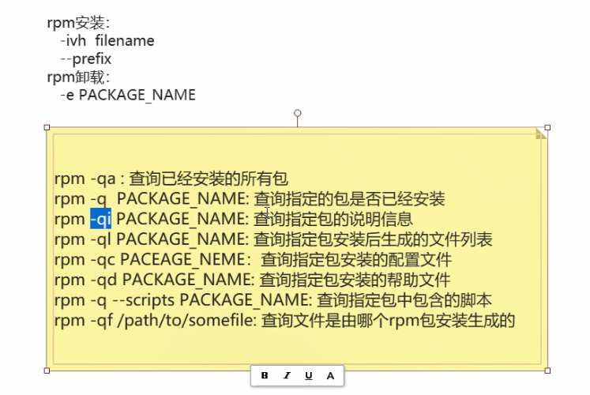

32-Linux rpm软件安装卸载相关的操作


1.   介绍：

Redhat提供了rpm管理体系     已经编译的软件包：针对不同的平台系统编译目标软件包     软件包包含依赖检查，但，还需人为解决


2、命令

(1)   rpm安装： 

①    -ivh filename

②  --prefix 

(2) rpm卸载： 

①    -e PACKAGE_NAME

(3)    其他选项：

①   rpm -qa : 查询已经安装的所有包

②   rpm -q PACKAGE_NAME: 查询指定的包是否已经安装

③   rpm -qi PACKAGE_NAME: 查询指定包的说明信息

④   rpm -ql PACKAGE_NAME: 查询指定包安装后生成的文件列表

⑤   rpm -qc PACEAGE_NEME：查询指定包安装的配置文件

⑥   rpm -qd PACKAGE_NAME: 查询指定包安装的帮助文件

⑦   rpm -q --scripts PACKAGE_NAME: 查询指定包中包含的脚本 

⑧   rpm -qf /path/to/somefile: 查询文件是由哪个rpm包安装生成的？


```shell
[root@node0924 jdk1.8.0_271-amd64]# clear
[root@node0924 jdk1.8.0_271-amd64]# cd
[root@node0924 ~]# cd
[root@node0924 ~]# rpm -qa
mysql-community-release-el6-5.noarch
basesystem-10.0-4.el6.noarch
mysql-community-client-5.7.31-1.el6.x86_64
setup-2.8.14-23.el6.noarch
tzdata-2020a-1.el6.noarch
info-4.13a-8.el6.x86_64
nspr-4.21.0-1.el6_10.x86_64
libselinux-2.0.94-7.el6.x86_64
db4-4.7.25-22.el6.x86_64
sed-4.2.1-10.el6.x86_64
libuuid-2.17.2-12.28.el6_9.2.x86_64
dbus-libs-1.2.24-11.el6_10.x86_64
libgpg-error-1.7-4.el6.x86_64
libselinux-utils-2.0.94-7.el6.x86_64
tcp_wrappers-libs-7.6-58.el6.x86_64
libidn-1.18-2.el6.x86_64
libstdc++-4.4.7-23.el6.x86_64
expat-2.0.1-13.el6_8.x86_64
checkpolicy-2.0.22-1.el6.x86_64
gmp-4.3.1-13.el6.x86_64
pth-2.0.7-9.3.el6.x86_64
grubby-7.0.15-7.el6.x86_64
e2fsprogs-libs-1.41.12-24.el6.x86_64
procps-3.2.8-45.el6_9.3.x86_64
coreutils-libs-8.4-47.el6.x86_64
shadow-utils-4.1.5.1-5.el6.x86_64
logrotate-3.7.8-28.el6.x86_64
nss-sysinit-3.44.0-7.el6_10.x86_64
krb5-libs-1.10.3-65.el6.x86_64
rpm-libs-4.8.0-59.el6.x86_64
cracklib-dicts-2.8.16-4.el6.x86_64
libuser-0.56.13-8.el6_7.x86_64
gdbm-1.8.0-39.el6.x86_64
python-pycurl-7.19.0-9.el6.x86_64
newt-python-0.52.11-4.el6.x86_64
iptables-1.4.7-19.el6.x86_64
util-linux-ng-2.17.2-12.28.el6_9.2.x86_64
device-mapper-libs-1.02.117-12.el6_9.1.x86_64
device-mapper-event-1.02.117-12.el6_9.1.x86_64
libcap-ng-0.6.4-3.el6_0.1.x86_64
device-mapper-multipath-libs-0.4.9-106.el6_10.1.x86_64
kernel-2.6.32-754.33.1.el6.x86_64
python-iniparse-0.3.1-2.1.el6.noarch
selinux-policy-targeted-3.7.19-312.el6.noarch
ustr-1.0.4-9.1.el6.x86_64
openssh-clients-5.3p1-124.el6_10.x86_64
gamin-0.1.10-9.el6.x86_64
dhclient-4.1.1-63.P1.el6.centos.x86_64
efibootmgr-0.5.4-15.el6.x86_64
dbus-glib-0.86-6.el6.x86_64
passwd-0.77-7.el6.x86_64
e2fsprogs-1.41.12-24.el6.x86_64
cloog-ppl-0.15.7-1.2.el6.x86_64
mpfr-2.4.1-6.el6.x86_64
perl-Error-0.17015-4.el6.noarch
autoconf-2.63-5.1.el6.noarch
ntpdate-4.2.6p5-15.el6.centos.x86_64
bridge-utils-1.2-10.el6.x86_64
xz-4.999.9-0.5.beta.20091007git.el6.x86_64
glib2-2.28.8-10.el6.x86_64
libpng-1.2.49-2.el6_7.x86_64
hicolor-icon-theme-0.11-1.1.el6.noarch
perl-Module-Pluggable-3.90-144.el6.x86_64
perl-5.10.1-144.el6.x86_64
vim-common-7.4.629-5.el6_10.2.x86_64
libXext-1.3.3-1.el6.x86_64
libXcursor-1.1.14-2.1.el6.x86_64
libXft-2.3.2-1.el6.x86_64
gnutls-2.12.23-22.el6.x86_64
cairo-1.8.8-6.el6_6.x86_64
vim-enhanced-7.4.629-5.el6_10.2.x86_64
wget-1.12-10.el6.x86_64
filesystem-2.4.30-3.el6.x86_64
gpg-pubkey-5072e1f5-4e773e2a
mysql-community-libs-5.7.31-1.el6.x86_64
numactl-2.0.9-2.el6.x86_64
libgcc-4.4.7-23.el6.x86_64
dhcp-common-4.1.1-63.P1.el6.centos.x86_64
libattr-2.4.44-7.el6.x86_64
ncurses-base-5.7-4.20090207.el6.x86_64
zlib-1.2.3-29.el6.x86_64
glibc-common-2.12-1.212.el6_10.3.x86_64
popt-1.13-7.el6.x86_64
glibc-2.12-1.212.el6_10.3.x86_64
ncurses-libs-5.7-4.20090207.el6.x86_64
nss-util-3.44.0-1.el6_10.x86_64
chkconfig-1.3.49.5-1.el6.x86_64
readline-6.0-4.el6.x86_64
audit-libs-2.4.5-6.el6.x86_64
libacl-2.2.49-7.el6_9.1.x86_64
libudev-147-2.74.el6_10.x86_64
libblkid-2.17.2-12.28.el6_9.2.x86_64
libsemanage-2.0.43-5.1.el6.x86_64
elfutils-libelf-0.164-2.el6.x86_64
findutils-4.4.2-9.el6.x86_64
cpio-2.10-13.el6.x86_64
lua-5.1.4-4.1.el6.x86_64
p11-kit-0.18.5-2.el6_5.2.x86_64
sysvinit-tools-2.87-6.dsf.el6.x86_64
nss-softokn-3.44.0-6.el6_10.x86_64
pcre-7.8-7.el6.x86_64
bzip2-1.0.5-7.el6_0.x86_64
libgcrypt-1.4.5-12.el6_8.x86_64
device-mapper-persistent-data-0.6.2-0.2.rc7.el6.x86_64
less-436-13.el6.x86_64
libnih-1.0.1-8.el6.x86_64
file-5.04-30.el6.x86_64
tar-1.23-15.el6_8.x86_64
libss-1.41.12-24.el6.x86_64
pinentry-0.7.6-8.el6.x86_64
net-tools-1.60-114.el6.x86_64
binutils-2.20.51.0.2-5.48.el6_10.1.x86_64
libusb-0.1.12-23.el6.x86_64
ncurses-5.7-4.20090207.el6.x86_64
libutempter-1.1.5-4.1.el6.x86_64
coreutils-8.4-47.el6.x86_64
module-init-tools-3.9-26.el6.x86_64
hwdata-0.233-20.1.el6.noarch
libpciaccess-0.13.4-1.el6.x86_64
gzip-1.3.12-24.el6.x86_64
nss-3.44.0-7.el6_10.x86_64
diffutils-2.8.1-28.el6.x86_64
nss-tools-3.44.0-7.el6_10.x86_64
dash-0.5.5.1-4.el6.x86_64
keyutils-libs-1.4-5.el6.x86_64
groff-1.18.1.4-21.el6.x86_64
openssl-1.0.1e-58.el6_10.x86_64
libcurl-7.19.7-54.el6_10.x86_64
cracklib-2.8.16-4.el6.x86_64
curl-7.19.7-54.el6_10.x86_64
openldap-2.4.40-16.el6.x86_64
ethtool-3.5-6.el6.x86_64
redhat-logos-60.0.14-12.el6.centos.noarch
plymouth-core-libs-0.8.3-29.el6.centos.x86_64
python-2.6.6-68.el6_10.x86_64
rpm-python-4.8.0-59.el6.x86_64
python-urlgrabber-3.9.1-11.el6.noarch
libedit-2.11-4.20080712cvs.1.el6.x86_64
yum-3.2.29-81.el6.centos.0.1.noarch
mingetty-1.08-5.el6.x86_64
pciutils-libs-3.1.10-4.el6.x86_64
libdrm-2.4.65-2.el6.x86_64
iproute-2.6.32-57.el6.x86_64
plymouth-0.8.3-29.el6.centos.x86_64
initscripts-9.03.61-1.el6.centos.x86_64
policycoreutils-2.0.83-30.1.el6_8.x86_64
fipscheck-1.2.0-7.el6.x86_64
device-mapper-1.02.117-12.el6_9.1.x86_64
openssh-5.3p1-124.el6_10.x86_64
lvm2-libs-2.02.143-12.el6_9.1.x86_64
libffi-3.0.5-3.2.el6.x86_64
kpartx-0.4.9-106.el6_10.1.x86_64
selinux-policy-3.7.19-312.el6.noarch
dracut-kernel-004-411.el6.noarch
iptables-ipv6-1.4.7-19.el6.x86_64
slang-2.2.1-1.el6.x86_64
fuse-2.8.3-5.el6.x86_64
pkgconfig-0.23-9.1.el6.x86_64
yum-metadata-parser-1.1.2-16.el6.x86_64
ppl-0.10.2-11.el6.x86_64
kernel-headers-2.6.32-754.33.1.el6.x86_64
glibc-devel-2.12-1.212.el6_10.3.x86_64
cpp-4.4.7-23.el6.x86_64
gcc-4.4.7-23.el6.x86_64
rsync-3.0.6-12.el6.x86_64
git-1.7.1-10.el6_10.x86_64
automake-1.11.1-4.el6.noarch
autoconf268-2.68-2.el6.noarch
jdk1.8-1.8.0_271-fcs.x86_64
kbd-misc-1.15-11.el6.noarch
kernel-2.6.32-431.el6.x86_64
attr-2.4.44-7.el6.x86_64
rootfiles-8.1-6.1.el6.noarch
xz-libs-4.999.9-0.5.beta.20091007git.el6.x86_64
xz-lzma-compat-4.999.9-0.5.beta.20091007git.el6.x86_64
freetype-2.3.11-19.el6_10.x86_64
fontconfig-2.8.0-5.el6.x86_64
libICE-1.0.6-1.el6.x86_64
libSM-1.2.1-2.el6.x86_64
gpm-libs-1.20.6-12.el6.x86_64
jasper-libs-1.900.1-22.el6.x86_64
perl-Pod-Escapes-1.04-144.el6.x86_64
perl-libs-5.10.1-144.el6.x86_64
perl-version-0.77-144.el6.x86_64
libXau-1.0.6-4.el6.x86_64
vim-filesystem-7.4.629-5.el6_10.2.x86_64
libX11-common-1.6.4-3.el6.noarch
libXrender-0.9.10-1.el6.x86_64
libXfixes-5.0.3-1.el6.x86_64
libXdamage-1.1.3-4.el6.x86_64
libXrandr-1.5.1-1.el6.x86_64
libXinerama-1.1.3-2.1.el6.x86_64
libXt-1.1.4-6.1.el6.x86_64
avahi-libs-0.6.25-17.el6.x86_64
cups-libs-1.4.2-81.el6_10.x86_64
pixman-0.32.8-1.el6.x86_64
pango-1.28.1-11.el6.x86_64
vim-X11-7.4.629-5.el6_10.2.x86_64
device-mapper-multipath-0.4.9-106.el6_10.1.x86_64
lvm2-2.02.143-12.el6_9.1.x86_64
openssh-server-5.3p1-124.el6_10.x86_64
mdadm-3.3.4-8.el6.x86_64
iscsi-initiator-utils-6.2.0.873-27.el6_9.x86_64
rsyslog-5.8.10-12.el6.x86_64
authconfig-6.1.12-23.el6.x86_64
shared-mime-info-0.70-6.el6.x86_64
sudo-1.8.6p3-29.el6_10.3.x86_64
audit-2.4.5-6.el6.x86_64
xfsprogs-3.1.1-20.el6.x86_64
vim-minimal-7.4.629-5.el6_10.2.x86_64
mysql-community-common-5.7.31-1.el6.x86_64
mysql-community-server-5.7.31-1.el6.x86_64
kernel-firmware-2.6.32-754.33.1.el6.noarch
libcap-2.16-5.5.el6.x86_64
nss-softokn-freebl-3.44.0-6.el6_10.x86_64
bash-4.1.2-48.el6.x86_64
libcom_err-1.41.12-24.el6.x86_64
libsepol-2.0.41-4.el6.x86_64
gawk-3.1.7-10.el6_7.3.x86_64
bzip2-libs-1.0.5-7.el6_0.x86_64
file-libs-5.04-30.el6.x86_64
cyrus-sasl-lib-2.1.23-15.el6_6.2.x86_64
libtasn1-2.3-6.el6_5.x86_64
sqlite-3.6.20-1.el6_7.2.x86_64
grep-2.20-6.el6.x86_64
p11-kit-trust-0.18.5-2.el6_5.2.x86_64
which-2.19-6.el6.x86_64
upstart-0.6.5-17.el6.x86_64
db4-utils-4.7.25-22.el6.x86_64
psmisc-22.6-24.el6.x86_64
make-3.81-23.el6.x86_64
MAKEDEV-3.24-6.el6.x86_64
pam-1.1.1-24.el6.x86_64
plymouth-scripts-0.8.3-29.el6.centos.x86_64
ca-certificates-2020.2.41-65.1.el6_10.noarch
m4-1.4.13-5.el6.x86_64
newt-0.52.11-4.el6.x86_64
libssh2-1.4.2-3.el6_10.1.x86_64
rpm-4.8.0-59.el6.x86_64
libxml2-2.7.6-21.el6_8.1.x86_64
python-libs-2.6.6-68.el6_10.x86_64
yum-plugin-fastestmirror-1.1.30-42.el6_10.noarch
centos-release-6-10.el6.centos.12.3.x86_64
iputils-20071127-24.el6.x86_64
gpgme-1.1.8-3.el6.x86_64
udev-147-2.74.el6_10.x86_64
fipscheck-lib-1.2.0-7.el6.x86_64
device-mapper-event-libs-1.02.117-12.el6_9.1.x86_64
cryptsetup-luks-libs-1.2.0-11.el6.x86_64
dracut-004-411.el6.noarch
pygpgme-0.1-18.20090824bzr68.el6.x86_64
system-config-firewall-base-1.2.27-7.2.el6_6.noarch
cryptsetup-luks-1.2.0-11.el6.x86_64
libaio-0.3.107-10.el6.x86_64
b43-openfwwf-5.2-10.el6.noarch
cyrus-sasl-2.1.23-15.el6_6.2.x86_64
grub-0.97-99.el6.x86_64
gnupg2-2.0.14-9.el6_10.x86_64
acl-2.2.49-7.el6_9.1.x86_64
glibc-headers-2.12-1.212.el6_10.3.x86_64
libgomp-4.4.7-23.el6.x86_64
perl-Git-1.7.1-10.el6_10.noarch
libtool-2.2.6-15.5.el6.x86_64
kbd-1.15-11.el6.x86_64
gpg-pubkey-c105b9de-4e0fd3a3
man-1.6f-39.el6.x86_64
libjpeg-turbo-1.2.1-3.el6_5.x86_64
libtiff-3.9.4-21.el6_8.x86_64
atk-1.30.0-1.el6.x86_64
perl-Pod-Simple-3.13-144.el6.x86_64
libxcb-1.12-4.el6.x86_64
libX11-1.6.4-3.el6.x86_64
gdk-pixbuf2-2.24.1-6.el6_7.x86_64
libXi-1.7.8-1.el6.x86_64
libXcomposite-0.4.3-4.el6.x86_64
libthai-0.1.12-3.el6.x86_64
gtk2-2.24.23-9.el6.x86_64
[root@node0924 ~]# rpm -q /opt/software/jdk
package /opt/software/jdk is not installed
[root@node0924 ~]# rpm -q /opt/software/jdk/jdk-8u271-linux-x64.rpm
package /opt/software/jdk/jdk-8u271-linux-x64.rpm is not installed
[root@node0924 ~]# ^C
[root@node0924 ~]# 

```

`rpm -qa`  查询已经安装的所有包

`rpm -q /opt/software/jdk/jdk-8u271-linux-x64.rpm`  查看包是否已经安装了




rpm安装

* -ivh 

prm卸载

* -e


```shell
[root@node0924 ~]# rpm -qi kbd-1.15-11.el6.x86_64
Name        : kbd                          Relocations: (not relocatable)
Version     : 1.15                              Vendor: CentOS
Release     : 11.el6                        Build Date: Fri 12 Nov 2010 04:45:43 AM CST
Install Date: Fri 25 Sep 2020 07:49:41 AM CST      Build Host: c5b2.bsys.dev.centos.org
Group       : System Environment/Base       Source RPM: kbd-1.15-11.el6.src.rpm
Size        : 991792                           License: GPLv2+
Signature   : RSA/8, Sun 03 Jul 2011 12:27:01 PM CST, Key ID 0946fca2c105b9de
Packager    : CentOS BuildSystem <http://bugs.centos.org>
URL         : http://ftp.altlinux.org/pub/people/legion/kbd
Summary     : Tools for configuring the console (keyboard, virtual terminals, etc.)
Description :
The kbd package contains tools for managing a Linux
system's console's behavior, including the keyboard, the screen
fonts, the virtual terminals and font files.
[root@node0924 ~]# 

```

`rpm -qi kbd-1.15-11.el6.x86_64` 查看说明信息


```shell
[root@node0924 ~]# rpm -qa | grep jdk
jdk1.8-1.8.0_271-fcs.x86_64
[root@node0924 ~]# 

```

`rpm -qa | grep jdk`  查询jdk的安装包


```shell
[root@node0924 ~]# rpm -ql jdk1.8-1.8.0_271-fcs.x86_64

```

`rpm -ql jdk1.8-1.8.0_271-fcs.x86_64`  查询指定包安装后生成的文件列表


```shell
[root@node0924 ~]# rpm -qc jdk1.8-1.8.0_271-fcs.x86_64
/usr/mfc/jdk1.8.0_271-amd64/.java/.systemPrefs/.system.lock
/usr/mfc/jdk1.8.0_271-amd64/.java/.systemPrefs/.systemRootModFile
/usr/mfc/jdk1.8.0_271-amd64/.java/init.d/jexec
/usr/mfc/jdk1.8.0_271-amd64/jre/lib/charsets.pack
/usr/mfc/jdk1.8.0_271-amd64/jre/lib/deploy.pack
/usr/mfc/jdk1.8.0_271-amd64/jre/lib/ext/localedata.pack
/usr/mfc/jdk1.8.0_271-amd64/jre/lib/javaws.pack
/usr/mfc/jdk1.8.0_271-amd64/jre/lib/jsse.pack
/usr/mfc/jdk1.8.0_271-amd64/jre/lib/plugin.pack
/usr/mfc/jdk1.8.0_271-amd64/jre/lib/rt.pack
/usr/mfc/jdk1.8.0_271-amd64/lib/tools.pack
[root@node0924 ~]# 

```

`rpm -qc jdk1.8-1.8.0_271-fcs.x86_64`  查询指定包安装的配置文件


```shell
# 查询指定包安装的帮助文件
rpm -qd jdk1.8-1.8.0_271-fcs.x86_64

# 查询指定包中包含的脚本 
rpm -q --scripts jdk1.8-1.8.0_271-fcs.x86_64

# 使用管道和more，查看文件
rpm -q --scripts jdk1.8-1.8.0_271-fcs.x86_64 | more

# 使用管道和less，查看文件
rpm -q --scripts jdk1.8-1.8.0_271-fcs.x86_64 | less

```


```shell
# ifconfig,查看网卡信息
[root@node0924 ~]# ifconfig
eth0      Link encap:Ethernet  HWaddr 00:0C:29:F8:E2:A7  
          inet addr:192.168.11.66  Bcast:192.168.11.255  Mask:255.255.255.0
          inet6 addr: fe80::20c:29ff:fef8:e2a7/64 Scope:Link
          UP BROADCAST RUNNING MULTICAST  MTU:1500  Metric:1
          RX packets:291642 errors:0 dropped:0 overruns:0 frame:0
          TX packets:31739 errors:0 dropped:0 overruns:0 carrier:0
          collisions:0 txqueuelen:1000 
          RX bytes:349082190 (332.9 MiB)  TX bytes:4715928 (4.4 MiB)

lo        Link encap:Local Loopback  
          inet addr:127.0.0.1  Mask:255.0.0.0
          inet6 addr: ::1/128 Scope:Host
          UP LOOPBACK RUNNING  MTU:65536  Metric:1
          RX packets:0 errors:0 dropped:0 overruns:0 frame:0
          TX packets:0 errors:0 dropped:0 overruns:0 carrier:0
          collisions:0 txqueuelen:0 
          RX bytes:0 (0.0 b)  TX bytes:0 (0.0 b)

# 查看ifconfig命令的位置
[root@node0924 ~]# type ifconfig
ifconfig is hashed (/sbin/ifconfig)
# 查询文件是由哪个rpm包安装生成的
[root@node0924 ~]# rpm -qf /sbin/ifconfig
net-tools-1.60-114.el6.x86_64
[root@node0924 ~]# 

```


```shell
[root@node0924 ~]# mv /sbin/ifconfig /tmp
[root@node0924 ~]# cd /sbin/
[root@node0924 sbin]# ls
addpart              faillock                 iptables-save        mkinitrd             shutdown
agetty               fdisk                    iptables-save-1.4.7  mkswap               slattach
arp                  findfs                   iptunnel             modinfo              sln
arping               fixfiles                 iscsiadm             modprobe             start
audispd              fsadm                    iscsid               mount.fuse           start_udev
auditctl             fsck                     iscsi-iname          mount.tmpfs          status
auditd               fsck.cramfs              iscsistart           mpathconf            stop
augenrules           fsck.ext2                iscsiuio             mpathpersist         sulogin
aureport             fsck.ext3                killall5             multipath            sushell
ausearch             fsck.ext4                kpartx               multipathd           swapoff
autrace              fsck.ext4dev             ldconfig             nameif               swapon
badblocks            fsck.xfs                 load_policy          netreport            switch_root
blkdeactivate        fsfreeze                 logsave              new-kernel-pkg       sysctl
blkdiscard           fstab-decode             losetup              nologin              tc
blkid                fstrim                   lsinitrd             pam_console_apply    telinit
blockdev             fuser                    lsmod                pam_tally2           thin_check
brcm_iscsiuio        genhostid                lvchange             pam_timestamp_check  thin_delta
bridge               getkey                   lvconvert            partx                thin_dump
cache_check          grub                     lvcreate             pdata_tools          thin_ls
cache_dump           grubby                   lvdisplay            pidof                thin_metadata_size
cache_metadata_size  grub-crypt               lvextend             pivot_root           thin_repair
cache_repair         grub-install             lvm                  plipconfig           thin_restore
cache_restore        grub-md5-crypt           lvmchange            plymouthd            thin_rmap
cbq                  grub-terminfo            lvmconf              poweroff             thin_trim
cciss_id             halt                     lvmconfig            ppp-watch            tune2fs
cfdisk               hwclock                  lvmdiskscan          pvchange             udevadm
chcpu                ifcfg                    lvmdump              pvck                 udevd
chkconfig            ifdown                   lvmetad              pvcreate             unix_chkpwd
clock                ifenslave                lvmsadc              pvdisplay            unix_update
consoletype          ifup                     lvmsar               pvmove               vgcfgbackup
cryptsetup           init                     lvreduce             pvremove             vgcfgrestore
ctrlaltdel           initctl                  lvremove             pvresize             vgchange
debugfs              insmod                   lvrename             pvs                  vgck
delpart              insmod.static            lvresize             pvscan               vgconvert
depmod               install-info             lvs                  rdisc                vgcreate
dhclient             installkernel            lvscan               reboot               vgdisplay
dhclient-script      ip                       MAKEDEV              reload               vgexport
dmeventd             ip6tables                matchpathcon         resize2fs            vgextend
dmsetup              ip6tables-1.4.7          mdadm                restart              vgimport
dmstats              ip6tables-multi          mdmon                restorecon           vgimportclone
dracut               ip6tables-multi-1.4.7    mii-diag             rmmod                vgmerge
dumpe2fs             ip6tables-restore        mii-tool             route                vgmknodes
e2fsck               ip6tables-restore-1.4.7  mingetty             rsyslogd             vgreduce
e2image              ip6tables-save           mke2fs               rtmon                vgremove
e2label              ip6tables-save-1.4.7     mkfs                 runlevel             vgrename
e2undo               ipmaddr                  mkfs.cramfs          runuser              vgs
era_check            iptables                 mkfs.ext2            scsi_id              vgscan
era_dump             iptables-1.4.7           mkfs.ext3            securetty            vgsplit
era_invalidate       iptables-multi           mkfs.ext4            service              weak-modules
era_restore          iptables-multi-1.4.7     mkfs.ext4dev         setfiles             wipefs
ether-wake           iptables-restore         mkfs.xfs             setsysfont           xfs_repair
ethtool              iptables-restore-1.4.7   mkhomedir_helper     sfdisk
[root@node0924 sbin]# 

```

`mv /sbin/ifconfig /tmp` 将ifconfig 移动到tmp文件夹下，sbin下没有ifconfig 了


```shell
[root@node0924 sbin]# rpm -qf /sbin/ifconfig
net-tools-1.60-114.el6.x86_64
[root@node0924 sbin]# ifconfig
-bash: /sbin/ifconfig: No such file or directory
[root@node0924 sbin]# 

```

 `rpm -qf /sbin/ifconfig`  依然能找到文件的安装包

`ifconfig` 已经使用不了了


```shell
[root@node0924 sbin]# mv /tmp/ifconfig /sbin/
[root@node0924 sbin]# ifconfig
eth0      Link encap:Ethernet  HWaddr 00:0C:29:F8:E2:A7  
          inet addr:192.168.11.66  Bcast:192.168.11.255  Mask:255.255.255.0
          inet6 addr: fe80::20c:29ff:fef8:e2a7/64 Scope:Link
          UP BROADCAST RUNNING MULTICAST  MTU:1500  Metric:1
          RX packets:292234 errors:0 dropped:0 overruns:0 frame:0
          TX packets:32036 errors:0 dropped:0 overruns:0 carrier:0
          collisions:0 txqueuelen:1000 
          RX bytes:349131673 (332.9 MiB)  TX bytes:4756440 (4.5 MiB)

lo        Link encap:Local Loopback  
          inet addr:127.0.0.1  Mask:255.0.0.0
          inet6 addr: ::1/128 Scope:Host
          UP LOOPBACK RUNNING  MTU:65536  Metric:1
          RX packets:0 errors:0 dropped:0 overruns:0 frame:0
          TX packets:0 errors:0 dropped:0 overruns:0 carrier:0
          collisions:0 txqueuelen:0 
          RX bytes:0 (0.0 b)  TX bytes:0 (0.0 b)

[root@node0924 sbin]# 

```

`mv /tmp/ifconfig /sbin/` 移动回去

`ifconfig`  查看网卡信息，可以查看了


