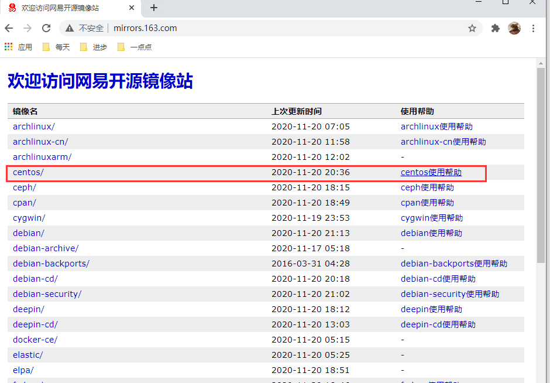

33-Yum安装与配置


Yum安装与配置

介绍：

Yum（全称为 Yellow dog Updater, Modified）是一个[Shell](https://baike.baidu.com/item/Shell)前端软件包管理器(软件)。基于[RPM](https://baike.baidu.com/item/RPM)包管理，能够从指定的服务器自动下载RPM包并且安装，可以自动处理依赖性关系，并且一次安装所有依赖的软件包，无须繁琐地一次次下载、安装。


配置修改yum源：

1、修改配置文件

2、yum clean all 清空本地的依赖缓存

3、yum makecache 将依赖缓存下载到本地


```shell
[root@node0924 ~]# umount /mnt/
umount: /mnt/: not mounted
[root@node0924 ~]# cd /dev/
[root@node0924 dev]# ls
agpgart          fb0        lp0                 ram0    root      tty0   tty26  tty43  tty60    vcs4
block            fd         lp1                 ram1    rtc       tty1   tty27  tty44  tty61    vcs5
bsg              full       lp2                 ram10   rtc0      tty10  tty28  tty45  tty62    vcs6
btrfs-control    fuse       lp3                 ram11   scd0      tty11  tty29  tty46  tty63    vcsa
bus              hidraw0    MAKEDEV             ram12   sda       tty12  tty3   tty47  tty7     vcsa1
cdrom            hpet       mapper              ram13   sda1      tty13  tty30  tty48  tty8     vcsa2
cdrw             hugepages  mcelog              ram14   sda2      tty14  tty31  tty49  tty9     vcsa3
char             hvc0       mem                 ram15   sda3      tty15  tty32  tty5   ttyS0    vcsa4
console          input      midi                ram2    sg0       tty16  tty33  tty50  ttyS1    vcsa5
core             kmsg       net                 ram3    sg1       tty17  tty34  tty51  ttyS2    vcsa6
cpu              log        network_latency     ram4    shm       tty18  tty35  tty52  ttyS3    vga_arbiter
cpu_dma_latency  loop0      network_throughput  ram5    snapshot  tty19  tty36  tty53  urandom  zero
crash            loop1      null                ram6    snd       tty2   tty37  tty54  usbmon0
disk             loop2      nvram               ram7    sr0       tty20  tty38  tty55  usbmon1
dmmidi           loop3      oldmem              ram8    stderr    tty21  tty39  tty56  usbmon2
dri              loop4      port                ram9    stdin     tty22  tty4   tty57  vcs
dvd              loop5      ppp                 random  stdout    tty23  tty40  tty58  vcs1
dvdrw            loop6      ptmx                raw     systty    tty24  tty41  tty59  vcs2
fb               loop7      pts                 rfkill  tty       tty25  tty42  tty6   vcs3
[root@node0924 dev]# mount cdrom /mnt
mount: block device /dev/sr0 is write-protected, mounting read-only
[root@node0924 dev]# cd /mnt/
[root@node0924 mnt]# ls
CentOS_BuildTag  images                    repodata                       RPM-GPG-KEY-CentOS-Testing-6
EFI              isolinux                  RPM-GPG-KEY-CentOS-6           TRANS.TBL
EULA             Packages                  RPM-GPG-KEY-CentOS-Debug-6
GPL              RELEASE-NOTES-en-US.html  RPM-GPG-KEY-CentOS-Security-6
[root@node0924 mnt]# cd Packages
[root@node0924 Packages]# ls
acl-2.2.49-6.el6.x86_64.rpm                                libgpg-error-1.7-4.el6.x86_64.rpm
aic94xx-firmware-30-2.el6.noarch.rpm                       libgssglue-0.1-11.el6.x86_64.rpm
atmel-firmware-1.3-7.el6.noarch.rpm                        libhbaapi-2.2.9-1.el6.x86_64.rpm
attr-2.4.44-7.el6.x86_64.rpm                               libhbalinux-1.0.16-1.el6.x86_64.rpm
audit-2.2-2.el6.x86_64.rpm                                 libidn-1.18-2.el6.x86_64.rpm
audit-libs-2.2-2.el6.x86_64.rpm                            libnih-1.0.1-7.el6.x86_64.rpm
authconfig-6.1.12-13.el6.x86_64.rpm                        libnl-1.1.4-2.el6.x86_64.rpm
b43-openfwwf-5.2-4.el6.noarch.rpm                          libpciaccess-0.13.1-2.el6.x86_64.rpm
basesystem-10.0-4.el6.noarch.rpm                           libselinux-2.0.94-5.3.el6_4.1.x86_64.rpm
bash-4.1.2-15.el6_4.x86_64.rpm                             libselinux-utils-2.0.94-5.3.el6_4.1.x86_64.rpm
bfa-firmware-3.2.21.1-2.el6.noarch.rpm                     libsemanage-2.0.43-4.2.el6.x86_64.rpm
binutils-2.20.51.0.2-5.36.el6.x86_64.rpm                   libsepol-2.0.41-4.el6.x86_64.rpm
bridge-utils-1.2-10.el6.x86_64.rpm                         libss-1.41.12-18.el6.x86_64.rpm
bzip2-1.0.5-7.el6_0.x86_64.rpm                             libssh2-1.4.2-1.el6.x86_64.rpm
bzip2-libs-1.0.5-7.el6_0.x86_64.rpm                        libstdc++-4.4.7-4.el6.x86_64.rpm
ca-certificates-2013.1.94-65.0.el6.noarch.rpm              libtasn1-2.3-3.el6_2.1.x86_64.rpm
centos-release-6-5.el6.centos.11.1.x86_64.rpm              libtirpc-0.2.1-6.el6_4.x86_64.rpm
checkpolicy-2.0.22-1.el6.x86_64.rpm                        libudev-147-2.51.el6.x86_64.rpm
chkconfig-1.3.49.3-2.el6_4.1.x86_64.rpm                    libusb-0.1.12-23.el6.x86_64.rpm
coreutils-8.4-31.el6.x86_64.rpm                            libuser-0.56.13-5.el6.x86_64.rpm
coreutils-libs-8.4-31.el6.x86_64.rpm                       libutempter-1.1.5-4.1.el6.x86_64.rpm
cpio-2.10-11.el6_3.x86_64.rpm                              libuuid-2.17.2-12.14.el6.x86_64.rpm
cracklib-2.8.16-4.el6.x86_64.rpm                           libxml2-2.7.6-14.el6.x86_64.rpm
cracklib-dicts-2.8.16-4.el6.x86_64.rpm                     lldpad-0.9.46-2.el6.x86_64.rpm
cronie-1.4.4-12.el6.x86_64.rpm                             lldpad-libs-0.9.46-2.el6.x86_64.rpm
cronie-anacron-1.4.4-12.el6.x86_64.rpm                     logrotate-3.7.8-17.el6.x86_64.rpm
crontabs-1.10-33.el6.noarch.rpm                            lua-5.1.4-4.1.el6.x86_64.rpm
cryptsetup-luks-1.2.0-7.el6.x86_64.rpm                     lvm2-2.02.100-8.el6.x86_64.rpm
cryptsetup-luks-libs-1.2.0-7.el6.x86_64.rpm                lvm2-libs-2.02.100-8.el6.x86_64.rpm
curl-7.19.7-37.el6_4.x86_64.rpm                            m4-1.4.13-5.el6.x86_64.rpm
cyrus-sasl-2.1.23-13.el6_3.1.x86_64.rpm                    make-3.81-20.el6.x86_64.rpm
cyrus-sasl-lib-2.1.23-13.el6_3.1.x86_64.rpm                MAKEDEV-3.24-6.el6.x86_64.rpm
dash-0.5.5.1-4.el6.x86_64.rpm                              mdadm-3.2.6-7.el6.x86_64.rpm
db4-4.7.25-18.el6_4.x86_64.rpm                             mingetty-1.08-5.el6.x86_64.rpm
db4-utils-4.7.25-18.el6_4.x86_64.rpm                       module-init-tools-3.9-21.el6_4.x86_64.rpm
dbus-glib-0.86-6.el6.x86_64.rpm                            mysql-libs-5.1.71-1.el6.x86_64.rpm
dbus-libs-1.2.24-7.el6_3.x86_64.rpm                        ncurses-5.7-3.20090208.el6.x86_64.rpm
device-mapper-1.02.79-8.el6.x86_64.rpm                     ncurses-base-5.7-3.20090208.el6.x86_64.rpm
device-mapper-event-1.02.79-8.el6.x86_64.rpm               ncurses-libs-5.7-3.20090208.el6.x86_64.rpm
device-mapper-event-libs-1.02.79-8.el6.x86_64.rpm          net-tools-1.60-110.el6_2.x86_64.rpm
device-mapper-libs-1.02.79-8.el6.x86_64.rpm                newt-0.52.11-3.el6.x86_64.rpm
device-mapper-multipath-0.4.9-72.el6.x86_64.rpm            newt-python-0.52.11-3.el6.x86_64.rpm
device-mapper-multipath-libs-0.4.9-72.el6.x86_64.rpm       nfs-utils-1.2.3-39.el6.x86_64.rpm
device-mapper-persistent-data-0.2.8-2.el6.x86_64.rpm       nfs-utils-lib-1.1.5-6.el6.x86_64.rpm
dhclient-4.1.1-38.P1.el6.centos.x86_64.rpm                 nspr-4.10.0-1.el6.x86_64.rpm
dhcp-common-4.1.1-38.P1.el6.centos.x86_64.rpm              nss-3.15.1-15.el6.x86_64.rpm
diffutils-2.8.1-28.el6.x86_64.rpm                          nss-softokn-3.14.3-9.el6.x86_64.rpm
dmraid-1.0.0.rc16-11.el6.x86_64.rpm                        nss-softokn-freebl-3.14.3-9.el6.x86_64.rpm
dmraid-events-1.0.0.rc16-11.el6.x86_64.rpm                 nss-sysinit-3.15.1-15.el6.x86_64.rpm
dracut-004-335.el6.noarch.rpm                              nss-tools-3.15.1-15.el6.x86_64.rpm
dracut-kernel-004-335.el6.noarch.rpm                       nss-util-3.15.1-3.el6.x86_64.rpm
dracut-network-004-335.el6.noarch.rpm                      openldap-2.4.23-32.el6_4.1.x86_64.rpm
e2fsprogs-1.41.12-18.el6.x86_64.rpm                        openssh-5.3p1-94.el6.x86_64.rpm
e2fsprogs-libs-1.41.12-18.el6.x86_64.rpm                   openssh-clients-5.3p1-94.el6.x86_64.rpm
efibootmgr-0.5.4-11.el6.x86_64.rpm                         openssh-server-5.3p1-94.el6.x86_64.rpm
elfutils-libelf-0.152-1.el6.x86_64.rpm                     openssl-1.0.1e-15.el6.x86_64.rpm
ethtool-3.5-1.el6.x86_64.rpm                               p11-kit-0.18.5-2.el6.x86_64.rpm
expat-2.0.1-11.el6_2.x86_64.rpm                            p11-kit-trust-0.18.5-2.el6.x86_64.rpm
fcoe-utils-1.0.28-3.el6.x86_64.rpm                         pam-1.1.1-17.el6.x86_64.rpm
file-5.04-15.el6.x86_64.rpm                                passwd-0.77-4.el6_2.2.x86_64.rpm
file-libs-5.04-15.el6.x86_64.rpm                           pciutils-libs-3.1.10-2.el6.x86_64.rpm
filesystem-2.4.30-3.el6.x86_64.rpm                         pcre-7.8-6.el6.x86_64.rpm
findutils-4.4.2-6.el6.x86_64.rpm                           pinentry-0.7.6-6.el6.x86_64.rpm
fipscheck-1.2.0-7.el6.x86_64.rpm                           pkgconfig-0.23-9.1.el6.x86_64.rpm
fipscheck-lib-1.2.0-7.el6.x86_64.rpm                       plymouth-0.8.3-27.el6.centos.x86_64.rpm
fuse-2.8.3-4.el6.x86_64.rpm                                plymouth-core-libs-0.8.3-27.el6.centos.x86_64.rpm
gamin-0.1.10-9.el6.x86_64.rpm                              plymouth-scripts-0.8.3-27.el6.centos.x86_64.rpm
gawk-3.1.7-10.el6.x86_64.rpm                               policycoreutils-2.0.83-19.39.el6.x86_64.rpm
gdbm-1.8.0-36.el6.x86_64.rpm                               popt-1.13-7.el6.x86_64.rpm
glib2-2.26.1-3.el6.x86_64.rpm                              postfix-2.6.6-2.2.el6_1.x86_64.rpm
glibc-2.12-1.132.el6.x86_64.rpm                            procps-3.2.8-25.el6.x86_64.rpm
glibc-common-2.12-1.132.el6.x86_64.rpm                     psmisc-22.6-15.el6_0.1.x86_64.rpm
gmp-4.3.1-7.el6_2.2.x86_64.rpm                             pth-2.0.7-9.3.el6.x86_64.rpm
gnupg2-2.0.14-6.el6_4.x86_64.rpm                           pygpgme-0.1-18.20090824bzr68.el6.x86_64.rpm
gpgme-1.1.8-3.el6.x86_64.rpm                               python-2.6.6-51.el6.x86_64.rpm
grep-2.6.3-4.el6.x86_64.rpm                                python-iniparse-0.3.1-2.1.el6.noarch.rpm
groff-1.18.1.4-21.el6.x86_64.rpm                           python-libs-2.6.6-51.el6.x86_64.rpm
grub-0.97-83.el6.x86_64.rpm                                python-pycurl-7.19.0-8.el6.x86_64.rpm
grubby-7.0.15-5.el6.x86_64.rpm                             python-urlgrabber-3.9.1-9.el6.noarch.rpm
gzip-1.3.12-19.el6_4.x86_64.rpm                            ql2100-firmware-1.19.38-3.1.el6.noarch.rpm
hwdata-0.233-9.1.el6.noarch.rpm                            ql2200-firmware-2.02.08-3.1.el6.noarch.rpm
info-4.13a-8.el6.x86_64.rpm                                ql23xx-firmware-3.03.27-3.1.el6.noarch.rpm
initscripts-9.03.40-2.el6.centos.x86_64.rpm                ql2400-firmware-7.00.01-1.el6.noarch.rpm
iproute-2.6.32-31.el6.x86_64.rpm                           ql2500-firmware-7.00.01-1.el6.noarch.rpm
iptables-1.4.7-11.el6.x86_64.rpm                           readline-6.0-4.el6.x86_64.rpm
iptables-ipv6-1.4.7-11.el6.x86_64.rpm                      redhat-logos-60.0.14-12.el6.centos.noarch.rpm
iputils-20071127-17.el6_4.2.x86_64.rpm                     rootfiles-8.1-6.1.el6.noarch.rpm
ipw2100-firmware-1.3-11.el6.noarch.rpm                     rpcbind-0.2.0-11.el6.x86_64.rpm
ipw2200-firmware-3.1-4.el6.noarch.rpm                      rpm-4.8.0-37.el6.x86_64.rpm
iscsi-initiator-utils-6.2.0.873-10.el6.x86_64.rpm          rpm-libs-4.8.0-37.el6.x86_64.rpm
ivtv-firmware-20080701-20.2.noarch.rpm                     rpm-python-4.8.0-37.el6.x86_64.rpm
iwl1000-firmware-39.31.5.1-1.el6.noarch.rpm                rsyslog-5.8.10-8.el6.x86_64.rpm
iwl100-firmware-39.31.5.1-1.el6.noarch.rpm                 rt61pci-firmware-1.2-7.el6.noarch.rpm
iwl3945-firmware-15.32.2.9-4.el6.noarch.rpm                rt73usb-firmware-1.8-7.el6.noarch.rpm
iwl4965-firmware-228.61.2.24-2.1.el6.noarch.rpm            sed-4.2.1-10.el6.x86_64.rpm
iwl5000-firmware-8.83.5.1_1-1.el6_1.1.noarch.rpm           selinux-policy-3.7.19-231.el6.noarch.rpm
iwl5150-firmware-8.24.2.2-1.el6.noarch.rpm                 selinux-policy-targeted-3.7.19-231.el6.noarch.rpm
iwl6000-firmware-9.221.4.1-1.el6.noarch.rpm                setup-2.8.14-20.el6_4.1.noarch.rpm
iwl6000g2a-firmware-17.168.5.3-1.el6.noarch.rpm            sgpio-1.2.0.10-5.el6.x86_64.rpm
iwl6050-firmware-41.28.5.1-2.el6.noarch.rpm                shadow-utils-4.1.4.2-13.el6.x86_64.rpm
kbd-1.15-11.el6.x86_64.rpm                                 shared-mime-info-0.70-4.el6.x86_64.rpm
kbd-misc-1.15-11.el6.noarch.rpm                            slang-2.2.1-1.el6.x86_64.rpm
kernel-2.6.32-431.el6.x86_64.rpm                           sqlite-3.6.20-1.el6.x86_64.rpm
kernel-firmware-2.6.32-431.el6.noarch.rpm                  sudo-1.8.6p3-12.el6.x86_64.rpm
keyutils-1.4-4.el6.x86_64.rpm                              system-config-firewall-base-1.2.27-5.el6.noarch.rpm
keyutils-libs-1.4-4.el6.x86_64.rpm                         sysvinit-tools-2.87-5.dsf.el6.x86_64.rpm
kpartx-0.4.9-72.el6.x86_64.rpm                             tar-1.23-11.el6.x86_64.rpm
krb5-libs-1.10.3-10.el6_4.6.x86_64.rpm                     tcp_wrappers-libs-7.6-57.el6.x86_64.rpm
less-436-10.el6.x86_64.rpm                                 TRANS.TBL
libacl-2.2.49-6.el6.x86_64.rpm                             tzdata-2013g-1.el6.noarch.rpm
libaio-0.3.107-10.el6.x86_64.rpm                           udev-147-2.51.el6.x86_64.rpm
libattr-2.4.44-7.el6.x86_64.rpm                            upstart-0.6.5-12.el6_4.1.x86_64.rpm
libblkid-2.17.2-12.14.el6.x86_64.rpm                       ustr-1.0.4-9.1.el6.x86_64.rpm
libcap-2.16-5.5.el6.x86_64.rpm                             util-linux-ng-2.17.2-12.14.el6.x86_64.rpm
libcap-ng-0.6.4-3.el6_0.1.x86_64.rpm                       vim-minimal-7.2.411-1.8.el6.x86_64.rpm
libcom_err-1.41.12-18.el6.x86_64.rpm                       which-2.19-6.el6.x86_64.rpm
libconfig-1.3.2-1.1.el6.x86_64.rpm                         xfsprogs-3.1.1-14.el6.x86_64.rpm
libcurl-7.19.7-37.el6_4.x86_64.rpm                         xorg-x11-drv-ati-firmware-7.1.0-3.el6.noarch.rpm
libdrm-2.4.45-2.el6.x86_64.rpm                             xz-libs-4.999.9-0.3.beta.20091007git.el6.x86_64.rpm
libedit-2.11-4.20080712cvs.1.el6.x86_64.rpm                yum-3.2.29-40.el6.centos.noarch.rpm
libertas-usb8388-firmware-5.110.22.p23-3.1.el6.noarch.rpm  yum-metadata-parser-1.1.2-16.el6.x86_64.rpm
libevent-1.4.13-4.el6.x86_64.rpm                           yum-plugin-fastestmirror-1.1.30-14.el6.noarch.rpm
libffi-3.0.5-3.2.el6.x86_64.rpm                            zd1211-firmware-1.4-4.el6.noarch.rpm
libgcc-4.4.7-4.el6.x86_64.rpm                              zlib-1.2.3-29.el6.x86_64.rpm
libgcrypt-1.4.5-11.el6_4.x86_64.rpm
[root@node0924 Packages]# 

```


```shell
# 切换到dev
cd /dev/

# 查看ls
ls

# mount cdrom /mnt
[root@node0924 dev]# mount cdrom /mnt
mount: block device /dev/sr0 is write-protected, mounting read-only

# 切换到mnt
cd /mnt/

# 查看
ls

# 切换到Packages
cd Packages

# 查看
ls
```

```shell
[root@node0924 Packages]# ls ./ | wc -l
249
[root@node0924 Packages]# 

```

`ls ./ | wc -l` 查看当前安装包的个数


```shell
[root@node0924 Packages]# cp shadow-utils-4.1.4.2-13.el6.x86_64.rpm /root/
[root@node0924 Packages]# cd
[root@node0924 ~]# ls
a                data                mysql-community-release-el6-5.noarch.rpm    soft        zfg
aa               install.log         mysql-community-release-el6-5.noarch.rpm.1  springboot
anaconda-ks.cfg  install.log.syslog  shadow-utils-4.1.4.2-13.el6.x86_64.rpm      test
[root@node0924 ~]# 

```


`cp shadow-utils-4.1.4.2-13.el6.x86_64.rpm /root/` 随便拷贝一个文件到root目录


```shell
[root@node0924 ~]# rpm -ivh shadow-utils-4.1.4.2-13.el6.x86_64.rpm
Preparing...                ########################################### [100%]
	package shadow-utils-2:4.1.5.1-5.el6.x86_64 (which is newer than shadow-utils-2:4.1.4.2-13.el6.x86_64) is already installed
	file /usr/sbin/useradd from install of shadow-utils-2:4.1.4.2-13.el6.x86_64 conflicts with file from package shadow-utils-2:4.1.5.1-5.el6.x86_64

```

`rpm -ivh shadow-utils-4.1.4.2-13.el6.x86_64.rpm`

rpm安装，有一些软件安装需要依赖包。

```shell
[root@node0924 ~]# cd /etc/yum.repos.d/
[root@node0924 yum.repos.d]# ls
CentOS-Base.repo         CentOS-Debuginfo.repo  CentOS-Vault.repo     mysql-community-source.repo
CentOS-Base.repo.backup  CentOS-fasttrack.repo  epel.repo
CentOS-Base.repo.rpmnew  CentOS-Media.repo      mysql-community.repo
[root@node0924 yum.repos.d]# 

```

`cd /etc/yum.repos.d/` 切换文件夹

```shell
[root@node0924 yum.repos.d]# mkdir back
[root@node0924 yum.repos.d]# ls
back                     CentOS-Base.repo.rpmnew  CentOS-Media.repo  mysql-community.repo
CentOS-Base.repo         CentOS-Debuginfo.repo    CentOS-Vault.repo  mysql-community-source.repo
CentOS-Base.repo.backup  CentOS-fasttrack.repo    epel.repo
[root@node0924 yum.repos.d]# mv CentOS-Base.repo back/
[root@node0924 yum.repos.d]# ls
back                     CentOS-Debuginfo.repo  CentOS-Vault.repo     mysql-community-source.repo
CentOS-Base.repo.backup  CentOS-fasttrack.repo  epel.repo
CentOS-Base.repo.rpmnew  CentOS-Media.repo      mysql-community.repo
[root@node0924 yum.repos.d]# 

```

`mkdir back`  创建文件夹

`mv CentOS-Base.repo back/` 移动文件到文件夹


阿里云官方镜像站：https://developer.aliyun.com/mirror/


```
2. 下载新的 CentOS-Base.repo 到 /etc/yum.repos.d/
CentOS 6


或者

curl -o /etc/yum.repos.d/CentOS-Base.repo https://mirrors.aliyun.com/repo/Centos-6.repo

```


```shell
[root@node0924 yum.repos.d]# wget -O /etc/yum.repos.d/CentOS-Base.repo https://mirrors.aliyun.com/repo/Centos-6.repo

```


```shell
[root@node0924 yum.repos.d]# wget -O /etc/yum.repos.d/CentOS-Base.repo https://mirrors.aliyun.com/repo/Centos-6.repo
--2020-11-20 00:11:32--  https://mirrors.aliyun.com/repo/Centos-6.repo
Resolving mirrors.aliyun.com... 120.198.189.240, 120.240.43.242, 120.241.46.241, ...
Connecting to mirrors.aliyun.com|120.198.189.240|:443... connected.
HTTP request sent, awaiting response... 200 OK
Length: 2523 (2.5K) [application/octet-stream]
Saving to: “/etc/yum.repos.d/CentOS-Base.repo”

100%[=====================================================================>] 2,523       --.-K/s   in 0s      

2020-11-20 00:11:33 (279 MB/s) - “/etc/yum.repos.d/CentOS-Base.repo” saved [2523/2523]

[root@node0924 yum.repos.d]# ls
back                     CentOS-Base.repo.rpmnew  CentOS-Media.repo  mysql-community.repo
CentOS-Base.repo         CentOS-Debuginfo.repo    CentOS-Vault.repo  mysql-community-source.repo
CentOS-Base.repo.backup  CentOS-fasttrack.repo    epel.repo
[root@node0924 yum.repos.d]# 

```


`wget -O /etc/yum.repos.d/CentOS-Base.repo https://mirrors.aliyun.com/repo/Centos-6.repo`  下载文件

`CentOS-Base.repo` 下载好的文件


欢迎访问网易开源镜像站：http://mirrors.163.com/





```shell
[root@node0924 yum.repos.d]# yum clean all
Loaded plugins: fastestmirror
Cleaning repos: base epel extras mysql-connectors-community mysql-tools-community mysql57-community-dmr updates
Cleaning up Everything
[root@node0924 yum.repos.d]# 

```

`yum clean all`  清空一下

```shell
[root@node0924 yum.repos.d]# yum makecache
Loaded plugins: fastestmirror
Determining fastest mirrors
 * base: mirrors.aliyun.com
 * extras: mirrors.aliyun.com
 * updates: mirrors.aliyun.com
base                                                                                    | 3.7 kB     00:00     
base/group_gz                                                                           | 242 kB     00:00     
base/filelists_db                                                                       | 6.4 MB     00:04     
base/primary_db                                                                         | 4.7 MB     00:01     
base/other_db                                                                           | 2.8 MB     00:00     
epel                                                                                    | 4.7 kB     00:00     
epel/group_gz                                                                           |  74 kB     00:00     
epel/filelists_db                                                                       | 7.9 MB     00:01     
epel/updateinfo                                                                         | 787 kB     00:00     
epel/prestodelta                                                                        |  435 B     00:00     
epel/primary_db                                                                         | 6.1 MB     00:00     
epel/other_db                                                                           | 3.0 MB     00:00     
extras                                                                                  | 3.4 kB     00:00     
extras/filelists_db                                                                     |  24 kB     00:00     
extras/prestodelta                                                                      | 2.2 kB     00:00     
extras/primary_db                                                                       |  29 kB     00:00     
extras/other_db                                                                         |  14 kB     00:00     
mysql-connectors-community                                                              | 2.6 kB     00:00     
mysql-connectors-community/filelists_db                                                 |  82 kB     00:00     
mysql-connectors-community/primary_db                                                   |  58 kB     00:00     
mysql-connectors-community/other_db                                                     |  13 kB     00:00     
mysql-tools-community                                                                   | 2.6 kB     00:00     
mysql-tools-community/filelists_db                                                      | 203 kB     00:00     
mysql-tools-community/primary_db                                                        |  63 kB     00:00     
mysql-tools-community/other_db                                                          |  17 kB     00:00     
mysql57-community-dmr                                                                   | 2.6 kB     00:00     
mysql57-community-dmr/filelists_db                                                      | 1.4 MB     00:00     
mysql57-community-dmr/primary_db                                                        | 246 kB     00:00     
mysql57-community-dmr/other_db                                                          |  66 kB     00:00     
updates                                                                                 | 3.4 kB     00:00     
updates/filelists_db                                                                    | 8.3 MB     00:02     
updates/prestodelta                                                                     | 356 kB     00:00     
updates/primary_db                                                                      |  12 MB     00:02     
updates/other_db                                                                        | 474 kB     00:00     
Metadata Cache Created
[root@node0924 yum.repos.d]# 

```

`yum makecache` 将依赖缓存下载到本地


```shell
[root@node0924 yum.repos.d]# yum install java
Loaded plugins: fastestmirror
Setting up Install Process
Loading mirror speeds from cached hostfile
 * base: mirrors.aliyun.com
 * extras: mirrors.aliyun.com
 * updates: mirrors.aliyun.com
Resolving Dependencies
--> Running transaction check
---> Package java-1.8.0-openjdk.x86_64 1:1.8.0.272.b10-0.el6_10 will be installed
--> Processing Dependency: java-1.8.0-openjdk-headless = 1:1.8.0.272.b10-0.el6_10 for package: 1:java-1.8.0-openjdk-1.8.0.272.b10-0.el6_10.x86_64
--> Processing Dependency: xorg-x11-fonts-Type1 for package: 1:java-1.8.0-openjdk-1.8.0.272.b10-0.el6_10.x86_64
--> Processing Dependency: libjvm.so(SUNWprivate_1.1)(64bit) for package: 1:java-1.8.0-openjdk-1.8.0.272.b10-0.el6_10.x86_64
--> Processing Dependency: libjli.so(SUNWprivate_1.1)(64bit) for package: 1:java-1.8.0-openjdk-1.8.0.272.b10-0.el6_10.x86_64
--> Processing Dependency: libjava.so(SUNWprivate_1.1)(64bit) for package: 1:java-1.8.0-openjdk-1.8.0.272.b10-0.el6_10.x86_64
--> Processing Dependency: libasound.so.2(ALSA_0.9.0rc4)(64bit) for package: 1:java-1.8.0-openjdk-1.8.0.272.b10-0.el6_10.x86_64
--> Processing Dependency: libasound.so.2(ALSA_0.9)(64bit) for package: 1:java-1.8.0-openjdk-1.8.0.272.b10-0.el6_10.x86_64
--> Processing Dependency: libjvm.so()(64bit) for package: 1:java-1.8.0-openjdk-1.8.0.272.b10-0.el6_10.x86_64
--> Processing Dependency: libjli.so()(64bit) for package: 1:java-1.8.0-openjdk-1.8.0.272.b10-0.el6_10.x86_64
--> Processing Dependency: libjava.so()(64bit) for package: 1:java-1.8.0-openjdk-1.8.0.272.b10-0.el6_10.x86_64
--> Processing Dependency: libgif.so.4()(64bit) for package: 1:java-1.8.0-openjdk-1.8.0.272.b10-0.el6_10.x86_64
--> Processing Dependency: libawt.so()(64bit) for package: 1:java-1.8.0-openjdk-1.8.0.272.b10-0.el6_10.x86_64
--> Processing Dependency: libasound.so.2()(64bit) for package: 1:java-1.8.0-openjdk-1.8.0.272.b10-0.el6_10.x86_64
--> Processing Dependency: libXtst.so.6()(64bit) for package: 1:java-1.8.0-openjdk-1.8.0.272.b10-0.el6_10.x86_64
--> Running transaction check
---> Package alsa-lib.x86_64 0:1.1.0-4.el6 will be installed
---> Package giflib.x86_64 0:4.1.6-3.1.el6 will be installed
---> Package java-1.8.0-openjdk-headless.x86_64 1:1.8.0.272.b10-0.el6_10 will be installed
--> Processing Dependency: tzdata-java >= 2020b for package: 1:java-1.8.0-openjdk-headless-1.8.0.272.b10-0.el6_10.x86_64
--> Processing Dependency: pcsc-lite-libs(x86-64) for package: 1:java-1.8.0-openjdk-headless-1.8.0.272.b10-0.el6_10.x86_64
--> Processing Dependency: lksctp-tools(x86-64) for package: 1:java-1.8.0-openjdk-headless-1.8.0.272.b10-0.el6_10.x86_64
--> Processing Dependency: jpackage-utils for package: 1:java-1.8.0-openjdk-headless-1.8.0.272.b10-0.el6_10.x86_64
---> Package libXtst.x86_64 0:1.2.3-1.el6 will be installed
---> Package xorg-x11-fonts-Type1.noarch 0:7.2-11.el6 will be installed
--> Processing Dependency: ttmkfdir for package: xorg-x11-fonts-Type1-7.2-11.el6.noarch
--> Processing Dependency: ttmkfdir for package: xorg-x11-fonts-Type1-7.2-11.el6.noarch
--> Processing Dependency: mkfontdir for package: xorg-x11-fonts-Type1-7.2-11.el6.noarch
--> Processing Dependency: mkfontdir for package: xorg-x11-fonts-Type1-7.2-11.el6.noarch
--> Running transaction check
---> Package jpackage-utils.noarch 0:1.7.5-3.16.el6 will be installed
---> Package lksctp-tools.x86_64 0:1.0.10-7.el6 will be installed
---> Package pcsc-lite-libs.x86_64 0:1.5.2-16.el6 will be installed
---> Package ttmkfdir.x86_64 0:3.0.9-32.1.el6 will be installed
---> Package tzdata-java.noarch 0:2020d-1.el6 will be installed
---> Package xorg-x11-font-utils.x86_64 1:7.2-11.el6 will be installed
--> Processing Dependency: libfontenc.so.1()(64bit) for package: 1:xorg-x11-font-utils-7.2-11.el6.x86_64
--> Processing Dependency: libXfont.so.1()(64bit) for package: 1:xorg-x11-font-utils-7.2-11.el6.x86_64
--> Running transaction check
---> Package libXfont.x86_64 0:1.5.1-2.el6 will be installed
---> Package libfontenc.x86_64 0:1.1.2-3.el6 will be installed
--> Finished Dependency Resolution

Dependencies Resolved

===============================================================================================================
 Package                              Arch            Version                           Repository        Size
===============================================================================================================
Installing:
 java-1.8.0-openjdk                   x86_64          1:1.8.0.272.b10-0.el6_10          updates          241 k
Installing for dependencies:
 alsa-lib                             x86_64          1.1.0-4.el6                       base             389 k
 giflib                               x86_64          4.1.6-3.1.el6                     base              37 k
 java-1.8.0-openjdk-headless          x86_64          1:1.8.0.272.b10-0.el6_10          updates           33 M
 jpackage-utils                       noarch          1.7.5-3.16.el6                    base              60 k
 libXfont                             x86_64          1.5.1-2.el6                       base             145 k
 libXtst                              x86_64          1.2.3-1.el6                       base              19 k
 libfontenc                           x86_64          1.1.2-3.el6                       base              29 k
 lksctp-tools                         x86_64          1.0.10-7.el6                      base              79 k
 pcsc-lite-libs                       x86_64          1.5.2-16.el6                      base              28 k
 ttmkfdir                             x86_64          3.0.9-32.1.el6                    base              43 k
 tzdata-java                          noarch          2020d-1.el6                       updates          190 k
 xorg-x11-font-utils                  x86_64          1:7.2-11.el6                      base              75 k
 xorg-x11-fonts-Type1                 noarch          7.2-11.el6                        base             520 k

Transaction Summary
===============================================================================================================
Install      14 Package(s)

Total download size: 35 M
Installed size: 111 M
Is this ok [y/N]: N
Exiting on user Command
Your transaction was saved, rerun it with:
 yum load-transaction /tmp/yum_save_tx-2020-11-20-00-21yPKWWw.yumtx
[root@node0924 yum.repos.d]# 

```

`yum install java`  安装java

`Is this ok [y/N]: N` 不需要安装


配置好yum后，几乎不需要下载rpm安装包，非常的方便。

我个人还是喜欢一个软件一个软件的安装。


yum类似于360软件管家，你直接告诉管家要安装的软件，管家就帮你安装好需要的软件了。


