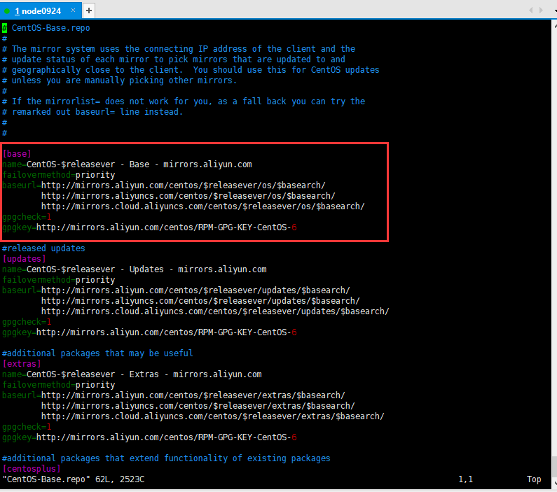
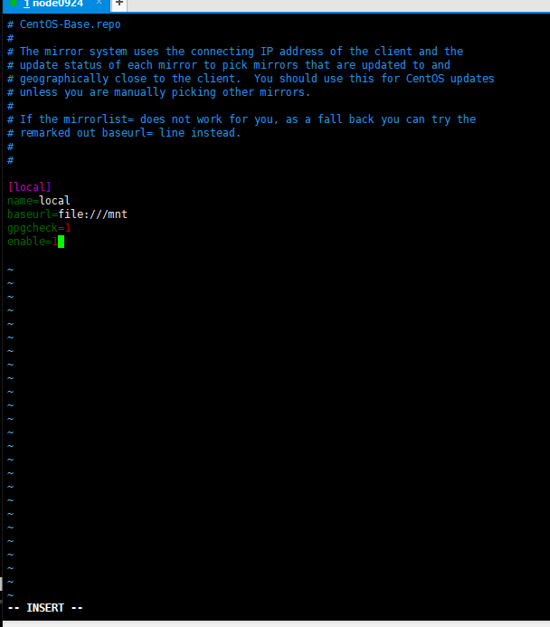
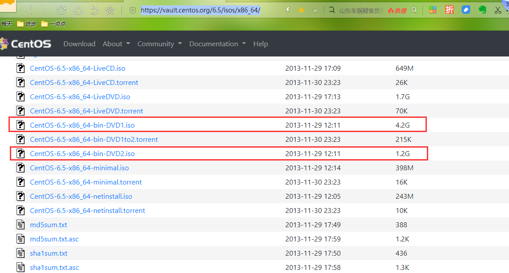

34-配置本地Yum源


配置本地Yum源

* Why？为什么需要配置本地源
  * 封闭式开发
  * 军工类项目
  * 没有外部网络

* How？怎么配置本地源


repo本地目录源：

mount /dev/cdrom /mnt

 

baseurl=file:///mnt

gpgcheck=0

enable=1

 

yum clean all

yum makecache

yum repolist


```shell
[root@node0924 yum.repos.d]# mount /dev/cdrom /mnt
mount: block device /dev/sr0 is write-protected, mounting read-only
mount: /dev/sr0 already mounted or /mnt busy
mount: according to mtab, /dev/sr0 is already mounted on /mnt
[root@node0924 yum.repos.d]# 

```

`mount /dev/cdrom /mnt`  将`/dev/cdrom`挂载在`/mnt`下


```shell
[root@node0924 yum.repos.d]# pwd
/etc/yum.repos.d
[root@node0924 yum.repos.d]# ls
back                     CentOS-Base.repo.rpmnew  CentOS-Media.repo  mysql-community.repo
CentOS-Base.repo         CentOS-Debuginfo.repo    CentOS-Vault.repo  mysql-community-source.repo
CentOS-Base.repo.backup  CentOS-fasttrack.repo    epel.repo
[root@node0924 yum.repos.d]# vim CentOS-Base.repo

```

`vim CentOS-Base.repo`  修改文件，这是我们从阿里云下下载出来的。




修改文件内容



```
# CentOS-Base.repo
#
# The mirror system uses the connecting IP address of the client and the
# update status of each mirror to pick mirrors that are updated to and
# geographically close to the client.  You should use this for CentOS updates
# unless you are manually picking other mirrors.
#
# If the mirrorlist= does not work for you, as a fall back you can try the 
# remarked out baseurl= line instead.
#
#

[local]
name=local
baseurl=file:///mnt
gpgcheck=1
enable=1


```


```shell
[root@node0924 yum.repos.d]# ls
back                     CentOS-Base.repo.rpmnew  CentOS-Media.repo  mysql-community.repo
CentOS-Base.repo         CentOS-Debuginfo.repo    CentOS-Vault.repo  mysql-community-source.repo
CentOS-Base.repo.backup  CentOS-fasttrack.repo    epel.repo
[root@node0924 yum.repos.d]# vim CentOS-Base.repo
[root@node0924 yum.repos.d]# yum clean all
Loaded plugins: fastestmirror
Cleaning repos: epel local mysql-connectors-community mysql-tools-community mysql57-community-dmr
Cleaning up Everything
Cleaning up list of fastest mirrors
[root@node0924 yum.repos.d]# yum makecache
Loaded plugins: fastestmirror
Determining fastest mirrors
epel                                                                                    | 4.7 kB     00:00     
epel/group_gz                                                                           |  74 kB     00:00     
epel/filelists_db                                                                       | 7.9 MB     00:00     
epel/prestodelta                                                                        |  435 B     00:00     
epel/primary_db                                                                         | 6.1 MB     00:00     
epel/other_db                                                                           | 3.0 MB     00:00     
local                                                                                   | 3.6 kB     00:00 ... 
local/group_gz                                                                          | 1.4 kB     00:00 ... 
local/filelists_db                                                                      | 182 kB     00:00 ... 
local/primary_db                                                                        | 492 kB     00:00 ... 
local/other_db                                                                          | 147 kB     00:00 ... 
mysql-connectors-community                                                              | 2.6 kB     00:00     
mysql-connectors-community/filelists_db                                                 |  82 kB     00:00     
mysql-connectors-community/primary_db                                                   |  58 kB     00:00     
mysql-connectors-community/other_db                                                     |  13 kB     00:00     
mysql-tools-community                                                                   | 2.6 kB     00:00     
mysql-tools-community/filelists_db                                                      | 203 kB     00:00     
mysql-tools-community/primary_db                                                        |  63 kB     00:00     
mysql-tools-community/other_db                                                          |  17 kB     00:00     
mysql57-community-dmr                                                                   | 2.6 kB     00:00     
mysql57-community-dmr/filelists_db                                                      | 1.4 MB     00:00     
mysql57-community-dmr/primary_db                                                        | 246 kB     00:00     
mysql57-community-dmr/other_db                                                          |  66 kB     00:00     
Metadata Cache Created
[root@node0924 yum.repos.d]# 

```


`yum clean all`  清理yum

`yum makecache` 下载


```shell
[root@node0924 yum.repos.d]# yum repolist
Loaded plugins: fastestmirror
Loading mirror speeds from cached hostfile
repo id                              repo name                                                           status
epel                                 Extra Packages for Enterprise Linux 6 - x86_64                      12,585
local                                local                                                                  248
mysql-connectors-community           MySQL Connectors Community                                             145
mysql-tools-community                MySQL Tools Community                                                   96
mysql57-community-dmr                MySQL 5.7 Community Server Development Milestone Release               432
repolist: 13,506
[root@node0924 yum.repos.d]# 

```

`yum repolist` 查看本地信息,248个本地源


```shell
[root@node0924 yum.repos.d]# yum install java
Loaded plugins: fastestmirror
Setting up Install Process
Loading mirror speeds from cached hostfile
No package java available.
Error: Nothing to do
[root@node0924 yum.repos.d]# yum install httpd
Loaded plugins: fastestmirror
Setting up Install Process
Loading mirror speeds from cached hostfile
No package httpd available.
Error: Nothing to do
[root@node0924 yum.repos.d]# 

```

`yum install java`

`yum install httpd`

本地安装


```shell
[root@node0924 yum.repos.d]# umount /mnt
[root@node0924 yum.repos.d]# df -h
Filesystem      Size  Used Avail Use% Mounted on
/dev/sda3        97G  3.1G   89G   4% /
tmpfs           490M     0  490M   0% /dev/shm
/dev/sda1       190M   48M  132M  27% /boot
[root@node0924 yum.repos.d]# 

```

`umount /mnt` 卸载本地光盘

`df -h` 查看盘符,没有/mnt挂载

```
/dev/sda1       190M   48M  132M  27% /boot
```


```shell
[root@node0924 yum.repos.d]# mount /dev/cdrom /mnt
mount: block device /dev/sr0 is write-protected, mounting read-only
[root@node0924 yum.repos.d]# df -h
Filesystem      Size  Used Avail Use% Mounted on
/dev/sda3        97G  3.1G   89G   4% /
tmpfs           490M     0  490M   0% /dev/shm
/dev/sda1       190M   48M  132M  27% /boot
/dev/sr0        398M  398M     0 100% /mnt
[root@node0924 yum.repos.d]# 

```

`mount /dev/cdrom /mnt` 挂载

`df -h` 查看盘符


需要下载的文件

地址：https://vault.centos.org/6.5/isos/x86_64/




