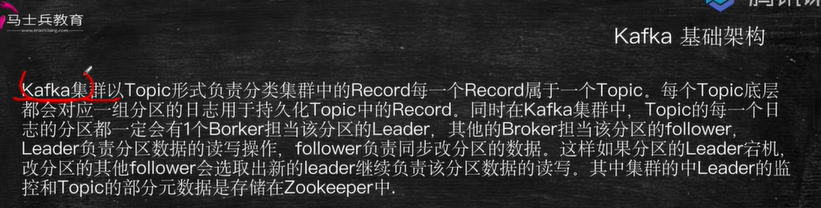

02Kafka章节1-(架构和概念)02

message queue 消息队列

常见工作模式

* 至多一次
* 没有限制

kafka基础架构

* 集群
* topic(**主题**)
* record(记录)
* broker(中间人)
* leader(领导者)
* follower(追随者)
* zookeeper(动物园管理员)

record

* key
* value
* timestamp

分区因子

kafka小结

* 消息队列
* 消息管理
* kafka集群