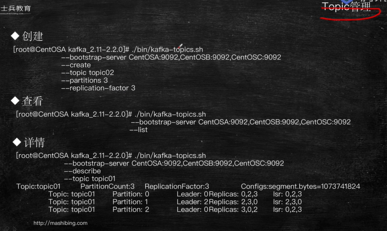
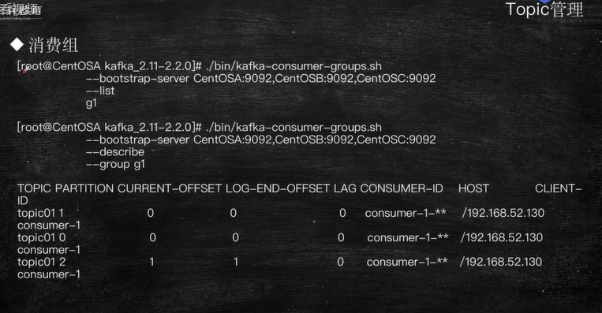
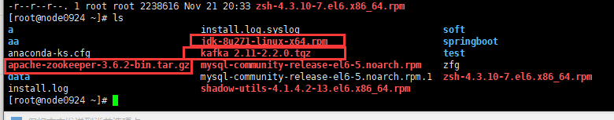

06Kafka章节2-(Zookeeper单机安装)01


kafka环境搭建


环境搭建-单机


环境搭建-集群



topic管理

* 创建
* 查看
* 详情


* 修改
* 删除


* 订阅
* 生产



* 消费组





单机安装

```
jdk-8u271-linux-x64.rpm
apache-zookeeper-3.6.2-bin.tar.gz
kafka_2.11-2.2.0.tgz
```


```shell
# 查看是否安装jdk
[root@node0924 ~]# rpm -qa | grep jdk
-bash: jdk: command not found
[root@node0924 ~]# 

```

查看是否安装jdk


```shell
# 安装jdk
[root@node0924 ~]# rpm -ivh jdk-8u271-linux-x64.rpm
warning: jdk-8u271-linux-x64.rpm: Header V3 RSA/SHA256 Signature, key ID ec551f03: NOKEY
Preparing...                ########################################### [100%]
	package jdk1.8-2000:1.8.0_271-fcs.x86_64 is already installed
[root@node0924 ~]# 

```


```shell
# 查找jdk是否安装
[root@node0924 ~]# rpm -qa | grep jdk
jdk1.8-1.8.0_271-fcs.x86_64
[root@node0924 ~]# 

```

```shell
# java -version
[root@node0924 ~]# java -version
java version "1.8.0_271"
Java(TM) SE Runtime Environment (build 1.8.0_271-b09)
Java HotSpot(TM) 64-Bit Server VM (build 25.271-b09, mixed mode)

# jps
[root@node0924 ~]# jps
1684 Jps

```

```shell
# which java
[root@node0924 ~]# which java
/usr/bin/java
[root@node0924 ~]# ls -lrt /usr/bin/java
lrwxrwxrwx. 1 root root 22 Nov 18 23:23 /usr/bin/java -> /etc/alternatives/java
[root@node0924 ~]# ls -lrt /etc/alternatives/java
lrwxrwxrwx. 1 root root 36 Nov 18 23:23 /etc/alternatives/java -> /usr/mfc/jdk1.8.0_271-amd64/bin/java
[root@node0924 ~]# 

```

`/usr/mfc/jdk1.8.0_271-amd64/bin/java`


```shell
# vi .bashrc
[root@node0924 ~]# vi .bashrc

```


```
# .bashrc

# User specific aliases and functions

alias rm='rm -i'
alias cp='cp -i'
alias mv='mv -i'

# Source global definitions
if [ -f /etc/bashrc ]; then
        . /etc/bashrc
fi
JAVA_HOME=/usr/mfc/jdk1.8.0_271-amd64
PATH=$PATH:$JAVA_HOME/bin
CLASSPATH=.
export JAVA_HOME
export PATH
export CLASSPATH

```

配置JAVA_HOME


```shell
# echo $JAVA_HOME
[root@node0924 ~]# echo $JAVA_HOME


# source .bashrc
[root@node0924 ~]# source .bashrc

# echo $JAVA_HOME
[root@node0924 ~]# echo $JAVA_HOME
/usr/mfc/jdk1.8.0_271-amd64
[root@node0924 ~]# 

```


安装jdk1.8，配置JAVA_HOME


```shell
# cat /etc/sysconfig/network 查看network
[root@node0924 ~]# cat /etc/sysconfig/network
NETWORKING=yes
HOSTNAME=node0924

# reboot 修改后重启
[root@node0924 ~]# reboot

```


```shell
# ifconfig
[root@node0924 ~]# ifconfig
eth0      Link encap:Ethernet  HWaddr 00:0C:29:F8:E2:A7  
          inet addr:192.168.11.66  Bcast:192.168.11.255  Mask:255.255.255.0
          inet6 addr: fe80::20c:29ff:fef8:e2a7/64 Scope:Link
          UP BROADCAST RUNNING MULTICAST  MTU:1500  Metric:1
          RX packets:142073 errors:0 dropped:0 overruns:0 frame:0
          TX packets:10256 errors:0 dropped:0 overruns:0 carrier:0
          collisions:0 txqueuelen:1000 
          RX bytes:198100484 (188.9 MiB)  TX bytes:1389320 (1.3 MiB)

lo        Link encap:Local Loopback  
          inet addr:127.0.0.1  Mask:255.0.0.0
          inet6 addr: ::1/128 Scope:Host
          UP LOOPBACK RUNNING  MTU:65536  Metric:1
          RX packets:0 errors:0 dropped:0 overruns:0 frame:0
          TX packets:0 errors:0 dropped:0 overruns:0 carrier:0
          collisions:0 txqueuelen:0 
          RX bytes:0 (0.0 b)  TX bytes:0 (0.0 b)

[root@node0924 ~]# 

```

`inet addr:192.168.11.66`

网卡信息


```shell
# vi /etc/hosts
[root@node0924 ~]# vi /etc/hosts
```


```
127.0.0.1   localhost localhost.localdomain localhost4 localhost4.localdomain4
::1         localhost localhost.localdomain localhost6 localhost6.localdomain6
192.168.11.66 node0924

```


```shell
# ping node0924
[root@node0924 ~]# ping node0924
PING node0924 (192.168.11.66) 56(84) bytes of data.
64 bytes from node0924 (192.168.11.66): icmp_seq=1 ttl=64 time=0.087 ms
64 bytes from node0924 (192.168.11.66): icmp_seq=2 ttl=64 time=0.027 ms
64 bytes from node0924 (192.168.11.66): icmp_seq=3 ttl=64 time=0.024 ms
64 bytes from node0924 (192.168.11.66): icmp_seq=4 ttl=64 time=0.024 ms
^C
--- node0924 ping statistics ---
4 packets transmitted, 4 received, 0% packet loss, time 3152ms
rtt min/avg/max/mdev = 0.024/0.040/0.087/0.027 ms
[root@node0924 ~]# 

```


配置主机名和ip映射


```shell
# service iptables status查看防火墙状态
[root@node0924 ~]# service iptables status
Table: filter
Chain INPUT (policy ACCEPT)
num  target     prot opt source               destination         
1    ACCEPT     all  --  0.0.0.0/0            0.0.0.0/0           state RELATED,ESTABLISHED 
2    ACCEPT     icmp --  0.0.0.0/0            0.0.0.0/0           
3    ACCEPT     all  --  0.0.0.0/0            0.0.0.0/0           
4    ACCEPT     tcp  --  0.0.0.0/0            0.0.0.0/0           state NEW tcp dpt:22 
5    REJECT     all  --  0.0.0.0/0            0.0.0.0/0           reject-with icmp-host-prohibited 

Chain FORWARD (policy ACCEPT)
num  target     prot opt source               destination         
1    REJECT     all  --  0.0.0.0/0            0.0.0.0/0           reject-with icmp-host-prohibited 

Chain OUTPUT (policy ACCEPT)
num  target     prot opt source               destination         

[root@node0924 ~]# 

```


```
查看防火墙状态
service iptables status

关闭防火墙
service iptables stop

开启防火墙
service iptables start

```


```shell
# service iptables status查看状态
[root@node0924 ~]# service iptables status
iptables: Firewall is not running.

# chkconfig iptables off，移除iptables服务自启
[root@node0924 ~]#  iptables off
[root@node0924 ~]# 

```


```shell
[root@node0924 ~]# chkconfig --list
auditd         	0:off	1:off	2:on	3:on	4:on	5:on	6:off
blk-availability	0:off	1:on	2:on	3:on	4:on	5:on	6:off
htcacheclean   	0:off	1:off	2:off	3:off	4:off	5:off	6:off
httpd          	0:off	1:off	2:off	3:off	4:off	5:off	6:off
ip6tables      	0:off	1:off	2:on	3:on	4:on	5:on	6:off
iptables       	0:off	1:off	2:off	3:off	4:off	5:off	6:off
iscsi          	0:off	1:off	2:off	3:on	4:on	5:on	6:off
iscsid         	0:off	1:off	2:off	3:on	4:on	5:on	6:off
lvm2-monitor   	0:off	1:on	2:on	3:on	4:on	5:on	6:off
mdmonitor      	0:off	1:off	2:on	3:on	4:on	5:on	6:off
multipathd     	0:off	1:off	2:off	3:off	4:off	5:off	6:off
mysqld         	0:off	1:off	2:on	3:on	4:on	5:on	6:off
netconsole     	0:off	1:off	2:off	3:off	4:off	5:off	6:off
netfs          	0:off	1:off	2:off	3:on	4:on	5:on	6:off
network        	0:off	1:off	2:on	3:on	4:on	5:on	6:off
ntpdate        	0:off	1:off	2:off	3:off	4:off	5:off	6:off
rdisc          	0:off	1:off	2:off	3:off	4:off	5:off	6:off
redis_6379     	0:off	1:off	2:on	3:on	4:on	5:on	6:off
redis_6380     	0:off	1:off	2:on	3:on	4:on	5:on	6:off
redis_6381     	0:off	1:off	2:on	3:on	4:on	5:on	6:off
restorecond    	0:off	1:off	2:off	3:off	4:off	5:off	6:off
rsyslog        	0:off	1:off	2:on	3:on	4:on	5:on	6:off
saslauthd      	0:off	1:off	2:off	3:off	4:off	5:off	6:off
sshd           	0:off	1:off	2:on	3:on	4:on	5:on	6:off
udev-post      	0:off	1:on	2:on	3:on	4:on	5:on	6:off
[root@node0924 ~]# 

```


```shell
[root@node0924 ~]# chkconfig --list | grep iptables
iptables       	0:off	1:off	2:off	3:off	4:off	5:off	6:off
[root@node0924 ~]# 

```

都是off，关闭状态


关闭防火墙


```shell
[root@node0924 ~]# cd
[root@node0924 ~]# ls
a                                  install.log.syslog                          soft
aa                                 jdk-8u271-linux-x64.rpm                     springboot
anaconda-ks.cfg                    kafka_2.11-2.2.0.tgz                        test
apache-zookeeper-3.6.2-bin.tar.gz  mysql-community-release-el6-5.noarch.rpm    zfg
data                               mysql-community-release-el6-5.noarch.rpm.1  zsh-4.3.10-7.el6.x86_64.rpm
install.log                        shadow-utils-4.1.4.2-13.el6.x86_64.rpm

# tar -zxf apache-zookeeper-3.6.2-bin.tar.gz -C /usr/
# 解压文件到usr目录
[root@node0924 ~]# tar -zxf apache-zookeeper-3.6.2-bin.tar.gz -C /usr/
[root@node0924 ~]# 

```


```shell
[root@node0924 ~]# tar -zxf apache-zookeeper-3.6.2-bin.tar.gz -C /usr/
[root@node0924 ~]# cd /usr/
[root@node0924 usr]# ls
apache-zookeeper-3.6.2-bin  bin  etc  games  include  lib  lib64  libexec  local  mfc  sbin  share  src  tmp
[root@node0924 usr]# cd apache-zookeeper-3.6.2-bin
[root@node0924 apache-zookeeper-3.6.2-bin]# ls
bin  conf  docs  lib  LICENSE.txt  NOTICE.txt  README.md  README_packaging.md
[root@node0924 apache-zookeeper-3.6.2-bin]# 

```

解压zookeeper，进入目录


```shell
[root@node0924 apache-zookeeper-3.6.2-bin]# ls
bin  conf  docs  lib  LICENSE.txt  NOTICE.txt  README.md  README_packaging.md
[root@node0924 apache-zookeeper-3.6.2-bin]# ls conf/
configuration.xsl  log4j.properties  zoo_sample.cfg
[root@node0924 apache-zookeeper-3.6.2-bin]# cp conf/zoo_sample.cfg conf/zoo.cfg
[root@node0924 apache-zookeeper-3.6.2-bin]# ls conf/
configuration.xsl  log4j.properties  zoo.cfg  zoo_sample.cfg
[root@node0924 apache-zookeeper-3.6.2-bin]# vi conf/zoo.cfg
[root@node0924 apache-zookeeper-3.6.2-bin]# 

```

```
dataDir=/root/zkdata

```

conf/zoo.cfg


```shell
# mkdir /root/zkdata创建目录
[root@node0924 apache-zookeeper-3.6.2-bin]# mkdir /root/zkdata
[root@node0924 apache-zookeeper-3.6.2-bin]# 

```


这样zookeeper就可以启动了，（需要配置JAVA_HOME环境）


```shell
# ./bin/zkServer.sh查看提示
[root@node0924 apache-zookeeper-3.6.2-bin]# ./bin/zkServer.sh
ZooKeeper JMX enabled by default
Using config: /usr/apache-zookeeper-3.6.2-bin/bin/../conf/zoo.cfg
Usage: ./bin/zkServer.sh [--config <conf-dir>] {start|start-foreground|stop|version|restart|status|print-cmd}
[root@node0924 apache-zookeeper-3.6.2-bin]# 

```


```
start 启动
start-foreground
stop 停止
version
restart
status 状态
print-cmd
```


```shell
# ./bin/zkServer.sh start zoo.cfg启动zookeeper
[root@node0924 apache-zookeeper-3.6.2-bin]# ./bin/zkServer.sh start zoo.cfg
ZooKeeper JMX enabled by default
Using config: /usr/apache-zookeeper-3.6.2-bin/bin/../conf/zoo.cfg
Starting zookeeper ... STARTED

# jps查看
[root@node0924 apache-zookeeper-3.6.2-bin]# jps
2041 QuorumPeerMain
2073 Jps
[root@node0924 apache-zookeeper-3.6.2-bin]# 

```


```
2041 QuorumPeerMain
```

有zookeeper进程


```shell
# ./bin/zkServer.sh status zoo.cfg查看状态
[root@node0924 apache-zookeeper-3.6.2-bin]# ./bin/zkServer.sh status zoo.cfg
ZooKeeper JMX enabled by default
Using config: /usr/apache-zookeeper-3.6.2-bin/bin/../conf/zoo.cfg
Client port found: 2181. Client address: localhost. Client SSL: false.
Mode: standalone
[root@node0924 apache-zookeeper-3.6.2-bin]# 

```

Mode: standalone

启动zookeeper，查看状态

