09Kafka章节2-(Kafka Topic管理)04


笔记，步骤，思路记录，无实操。


启动三台主机的kafka服务

```shell
# 进入kafka目录
cd /usr/kafka_2.11-2.2.0

# 启动kafak
./bin/kafka-server-start.sh -daemon config/server.properties

# 查看java应用程序
jps
```


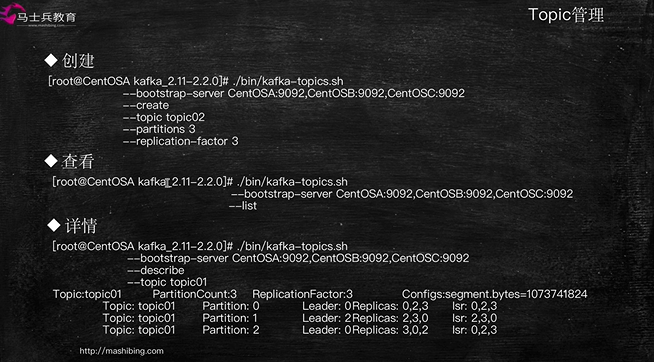

topic管理

* 创建
* 查看
* 详情

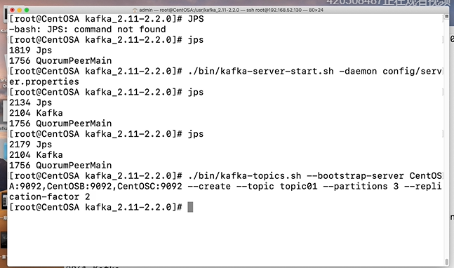

创建topic

```shell
# 创建topic
./bin/kafka-topics.sh --bootstrap-server CentOSA:9092,CentOSB:9092,CentOSB:9092 --create --topic topic topic01 --partitions 3 --replication-factor 2

```

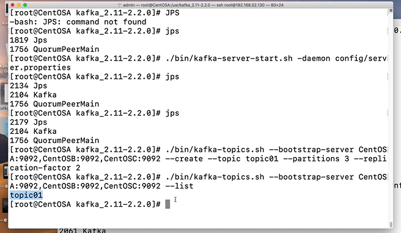

查看topic

```shell
# 查看topic
./bin/kafka-topics.sh --bootstrap-server CentOSA:9092,CentOSB:9092,CentOSB:9092 --list
```


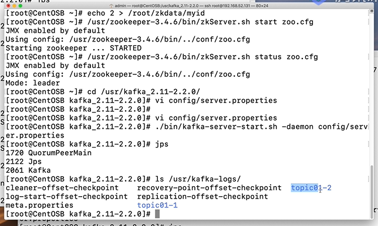

查看三台主机A、B、C的kafka日志,体会分区和副本因子的概念

```shell
# 查看kafka日志
ls /usr/kafka-logs/

```


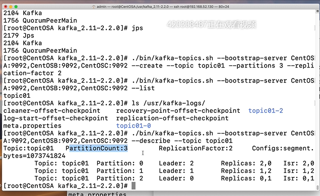


查看topic详情

```shell
# 查看详情
./bin/kafka-topics.sh --bootstrap-server CentOSA:9092,CentOSB:9092,CentOSB:9092 --describe --topic topic01

```


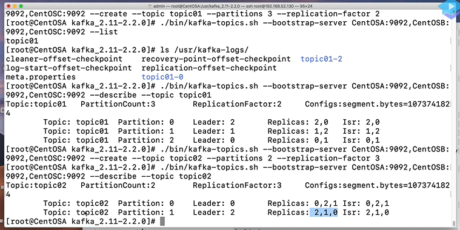


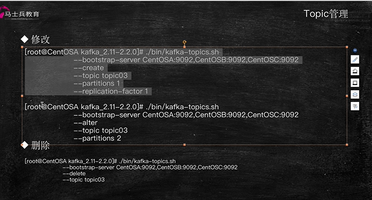

topic管理

* 修改
* 删除

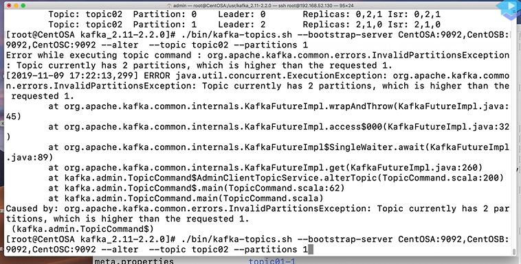

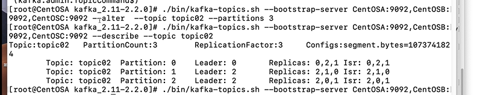

修改分区，kafka的分区只能增，不能减。


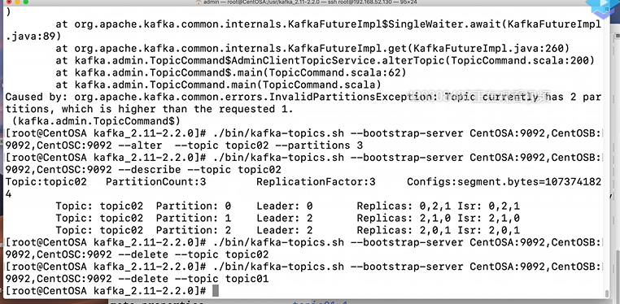

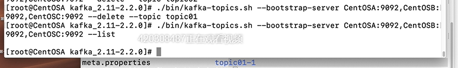

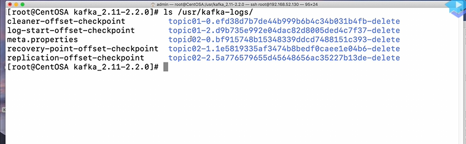

删除topic


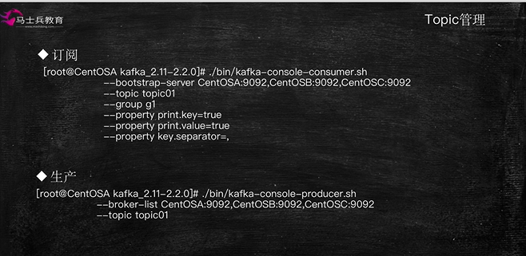

topic管理

* 订阅
* 生产


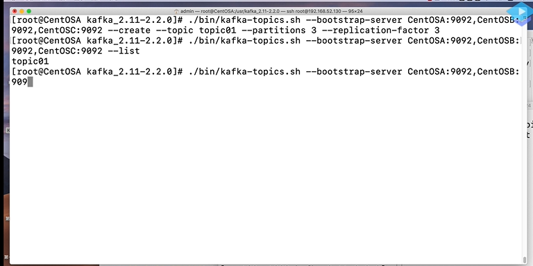

先创建topic

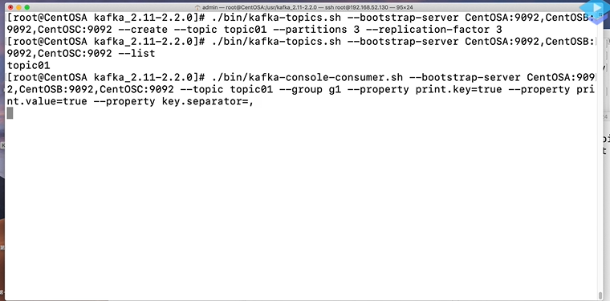

在A上创建消费者


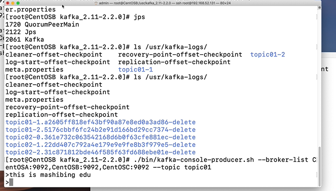

在B上创建生产者，生产消息


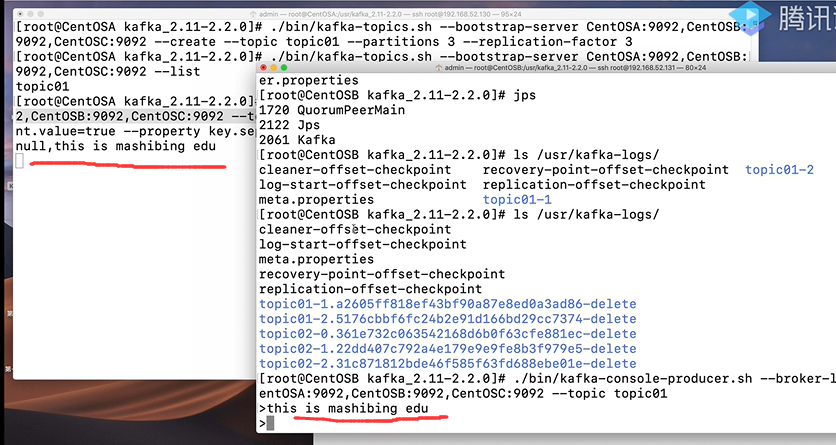

观察消息


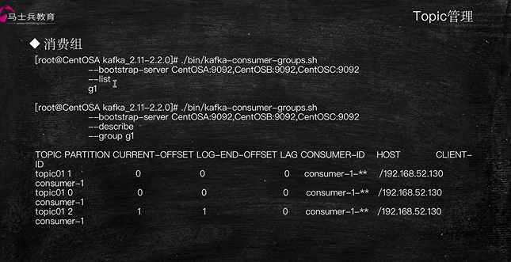

topic管理

* 消费组


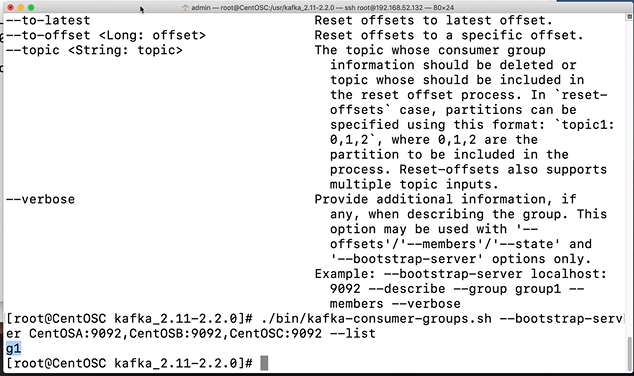

查看现在的组信息

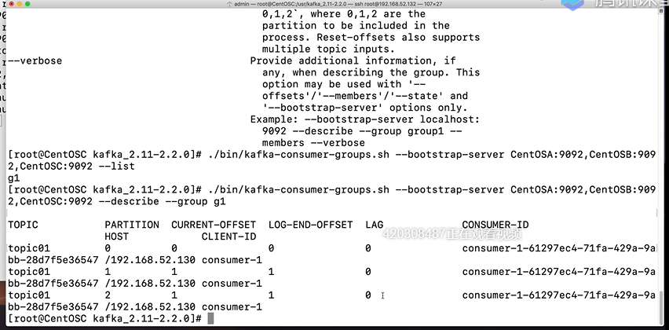

查看g1组的详细信息


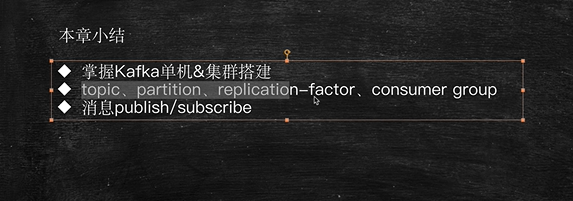


小结

* kafka单机和集群的搭建
* topic管理